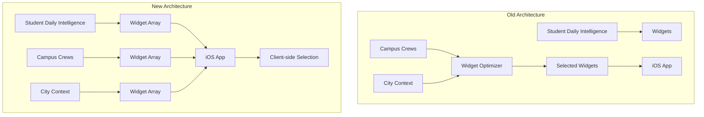

# Crew Architecture Refactor

This document describes the major architectural refactoring completed on July 4, 2025, focusing on widget generation optimization and context analysis transformation. Current stack uses PortKey to route LLM calls (OpenAI/Anthropic/Gemini) and outputs feed api-router widgets with RLS enforced.

## Overview

The refactoring eliminated the redundant Widget Optimizer crew and transformed the real-time Context Inference crew into a sophisticated Deep Context Analysis system. This simplification improves performance, reduces costs, and provides better intelligence.

## Key Changes

### 1. Widget Optimizer Elimination

**Before**: 
- Separate `widget_optimizer` crew selected from pre-generated widgets
- Added 3-7 seconds of latency
- Created architectural bottleneck

**After**:
- Each crew generates its own widgets directly via Widget Conformance Agent
- iOS performs widget selection client-side
- No performance bottleneck

### 2. Context Inference → Deep Context Analysis

**Before**:
- Simple real-time context detection
- Basic time/location-based rules
- Limited intelligence

**After**:
- Historical pattern analysis over weeks/months
- Behavioral insights and life optimization
- Predictive context intelligence
- Three specialized agents:
  - Behavioral Pattern Recognition Specialist
  - Student Life Optimization Strategist
  - Predictive Context Intelligence Specialist

### 3. Universal Widget Generation

All campus and city crews now include the Widget Conformance Agent:
- `campus_logistics` - Parking, facilities, mobility widgets
- `campus_events` - Event recommendations, calendar widgets
- `campus_news` - News, announcements, safety widgets
- `city_context` - Weather, transit, local opportunity widgets

## Architecture Benefits



## Deep Context Analysis Capabilities

The new `deep_context_analysis` crew provides:

### 1. Behavioral Pattern Recognition
- Identifies productive vs unproductive patterns
- Recognizes optimal times/locations for activities
- Detects lifestyle patterns correlating with success
- Finds inefficiencies in student schedules

### 2. Life Optimization Strategies
- Schedule improvements based on energy patterns
- Study location optimization from performance data
- Social and wellness integration recommendations
- Stress reduction strategies

### 3. Predictive Intelligence
- Forecasts optimal study times
- Predicts context conflicts
- Identifies upcoming high-stress periods
- Suggests proactive adjustments

## Implementation Details

### Widget Conformance Integration

Each crew now includes:
```python
# Import Widget Conformance Agent
from shared.agents.widget_conformance import create_widget_conformance_agent

# Create agent
widget_conformance_agent = create_widget_conformance_agent(llm)

# Add widget generation task
widget_conformance_task = Task(
    description="Transform analysis into widget arrays...",
    agent=widget_conformance_agent,
    context=[final_synthesis_task]
)
```

### Deep Context Analysis Structure

```python
class DeepContextAnalysisCrew(BaseDormWayCrew):
    """
    Analyzes historical context patterns to:
    1. Learn individual student behavioral patterns
    2. Predict optimal contexts for different activities  
    3. Generate context-aware recommendations
    4. Identify life pattern improvements
    """
```

## Performance Improvements

- **Latency Reduction**: Eliminated 3-7 second widget optimization delay
- **Cost Reduction**: Removed redundant LLM calls for widget selection
- **Parallel Processing**: Each crew generates widgets independently
- **Scalability**: No central bottleneck for widget generation

## Migration Impact

### Removed Files
- `crews/widget_optimizer.py`
- `crews/context_inference.py`

### Added Files
- `crews/deep_context_analysis.py`

### Modified Files
- `crews/campus_logistics.py` - Added Widget Conformance Agent
- `crews/campus_events.py` - Added Widget Conformance Agent
- `crews/campus_news.py` - Added Widget Conformance Agent
- `crews/city_context.py` - Added Widget Conformance Agent
- `main.py` - Updated crew registry

## Testing

All changes were validated with comprehensive tests:
- Widget optimizer successfully eliminated
- Context inference successfully removed
- Deep context analysis successfully created
- All widget-enabled crews import successfully
- Main registry properly updated

## Next Steps

1. Create specialized context crews:
   - Study Planning / School Work Optimizer
   - Health & Wellness
   - Career Development

2. Implement Vectara tools for semantic search

3. Test deep context analysis with real historical data

## Related Documentation

- Widget System Architecture
- Widget Conformance Agent
- Widget Registry & Extensibility
- Student Daily Intelligence Crew
