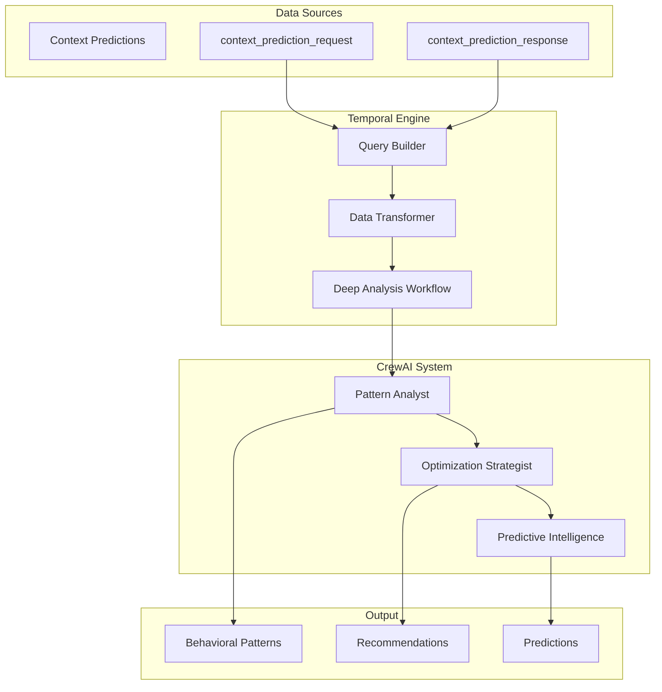

# Deep Context Analysis Crew

## Overview

The Deep Context Analysis Crew is an AI agent system that analyzes historical context prediction data to identify behavioral patterns, generate life optimization recommendations, and provide predictive insights for students. Unlike real-time context detection, this crew performs offline analysis of accumulated context data to understand long-term behavioral patterns and suggest evidence-based improvements.

## Purpose & Capabilities

### Core Functions
1. **Pattern Recognition**: Analyzes weeks or months of context predictions to identify meaningful behavioral patterns
2. **Life Optimization**: Transforms patterns into actionable recommendations for student life improvement
3. **Predictive Intelligence**: Generates forecasts for optimal future contexts based on historical data

### Key Differentiators
- **Historical Analysis**: Works with stored context predictions, not real-time data
- **Pattern Learning**: Identifies trends across time, location, health, and screen usage
- **Evidence-Based**: All recommendations grounded in actual student behavior data
- **Personalized**: Adapts to individual student patterns and preferences

## Data Flow Architecture



## Database Queries for Temporal

### Primary Query: Fetch Context Predictions

```sql
-- Fetch context predictions for a user over a time period
WITH prediction_data AS (
    SELECT 
        req.id as request_id,
        req.user_id,
        req.data as request_data,
        req.created_at as request_time,
        resp.data as response_data,
        resp.created_at as response_time
    FROM 
        context_prediction_request req
    INNER JOIN 
        context_prediction_response resp 
    ON 
        req.id = resp.request_id
    WHERE 
        req.user_id = $1
        AND req.created_at >= $2  -- Start date (e.g., 30 days ago)
        AND req.created_at <= $3  -- End date (e.g., now)
    ORDER BY 
        req.created_at ASC
)
SELECT 
    jsonb_build_object(
        'request', request_data,
        'response', response_data,
        'timestamp', request_time
    ) as prediction
FROM 
    prediction_data;
```

### Alternative Query: Using service_data RPC

```sql
-- Using the save_user_mobile_data RPC which stores predictions
SELECT 
    data->>'request' as request,
    data->>'response' as response,
    created_at as timestamp
FROM 
    service_data
WHERE 
    user_id = $1
    AND method IN ('context_prediction_request', 'context_prediction_response')
    AND created_at >= NOW() - INTERVAL '30 days'
ORDER BY 
    created_at ASC;
```

### Aggregation Query: Summary Statistics

```sql
-- Get summary statistics for the analysis
SELECT 
    COUNT(*) as total_predictions,
    MIN(created_at) as earliest_prediction,
    MAX(created_at) as latest_prediction,
    COUNT(DISTINCT DATE(created_at)) as days_with_data,
    jsonb_object_agg(
        response_data->>'primaryState', 
        COUNT(*)
    ) as state_counts
FROM 
    context_prediction_request req
INNER JOIN 
    context_prediction_response resp 
ON 
    req.id = resp.request_id
WHERE 
    req.user_id = $1
    AND req.created_at >= NOW() - INTERVAL '30 days';
```

## Input Data Format

### Expected Structure from Database

```typescript
interface ContextPredictionData {
  request: {
    environment: {
      location: {
        latitude: number;
        longitude: number;
        accuracy: number;
      };
      timeOfDay: "morning" | "afternoon" | "evening" | "night";
      dayOfWeek: string;
      weatherDetails: {
        temperature: number;
        humidity: number;
        conditions: string;
      };
    };
    recentActivity: {
      lastKnownState: string;
      transitions: string[];
    };
    health: {
      stepCount: number;
      heartRate: {
        current: number;
        resting: number;
      };
      sleepAnalysis: {
        duration: number;
        quality: string;
      };
      energyLevel: number;
    };
    screenTime: {
      totalMinutesToday: number;
      pickupCount: number;
      appCategories: Record<string, number>;
    };
  };
  response: {
    primaryState: string;
    confidence: number;
    reasoning: string[];
    alternativeStates: Array<{
      state: string;
      confidence: number;
    }>;
  };
  timestamp: string;
}
```

### Crew Input Format

```python
{
    # REQUIRED: Array of context predictions
    "context_predictions": List[ContextPredictionData],
    
    # OPTIONAL: Student information
    "student_info": {
        "major": str,
        "year": str,
        "campus": str
    },
    
    # OPTIONAL: Upcoming schedule
    "upcoming_calendar": {
        "events": List[Dict],
        "deadlines": List[Dict]
    },
    
    # OPTIONAL: Academic calendar
    "academic_calendar": {
        "finals": List[Dict],
        "breaks": List[Dict]
    }
}
```

## Output Format

### Structured Analysis Output

```json
{
  "success": true,
  "deep_analysis": {
    "context_state_patterns": {
      "most_frequent_states": ["studying", "in_class", "socializing"],
      "time_of_day_patterns": {
        "morning": ["morning_routine", "in_class"],
        "evening": ["studying", "relaxing"]
      },
      "day_of_week_patterns": {
        "weekdays": {"primary": "academic", "frequency": 0.85},
        "weekends": {"primary": "social", "frequency": 0.70}
      },
      "state_transitions": [
        {"from": "sleeping", "to": "morning_routine", "frequency": 0.95}
      ]
    },
    "environmental_correlations": {
      "weather_impact": {
        "rainy": {"indoor_activities": 0.85},
        "sunny": {"outdoor_activities": 0.70}
      },
      "location_patterns": {
        "library": ["studying", "focused_work"],
        "dorm": ["sleeping", "relaxing", "morning_routine"]
      }
    },
    "health_wellness_patterns": {
      "step_patterns": {
        "by_context": {"in_class": 2000, "studying": 500, "socializing": 5000},
        "daily_average": 8000
      },
      "heart_rate_patterns": {
        "resting_average": 65,
        "active_contexts": {"exercising": 140, "walking": 85}
      },
      "energy_patterns": {
        "morning": 4.2,
        "afternoon": 3.5,
        "evening": 2.8,
        "correlation_with_sleep": 0.75
      }
    },
    "screen_time_insights": {
      "usage_by_context": {
        "studying": {"average_minutes": 150, "productivity_ratio": 0.80},
        "socializing": {"average_minutes": 75, "social_app_ratio": 0.65}
      },
      "pickup_patterns": {
        "high_pickup_contexts": ["waiting", "transitioning"],
        "low_pickup_contexts": ["studying", "in_class"]
      }
    },
    "context_optimizations": {
      "contexts_to_maximize": ["focused_studying", "quality_sleep", "exercise"],
      "contexts_to_minimize": ["procrastinating", "doom_scrolling"],
      "optimal_transitions": ["morning_routine → breakfast → in_class"],
      "timing_recommendations": {
        "best_study_time": "7-9 PM",
        "optimal_exercise": "6-7 AM",
        "social_time": "Friday evenings"
      }
    },
    "future_context_predictions": {
      "next_week": [
        {
          "date": "2025-01-10",
          "time_of_day": "morning",
          "predicted_context": "studying",
          "confidence": 0.85,
          "based_on_pattern": "weekday morning study pattern"
        }
      ],
      "optimization_opportunities": {
        "best_focus_times": ["Mon-Wed 7-9 PM"],
        "optimal_context_sequences": ["exercise → shower → focused_study"]
      }
    }
  },
  "crew_metadata": {
    "version": "2.0_deep_context_analysis",
    "analysis_type": "historical_pattern_learning",
    "data_timespan": "30 days",
    "processing_approach": "pattern_recognition + optimization + prediction"
  }
}
```

## Integration with Temporal

### Workflow Implementation

```typescript
// In Temporal workflow
export async function analyzeStudentContextPatterns(
  userId: string,
  options: AnalysisOptions = {}
): Promise<DeepAnalysisResult> {
  const { days = 30, includeCalendar = true } = options;
  
  // Step 1: Query context predictions
  const predictions = await activities.queryContextPredictions(userId, days);
  
  // Step 2: Fetch optional data
  let studentInfo = null;
  let upcomingCalendar = null;
  let academicCalendar = null;
  
  if (includeCalendar) {
    [studentInfo, upcomingCalendar, academicCalendar] = await Promise.all([
      activities.getStudentInfo(userId),
      activities.getUpcomingCalendar(userId),
      activities.getAcademicCalendar(userId)
    ]);
  }
  
  // Step 3: Execute deep context analysis crew
  const crewInput = {
    context_predictions: predictions,
    student_info: studentInfo,
    upcoming_calendar: upcomingCalendar,
    academic_calendar: academicCalendar
  };
  
  const analysis = await activities.executeDeepContextAnalysisCrew(
    crewInput, 
    userId
  );
  
  // Step 4: Store results
  await activities.storeAnalysisResults(userId, analysis);
  
  return analysis;
}
```

### Activity Implementations

```typescript
// Query context predictions activity
export async function queryContextPredictions(
  userId: string, 
  days: number
): Promise<ContextPrediction[]> {
  const query = `
    SELECT jsonb_build_object(
      'request', req.data,
      'response', resp.data,
      'timestamp', req.created_at
    ) as prediction
    FROM context_prediction_request req
    INNER JOIN context_prediction_response resp 
      ON req.id = resp.request_id
    WHERE req.user_id = $1
      AND req.created_at >= NOW() - INTERVAL '${days} days'
    ORDER BY req.created_at ASC
  `;
  
  const { data, error } = await supabase
    .rpc('execute_sql', { query, params: [userId] });
    
  if (error) throw error;
  return data.map(row => row.prediction);
}

// Execute crew activity
export async function executeDeepContextAnalysisCrew(
  input: CrewInput,
  userId: string
): Promise<AnalysisResult> {
  const response = await fetch(`${CREWS_API_URL}/api/v1/crew/execute`, {
    method: 'POST',
    headers: {
      'Content-Type': 'application/json',
      'Authorization': `Bearer ${CREWS_API_KEY}`
    },
    body: JSON.stringify({
      crew_type: 'deep_context_analysis',
      input_data: input,
      user_id: userId,
      cache_key: `deep_analysis_${userId}_${Date.now()}`
    })
  });
  
  if (!response.ok) {
    throw new Error(`Crew execution failed: ${response.statusText}`);
  }
  
  return response.json();
}
```

## Testing & Validation

### Synthetic Data Generation

A synthetic data generator is available for testing:

```bash
# Generate test data
python generate_synthetic_context_data.py

# Test the crew with synthetic data
python test_deep_context_analysis_crew.py
```

### Validation Checklist

1. **Data Quality**
   - Minimum 7 days of predictions
   - At least 3 predictions per day
   - Variety of contexts represented

2. **Pattern Detection**
   - Identifies morning/evening routines
   - Recognizes weekday vs weekend patterns
   - Detects location-context correlations

3. **Recommendations**
   - Actionable and specific
   - Based on actual patterns
   - Considers constraints (schedule, weather)

4. **Predictions**
   - Confidence scores align with pattern strength
   - Alternative states make sense
   - Time-based forecasts are reasonable

## Performance Considerations

- **Data Volume**: Optimal with 30-90 days of predictions
- **Execution Time**: 30-60 seconds for full analysis
- **Model**: Uses GPT-4o-mini for cost efficiency
- **Caching**: Results cached for 24-48 hours
- **Concurrency**: Can analyze multiple users in parallel

## Use Cases

1. **Weekly Wellness Reports**
   - Run every Sunday night
   - Analyze past week's patterns
   - Generate recommendations for upcoming week

2. **Monthly Behavior Analysis**
   - Deep dive into long-term patterns
   - Identify trends and changes
   - Suggest lifestyle adjustments

3. **Academic Planning**
   - Analyze study patterns before exams
   - Optimize schedule for productivity
   - Balance academic and personal time

4. **Health & Wellness Insights**
   - Track sleep impact on performance
   - Monitor screen time patterns
   - Suggest activity improvements

## Related Documentation

- Context System
- [Crew Input Specifications](/docs/engineering/ai-crews/crew-input-specifications-for-temporal-integration)
- Engine Integration
- Widget System Architecture
