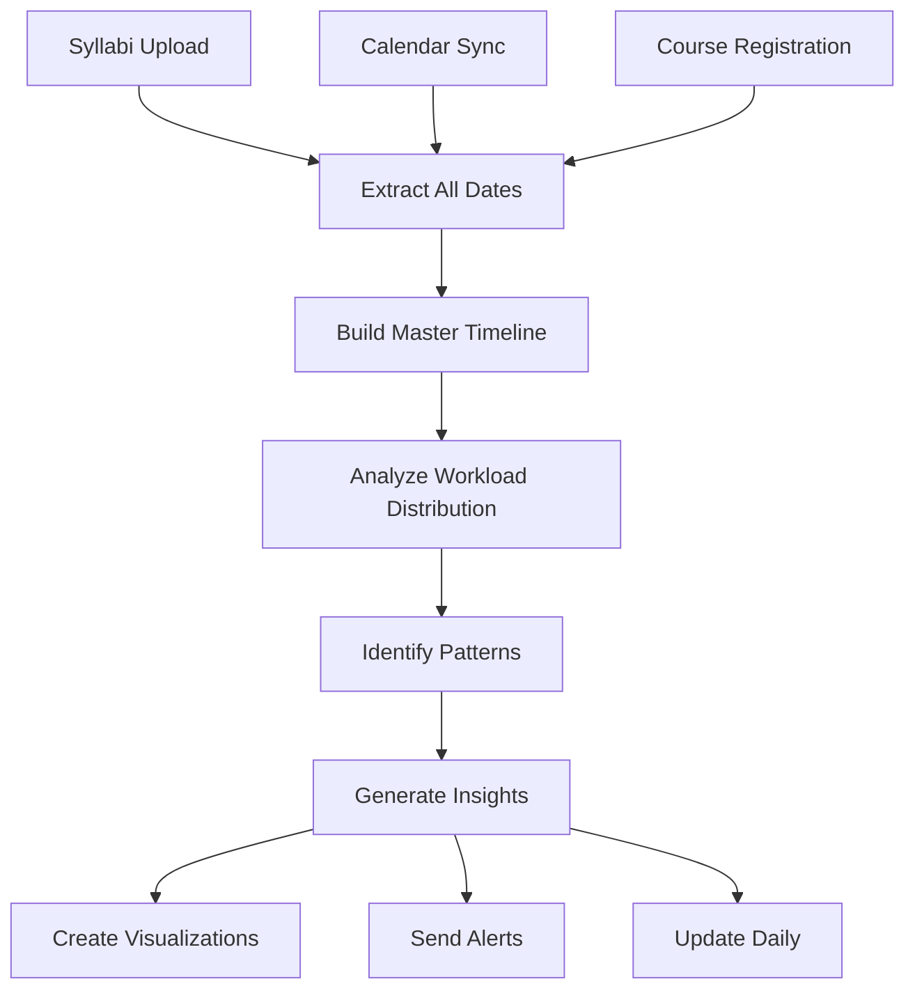

# Full Workload Analysis Crew

> **Created**: 2025-07-15  
> **Status**: Concept Design  
> **Type**: AI Crew Specification

## Overview

The Full Workload Analysis Crew aggregates data from all syllabi, calendars, and course materials to present a comprehensive view of a student's total academic obligations. This crew helps students visualize and manage their entire workload across all courses.

## Core Purpose

Transform scattered academic obligations into a unified, actionable workload view that prevents overwhelm and enables strategic time management.

## Data Sources

### Primary Sources
1. **All Uploaded Syllabi**
   - Assignment due dates
   - Exam schedules  
   - Reading assignments
   - Project milestones
   - Participation requirements

2. **Calendar Data**
   - Class meeting times
   - Office hours
   - Study group sessions
   - Personal commitments

3. **Course Context**
   - Credit hours per course
   - Course difficulty ratings
   - Historical time requirements
   - Prerequisites and dependencies

### Secondary Sources
- **LMS Integration** (Canvas, Blackboard)
- **Email** (professor announcements)
- **Location Data** (time between classes)
- **Historical Performance** (personal pacing)

## Crew Capabilities

### 1. Workload Aggregation
```typescript
interface WorkloadSummary {
  totalCreditHours: number;
  coursesCount: number;
  
  weeklyCommitments: {
    classTime: number;        // hours in class
    homeworkTime: number;     // estimated homework hours
    readingTime: number;      // estimated reading hours
    studyTime: number;        // recommended study hours
    totalHours: number;       // sum of all above
  };
  
  upcomingDeadlines: Deadline[];
  examSchedule: Exam[];
  majorProjects: Project[];
}
```

### 2. Time Analysis Views

#### Weekly Heat Map
```
        Mon  Tue  Wed  Thu  Fri  Sat  Sun
Morning  🟩   🟧   🟩   🟧   🟩   🟦   🟦
Midday   🟧   🟥   🟧   🟥   🟧   🟩   🟩  
Evening  🟧   🟧   🟥   🟧   🟨   🟨   🟩
Night    🟨   🟥   🟨   🟥   🟩   🟩   🟩

🟥 Heavy (3+ hrs)  🟧 Moderate  🟨 Light  🟩 Free  🟦 Flexible
```

#### Deadline Clustering Detection
- Identifies "hell weeks" with multiple deadlines
- Suggests work redistribution strategies
- Alerts for unrealistic workload periods

### 3. Intelligent Insights

#### Workload Patterns
```typescript
interface WorkloadInsights {
  // Danger zones
  hellWeeks: WeekPeriod[];          // Multiple major deadlines
  impossibleDays: Date[];           // Physically impossible schedules
  
  // Opportunities  
  lightPeriods: WeekPeriod[];       // Good for getting ahead
  studyBlocks: TimeSlot[];          // Optimal study windows
  
  // Recommendations
  startEarlyItems: Assignment[];    // Complex tasks needing early start
  batchOpportunities: Task[];       // Similar tasks to do together
  
  // Warnings
  conflicts: ScheduleConflict[];    // Overlapping obligations
  travelIssues: TravelWarning[];    // Not enough time between locations
}
```

#### Smart Recommendations
- "Start your Econ paper 2 weeks early - you have 3 other deadlines that week"
- "Tuesday evenings are your most consistent free time - ideal for weekly review"
- "Your Thursday is overloaded - consider moving office hours to Friday"
- "Week of Oct 15: 4 exams + 2 papers due - request extension or start now"

### 4. Visualization Components

#### Semester Timeline
```
September ━━━━━━━━━━━━━━━━━━━━━━━━━━━━━━━━━━━━━━ December
         ↓        ↓          ↓            ↓
    [Light]  [Moderate]  [HEAVY]    [Finals]
    
📚 Reading: ████████████░░░░░░ 65% complete
📝 Papers:  ██████░░░░░░░░░░░░ 35% complete  
🧪 Exams:   ████████░░░░░░░░░░ 45% complete
```

#### Daily Load Indicator
```
Today's Workload: 7.5 hours

Classes:     ████ 3 hrs
Homework:    ██████ 2.5 hrs  
Reading:     ████ 1.5 hrs
Study:       ██ 0.5 hrs

⚠️ Above recommended daily limit
```

#### Course Balance Wheel
Shows if workload is evenly distributed or if one course dominates:
```
         EECS 281
            🟥
     🟨             🟧
   Math          Physics
    🟩             🟦
       Spanish  Philosophy
```

## Implementation Phases

### Phase 1: Basic Aggregation (Launch + 1 month)
- Combine all syllabus deadlines
- Simple calendar view
- Basic conflict detection
- Weekly summary email

### Phase 2: Smart Analysis (Launch + 3 months)
- Hell week detection
- Workload balancing suggestions
- Time estimation per assignment
- Study time recommendations

### Phase 3: Predictive Intelligence (Launch + 6 months)
- Learn individual pacing
- Predict crunch times
- Proactive interventions
- Peer comparison (anonymous)

## User Interface Concepts

### Main Dashboard Card
```
📊 Full Workload Analysis
This Week: Moderate (18 study hrs)
Next Week: ⚠️ Heavy (28 study hrs)

[View Details] [Get Recommendations]
```

### Detailed View Tabs
1. **Timeline**: Semester-long Gantt chart
2. **Heatmap**: Weekly/monthly intensity view  
3. **Analytics**: Time breakdowns and trends
4. **Insights**: AI recommendations
5. **Compare**: Anonymous peer benchmarks

### Key Metrics Display
- Total weekly commitment hours
- Deadline density score
- Work-life balance rating
- Stress prediction index
- Success probability score

## Crew Workflow



## Success Metrics

1. **Engagement**: Daily active users checking workload
2. **Prevention**: Reduced last-minute submissions
3. **Balance**: Improved work distribution scores
4. **Performance**: Higher assignment completion rates
5. **Wellness**: Lower reported stress levels

## Privacy Considerations

- All analysis happens on-device or in user's private cloud
- Peer comparisons use aggregate, anonymized data only
- No sharing of individual workload data
- User controls what sources to include

## Future Enhancements

1. **Team Project Coordination**: Mesh schedules with project partners
2. **Wellness Integration**: Factor in sleep, exercise, social time
3. **Career Planning**: Include job search, internship applications  
4. **Break Optimization**: Suggest when to take study breaks
5. **Adaptive Learning**: Personalize based on individual work speed

## Example Crew Output

```
🎓 Full Workload Analysis - Week of Oct 15

⚠️ CRITICAL WEEK DETECTED
You have 42 hours of academic work scheduled.
Normal weeks average 25 hours.

Conflicts Found:
- Tues: Physics exam + Econ paper due same day
- Thurs: 15 min between classes (different buildings)

Recommendations:
1. Start Econ paper NOW (not enough time next week)
2. Request Physics exam review session
3. Prep meals Sunday - no cooking time Mon-Wed
4. Cancel non-essential commitments
5. Book wellness center appointment for Friday

This Week's Strategy:
"Front-load everything possible"

[Accept Plan] [Modify] [Get Help]
```

## Integration Points

- **Calendar App**: Two-way sync
- **BrainGains**: "How should I prepare for hell week?"
- **Wellness Features**: Stress monitoring
- **Social Features**: Study buddy matching
- **Campus Resources**: Auto-book tutoring

---

*This Crew turns chaos into clarity, helping students see and manage their full academic picture.*
