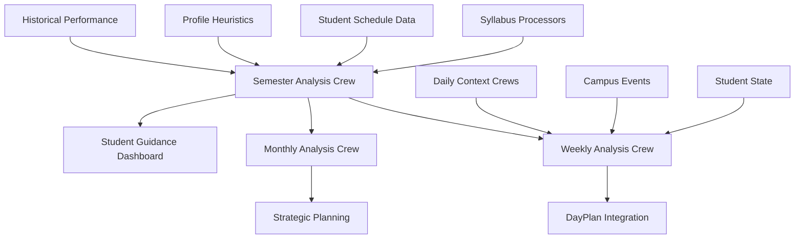

# Semester Analysis & Periodic Crews

> **Status**: Planning Phase  
> **Priority**: High  
> **Dependencies**: Syllabus Processor crews, Student scheduling system  
> **Timeline**: Implementation Q1 2025

## Overview

This document outlines a comprehensive system of periodic analysis crews designed to provide students with strategic insights across different time horizons - from weekly tactical guidance to semester-wide strategic planning.

## Core Architecture

### Data Flow


## 1. Semester Analysis Crew

### Purpose
Synthesizes all processed syllabi, student schedules, and profile heuristics to create a comprehensive semester roadmap identifying crunch weeks, cost analysis, workload distribution, and strategic guidance.

### Input Data
```typescript
interface SemesterAnalysisInput {
  processed_syllabi: SyllabusAnalysis[];
  student_schedule: {
    course_schedules: CourseSchedule[];
    personal_commitments: PersonalCommitment[];
    work_schedule?: WorkSchedule;
  };
  student_profile: {
    academic_history: AcademicRecord[];
    learning_preferences: LearningStyle;
    time_management_patterns: TimePattern[];
    stress_indicators: StressProfile;
    financial_constraints: FinancialProfile;
  };
  semester_context: {
    semester_name: string;
    start_date: string;
    end_date: string;
    break_periods: BreakPeriod[];
    campus_events: CampusEvent[];
  };
}
```

### Output Structure
```typescript
interface SemesterAnalysisOutput {
  executive_summary: {
    difficulty_rating: number; // 1-10
    total_estimated_hours: number;
    predicted_gpa_range: string;
    success_probability: string;
    key_risk_factors: string[];
  };
  
  crunch_periods: CrunchWeek[];
  cost_breakdown: SemesterCostAnalysis;
  workload_distribution: WeeklyWorkloadMap;
  strategic_guidance: StrategyRecommendations;
  milestone_calendar: ImportantDate[];
  
  // View-specific summaries
  weekly_previews: WeeklySummary[];
  monthly_themes: MonthlyTheme[];
  
  risk_mitigation: {
    high_risk_weeks: RiskWeek[];
    contingency_plans: ContingencyPlan[];
    early_warning_signals: WarningSignal[];
  };
}
```

### Key Analysis Components

#### Crunch Week Detection
- **Algorithm**: Combines assignment due dates, exam schedules, and estimated completion times
- **Scoring**: 1-10 intensity rating based on workload concentration
- **Recommendations**: Preparation strategies, time reallocation, stress management

#### Financial Impact Analysis
- **Textbook costs**: Required vs optional materials
- **Technology requirements**: Software, equipment, subscriptions
- **Hidden costs**: Lab fees, field trips, certification exams
- **Money-saving strategies**: Used books, sharing, timing purchases

#### Strategic Advantage Identification
- **Course synergies**: Overlapping content for efficient studying
- **Professor networking**: Office hours utilization, research opportunities
- **Career alignment**: Skills development, portfolio building
- **Academic optimization**: GPA impact, prerequisite planning

### Implementation Plan

#### Agent Architecture
1. **Semester Strategist**: Master coordinator analyzing overall patterns
2. **Workload Analyzer**: Calculates time requirements and distributions
3. **Financial Analyst**: Comprehensive cost analysis and optimization
4. **Risk Assessment Specialist**: Identifies potential problems and solutions
5. **Opportunity Identifier**: Finds strategic advantages and synergies

#### LLM Strategy
- **Primary LLM**: GPT-4o for complex strategic analysis
- **Fast Processing**: Gemini 2.0 Flash for data aggregation tasks
- **Validation**: Claude Sonnet for output quality assurance

## 2. Weekly Analysis Crew

### Purpose
Provides tactical weekly guidance based on semester analysis, current student state, and emerging contexts.

### Input Data
```typescript
interface WeeklyAnalysisInput {
  semester_analysis: SemesterAnalysisOutput;
  current_week_context: {
    week_number: number;
    date_range: DateRange;
    upcoming_deadlines: Assignment[];
    scheduled_events: Event[];
  };
  student_current_state: {
    energy_levels: EnergyProfile;
    stress_indicators: StressLevel[];
    academic_progress: ProgressMetrics;
    health_metrics: HealthData;
  };
  contextual_factors: {
    weather_forecast: WeatherData;
    campus_events: CampusEvent[];
    travel_status: TravelStatus;
  };
}
```

### Output Structure
```typescript
interface WeeklyAnalysisOutput {
  week_overview: {
    intensity_rating: number;
    focus_theme: string;
    success_metrics: string[];
  };
  
  daily_priorities: DailyPriority[];
  study_schedule_optimization: StudyBlock[];
  wellness_recommendations: WellnessAction[];
  social_opportunities: SocialEvent[];
  
  risk_monitoring: {
    stress_level_prediction: number;
    potential_conflicts: Conflict[];
    mitigation_strategies: string[];
  };
  
  preparation_for_next_week: {
    advance_tasks: Task[];
    resource_needs: Resource[];
    scheduling_considerations: string[];
  };
}
```

### Key Features
- **Adaptive Scheduling**: Adjusts based on energy patterns and workload
- **Wellness Integration**: Balances academic demands with mental health
- **Social Optimization**: Identifies networking and relationship opportunities
- **Proactive Planning**: Prepares for upcoming challenges

## 3. Monthly Analysis Crew

### Purpose
Provides monthly strategic reviews and forward-looking planning, bridging weekly tactics and semester strategy.

### Input Data
```typescript
interface MonthlyAnalysisInput {
  semester_analysis: SemesterAnalysisOutput;
  weekly_performance_data: WeeklyPerformance[];
  academic_progress: {
    current_grades: CourseGrade[];
    assignment_completion_rates: CompletionMetric[];
    study_habit_effectiveness: StudyMetric[];
  };
  life_context_changes: {
    schedule_modifications: ScheduleChange[];
    personal_developments: PersonalUpdate[];
    health_trends: HealthTrend[];
  };
}
```

### Output Structure
```typescript
interface MonthlyAnalysisOutput {
  performance_review: {
    academic_trajectory: string;
    goal_progress: GoalProgress[];
    habit_effectiveness: HabitAnalysis[];
  };
  
  strategic_adjustments: {
    study_method_updates: StudyMethodChange[];
    schedule_optimizations: ScheduleOptimization[];
    priority_rebalancing: PriorityShift[];
  };
  
  upcoming_month_preview: {
    major_milestones: Milestone[];
    preparation_requirements: Preparation[];
    opportunity_windows: Opportunity[];
  };
  
  wellness_check: {
    stress_pattern_analysis: StressPattern[];
    energy_optimization: EnergyOptimization[];
    social_health_assessment: SocialHealth;
  };
}
```

## 4. Additional Periodic Crews

### 4.1 Midterm Analysis Crew
**Frequency**: Mid-semester (Week 8-9)  
**Purpose**: Comprehensive performance review and strategy adjustment

```typescript
interface MidtermAnalysisOutput {
  academic_health_check: AcademicHealthCheck;
  grade_projection_update: GradeProjection[];
  strategic_pivots: StrategyPivot[];
  resource_reallocation: ResourceReallocation[];
  recovery_plans: RecoveryPlan[];
}
```

### 4.2 Finals Preparation Crew
**Frequency**: 4 weeks before finals  
**Purpose**: Comprehensive final exam strategy and timeline

```typescript
interface FinalsPreparationOutput {
  study_timeline: StudyTimeline[];
  exam_prioritization: ExamPriority[];
  resource_allocation: ResourceAllocation[];
  stress_management_plan: StressManagementPlan;
  contingency_strategies: ContingencyStrategy[];
}
```

### 4.3 Course Selection Advisory Crew
**Frequency**: End of semester  
**Purpose**: Next semester planning and course selection optimization

```typescript
interface CourseSelectionOutput {
  recommended_courses: CourseRecommendation[];
  schedule_optimization: ScheduleOptimization[];
  prerequisite_planning: PrerequisitePlan[];
  workload_balancing: WorkloadBalance;
  career_alignment_analysis: CareerAlignment[];
}
```

### 4.4 Study Habit Optimizer Crew
**Frequency**: Weekly  
**Purpose**: Continuous study pattern analysis and optimization

```typescript
interface StudyHabitOutput {
  effectiveness_metrics: EffectivenessMetric[];
  habit_recommendations: HabitRecommendation[];
  environment_optimizations: EnvironmentOptimization[];
  technique_experiments: TechniqueExperiment[];
}
```

### 4.5 Stress & Wellness Monitor Crew
**Frequency**: Weekly  
**Purpose**: Mental health and stress level analysis with intervention recommendations

```typescript
interface WellnessMonitorOutput {
  stress_level_assessment: StressAssessment;
  wellness_trend_analysis: WellnessTrend[];
  intervention_recommendations: InterventionRecommendation[];
  support_resource_suggestions: SupportResource[];
}
```

### 4.6 Financial Planning Crew
**Frequency**: Monthly  
**Purpose**: Semester budget tracking and financial optimization

```typescript
interface FinancialPlanningOutput {
  budget_analysis: BudgetAnalysis;
  expense_optimization: ExpenseOptimization[];
  saving_opportunities: SavingOpportunity[];
  financial_health_score: number;
}
```

### 4.7 Career Progress Crew
**Frequency**: Monthly  
**Purpose**: Career development and networking analysis

```typescript
interface CareerProgressOutput {
  skill_development_tracking: SkillProgress[];
  networking_opportunities: NetworkingOpportunity[];
  career_milestone_progress: CareerMilestone[];
  portfolio_development_suggestions: PortfolioSuggestion[];
}
```

## Implementation Timeline

### Phase 1: Core Semester Analysis (Weeks 1-3)
- [ ] Implement Semester Analysis Crew
- [ ] Create Pydantic models for all data structures
- [ ] Build agent architecture with proper LLM routing
- [ ] Integrate with existing syllabus processor outputs
- [ ] Create comprehensive testing suite

### Phase 2: Periodic Analysis Crews (Weeks 4-6)
- [ ] Implement Weekly Analysis Crew
- [ ] Implement Monthly Analysis Crew
- [ ] Build data aggregation pipelines
- [ ] Create scheduling system for periodic execution
- [ ] Integration testing with Engine workflows

### Phase 3: Specialized Crews (Weeks 7-10)
- [ ] Implement Midterm Analysis Crew
- [ ] Implement Finals Preparation Crew
- [ ] Implement Course Selection Advisory Crew
- [ ] Implement Study Habit Optimizer Crew
- [ ] Implement Stress & Wellness Monitor Crew

### Phase 4: Advanced Crews (Weeks 11-12)
- [ ] Implement Financial Planning Crew
- [ ] Implement Career Progress Crew
- [ ] Build comprehensive dashboard integration
- [ ] Performance optimization and caching
- [ ] Production deployment and monitoring

## Technical Considerations

### Memory Management
- Use `BaseDormWayCrewWithMemory` for crews needing historical context
- Implement proper memory cleanup to prevent context contamination
- Build crew-specific memory namespaces

### Performance Optimization
- Implement intelligent caching for semester-level analysis
- Use parallel processing for independent analysis components
- Optimize LLM calls through strategic batching

### Data Privacy & Security
- Ensure all PII is properly handled in analysis
- Implement data retention policies for historical analysis
- Build audit trails for all crew executions

### Integration Points
- **Engine Integration**: Temporal workflow scheduling
- **DayPlan Integration**: Weekly crew outputs feed daily planning
- **Mobile App**: Expose analysis results through dashboard APIs
- **Admin Dashboard**: Monitoring and override capabilities

## Success Metrics

### User Engagement
- **Adoption Rate**: % of users viewing semester analysis
- **Action Implementation**: % of recommendations actually followed
- **User Satisfaction**: Survey scores on analysis usefulness

### Academic Outcomes
- **GPA Improvement**: Correlation with semester analysis usage
- **Stress Reduction**: Measured through self-reporting
- **Time Management**: Improved efficiency metrics

### System Performance
- **Execution Time**: Crew completion times within SLA
- **Accuracy**: Prediction accuracy for crunch weeks and workload
- **Reliability**: Uptime and error rates

---

*This document will be updated as implementation progresses. Last updated: January 2025*
