# Ably Relay Service Architecture

**Overview**: The Ably Relay service is a critical TypeScript/Node.js service that acts as a bridge between Temporal workflows and Ably real-time channels, enabling seamless communication between the iOS app and backend processing systems.

## Table of Contents

1. #service-overview|Service Overview
2. #architecture-components|Architecture Components
3. #message-flow-patterns|Message Flow Patterns
4. #presence-management|Presence Management
5. #telemetry-processing|Telemetry Processing
6. #integration-points|Integration Points
7. #deployment--scaling|Deployment & Scaling

## Service Overview

### Purpose and Responsibilities

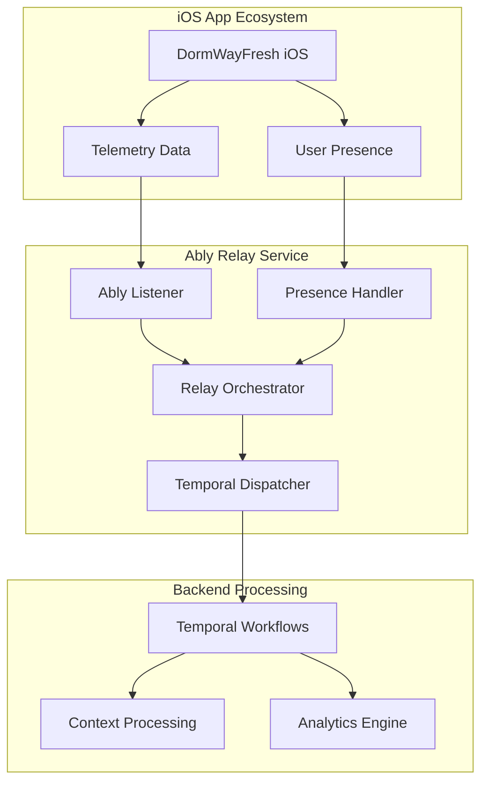

**Core Responsibilities:**
1. **Real-time Bridge**: Connect Ably channels to Temporal workflows
2. **Telemetry Relay**: Forward iOS telemetry data to processing systems
3. **Presence Tracking**: Monitor user sessions and activity states
4. **Event Orchestration**: Coordinate between real-time events and batch processing
5. **Session Management**: Track user lifecycle across the platform
6. **Context Prediction Telemetry**: Comprehensive logging of ML prediction requests and responses for deep analysis

## Architecture Components

### Service Structure

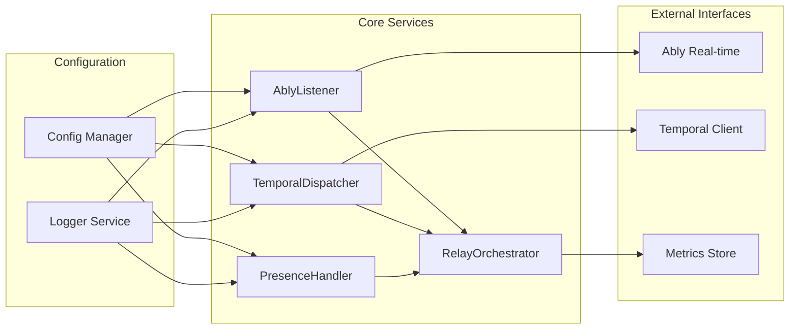

### Component Responsibilities

#### AblyListener (`ably-listener.ts`)
- Subscribes to Ably channels for incoming messages
- Handles connection state management
- Processes real-time events from iOS app
- Manages channel subscriptions and unsubscriptions

#### TemporalDispatcher (`temporal-dispatcher.ts`)
- Dispatches events to appropriate Temporal workflows
- Handles workflow execution management
- Manages retry logic for failed dispatches
- Maintains workflow state tracking

#### PresenceHandler (`presence-handler.ts`)
- Tracks user presence events (enter/leave/update)
- Manages session duration tracking
- Handles presence data aggregation
- Coordinates with user context updates

#### RelayOrchestrator (`relay-orchestrator.ts`)
- Coordinates between all service components
- Manages event routing and prioritization
- Handles service health monitoring
- Orchestrates shutdown and cleanup procedures

## Message Flow Patterns

### Telemetry Data Flow

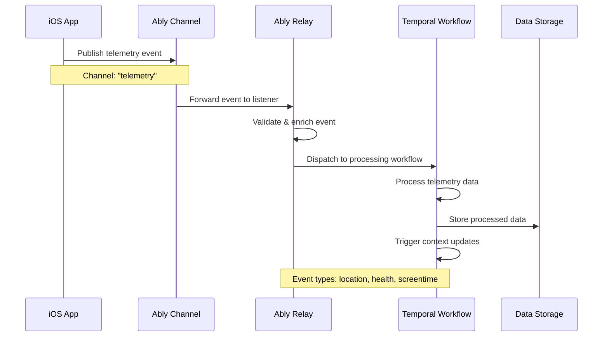

### User Update Flow

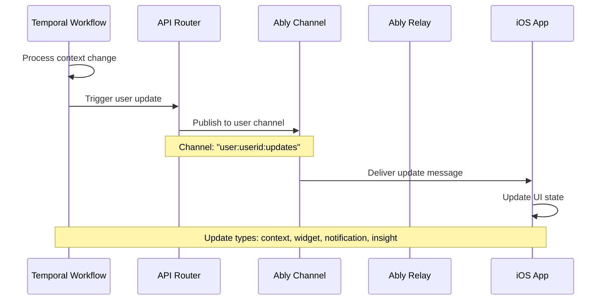

### System Broadcast Flow

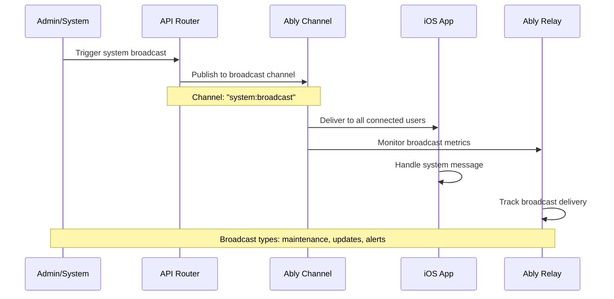

## Presence Management

### Presence Event Handling

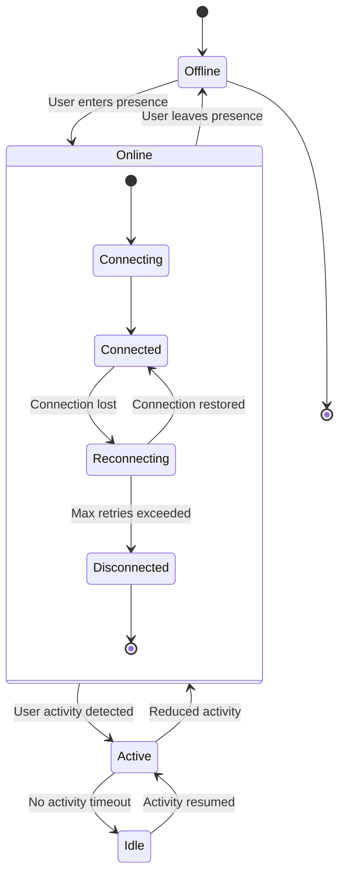

### Presence Data Structure

```typescript
interface PresenceData {
  userId: string;
  device: 'ios' | 'web';
  platform: string;
  version: string;
  model?: string;
  timestamp: number;
  type: 'telemetry_producer' | 'update_consumer';
  sessionId: string;
  location?: {
    campus?: string;
    building?: string;
  };
}
```

### Session Tracking Flow

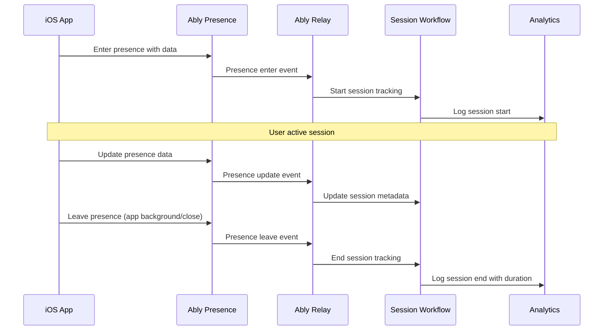

## Telemetry Processing

### Context Prediction Telemetry Flow

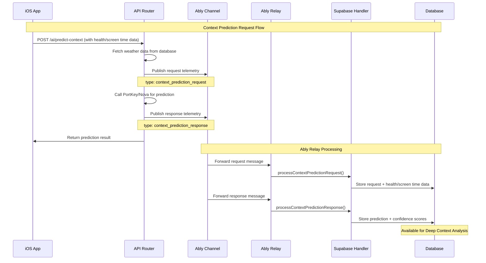

### Context Prediction Data Structure

**Request Telemetry**:
```typescript
interface ContextPredictionRequest {
  type: 'context_prediction_request';
  userId: string;
  data: {
    userId: string;
    request: {
      user: { major: string; year: string; campus: string };
      environment: { location: LocationData; timeOfDay: string; weatherDetails: WeatherData };
      health?: { stepCount?: number; heartRate?: HeartRateData; sleepAnalysis?: SleepData };
      screenTime?: { totalMinutesToday?: number; pickupCount?: number };
      recentActivity: ActivityData;
      calendar: CalendarData;
      patterns: PatternData;
    };
    metadata: {
      weatherSource: 'database' | 'api' | 'fallback';
      cacheHit: boolean;
      campusDetected?: string;
    };
    timestamp: string;
  };
}
```

**Response Telemetry**:
```typescript
interface ContextPredictionResponse {
  type: 'context_prediction_response';
  userId: string;
  data: {
    userId: string;
    input: ContextPredictionRequest['data']['request'];
    output: {
      primaryState: string;
      confidence: number;
      reasoning: string;
      locationAnalysis: LocationAnalysis;
      temporalInsights: TemporalInsights;
      environmentalFactors: EnvironmentalFactors;
    };
    weatherSource: string;
    metadata: {
      inferenceTimeMs: number;
      modelUsed: string;
      tokenCount?: number;
      cacheUsed: boolean;
    };
    timestamp: string;
  };
}
```

### Event Processing Pipeline

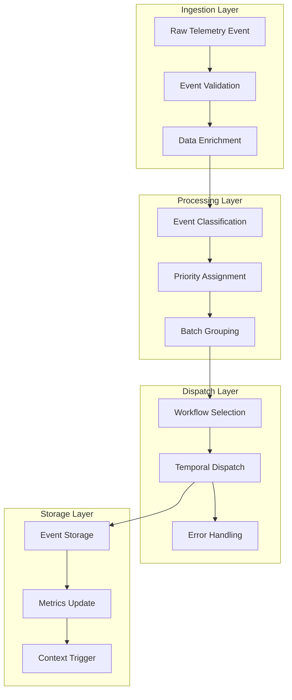

### Event Types and Workflows

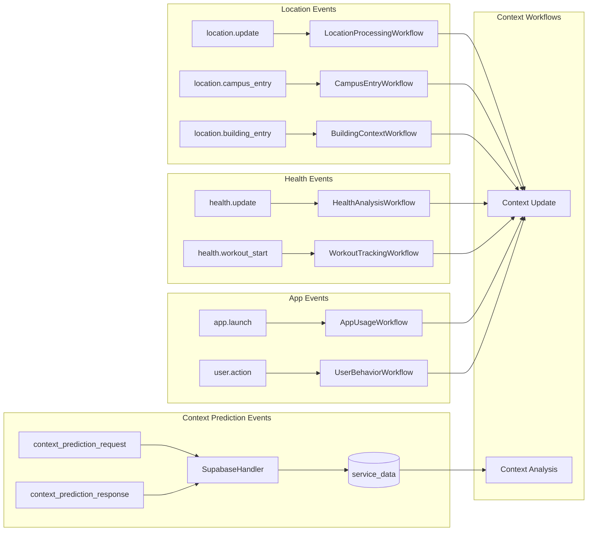

### Error Handling and Retries

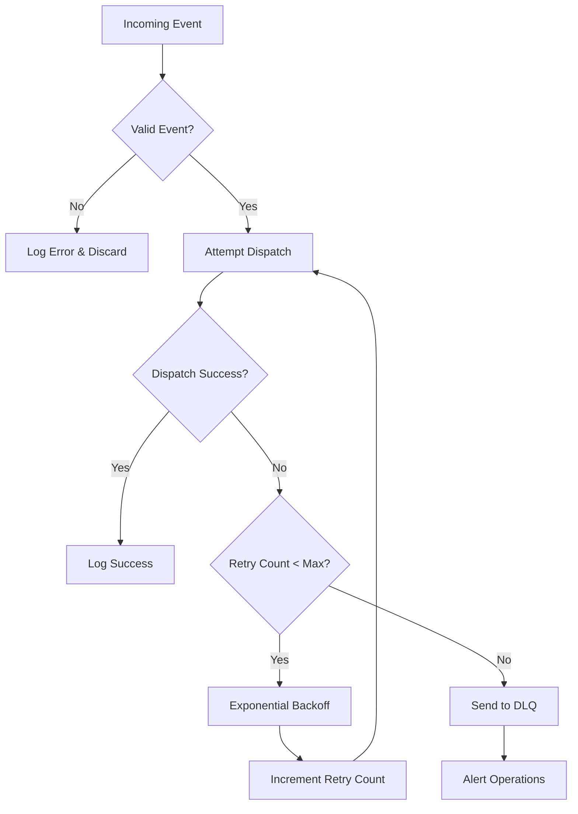

## Integration Points

### Temporal Integration

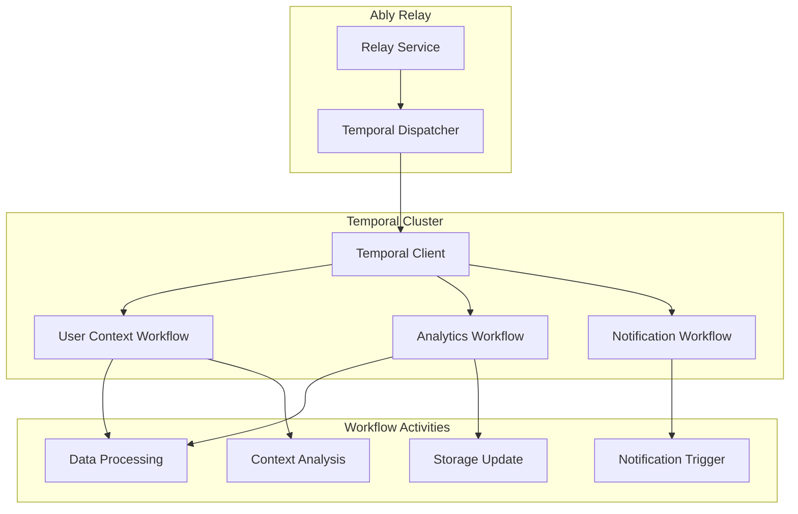

### API Router Integration

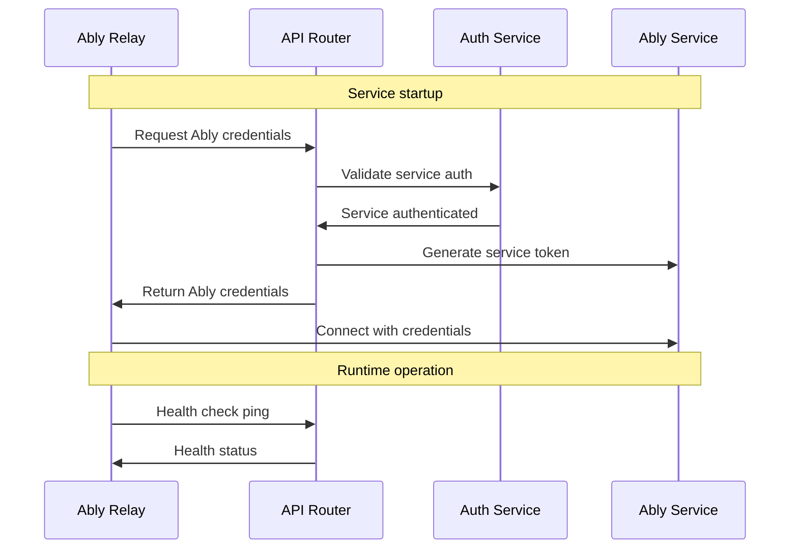

### Database Integration

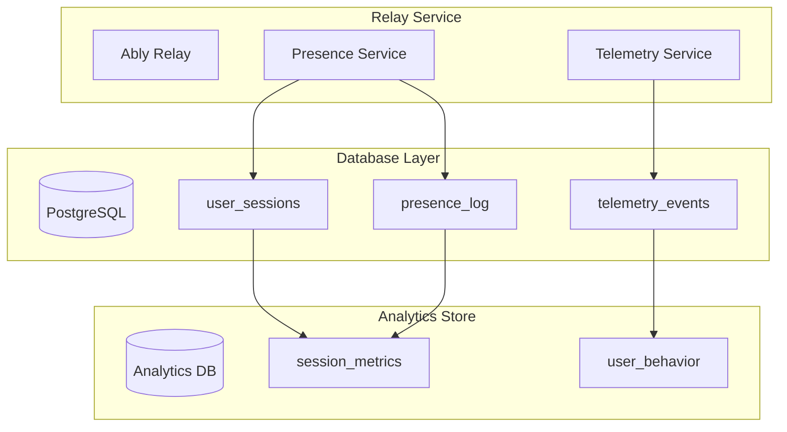

## Deployment & Scaling

### Deployment Architecture

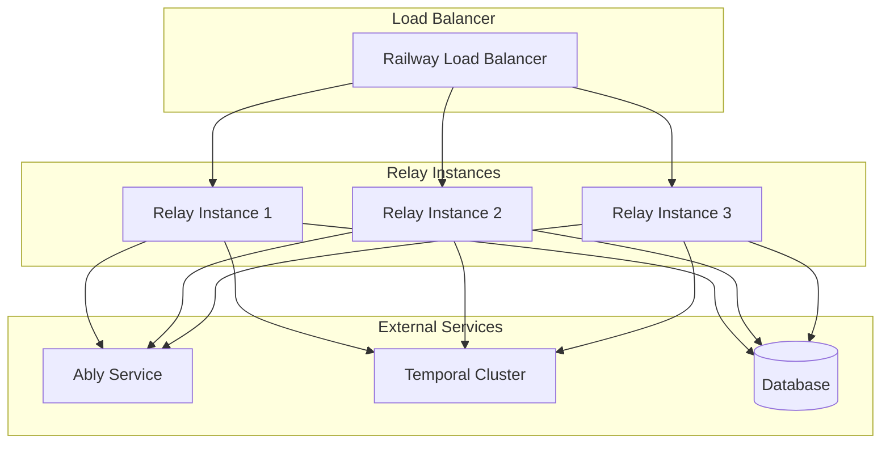

### Scaling Considerations

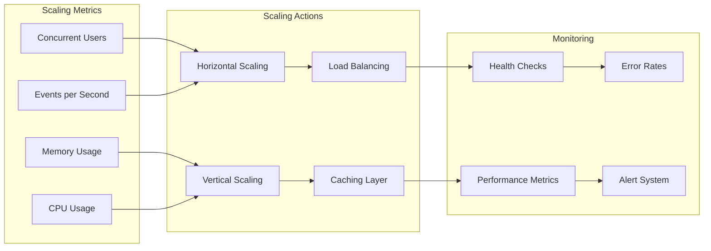

### Environment Configuration

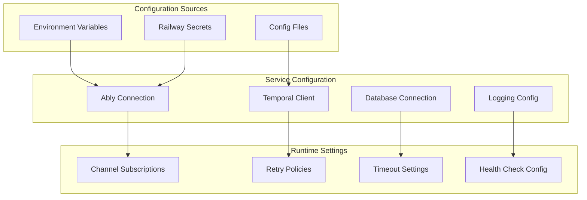

## Monitoring and Observability

### Health Monitoring

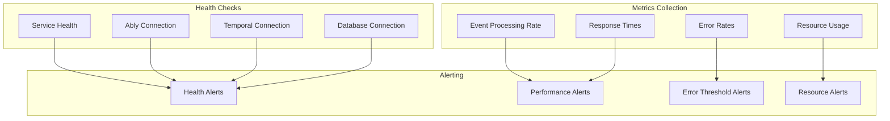

### Performance Metrics

- **Event Processing Rate**: Events per second processed
- **Dispatch Latency**: Time from event receipt to Temporal dispatch
- **Connection Health**: Ably and Temporal connection status
- **Error Rates**: Failed dispatches and processing errors
- **Memory/CPU Usage**: Resource consumption monitoring
- **Active Sessions**: Current user presence count

## Related Documentation

- [DormWayFresh Architecture](/docs/engineering/architecture/dormwayfresh-ios-architecture)
- Real-time Updates Strategy
- API Router Integration
- [Temporal Workflows](/docs/engineering/architecture/sot-context-system)
