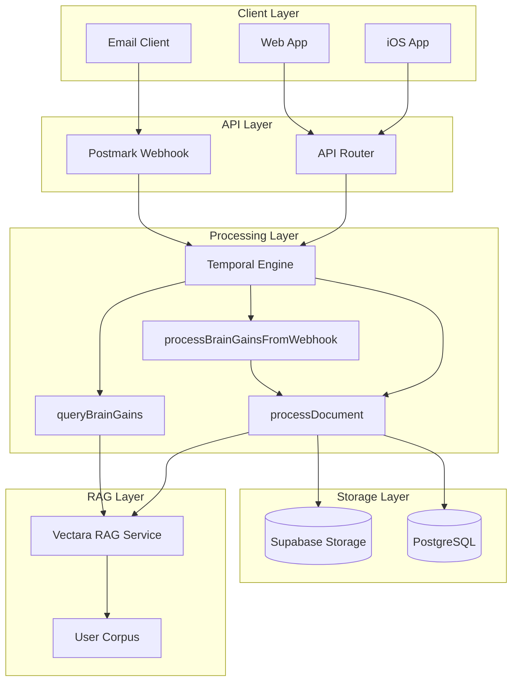

# BrainGains RAG Architecture

## Overview

BrainGains is DormWay's multi-document Retrieval-Augmented Generation (RAG) system that enables students to upload, store, and intelligently query their academic documents. Current stack: PortKey gateway + model providers (OpenAI/Anthropic/Gemini), storage in Postgres/S3, embeddings in Vectara (evaluating Pinecone fallback). Responses flow through api-router with RLS enforced via `dormway_api`.

## System Architecture

> Current channels/roles: api-router enforces RLS via `dormway_api`; engine publishes progress updates over Ably `user:{userId}:updates`, and Customer.io sends visible notifications on completion.



## Key Components

### 1. Upload Paths

#### API Upload
- **Endpoint**: `POST /api/braingains/documents`
- **Format**: Multipart form data
- **File Types**: PDF, TXT, MD, DOC, DOCX
- **Max Size**: 25MB
- **Process**: Direct → Supabase → Temporal → Vectara

#### Email Upload
- **Endpoint**: `POST /api/postmark/braingains`
- **Process**: Email → Webhook → Supabase → Temporal → Vectara
- **Batch Processing**: All attachments in single workflow

### 2. Document Types

Supports 14 academic document types:
- `syllabus` - Course syllabi
- `notes` - Class notes
- `assignment` - Homework assignments
- `study_guide` - Study guides
- `reference` - Reference materials
- `textbook` - Textbook excerpts
- `lecture_slides` - Presentation slides
- `homework` - Homework submissions
- `exam` - Past exams
- `quiz` - Quiz materials
- `project` - Project documents
- `lab_report` - Lab reports
- `essay` - Essays and papers
- `research_paper` - Research papers
- `other` - Miscellaneous

### 3. Temporal Workflows

#### processDocument
- Extracts text from uploaded files
- Stores metadata in PostgreSQL
- Indexes content in Vectara
- Updates processing status

#### queryBrainGains
- Queries user's Vectara corpus
- Returns RAG-enhanced responses
- Includes source metadata
- Tracks usage statistics

#### processBrainGainsFromWebhook
- Parent workflow for email attachments
- Spawns child `processDocument` workflows
- Enables batch restart/retry

### 4. Vectara Integration

#### Configuration
```typescript
{
  search: {
    corpora: [{ corpus_key: "DW-{userId}" }],
    limit: 25,
    context_configuration: {
      sentences_before: 2,
      sentences_after: 2
    },
    reranker: {
      type: "customer_reranker",
      reranker_id: "rnk_272725717"
    }
  },
  generation: {
    generation_preset_name: "vectara-summary-ext-24-05-large",
    max_used_search_results: 5,
    model_parameters: { llm_name: "gpt-4o-mini" },
    enable_factual_consistency_score: true
  }
}
```

#### User Isolation
- Each user has a dedicated corpus: `DW-{userId}`
- Automatic corpus creation on first upload
- Complete data isolation between users

### 5. Security Architecture

#### Authentication
- JWT-based authentication for API
- Device key authentication for mobile
- Basic auth for webhooks

#### Data Protection
- Signed URLs (1-hour expiry) for file access
- GraphQL DDN row-level security
- Vectara corpus isolation
- No cross-user data access

#### File Security
- ClamAV virus scanning (optional)
- File type validation
- Size limits enforcement
- Sanitized filenames

## Data Flow

### Upload Flow
1. User uploads document via API or email
2. File stored in Supabase storage
3. Workflow extracts text content
4. Document indexed in Vectara
5. Metadata stored in PostgreSQL
6. User notified of completion

### Query Flow
1. User sends query via API
2. Workflow queries Vectara corpus
3. Vectara returns ranked results
4. System formats response with sources
5. Usage tracked in database

## Database Schema

### braingains_documents
- `id`: UUID primary key
- `user_id`: References accounts(id)
- `document_type`: Enum of 14 types
- `filename`: Original filename
- `content_url`: Supabase storage URL
- `extracted_text`: Full text content
- `vectara_doc_id`: Vectara document ID
- `processing_status`: Current status
- `metadata`: JSONB additional data
- `created_at`: Timestamp
- `updated_at`: Timestamp

### braingains_usage
- `id`: UUID primary key
- `user_id`: References accounts(id)
- `upload_count`: Total uploads
- `query_count`: Total queries
- `total_pages`: Pages processed
- `last_activity`: Timestamp

## Performance Characteristics

### Capacity
- 25MB max file size
- 25 documents per query
- Unlimited documents per user
- Sub-2 second query response time

### Scalability
- Vectara handles vector operations
- Temporal manages processing queue
- Supabase scales storage automatically
- PostgreSQL handles metadata

## Future Enhancements

### Planned Features
1. **Multimodal Support**: Images, audio, video (Vectara 2025)
2. **Document Sharing**: Share documents between users
3. **Advanced Filters**: Filter by date, course, type
4. **Mobile Offline**: Cache recent documents
5. **Study Groups**: Shared document collections

### API Enhancements
1. Bulk upload endpoint
2. Document versioning
3. Collaborative annotations
4. Export to study materials
5. Integration with calendar

## Monitoring & Operations

### Key Metrics
- Upload success rate
- Query response time
- Vectara API usage
- Storage utilization
- User engagement

### Error Handling
- Workflow retries for transient failures
- Dead letter queue for permanent failures
- User notifications for processing errors
- Admin alerts for system issues

## Related Documentation

- 🔨 BrainGains Implementation Guide
- API Documentation
- Workflow Documentation
- Security Architecture
