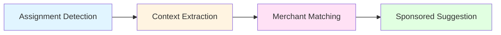
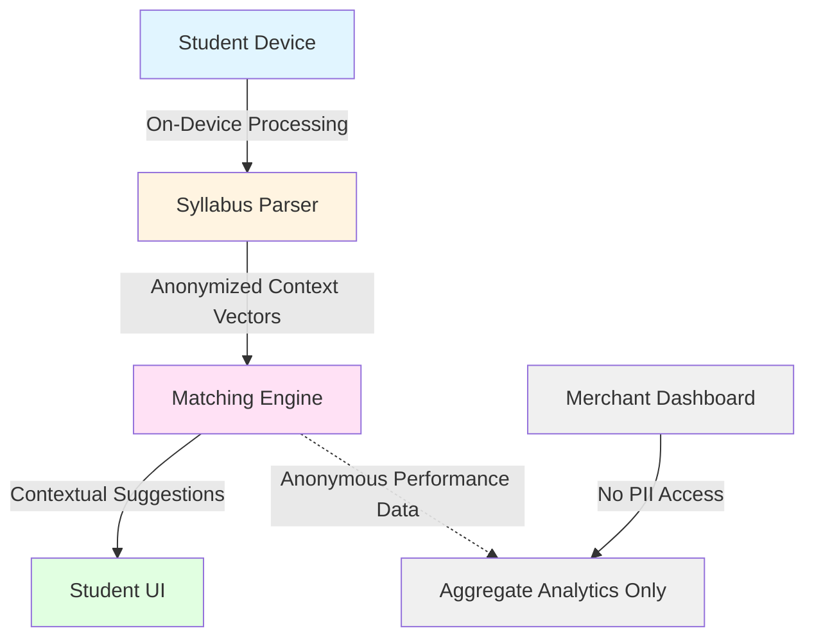
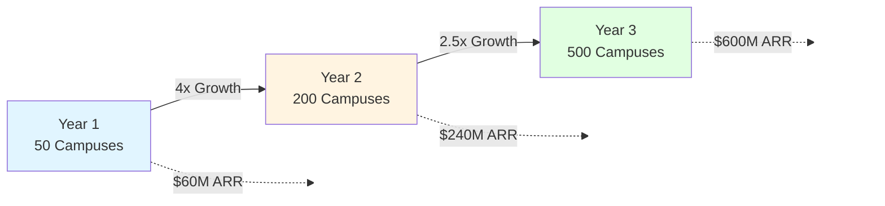
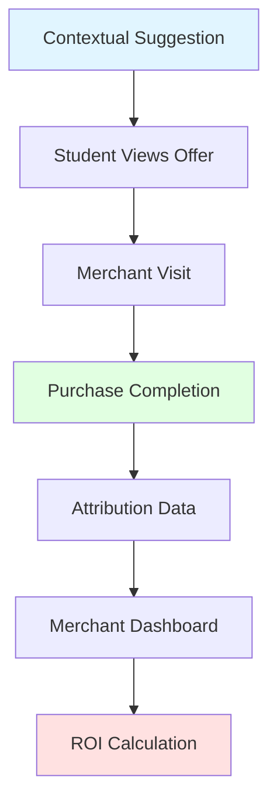
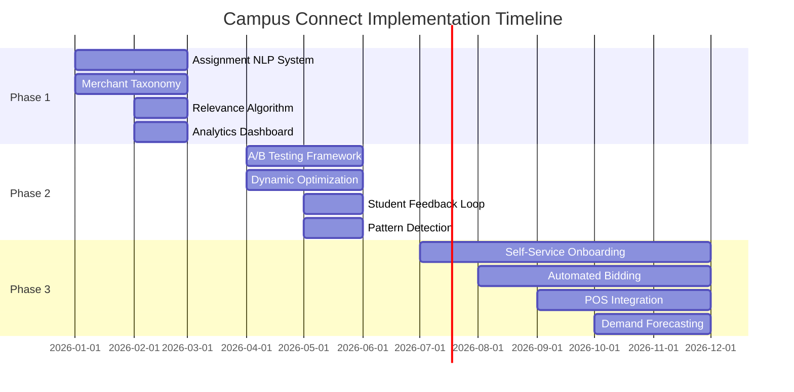
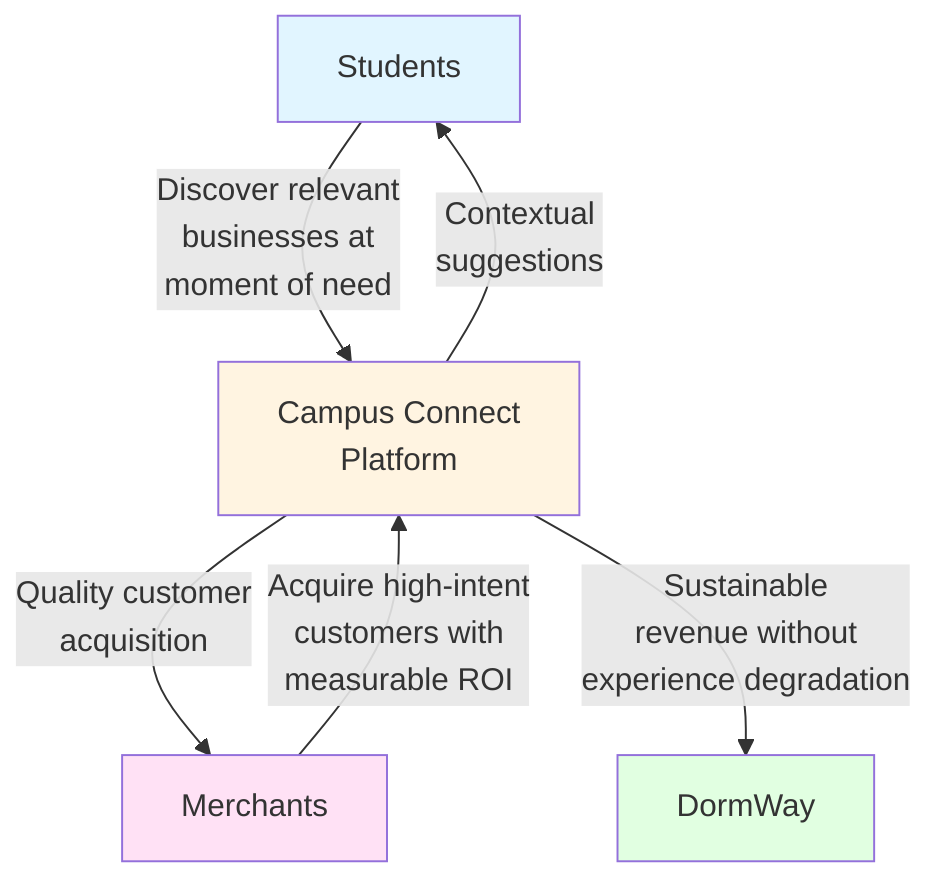
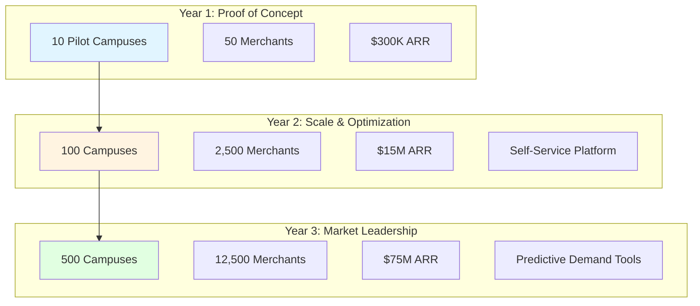

# Campus Connect: Contextual Sponsorship Integration

## Executive Summary

Campus Connect represents a fundamental rethinking of college student advertising by leveraging DormWay's academic intelligence layer to deliver contextually relevant sponsorships at the moment of highest intent. Rather than interruptive display ads, Campus Connect integrates merchant offerings directly into the student's academic workflow—surfacing relevant businesses when assignment context naturally creates demand.

## Market Opportunity

### Addressable Market
- **19.3M college students** across U.S. campuses (15.3M undergraduate, 3-4M graduate)[^1]
- **$600B+ annual spending power** including $78.3B on food/groceries and $94B in back-to-college seasonal spending[^2][^3]
- **Fragmented local business market**: Campus marketing represents a multi-billion dollar opportunity with no centralized spend data
- **Current inefficiency**: Traditional campus advertising (flyers, posters, digital boards) reaches students at moments of low purchase intent, missing contextual opportunities

[^1]: National Center for Education Statistics (NCES), Fall 2023 enrollment data, released January 2025. National Student Clearinghouse Research Center reports 15.3M undergraduates for Spring 2025.
[^2]: Refuel Agency College Explorer™, proprietary research (note: single commercial source, methodology not publicly disclosed).
[^3]: National Retail Federation, Back-to-College Spending 2023 ($94B seasonal spending, $1,367 average per student).

### Problem Statement

Traditional campus advertising suffers from three core failures:

1. **Temporal Misalignment**: Flyers, digital ads, and campus promotions reach students when intent is lowest
2. **Context Blindness**: Merchants have no visibility into what students are actually working on
3. **Discovery Friction**: Students default to Google/Amazon rather than discovering local alternatives

## Solution Architecture

### Intelligence Layer

DormWay's syllabus parsing and assignment tracking creates a unique contextual graph:

**Example Flow:**
- Student receives syllabus with "Group presentation on climate policy - due Oct 15"
- DormWay extracts: project type (group presentation), topic (climate policy), deadline
- Context engine identifies relevant merchants: print shops, coffee shops with meeting rooms, stationery stores
- Sponsored suggestion surfaces: "Need presentation materials? Ann Arbor Copy Shop offers 20% off for DormWay users"

### Contextual Triggers

Campus Connect activates on specific academic events:

| Trigger | Context Signal | Relevant Merchants |
|---------|---------------|-------------------|
| Group project assigned | Multiple students, collaboration needed | Coffee shops, study spaces, printing services |
| Lab report due | Technical documentation required | Office supply, tech repair, printing |
| Reading list published | Book/material acquisition | Bookstores, libraries, used book marketplaces |
| Exam scheduled | Study preparation period | Coffee shops, tutoring services, office supply |
| Field work assigned | Off-campus activity | Transportation, equipment rental, restaurants |

### Privacy-Preserving Architecture

All contextual processing happens on-device or through anonymized aggregation:

1. **Syllabus parsing** extracts assignment metadata locally
2. **Merchant matching** uses anonymized context vectors
3. **No PII** shared with advertisers—only aggregate performance metrics
4. **Student control**: Opt-in per merchant category, adjustable relevance threshold

## Revenue Model

### Pricing Structure

**Tier 1: Contextual Listings** ($200-500/month per location)
- Merchant appears in relevant contextual moments
- Basic analytics: impressions, click-through, student engagement time
- Example: Local print shop appears when printing-related assignments detected

**Tier 2: Sponsored Positioning** ($500-1,500/month per location)
- Priority placement in contextual suggestions
- A/B testing capabilities for offers
- Student preference insights (anonymized)
- Example: Coffee shop gets first position when group study context detected

**Tier 3: Campus Deals Platform** ($1,500-3,000/month per location)
- Full integration into DormWay's deals marketplace
- Dynamic pricing based on student demand signals
- Performance analytics: conversion attribution, repeat customer rate
- Example: Restaurant adjusts happy hour timing based on class schedule patterns

### Market Sizing

Conservative estimates based on 100K active students (5% of 2M campus population, scaled across major metro areas):

| Category | Merchants/Campus | Monthly ARPU | Annual Revenue |
|----------|-----------------|--------------|----------------|
| Food & Beverage | 150 | $400 | $720K |
| Printing & Office | 20 | $600 | $144K |
| Retail & Services | 80 | $350 | $336K |
| **Total per campus** | **250** | | **$1.2M** |

**Nationwide scaling** (targeting 500 campuses by 2027):

- Year 1 (50 campuses): $60M ARR
- Year 2 (200 campuses): $240M ARR  
- Year 3 (500 campuses): $600M ARR

## Competitive Advantages

### 1. Zero-Party Data Architecture
Unlike Facebook/Google behavioral tracking, students explicitly share academic context through syllabus uploads. This creates higher-quality intent signals without privacy concerns, as students voluntarily provide contextual information about their coursework and assignments.

### 2. Network Intelligence
As more students join, Campus Connect learns:
- Which assignments generate specific merchant needs
- Optimal timing for merchant suggestions (preliminary data suggests 3-5 days before project due dates yields highest engagement)
- Cross-campus patterns (e.g., chemistry labs consistently drive safety equipment and printing needs)
- Seasonal demand fluctuations tied to academic calendars

### 3. Closed-Loop Attribution

DormWay can track full funnel from contextual suggestion → merchant visit → purchase completion, providing merchants with clearer ROI than any campus advertising alternative.

### 4. Anti-Commoditization
Unlike Yelp/Google where students search generic terms ("coffee near me"), Campus Connect surfaces merchants in specific academic contexts, reducing price competition and increasing merchant differentiation.

## Technical Implementation

### Phase 1: Contextual Matching Engine (Months 1-3)

- Assignment NLP classification system
- Merchant category taxonomy (250+ categories)
- Basic relevance scoring algorithm
- Analytics dashboard for merchants

### Phase 2: Dynamic Optimization (Months 4-6)
- A/B testing framework for merchant offers
- Time-based relevance adjustments (surge pricing equivalent)
- Student feedback loop (upvote/downvote suggestions)
- Cross-campus pattern detection

### Phase 3: Marketplace Platform (Months 7-12)
- Self-service merchant onboarding
- Automated bidding for contextual placement
- Integration with POS systems for closed-loop attribution
- Predictive demand forecasting for merchants

## Risk Mitigation

### Student Experience Degradation
**Risk**: Over-commercialization alienates core user base

**Mitigation**:
- Hard cap: Max 2 sponsored suggestions per academic event
- Relevance threshold: Only show suggestions scoring >0.75 on context match
- User control: Per-category opt-out, "never show again" option
- Quality filter: Merchant rating must be >4.2 stars

### Merchant Skepticism
**Risk**: Local businesses don't understand contextual advertising value

**Mitigation**:
- Pilot program with 5 merchants per campus (free for first 3 months)
- Simple dashboard showing "X students viewed your offer when working on Y assignments"
- Case studies demonstrating 3-5x better ROI than flyers/social ads
- No long-term contracts (month-to-month until value proven)

### Regulatory Compliance
**Risk**: FERPA concerns about student data usage

**Mitigation**:
- All contextual matching happens on-device (no student data leaves phone)
- Merchants receive only aggregate, anonymized analytics
- Clear Terms of Service explaining what data is/isn't shared
- Annual third-party FERPA compliance audit

## Success Metrics

### Three-Way Value Exchange

### Student-Side KPIs
- **Contextual relevance score**: >0.8 (student rates suggestion as helpful)
- **Click-through rate**: 8-15% target (contextual advertising can achieve significantly higher engagement than standard display ads at 0.5-0.7%)[^4]
- **Opt-out rate**: below 5% (indicates good experience)

### Merchant-Side KPIs
- **Customer acquisition cost**: under $12 (vs $18-27 for social ads in food/beverage categories)[^5]
- **Conversion rate**: >12% (contextual intent drives higher conversion)
- **Repeat purchase rate**: >40% within semester
- **Month-over-month merchant retention**: >85%

[^4]: Compado 2022 KPI Report shows 15% CTR for contextual advertising vs. industry standard display CTRs of 0.46-0.73% (WordStream 2024 Benchmarks). Studies by GumGum show 43% higher neural engagement for contextually relevant ads.
[^5]: WordStream 2024 benchmarks: Facebook CPA for food/beverage $12.91, education industry $7.85. Google Ads food/beverage CPA $26.58 (DoorDash Merchant Resources 2024). Snapchat averages $5.53 CPA for 18-24 demographic.

### Platform KPIs
- **Merchant adoption rate**: 15% of eligible businesses per campus by Month 6
- **Average revenue per merchant**: $500/month
- **Gross margin**: 90% (pure software margin after AWS costs)

## Expansion Roadmap

### Year 1: Proof of Concept
- Launch on 10 pilot campuses
- 50 merchants total
- $300K ARR (baseline validation)

### Year 2: Scale & Optimization
- Expand to 100 campuses
- 2,500 merchants
- $15M ARR
- Build self-service merchant platform

### Year 3: Market Leadership
- 500 campuses nationwide
- 12,500 merchants
- $75M ARR
- Launch predictive demand tools for merchants

## Conclusion

Campus Connect transforms college student advertising from spray-and-pray to surgical precision. By leveraging DormWay's unique position as the academic intelligence layer, it creates a three-way value exchange:

1. **Students** discover relevant local businesses at moments of genuine need
2. **Merchants** acquire high-intent customers with measurable ROI
3. **DormWay** builds sustainable revenue without degrading student experience

The result is a defensible, high-margin business model that scales with the platform's core network effects—each additional student makes the system smarter, and each additional merchant makes the platform more valuable to students.

---

**Document Version**: 1.0  
**Last Updated**: October 2025  
**Author**: DormWay Strategy Team

---

## References and Data Sources

### Primary Enrollment Data
1. **National Center for Education Statistics (NCES)**: "Postsecondary Enrollment Rises in Fall 2023, Marking First Increase in Over a Decade" (January 7, 2025)
   - URL: https://nces.ed.gov/whatsnew/press_releases/1_7_2025.asp
   - Fall 2023: 19.13 million total students

2. **National Student Clearinghouse Research Center**: "Current Term Enrollment Estimates" (Spring 2025)
   - URL: https://nscresearchcenter.org/current-term-enrollment-estimates/
   - Spring 2025: 15.3M undergraduates, 2.5M graduate students
   - Coverage: 97% of Title IV degree-granting institutions

### Student Market Size
3. **National Retail Federation**: "Back-to-College Consumer Spending 2023"
   - $94 billion in seasonal back-to-college spending
   - $1,367 average per student

4. **Refuel Agency**: College Explorer™ proprietary research
   - Student spending power estimates
   - Category breakdowns: $78.3B food/groceries
   - Note: Single commercial source, methodology not publicly disclosed
   - URL: https://www.refuelagency.com/blog/college/spending-habits-of-college-students/

### Advertising Performance Benchmarks
5. **WordStream**: "Google Ads Benchmarks for YOUR Industry" (2024-2025 updates)
   - Display CTR across industries: 0.46-0.73%
   - Search CTR: 6.42-6.66%
   - Education industry: Display 0.73%, Search 6.21%
   - URL: https://www.wordstream.com/blog/ws/2016/02/29/google-adwords-industry-benchmarks

6. **WordStream**: "Facebook Ad Benchmarks for YOUR Industry" (2024-2025)
   - Facebook CPA across industries: $18.68 average
   - Education industry CPA: $7.85
   - URL: https://www.wordstream.com/blog/ws/2017/02/28/facebook-advertising-benchmarks

7. **Compado**: "2022 KPIs — Contextual Advertising in Numbers" (February 2023)
   - 15% average CTR for contextual advertising
   - 11% conversion rate
   - Based on 1 billion impressions, 230 million users
   - URL: https://compado.com/press-releases/contextual-advertising-kpis-2022/
   - Note: Self-reported by single platform; specific ad format

8. **GumGum + SPARK Neuro**: "Cognitextual: A Neuroanalytic Study of Contextual Ad Effectiveness"
   - 43% higher neural engagement for contextually relevant ads
   - URL: https://gumgum.com/guides/cognitextual-a-neuroanalytic-study-of-contextual-ad-effectiveness

### Customer Acquisition Cost Data
9. **DoorDash Merchant Resources**: "Comparing Restaurant Customer Acquisition Costs & Paid Marketing Channels" (2024)
   - Food/beverage Google Ads: $26.58 CAC
   - Food/beverage Facebook: $12.91 CAC
   - URL: https://merchants.doordash.com/en-us/blog/restaurant-customer-acquisition-cost

10. **Gupta Media**: "Social Media Ads Cost in 2025"
    - Snapchat CPA: $5.53 (18-24 demographic focus)
    - Platform-specific benchmarks
    - URL: https://www.guptamedia.com/social-media-ads-cost

11. **Coegi Partners**: "Using TikTok Ads to Reach Potential College Students"
    - Case study: $3.53 cost per page view conversion
    - 82% higher CTR than Snapchat for student audiences
    - URL: https://coegipartners.com/industry-expertise/education/social-media/using-tiktok-reach-potential-college-students/

### Contextual Advertising Research
12. **Taylor & Francis Online**: "AI-Driven Contextual Advertising: Toward Relevant Messaging Without Personal Data" (2024)
    - Journal of Advertising research on contextual effectiveness
    - URL: https://www.tandfonline.com/doi/full/10.1080/10641734.2024.2334939

### Additional Industry Sources
13. **College Board**: "Trends in College Pricing and Student Aid 2024"
    - Average costs: Public 4-year $29,910, Private 4-year $62,990
    - URL: https://research.collegeboard.org/

14. **Adweek**: "Here's How Brands Can Connect With College Students Throughout the School Year"
    - Student discretionary spending patterns
    - URL: https://www.adweek.com/brand-marketing/heres-how-brands-can-connect-college-students-throughout-school-year-173197/

---

## Methodology Notes

**Market Sizing Assumptions:**
- 5% platform penetration at mature campuses (100K active students = 2M campus population)
- Merchant adoption rate: 15% of eligible local businesses by Month 6
- ARPU based on comparable SaaS pricing for local business marketing tools
- Revenue projections assume 90% gross margin (standard for software platforms)

**Competitive Benchmark Sources:**
- All advertising benchmarks represent 2024-2025 industry data
- Education-specific metrics used where available
- Student demographic targeting (18-24) prioritized in social media benchmarks

**Data Quality Considerations:**
- Enrollment data: Official federal statistics (NCES) supplemented by near-real-time tracking (National Student Clearinghouse)
- Spending power: Single commercial source with methodology limitations; supplemented with verifiable seasonal spending (NRF)
- Advertising performance: Industry benchmarks from multiple independent sources; contextual advertising data limited to specific platforms
- CAC data: Platform-specific benchmarks vary significantly by industry, geography, and campaign optimization
