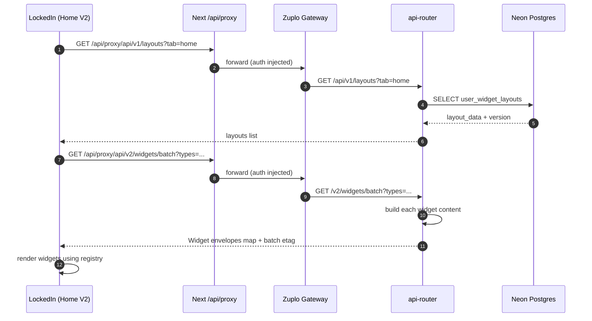
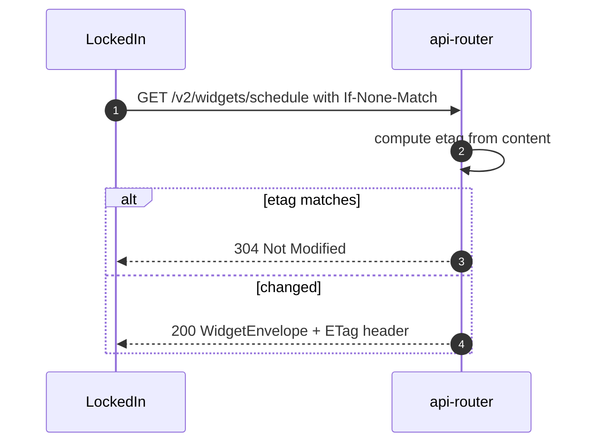
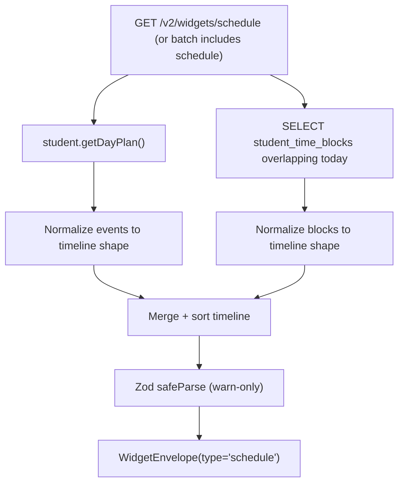
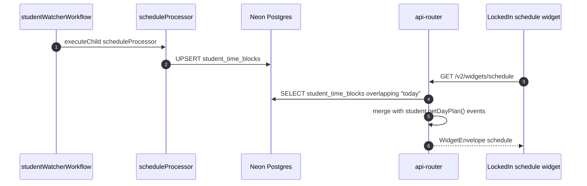
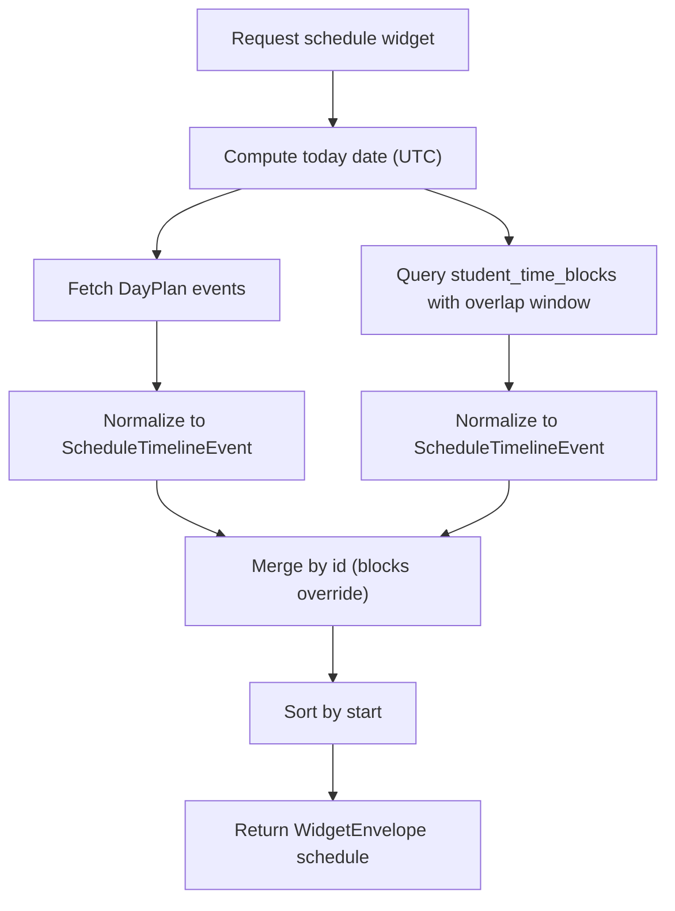
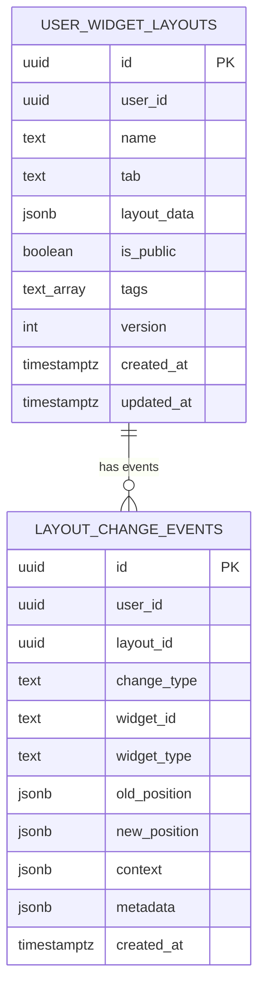
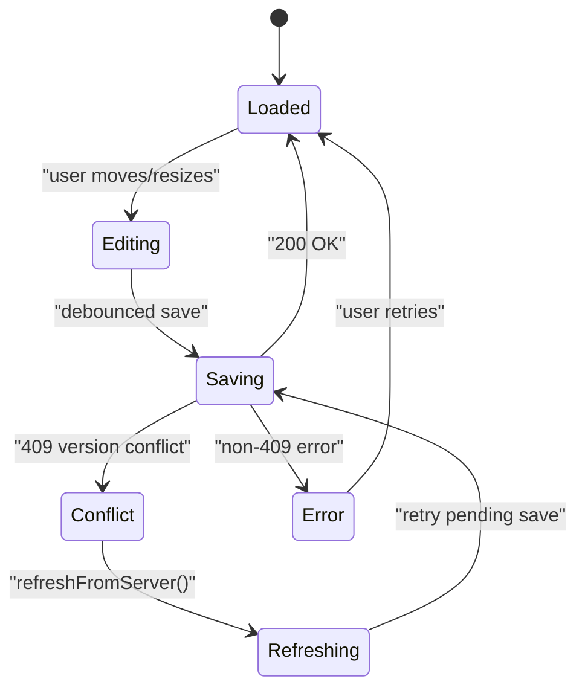
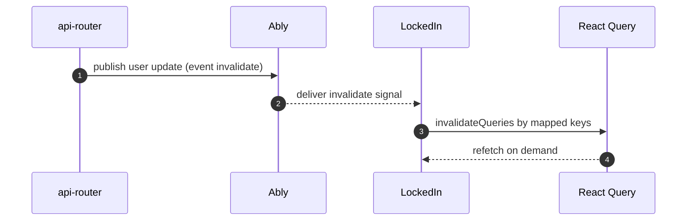

# Dashboard v2 & Widget Strategy (Current)

This is the current “dash-v2” implementation used by `dormway-lockedin` and backed by `api-router`.
For the long-term target architecture, see Home V2 Batch-First Widgets (Long-Term Spec).

For broader system context, see [How DormWay Works](/docs/engineering/architecture/how-dormway-works).

Primary code references:

- Web dashboard: `.repos/dormway-platform/services/dormway-lockedin/src/app/dashboard/home-v2/page.tsx`
- Widget registry (canonical types + metadata): `.repos/dormway-platform/services/dormway-lockedin/src/app/dashboard/home-v2/widgets/registry.ts`
- Widgets API v2: `.repos/dormway-platform/services/api-router/src/routes/v2/widgets.routes.ts`
- Layout API v1: `.repos/dormway-platform/services/api-router/src/routes/layout-routes.ts`
- Layout persistence service: `.repos/dormway-platform/services/api-router/src/services/layout-service.ts`
- Layout wire model + widget type contract: `.repos/dormway-platform/services/api-router/src/interfaces/layout.ts`

---

## 1) What “Dashboard v2” is (today)

Dashboard v2 is a **layout-first** dashboard where:

- the user’s widget **layout** (positions/sizes/config only) is persisted server-side (`user_widget_layouts`)
- widget **data** is fetched separately via `/v2/widgets/*` (single) or `/v2/widgets/batch` (multi)
- the UI renders widgets from a **canonical registry** (single source of truth for display + sizing + base priority)
- rollout is gated by `NEXT_PUBLIC_USE_V2_WIDGETS` (hybrid V1/V2 data plumbing still exists)

---

## 2) Key components and responsibilities

### Frontend: `dormway-lockedin`

- Renders the grid layout (`react-grid-layout`) and widget components.
- Persists layouts via `/api/proxy/api/v1/layouts` (Next proxy → Zuplo → api-router).
- Fetches widget data via `/api/proxy/api/v2/widgets/batch?types=...` (or individual endpoints).
- Normalizes widget types for dedupe/back-compat (e.g. `dayplan` → `schedule`, `canvas` → `courses`).

References:

- Widget types + aliases: `.repos/dormway-platform/services/dormway-lockedin/src/app/dashboard/home-v2/widgets/registry.ts`
- Hybrid data migration: `.repos/dormway-platform/services/dormway-lockedin/src/hooks/home/useWidgetDataHybrid.ts`
- Batch fetch: `.repos/dormway-platform/services/dormway-lockedin/src/hooks/home/useWidgetBatchV2.ts`

### Backend: `api-router`

- Exposes V2 widgets endpoints that wrap existing student/core APIs in a `WidgetEnvelope`.
- Builds the canonical **Schedule timeline** payload by merging:
  - DayPlan events (`student.getDayPlan()`)
  - `student_time_blocks` rows overlapping “today”
- Persists widget layouts via `/api/v1/layouts` + `LayoutService` (validation + PII stripping + optimistic locking).

References:

- Widgets API: `.repos/dormway-platform/services/api-router/src/routes/v2/widgets.routes.ts`
- Layout routes: `.repos/dormway-platform/services/api-router/src/routes/layout-routes.ts`
- Layout service: `.repos/dormway-platform/services/api-router/src/services/layout-service.ts`

### Postgres (Neon)

- `user_widget_layouts`: user layouts (no PII; “configuration only”)
- `layout_change_events`: change telemetry for the “learning flywheel”

---

## 3) High-level flow (page load)

Notes:

- Layout and widget data are **separate requests**; layout persistence does not include live widget payloads.
- The v2 batch response supports partial failure via `errors[type]` (widget-by-widget).

---

## 4) Widget envelope (contract)

The V2 widgets routes return a consistent shape:

- `WidgetEnvelope<T>`: `{ id, type, gridHints, content, generatedAt }`
- Single-widget endpoints: ETag is based on `content` only (`sendWidgetResponse`)
- Batch endpoint: returns `data.widgets[type] = WidgetEnvelope` plus a batch ETag

References:

- `WidgetEnvelope` + `sendWidgetResponse`: `.repos/dormway-platform/services/api-router/src/routes/v2/widgets.routes.ts`
- Frontend envelope types: `.repos/dormway-platform/services/dormway-lockedin/src/hooks/home/widgetV2Types.ts`

---

## 4.1 ETag and 304 semantics (single vs batch)

The v2 widgets API supports conditional GETs via ETag, but the current behavior differs between single-widget and batch endpoints.

### Single widget endpoints (`/v2/widgets/<type>`)

- ETag is computed from `content` only (stable if content is stable).
- The response body includes a `generatedAt` timestamp in the envelope, but the ETag ignores it.

Reference: `.repos/dormway-platform/services/api-router/src/routes/v2/widgets.routes.ts` (`sendWidgetResponse`)

### Batch endpoint (`/v2/widgets/batch`)

- Current batch ETag is computed from the `widgets` object, which contains full envelopes (including `generatedAt`).
- Because `generatedAt` changes every request, the batch ETag is effectively unstable even when widget content is unchanged.

Reference: `.repos/dormway-platform/services/api-router/src/routes/v2/widgets.routes.ts` (`/batch`)

Client nuance:

- `useWidgetBatchV2` currently does not send `If-None-Match`, so even a stable ETag would not yield 304s without client changes.
  - `.repos/dormway-platform/services/dormway-lockedin/src/hooks/home/useWidgetBatchV2.ts`

Sharp edge link:

- `SE-008` tracks batch ETag instability and missing client conditional requests.

---

## 5) Schedule widget v2 (the canonical “timeline”)

The schedule widget is the primary “daily timeline” widget. The backend constructs it as:

1) Fetch DayPlan events: `student.getDayPlan()`
2) Fetch `student_time_blocks` overlapping today (not strict containment)
3) Normalize and merge into a single array of `ScheduleTimelineEvent`
4) Sort by start time and return `ScheduleWidgetContent`
5) Validate at the boundary with Zod (log only, do not fail the request)

Reference: `.repos/dormway-platform/services/api-router/src/routes/v2/widgets.routes.ts`

---

## 5.1 Schedule widget reads reconciliation output (how it stays “fresh”)

The schedule widget is “thin”; it does **not** run reconciliation itself. It reads the outputs produced elsewhere:

- **DayPlan events**: via `student.getDayPlan()` (ultimately produced/updated by StudentWatcher + DayPlan generation)
- **Consolidated schedule blocks**: from `student_time_blocks` (produced by `scheduleProcessor` reconciliation)

Key code references:

- Widget schedule timeline builder: `.repos/dormway-platform/services/api-router/src/routes/v2/widgets.routes.ts` (`buildScheduleTimeline`)
- Reconciliation writer: `.repos/dormway-platform/services/engine/src/workflows/studentProcessor.workflow.ts` (`scheduleProcessor`) → `consolidateAndStoreCalendarEvents` → `student_time_blocks`

Important nuance (sharp edge link):

- `buildScheduleTimeline` currently computes “today” using UTC date boundaries (`new Date().toISOString().split('T')[0]`), and queries `student_time_blocks` with `startOfDay/endOfDay` in `Z`.
  - This can show the wrong local day near midnight for non-UTC users (see `SE-011`).

### 5.2 `buildScheduleTimeline` algorithm (current)

This is the concrete “merge logic” used by `/v2/widgets/schedule` today:

1) Compute `today` from `new Date().toISOString().split('T')[0]` (UTC date)
2) Fetch DayPlan and normalize any of: `start|startTime|start_time` and `end|endTime|end_time`
3) Fetch `student_time_blocks` that **overlap** the UTC day window:
   - `start_time < endOfDay` AND `end_time > startOfDay`
4) Normalize both sources to `ScheduleTimelineEvent`
5) Merge into a single map keyed by `id`:
   - dayplan events inserted first
   - time blocks inserted second (override if `id` collides)
6) Sort ascending by `start`

Reference: `.repos/dormway-platform/services/api-router/src/routes/v2/widgets.routes.ts` (`buildScheduleTimeline`)

---

## 6) Widget types and “strategy” (how to add / evolve widgets)

### Canonical types (web)

The web dashboard maintains a canonical widget registry, including deprecated aliases:

- canonical: `schedule`
- deprecated aliases: `dayplan`, `schedule_v2` (both normalize to `schedule`)
- course widget: canonical `courses` (alias: API `canvas`)

Reference: `.repos/dormway-platform/services/dormway-lockedin/src/app/dashboard/home-v2/widgets/registry.ts`

### Canonical types (storage + validation)

When saving layouts, `api-router`:

- normalizes wire types to canonical form (`normalizeWidgetType`)
- rejects unknown widget types (`isValidWidgetType`)
- strips likely PII from `layout_data.widgets[*].content.data` recursively (by key patterns)

Reference: `.repos/dormway-platform/services/api-router/src/interfaces/layout.ts`

### “Adding a widget” checklist (current reality)

To add a new widget type end-to-end today, you typically touch:

- Backend: add to `GRID_HINTS` and implement `/v2/widgets/<type>` and batch switch case
- Web: add to `WIDGET_REGISTRY`, implement a component, wire it into the widget renderer switch
- Layout contract: add to `VALID_WIDGET_TYPES` in `.repos/dormway-platform/services/api-router/src/interfaces/layout.ts`
- iOS: keep the iOS WidgetType enum in sync (per comments in `VALID_WIDGET_TYPES`)

---

## 7) Layout persistence (server + client)

### Data model (ERD)

### Save semantics (optimistic locking)

The backend supports optimistic locking via `version`:

- client sends `version` with updates
- server compares with current DB version; mismatch returns a 409 “version conflict”

References:

- Web client conflict handling: `.repos/dormway-platform/services/dormway-lockedin/src/lib/dashboard/useLayoutService.ts`
- Backend conflict handling: `.repos/dormway-platform/services/api-router/src/services/layout-service.ts`

---

## 8) Real-time invalidation (signals → refetch)

The web app uses an “invalidate then refetch” model:

- server emits invalidation signals (via Ably)
- client invalidates React Query caches by key prefix
- React Query refetches fresh widget payloads

Reference: `.repos/dormway-platform/services/dormway-lockedin/src/hooks/useRealtimeInvalidation.ts`

---

## 8.1 Invalidation wiring (who publishes, who listens)

Server-side, `api-router` publishes invalidation signals on Ably:

- `.repos/dormway-platform/services/api-router/src/services/ably-service.ts` (`publishInvalidation`, `publishInvalidationBatch`)

Client-side, LockedIn listens and maps `resource` to React Query keys:

- `.repos/dormway-platform/services/dormway-lockedin/src/hooks/useRealtimeInvalidation.ts`

Current mapping (LockedIn):

- `dashboard` invalidates `dashboard-composite`
- `schedule` invalidates `schedule` and `dashboard-composite`
- `courses` invalidates `courses` and `dashboard-composite`
- `tasks` invalidates `tasks` and `dashboard-composite`

Important nuance (sharp edge link):

- The v2 widget batch query key is `widget-batch-v2` (`useWidgetBatchV2`), but it is not part of the default invalidation map in `useRealtimeInvalidation` (see `SE-010`).

---

## 9) Sharp edges (current)

See [Sharp Edges Tracker (Current)](/docs/engineering/architecture/sharp-edges-tracker-current) for the live list. Dashboard v2 specific sharp edges currently include:

- Batch ETag instability (ETag includes per-request `generatedAt` in envelopes)
- Widget envelope schema drift (`widgetEnvelope.v2.schema.json` does not match the actual v2 envelope used by the route)
- Real-time invalidation mapping drift (v2 batch key is not consistently invalidated across all code paths)
- “Today” calculation in schedule widget is UTC-based (can be wrong near midnight for non-UTC users)
