# DormWayFresh iOS Architecture

**Overview**: DormWayFresh is the next-generation iOS application for DormWay, built from the ground up with modern SwiftUI patterns, protocol-based dependency injection, and comprehensive real-time communication capabilities.

## Table of Contents

1. #architectural-principles|Architectural Principles
2. #package-structure|Package Structure
3. #dependency-injection-system|Dependency Injection System
4. #real-time-communication|Real-time Communication
5. #data-collection-framework|Data Collection Framework
6. #service-layer-architecture|Service Layer Architecture
7. #integration-with-backend-services|Integration with Backend Services

## Architectural Principles

### Core Design Philosophy

```mermaid
graph TB
    subgraph "DormWayFresh Architecture"
        A[Protocol-Based DI] --> B[No Singletons]
        A --> C[@MainActor Thread Safety]
        A --> D[Environment Injection]
        
        E[Modular Packages] --> F[Clear Boundaries]
        E --> G[Testable Components]
        E --> H[Reusable Services]
        
        I[Real-time First] --> J[Ably Integration]
        I --> K[Offline Support]
        I --> L[Background Processing]
    end
```

**Key Principles:**
1. **No Singletons**: Services injected via DI container; Ably/Clerk clients scoped per session.
2. **Protocol-Based**: Services defined by protocols, not concrete types.
3. **@MainActor**: UI-touching services marked @MainActor; background services use dedicated queues.
4. **Environment Injection**: Container passed through SwiftUI environment.
5. **Modular Design**: Clear separation of concerns across packages.

## Package Structure

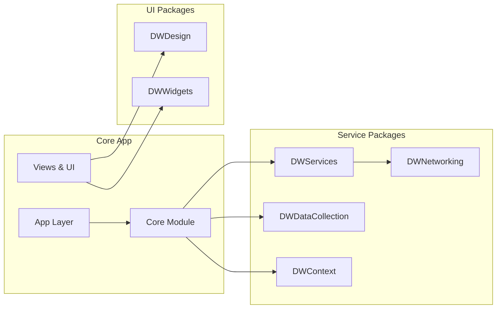

### Package Responsibilities

#### Core Module (`/Core`)
- **DependencyInjection/**: Central DI container and service protocols
- **Services/**: Core app services (AuthService, APIService)
- **Models/**: Core data models shared across the app

#### DWServices Package
- **Network Services**: HTTP networking, Supabase, Ably integration
- **Real-time Services**: RealtimeUpdatesService, presence management
- **User Services**: Profile management, context services
- **External Integrations**: Campus data, majors data

#### DWDataCollection Package
- **Telemetry Services**: TelemetryService with dual Ably/HTTP approach
- **Data Collectors**: Health, Location, ScreenTime, Calendar
- **Performance Monitoring**: PerformanceGuardian for resource protection

#### DWContext Package
- **Context Processing**: ContextEngine, ContextService
- **LLM Integration**: Context prediction and analysis

#### DWDesign Package
- **Design System**: Typography, colors, components
- **UI Components**: Reusable SwiftUI components

#### DWWidgets Package
- **Widget Management**: WidgetEngine, widget configuration
- **Widget Types**: Various widget implementations

## Dependency Injection System

### Container Architecture

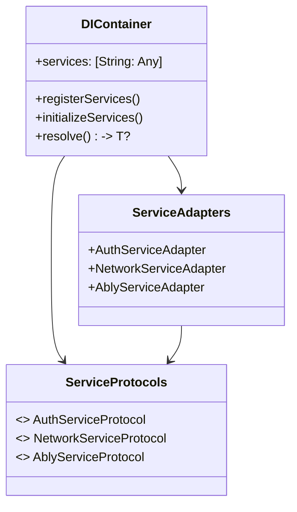

### Service Registration Flow

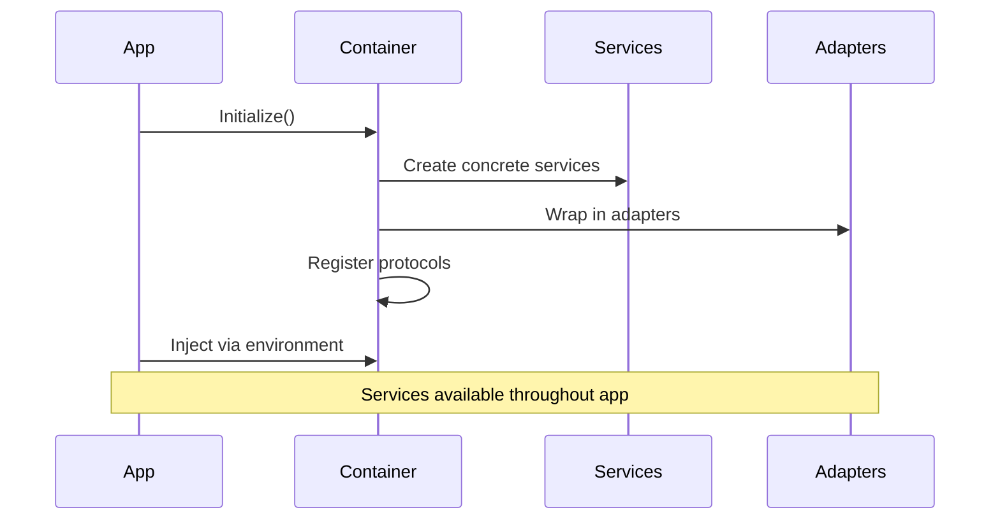

### Example Service Registration

```swift
// 1. Define Protocol
@MainActor
public protocol RealtimeUpdatesServiceProtocol {
    func startListening(userId: String) async
    func stopListening()
}

// 2. Create Service in Package
@MainActor
public final class RealtimeUpdatesService: ObservableObject {
    // Implementation in DWServices package
}

// 3. Create Adapter in Core
@MainActor
final class RealtimeUpdatesServiceAdapter: RealtimeUpdatesServiceProtocol {
    private let service: RealtimeUpdatesService
    // Adapter implementation
}

// 4. Register in Container
let realtimeService = RealtimeUpdatesService(ablyService: ablyService)
registerSingleton(RealtimeUpdatesServiceProtocol.self, 
                 implementation: RealtimeUpdatesServiceAdapter(realtimeService))
```

## Real-time Communication

### Ably Channel Architecture

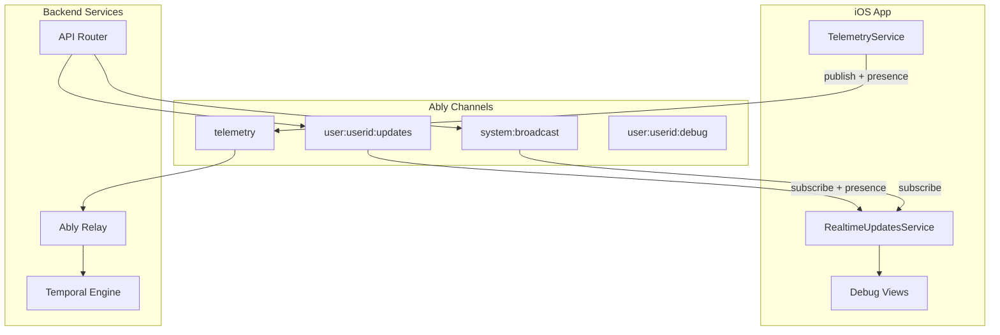

### Message Flow Architecture

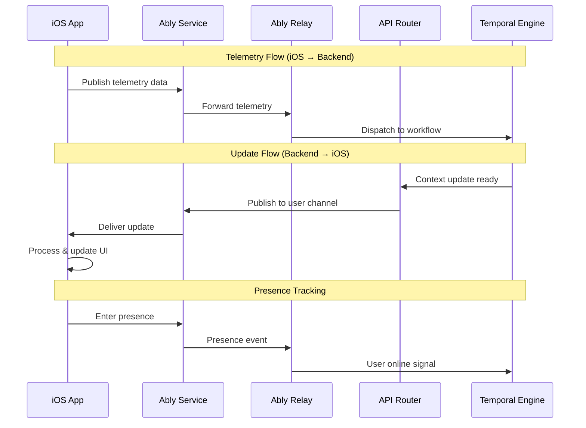

### Channel Permissions

```typescript
const capability: TokenParams['capability'] = {
  [`user:${userId}:*`]: ['subscribe', 'publish', 'presence', 'history'],
  'telemetry': ['publish', 'presence'],
  [`user:${userId}:updates`]: ['subscribe', 'presence'],
  'system:broadcast': ['subscribe'],
};
```

## Data Collection Framework

### Collector Architecture

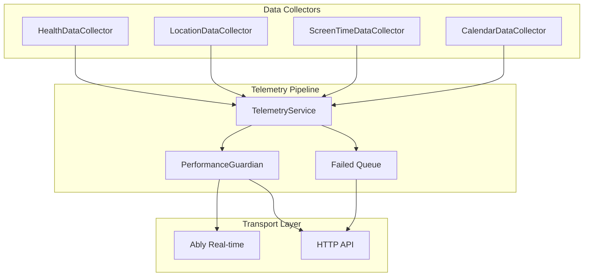

### Telemetry Event Types

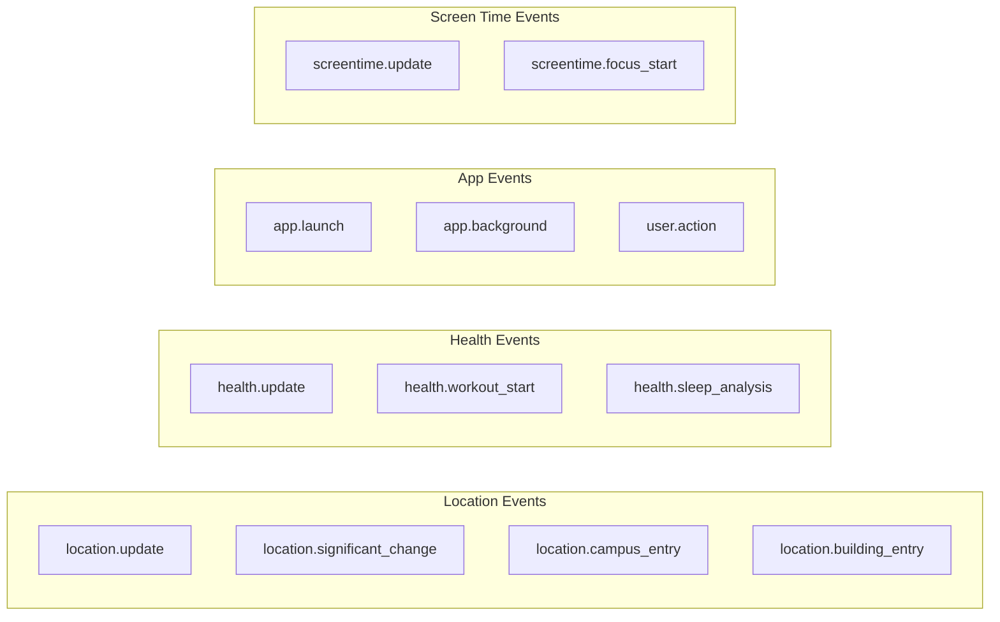

### Performance Guardian

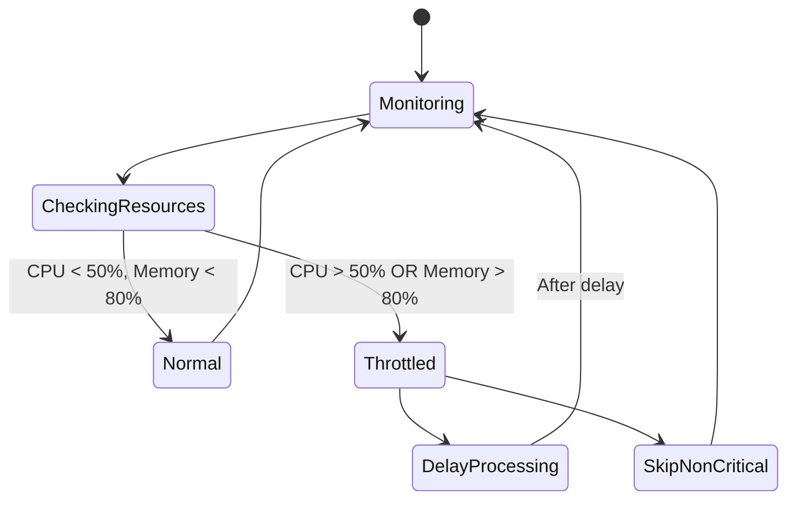

## Service Layer Architecture

### Service Dependencies

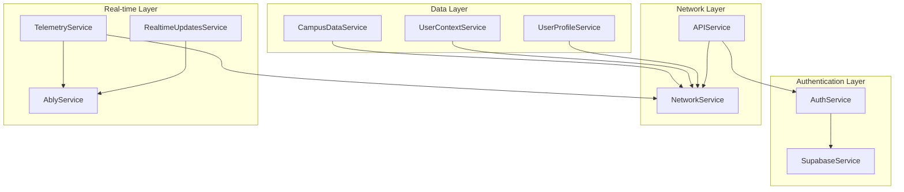

### Service Lifecycle

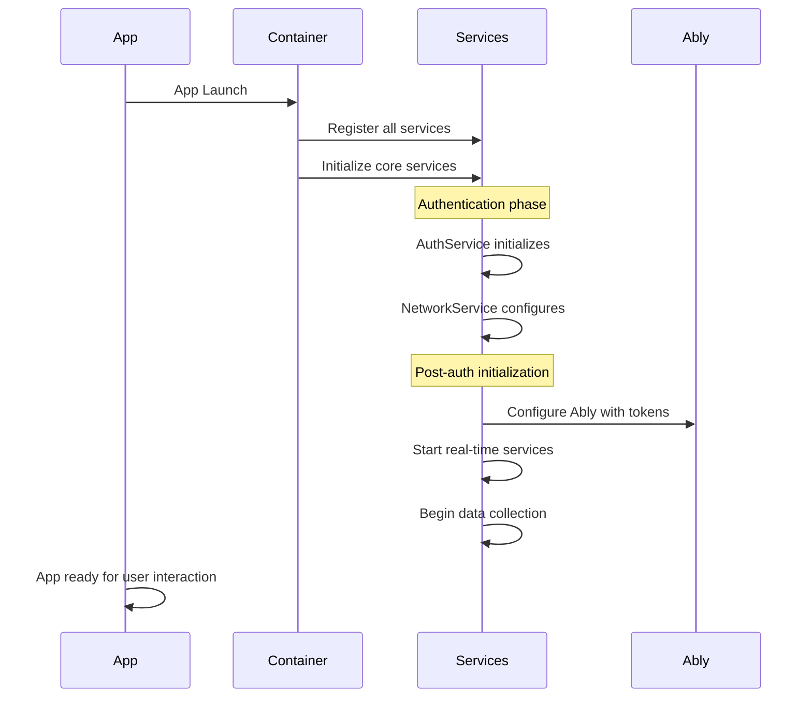

## Integration with Backend Services

### API Router Integration

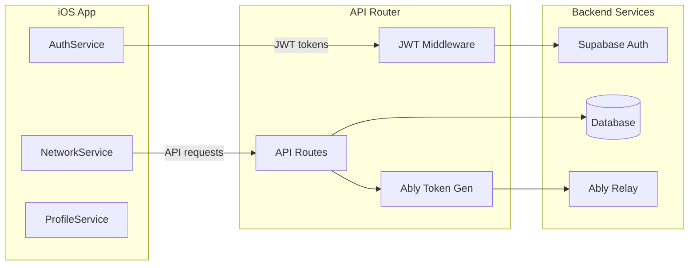

### Authentication Flow

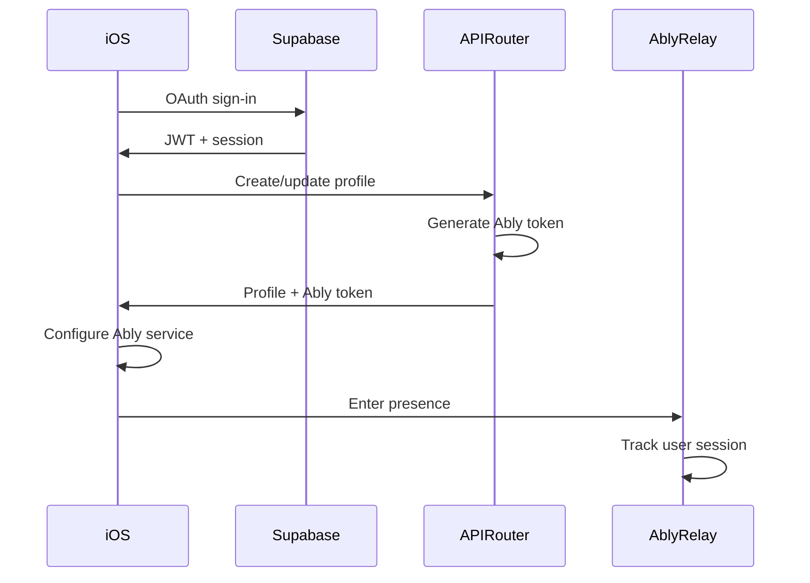

### Error Handling Strategy

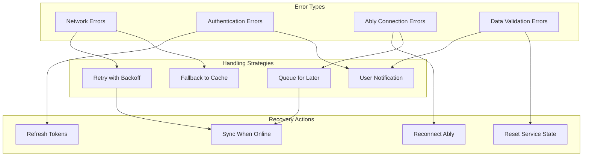

## Next Steps

1. **Widget Intelligence**: Implement context-aware widget system
2. **Offline Synchronization**: Enhanced offline support with conflict resolution
3. **Performance Optimization**: Fine-tune data collection and real-time updates
4. **Analytics Integration**: Comprehensive user behavior tracking
5. **Testing Framework**: Unit and integration test coverage

## Related Documentation

- Real-time Updates Strategy
- [Ably Relay Service](/docs/engineering/architecture/ably-relay-service-architecture)
- API Router Integration
- [Mobile Architecture Overview](/docs/engineering/technical/ios/dormway-ios-app-architecture)
