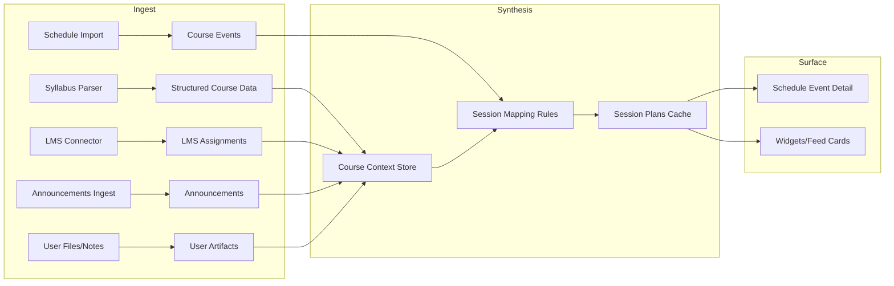

# Event Readiness Layer - High-Level Spec (Draft)

> Make every scheduled class event actionable by surfacing the required prep, logistics, and authoritative updates before the student arrives.

---

## Overview

### Problem Statement
Students trust schedules for time, but not for preparedness. They still have to check multiple sources (syllabus PDFs, Canvas assignments, announcements, files, notes) to know what must be completed before a class session. This creates uncertainty and missed requirements, especially when last-minute changes are announced.

### Proposed Solution
Introduce an **Event Readiness Layer** that attaches a **Session Prep Card** to each class event. The card aggregates required work, readings, logistics, and updates for that specific session by consulting structured course data, LMS assignments, extracted syllabus requirements, and announcement sources. All surfaced items include provenance, recency, and confidence.

### Success Criteria
- [ ] For pilot users, >95% of prep items shown for a class are correct and relevant.
- [ ] <5% of sessions show a missing required item that existed in the sources.
- [ ] 80% of users open a session prep card at least once per week.
- [ ] 30% of shown prep items are completed or clicked (link-through or completion mark).
- [ ] Time-to-render for session card < 200ms from cached data.

---

## Goals and Non-Goals

### Goals
- Deliver a reliable, event-specific prep view with explicit sources.
- Minimize LLM cost by batching and caching session-level outputs.
- Capture time-sensitive changes (announcements, room changes, cancellations).
- Provide a clear trust model with confidence and source disclosure.

### Non-Goals
- Full assignment planner or task decomposition (handled by Task Bank / Planner systems).
- Replacing the syllabus or LMS; this is an overlay.
- Predicting grades or recommending study strategies.
- Real-time chat agent for every event (can be layered later).

---

## Primary User Story
As a student, when I tap a class on my schedule, I want to see exactly what I need to have done for that class, including readings and assignments, plus any last-minute changes, with links to the source materials.

## Additional User Stories
- As a student, I want to know if class is canceled or moved before I walk there.
- As a student, I want to see what is required vs optional prep.
- As a student, I want to trust that the app is not guessing and can show me where each requirement came from.
- As a student, I want to mark prep as done and not have it keep showing up.

---

## Requirements

### Functional Requirements
| ID | Requirement | Priority |
|----|-------------|----------|
| FR-1 | Generate a Session Prep Card for each class event with required prep, optional prep, and logistics updates. | Must |
| FR-2 | Attach provenance (source type, title, timestamp, link) to every item. | Must |
| FR-3 | Ingest syllabus-derived requirements (readings, assignments, due rules) into structured data. | Must |
| FR-4 | Ingest LMS assignments and due dates, attach to sessions by date logic. | Must |
| FR-5 | Ingest announcements (via LMS or fallback channels) and surface relevant updates per session. | Should |
| FR-6 | Support user overrides (mark done, hide item, flag incorrect). | Should |
| FR-7 | Provide confidence score and explain any inferred mappings. | Should |
| FR-8 | Batch generation to avoid per-event LLM calls. | Must |
| FR-9 | Show session prep from cache with <200ms render latency. | Must |
| FR-10 | Support links to files (PDFs), LMS items, and campus location info. | Should |

### Non-Functional Requirements
| ID | Requirement | Metric |
|----|-------------|--------|
| NFR-1 | P95 session card render time | < 200ms (cached) |
| NFR-2 | LLM cost ceiling | < $0.15 per student per week for prep generation |
| NFR-3 | Reliability | > 99.5% daily job success |
| NFR-4 | Data freshness | Announcements reflected within 15 minutes of ingest |
| NFR-5 | Privacy | All sources disclosed; user control over email/permission scope |

---

## Core Concepts

### Event Readiness Layer
A system that enriches each schedule event with actionable prep and logistics based on authoritative sources.

### Session Prep Card
A structured summary rendered in the schedule detail view:
- Required items (must-do before class)
- Optional items (nice-to-do)
- Logistics updates (location, cancellation, instructor note)
- Links and sources
- Confidence and recency

### Session Plan
The internal, cached representation of the prep card. A Session Plan is generated once per session (or per week) and updated only when input data changes.

---

## Data Inputs and Source Priority

### Source Types (Highest Authority First)
1. **Course announcements** (time-sensitive overrides)
2. **LMS assignments** (Canvas/Blackboard/etc.)
3. **Syllabus extracted rules** (readings, weekly topics, due rules)
4. **Calendar events** (ICS schedule, classroom event)
5. **User notes/files** (Sketchable, manual uploads)

### Data Inputs
- **Syllabus extractions**: assignments, weights, required readings, weekly topics, exam dates, assignment rules ("before next class").
- **Schedule events**: class meeting times, location, recurrence.
- **LMS assignments**: due dates, availability, linked files.
- **Announcements**: cancellations, room changes, new prep requirements.
- **User files**: professor PDFs, reading lists, lecture slides.

---

## System Architecture (High-Level)



---

## Session Plan Generation Strategy

### Batch First (Cost-Controlled)
- **Generate per course per week** or per change event.
- **Do not run LLM per session** unless a high ambiguity is detected.
- Session Plans are cached and updated incrementally when new inputs arrive.

### Change-Driven Updates
Regenerate only when:
- New LMS assignment appears or due date changes.
- New announcement is ingested.
- Syllabus extraction updated.
- Schedule event time/location changes.

### Mapping Logic (Deterministic First)
1. Attach LMS assignment if due date <= class start time and within course.
2. Attach syllabus reading if explicitly dated or mapped to week/topic.
3. Attach announcement if it mentions session date or contains location/cancellation keywords.
4. Mark as inferred only if mapping required a rule-based guess (e.g., "Week 5" -> date range).

---

## LLM Usage Policy

### Allowed LLM Tasks
- Parse unstructured syllabus text into structured entities.
- Resolve relative references ("before next lecture", "Week 4") into dates based on course meeting cadence.
- Summarize announcements into short actionable items.

### Disallowed LLM Tasks
- Generating new requirements not present in sources.
- Overriding explicit due dates.
- Fabricating locations or cancellations.

### Cost Targets
- 1-2 LLM calls per course per week.
- Additional LLM calls only on syllabus change or ambiguous rules.

---

## Data Model (Proposed)

### SessionPlan (Core)
```json
{
  "sessionPlanId": "sp_123",
  "studentId": "stu_123",
  "courseId": "course_abc",
  "eventId": "evt_456",
  "sessionDate": "2026-02-03",
  "sessionStart": "2026-02-03T16:00:00-05:00",
  "confidence": 0.92,
  "generatedAt": "2026-02-02T18:00:00-05:00",
  "requiredItems": [
    {
      "type": "assignment",
      "title": "Problem Set 3",
      "dueAt": "2026-02-03T15:59:00-05:00",
      "source": {
        "system": "canvas",
        "url": "...",
        "timestamp": "2026-02-01T09:20:00-05:00"
      },
      "confidence": 0.98,
      "status": "pending"
    }
  ],
  "optionalItems": [
    {
      "type": "reading",
      "title": "Chapter 4",
      "source": {
        "system": "syllabus",
        "url": "...",
        "timestamp": "2026-01-10T08:00:00-05:00"
      },
      "confidence": 0.7,
      "status": "pending"
    }
  ],
  "logisticsUpdates": [
    {
      "type": "location_change",
      "summary": "Class moved to Room 204",
      "source": {
        "system": "announcement",
        "url": "...",
        "timestamp": "2026-02-03T09:00:00-05:00"
      }
    }
  ],
  "provenance": {
    "sourcesUsed": ["canvas", "syllabus", "announcement"],
    "inferredMappings": ["Week 5 -> 2026-02-03"]
  }
}
```

### Supporting Entities
- `CourseContext`: normalized syllabus data, assignments, weights, weekly topics.
- `Announcement`: structured message with type, priority, impactedDate.
- `ReadingItem`: linkable reading with dueRule or explicit date.
- `UserOverride`: suppress, mark done, or correct mapping.

---

## User Experience (Schedule Event Detail)

### Session Prep Card Layout
- Header: Course + time + confidence badge
- Required section: items ordered by urgency (due time)
- Optional section: readings, recommended prep
- Logistics section: cancellations, location changes, instructor notes
- Source pills: Canvas, Syllabus, Announcement, File
- Actions: Open, Mark done, Hide, Report incorrect

### Edge UI States
- **No prep required**: show "Nothing required before this class" with sources checked.
- **Low confidence**: label "Unconfirmed" with explicit reason.
- **Missing announcements**: show "Announcements not connected" CTA.

---

## Trust, Quality, and Confidence

### Confidence Scoring (Heuristic)
- +0.4 if explicit due date in LMS
- +0.2 if syllabus date matches session date
- +0.2 if multiple sources agree
- -0.2 if inferred mapping
- Min 0.3 / Max 1.0

### Reliability Guardrails
- Never show items without a source.
- Clearly mark inferred items.
- Allow user correction feedback to improve mappings.

---

## Announcements Ingest Strategy

### Primary (If LMS Access Available)
- LMS API or OAuth integration.

### Fallback Options
1. **Email forwarding** to a DormWay address (lower integration friction).
2. **On-device capture** via browser extension (for locked-down LMS).
3. **Manual upload** of announcement emails (lowest automation).

### Consent and Privacy
- Explicit permission with scope explanation.
- Display a preview of captured content.
- Allow revocation and data deletion.

---

## Integration Points

### Existing Systems
- DayPlan V2 (priority-first daily brief)
- Schedule Processor + ICS import
- Syllabus Processor
- Canvas integration
- Docs Library (files + reading links)

### New or Extended Services
- Session Plan Generator (batch)
- Announcement Ingest pipeline (if not already present)
- Session Plan Cache (per user/course/session)

---

## Observability and Ops

### Metrics
- Session Plan generation success rate
- Missing required prep rate (user reported)
- Announcement ingest latency
- Prep card engagement (opens, clicks, completions)

### Alerts
- No announcements ingested for > 7 days (if connected)
- Session Plan generation failed for > 5% of sessions in a day
- Sudden drop in confidence for a course

---

## Rollout Plan (High-Level)

### Phase 0: Data Audit
- Validate syllabus extraction coverage (readings, due rules, topics).
- Confirm LMS assignment mapping accuracy.

### Phase 1: Pilot (10-20 users)
- Enable Session Prep Cards for 1-2 courses per user.
- Require high confidence only.

### Phase 2: Expansion
- Add optional prep + announcement integration.
- Enable user overrides and feedback loop.

### Phase 3: Full Rollout
- Enable for all class sessions.
- Layer into feed cards and notifications.

---

## Risks and Mitigations

| Risk | Impact | Likelihood | Mitigation |
|------|--------|------------|------------|
| Incorrect prep shown | High | Medium | Confidence gating + source disclosure + user corrections |
| Missing announcements | High | High | Email/extension fallback + CTA for missing sources |
| LLM costs spike | Medium | Medium | Batch generation + change-driven updates |
| Syllabus ambiguity | Medium | High | Allow inferred items, but mark low confidence |
| User trust loss | High | Medium | Transparent sourcing + easy hide/feedback |

---

## Open Questions

- What is the minimum acceptable announcement access method per campus?
- How strict should confidence gating be for initial rollout?
- Should prep cards include "graded weight" context from the syllabus?
- Should items always be attached to a specific session, or also show in day-level summary?
- How will we reconcile conflicting sources (e.g., syllabus vs announcement)?

---

## Related Documentation

- [DayPlan V2](/docs/engineering/architecture/sot-dayplan-v2)
- [Sync Orchestration & Schedules](/docs/engineering/architecture/sot-sync-orchestration-schedules)
- [Canvas Integration](/docs/engineering/architecture/sot-canvas-integration)
- [Schedule Sources & Precedence (Current)](/docs/engineering/technical/calendar/schedule-sources-precedence-current)
- [scheduleProcessor Workflow Deep Dive (Current)](/docs/engineering/technical/calendar/scheduleprocessor-workflow-deep-dive-current)
- [DayPlan V2 Architecture](/docs/engineering/architecture/dayplan-v2-architecture)

---

## Changelog

| Date | Author | Changes |
|------|--------|---------|
| 2026-02-03 | Codex | Initial draft |

---

**Linear Issue**: DORM-XXX
**Last Updated**: 2026-02-03
