# How DormWay Works

This is a “master trace” of the DormWay system *as implemented in the current workspace checkout*, with emphasis on:

- Identity + login (Clerk + gateway headers; device keys legacy)
- The StudentWatcher “digital twin” workflow
- LLM + RAG processing (Portkey + prompt registry + Ragie)
- Tasks + Task Bank + planner blocks (unscheduled → scheduled → completed)
- Where `@dormway/core` (aka “dormway-core”) fits into everything

If something here conflicts with production behavior, treat the code references as the source of truth and update this doc accordingly.

Sharp edges tracker: [Sharp Edges Tracker (Current)](/docs/engineering/architecture/sharp-edges-tracker-current)

---

## Mermaid Diagrams (Read Me)

This doc includes Mermaid diagrams (` ```mermaid ` blocks). If you don’t see them rendered in Obsidian, enable Mermaid support in Obsidian settings.

## 1) Repos in This Workspace

The workspace is multi-repo:

- `.repos/dormway-platform` — backend services + Temporal engine + shared `@dormway/core`
- `.repos/dormway-api-2` — Zuplo API gateway (policies, auth enrichment, routing)
- `.repos/ios-clean` — SwiftUI app
- `.repos/dw-campus-sdk` — shared campus tooling

---

## 2) Runtime Topology (What Runs Where)

### “Platform” services (Docker / local dev)

The canonical list is documented in `.repos/dormway-platform/docker-compose.yml`.

Key backend services:

- **Zuplo gateway** (`.repos/dormway-api-2`) — verifies JWTs and injects identity headers.
- **API Router** (`.repos/dormway-platform/services/api-router`) — primary HTTP API used by apps/admin/web; calls DB, triggers/signal Temporal workflows, handles webhooks.
- **Engine** (`.repos/dormway-platform/services/engine`) — Temporal worker(s) running workflows and activities (StudentWatcher, schedule/syllabus processing, etc).

Supporting services show up in the compose docs and are used by specific features (Ably relay, dormway-admin, lockedin web app, etc.).

### Top-Level System Map (Conceptual)

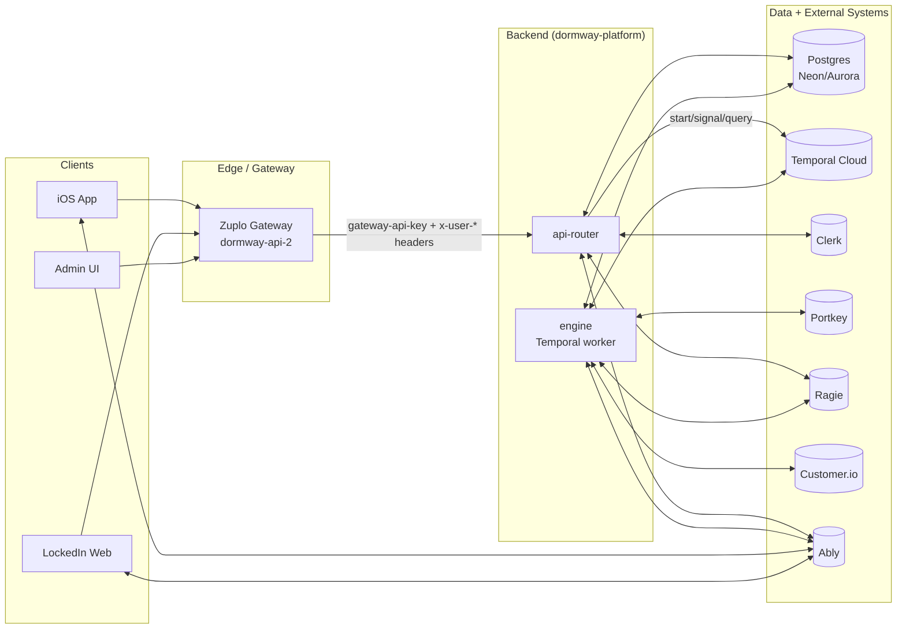

---

## 3) Data Stores + External Systems (High Signal)

From the code paths covered here:

- **Postgres (Neon / Aurora naming in code)** — primary relational store (accounts, contexts, preferences, watcher state, documents, ingestions, etc).
  - Example queries reference tables like `accounts`, `contexts`, `user_preferences`, `student_watcher_state`, `braingains_documents`, `content_ingestions`.
  - See `.repos/dormway-platform/services/engine/src/activities/workflowState.activities.ts`.
- **Temporal** — orchestration + durable workflows (StudentWatcher, schedule import, semester processing).
  - Worker entrypoint: `.repos/dormway-platform/services/engine/src/index.ts`.
  - Student task queue: `.repos/dormway-platform/services/engine/src/workflows/config.workflow.ts`.
- **Clerk** — primary identity provider (JWTs, user lifecycle webhooks).
  - Webhook handler: `.repos/dormway-platform/services/api-router/src/routes/webhooks/clerk-routes.ts`.
- **Zuplo** — edge gateway that validates Clerk tokens (Auth0 legacy paths still exist) and injects `x-user-*` identity headers.
  - Policies: `.repos/dormway-api-2/config/policies.json`.
  - Clerk enrichment: `.repos/dormway-api-2/modules/clerk-enrichment.ts`.
- **Portkey** — model routing + prompt management for LLM calls.
  - Shared LLM utilities: `.repos/dormway-platform/services/shared/dormway-core/src/llm/llm-caller.ts`.
  - Engine-specific wrapper: `.repos/dormway-platform/services/engine/src/activities/portkey.activities.ts`.
- **Ragie** — document indexing + retrieval used for Ace (RAG) and user/course/org partitions.
  - API Router “Ace” routes: `.repos/dormway-platform/services/api-router/src/routes/ace-llm-routes.ts`.
  - Ragie → StudentWatcher webhook: `.repos/dormway-platform/services/api-router/src/routes/webhook-routes-s3.ts`.
  - Deep dive: [Ragie Ingestion, Webhooks, and ACE Query Pipeline Deep Dive (Current)](/docs/engineering/technical/ai/rag/ragie-ingestion-webhooks-and-ace-query-pipeline-deep-dive-current)
- **Customer.io** — transactional email/push delivery (DayPlan emails, transactional notifications).
  - StudentWatcher uses notification activities + dayplan email activities; see `.repos/dormway-platform/services/engine/src/workflows/studentWatcher.simplified.workflow.ts`.
- **Ably** — real-time messaging for dashboard updates, toasts/progress events, and “invalidate” signals that cause clients to refetch data.
  - Publisher (API Router): `.repos/dormway-platform/services/api-router/src/services/ably-service.ts`.
  - Consumer (LockedIn): `.repos/dormway-platform/services/dormway-lockedin/src/hooks/useRealtimeInvalidation.ts`.
  - Deep dive: [Realtime Invalidation & Update Propagation Deep Dive (Current)](/docs/engineering/technical/realtime/realtime-invalidation-update-propagation-deep-dive-current)

### ERD (Key Tables Referenced by the Flows in This Doc)

This ERD is based on table usage observed in the code paths referenced here (it’s intentionally minimal and “logical”; it may not match every DB constraint).

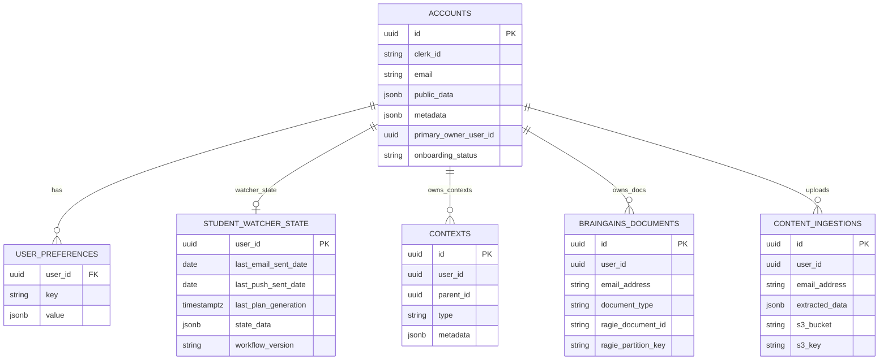

---

## 4) `@dormway/core` (“dormway-core”): What It Is

`@dormway/core` is the shared library that centralizes:

- **Middleware factories** (auth, gateway auth, RBAC, error handling, etc)
- **Domain services** (accounts, contexts, preferences, system-config, etc)
- **Adapters** (Temporal, Ragie, cache, etc)
- **LLM utilities** (Portkey client + prompt registry loader + response parsing)

Key references:

- Package root README: `.repos/dormway-platform/services/shared/dormway-core/README.md`
- Auth middleware factory: `.repos/dormway-platform/services/shared/dormway-core/src/middleware/factories/auth.factory.ts`
- Gateway auth factory: `.repos/dormway-platform/services/shared/dormway-core/src/middleware/factories/gateway-auth.factory.ts`
- LLM caller: `.repos/dormway-platform/services/shared/dormway-core/src/llm/llm-caller.ts`
- Domain SystemConfig: `.repos/dormway-platform/services/shared/dormway-core/src/domains/system-config` (see [[#9) System Settings (Runtime Configuration)|Section 9]])

---

## 5) Identity, Login, and Request Authentication

There are *multiple* auth “modes” because DormWay supports:

- gateway-injected identity (Zuplo / API Gateway)
- direct Clerk bearer tokens (dev / some services)
- device keys (legacy mobile “sessionless” calls; deprecated)
- internal service keys (service-to-service)
- legacy Auth0 paths (still present in gateway policies/middleware; not primary)

### 5.1 The canonical production path (Client → Zuplo → API Router)

Zuplo is responsible for:

1) Verifying the end-user token (Clerk; Auth0 policy is legacy).
2) Injecting identity headers like `x-user-id`, `x-user-email`, `x-user-role`, etc.
3) Injecting `gateway-api-key` for server-to-server enforcement.

Concrete code:

- Zuplo sets `gateway-api-key`: `.repos/dormway-api-2/config/policies.json` (policy `set-headers-inbound-gatewaykey`)
- Zuplo sets `x-user-*` headers for Clerk: `.repos/dormway-api-2/modules/clerk-enrichment.ts`

API Router enforces:

- Requests must include the correct `gateway-api-key` (or bypass via internal `API_KEY`).
  - Middleware: `.repos/dormway-platform/services/api-router/src/middleware/gateway-auth.ts`
  - Factory: `.repos/dormway-platform/services/shared/dormway-core/src/middleware/factories/gateway-auth.factory.ts`

Then routes typically apply `authMiddleware` which resolves the user identity (often from `x-user-id`):

- `.repos/dormway-platform/services/api-router/src/middleware/auth.ts`
- `.repos/dormway-platform/services/shared/dormway-core/src/middleware/factories/auth.factory.ts`

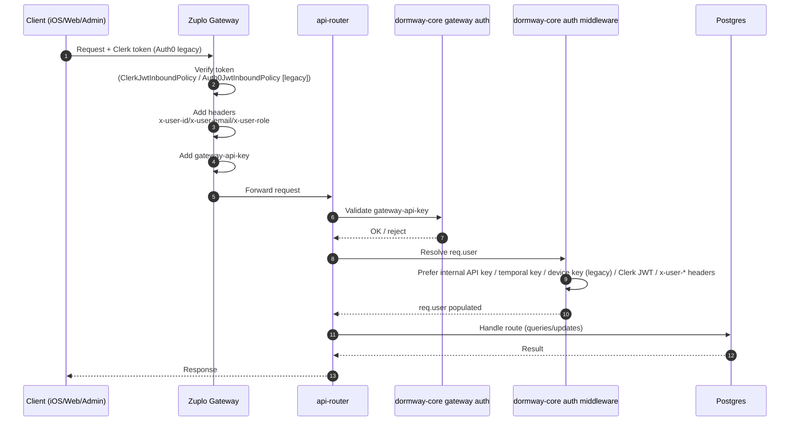

### 5.2 Clerk user lifecycle → “backend user ID” mapping

DormWay stores its own internal account UUID in Postgres and **syncs that ID into Clerk public metadata** so it can appear in JWTs.

Flow (implemented):

1) Clerk emits `user.created`.
2) API Router webhook handler creates or merges an `accounts` row.
3) API Router updates Clerk public metadata with:
   - `backend_user_id` (DormWay UUID)
   - `role`
4) StudentWatcher is started for the new user.

Code:

- Webhook handler: `.repos/dormway-platform/services/api-router/src/routes/webhooks/clerk-routes.ts`
- The auth middleware expects `backend_user_id` to be present in Clerk JWT payloads (or uses `sub` as fallback):
  - `.repos/dormway-platform/services/shared/dormway-core/src/middleware/factories/auth.factory.ts`
- Zuplo also expects and forwards `backend_user_id` from Clerk JWT claims:
  - `.repos/dormway-api-2/modules/clerk-enrichment.ts`

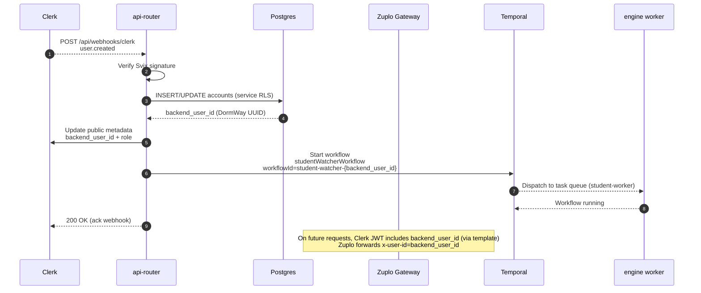

### 5.3 Device keys (mobile header auth, legacy)

Some requests can be authenticated via an HMAC-signed “device key” in `x-device-key` (legacy; not for new clients).

- Verification path is in the shared auth middleware: `.repos/dormway-platform/services/shared/dormway-core/src/middleware/factories/auth.factory.ts`
- API Router provides the verifier implementation: `.repos/dormway-platform/services/api-router/src/utils/retool-auth.ts`

### 5.4 Internal service-to-service auth

The shared auth middleware supports internal calls via `Authorization: Bearer ${API_KEY}`:

- `.repos/dormway-platform/services/shared/dormway-core/src/middleware/factories/auth.factory.ts`

This is how internal services can bypass the gateway in controlled environments.

### 5.5 dormway-lockedin “BFF Proxy” layer (and why it matters)

`dormway-lockedin` (Next.js) contains a server-side proxy route that forwards browser requests to the backend, while attaching auth headers derived from the Clerk session cookie.

Key code:

- Proxy route: `.repos/dormway-platform/services/dormway-lockedin/src/app/api/proxy/[...path]/route.ts`
- Proxy auth/header building: `.repos/dormway-platform/services/dormway-lockedin/src/lib/proxy-auth.ts`
- Client fetch wrapper (token refresh + retries + ETag caching): `.repos/dormway-platform/services/dormway-lockedin/src/lib/authorizedFetch.ts`

Important behaviors that affect “How DormWay Works”:

- The proxy normally targets the configured API base (often **Zuplo**), but **bypasses Zuplo** in two cases:
  - **Impersonation**: if an impersonation JWT is present, it routes directly to `API_ROUTER_DIRECT_URL` / `http://api-router:3001` so Zuplo doesn’t reject the token as “Invalid Compact JWS”.
  - **Onboarding/public endpoints without a session**: it routes directly to `http://api-router:3001` so onboarding can work with `x-api-key` without Zuplo trying to validate a non-JWT bearer.
- The proxy can short-circuit with a **401** before hitting Zuplo for routes that *require auth* but have no valid session (based on an allowlist).

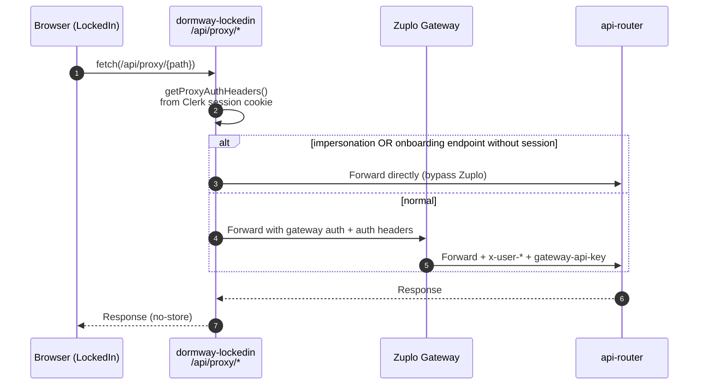

Related internal route used by API Router:

- Onboarding cache invalidation: `.repos/dormway-platform/services/dormway-lockedin/src/app/api/cache/invalidate-onboarding/route.ts`

### 5.6 iOS request auth + app-level HMAC signing (client ↔ API Router)

The iOS app uses:

- **Clerk access tokens** as `Authorization: Bearer <jwt>` for user-authenticated calls.
  - Session restore + token refresh: `.repos/ios-clean/Core/Services/AuthService.swift`
- Optional **app-level HMAC request signing** (separate from user auth) by adding `X-App-*` headers.
  - Signer: `.repos/ios-clean/Core/Security/AppHMACSigner.swift`
  - Wired into the networking stack at startup if `Info.plist` contains `APP_SIGNING_KEY` (hex):
    - `.repos/ios-clean/Core/DependencyInjection/Container.swift`

On the backend, the verifier lives in API Router:

- `.repos/dormway-platform/services/api-router/src/middleware/app-hmac-v2.ts`

The canonical string-to-sign matches the backend verifier:

- `ts\nMETHOD\npathWithQuery\nsha256Hex(body)`
- Signature: HMAC-SHA256(secret, stringToSign) encoded as base64
- Headers (case-insensitive): `X-App-Timestamp`, `X-App-Key-Id`, `X-App-Sig-V`, `X-App-Signature`, optional `X-App-Nonce`

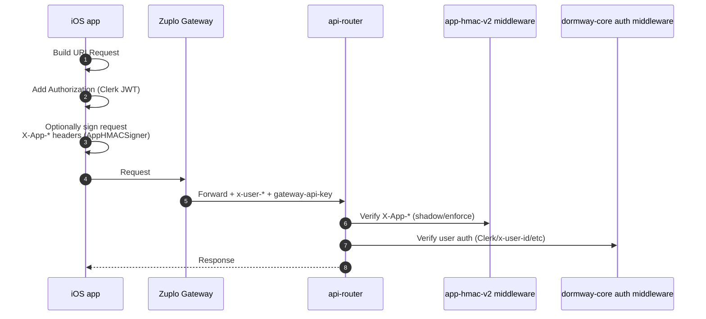

Note: ios-clean also writes `userId` + `accessToken` into an app-group `UserDefaults` for widgets after session restore (see `.repos/ios-clean/Core/Services/AuthService.swift`), which can affect background/widget data loaders.

---

## 6) Temporal Engine: Workflows, Task Queues, and Why It Exists

The Engine service is the Temporal worker runtime. It runs long-lived workflows, scheduled jobs, and activity code that:

- needs retries/durability
- needs *time-based* behavior (e.g., “5 AM in the user’s timezone”)
- would be awkward as ad-hoc HTTP handlers

Entry point:

- `.repos/dormway-platform/services/engine/src/index.ts`

Task queues:

- `.repos/dormway-platform/services/engine/src/workflows/config.workflow.ts`
  - Student workflows run on `taskQueues.student` = `student-worker`

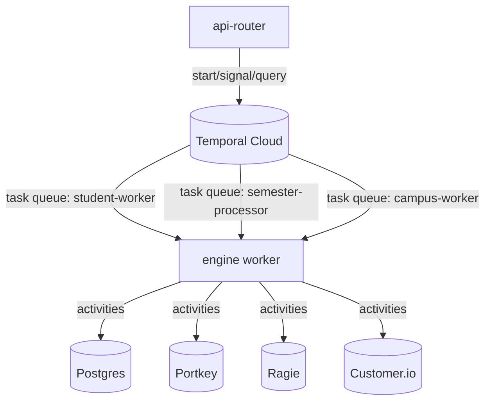

### 6.1 Sync Orchestration (Scheduled Syncs)

There are two layers:

1) **Temporal Schedules** (created/updated by the engine at boot)
2) **Sync Orchestrator endpoint** in API Router that chooses what to sync and triggers the actual workflows

Deep dive: [Sync Orchestration & Priority (Current)](/docs/engineering/technical/infrastructure/sync/sync-orchestration-priority-current)

#### 6.1.1 Temporal schedule provisioning

At engine startup, schedules are ensured when `SYNC_SCHEDULES_ENABLED === 'true'`:

- Engine boot: `.repos/dormway-platform/services/engine/src/index.ts`
- Schedule definitions: `.repos/dormway-platform/services/engine/src/schedules/syncOrchestratorSchedules.ts`

Current schedules include (IDs matter because they become `schedule_id` passed downstream):

- `sync-hourly-smart` (every 1h, `mode=auto`)
- `sync-city-4h` (every 4h, `mode=cities_only`)
- `sync-daily-force` (daily at 4:00, `mode=auto`, `force=true`)
- `sync-term-data-enrichment` (daily at 5:00, `mode=campuses_missing_term_data`, `force=true`)

Related deep dive (what this schedule populates and how it’s used end-to-end): [Term Management & Term Resolution Deep Dive (Current)](/docs/engineering/technical/engine/term-management-term-resolution-deep-dive-current)

Temporal schedule policies (important behavior):

- `overlap: SKIP` (if a run is still executing, the next scheduled tick is skipped)
- `catchupWindow: 5 minutes` (missed ticks beyond this window won’t backfill)

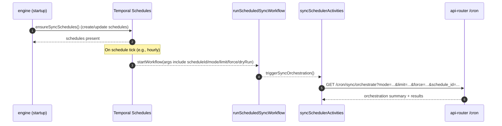

#### 6.1.2 API Router orchestrator: choosing what to sync (priority)

The cron endpoint delegates to a shared service:

- Route: `.repos/dormway-platform/services/api-router/src/routes/cron-routes.ts`
- Service: `.repos/dormway-platform/services/api-router/src/services/sync-orchestrator-service.ts`

Core selection rules (as implemented):

- **Eligibility gate**
  - `contexts.is_active = true`
  - `calculate_sync_priority(context_id) >= min_priority_score` (default 150)
  - If `respect_next_sync_at` is enabled (default), only consider contexts where:
    - `next_sync_at IS NULL OR next_sync_at <= NOW()`
- **Modes**
  - `auto/all`: cities + campuses
  - `cities_only`: only `contexts.type='city'`
  - `campuses_only`: only `contexts.type='campus'`
  - `campuses_missing_term_data`: campuses where `campus_configs.current_term_data` is missing/empty
- **Ordering**
  - Cities are ranked before campuses (type precedence), then by priority score, then by hours since last sync.
- **Concurrency caps**
  - Default: `max_concurrent_cities=2`, `max_concurrent_campuses=5`
  - These caps are enforced in `makeSyncDecisions()`.

```mermaid
flowchart TD
  A[/cron/sync/orchestrate/] --> B[getSyncCandidates(mode, limit)]
  B --> C{respect_next_sync_at?}
  C -- yes --> D[Filter: next_sync_at <= now OR null]
  C -- no --> E[Skip next_sync_at gate]
  D --> F[Compute current_priority via calculate_sync_priority()]
  E --> F
  F --> G[Sort: type(city first) -> priority desc -> hours_since_sync desc]
  G --> H[makeSyncDecisions()]
  H --> I{resource limits hit?}
  I -- yes --> J[skip with reason]
  I -- no --> K[executeSyncs(): start Temporal workflows]
  K --> L[updateSyncTracking(): contexts.sync_metadata]
  L --> M[Optionally trigger overlay fold workflows]
```

#### 6.1.3 What actually gets started (idempotent workflow IDs)

When the orchestrator decides to sync:

- City: starts `processSingleCity` on task queue `city-worker`
  - workflowId: `city-sync-${cityId}`
- Campus: starts `processSingleCampus` on task queue `campus-worker`
  - workflowId: `campus-sync-${campusId}`

This is intentional dedupe: if the cron tick fires repeatedly, Temporal will not start duplicates with the same workflow ID.

See: `.repos/dormway-platform/services/api-router/src/services/sync-orchestrator-service.ts`

### 6.2 Database Functions Used by Sync Priority/Scheduling

These are Postgres functions referenced directly by the sync orchestrator SQL and admin tooling.

#### `calculate_sync_priority(uuid)` (priority score)

- Latest definition in repo: `.repos/dormway-platform/infrastructure/database/migrations/20251017_canvas_priority_boost.sql`
- Called from orchestrator queries as `calculate_sync_priority(c.id)` to compute `current_priority`.

High-level inputs (per migration):

- context type (`city` vs `campus`)
- staleness (`hours_since_sync`)
- student activity (total + “active students” via `accounts.last_login_at`)
- recent `service_data` activity
- growth potential signals (syllabi uploaded, courses created, enrichment/housing signals)
- Canvas enablement (bonus for Canvas campuses)

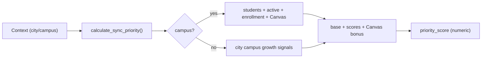

#### `calculate_next_sync_time(uuid)` (next sync timestamp)

- Defined in: `.repos/dormway-platform/infrastructure/database/migrations/20250912_add_sync_tracking.sql`
- Used by admin “recalculate” endpoint: `.repos/dormway-platform/services/api-router/src/routes/admin/sync-status-routes.ts`

It computes a base frequency by context type and adjusts it based on priority score buckets.

#### `mark_sync_completed(uuid)` (helper updater)

- Defined in: `.repos/dormway-platform/infrastructure/database/migrations/20250912_add_sync_tracking.sql`
- Updates `contexts.last_sync_at`, recomputes `next_sync_at`, and refreshes `sync_priority_score`.

---

## 7) StudentWatcher (The “Digital Twin”)

### 7.1 What it is

`studentWatcherWorkflow` is a **long-running Temporal workflow per student** that:

- generates the daily plan at 5 AM (user timezone)
- sends the morning briefing (push + optional email)
- can send an evening briefing
- periodically reconciles calendar and Canvas data
- reacts to “context updates” (syllabus changes, calendar changes, document indexing, etc)
- persists minimal state to Postgres so it can resume safely

Workflow implementation:

- `.repos/dormway-platform/services/engine/src/workflows/studentWatcher.simplified.workflow.ts`

Deep dive: [StudentWatcher Workflow Deep Dive (Current)](/docs/engineering/technical/studentwatcher/studentwatcher-workflow-deep-dive-current)

### 7.1.1 StudentWatcher State Diagram (Simplified)

This reflects the durable “shape” of the workflow loop (not every internal branch).

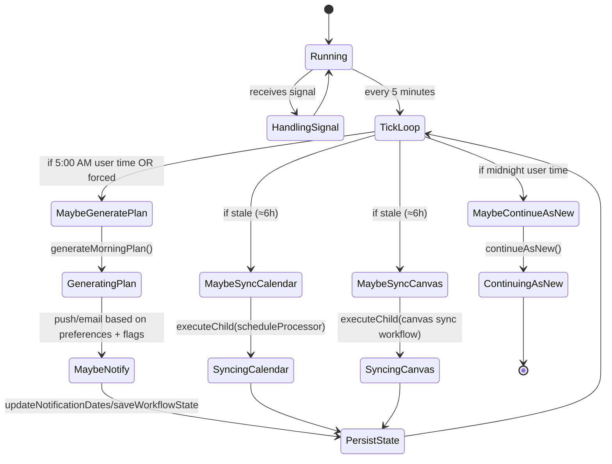

### 7.2 Workflow identity + how it starts

Workflow ID convention:

- `student-watcher-${userId}`

Start points:

- Clerk webhook starts it on user creation: `.repos/dormway-platform/services/api-router/src/routes/webhooks/clerk-routes.ts`
- Onboarding flow also starts it: `.repos/dormway-platform/services/engine/src/workflows/studentProcessor.workflow.ts` (calls `studentActivities.startStudentWatcher`)
- The activity that starts it: `.repos/dormway-platform/services/engine/src/activities/student.activities.ts`

```mermaid
flowchart LR
  subgraph Starters["Who starts StudentWatcher?"]
    ClerkWebhook[Clerk webhook<br/>user.created]
    OnboardingWF[onboardStudent workflow]
    AdminAction[Admin / debug actions]
  end

  ClerkWebhook -->|startWorkflow studentWatcherWorkflow| Temporal[(Temporal)]
  OnboardingWF -->|startStudentWatcher activity| Temporal
  AdminAction -->|signal generate_plan / start if missing| Temporal

  Temporal --> Engine[engine worker]
  Engine --> Watcher[studentWatcherWorkflow<br/>workflowId=student-watcher-{userId}]
```

### 7.3 Signals and queries (how the rest of the system “talks” to it)

Defined signals (current implementation):

- `context_update` — high-level “something changed” event; may trigger plan regen and/or context inference
- `generate_plan` — trigger plan generation, optionally force and/or send email
- `trigger_calendar_sync` — run `scheduleProcessor` reconciliation
- `trigger_canvas_sync` — run Canvas sync (PAT or ICS) (deep dives: [Canvas Sync, Storage, and UI Surfacing (Current)](/docs/engineering/technical/canvas/canvas-sync-storage-and-ui-surfacing-current), [Canvas Term Window & Course Filtering Deep Dive (Current)](/docs/engineering/technical/canvas/canvas-term-window-course-filtering-deep-dive-current))
- `preferences_update` — update stored prefs and optionally regenerate plan
- `generate_feed_cards` — generate home-feed cards from the latest day plan (deep dive: [Home Feed System Deep Dive (Current)](/docs/engineering/technical/feed/home-feed-system-deep-dive-current))
- `daily_plan` — internal channel for writing the newest plan into workflow state

Status query:

- `getStatus` query returns: plan id, last generation time, checks, etc.

Code:

- `.repos/dormway-platform/services/engine/src/workflows/studentWatcher.simplified.workflow.ts`

Deep dive (iOS → `service_data` → StudentWatcher reactions → downstream invalidations): [Context Prediction Pipeline Deep Dive (Current)](/docs/engineering/technical/ai/context/context-prediction-pipeline-deep-dive-current)

Example external signal source (Ragie webhooks → watcher):

- `.repos/dormway-platform/services/api-router/src/routes/webhook-routes-s3.ts`

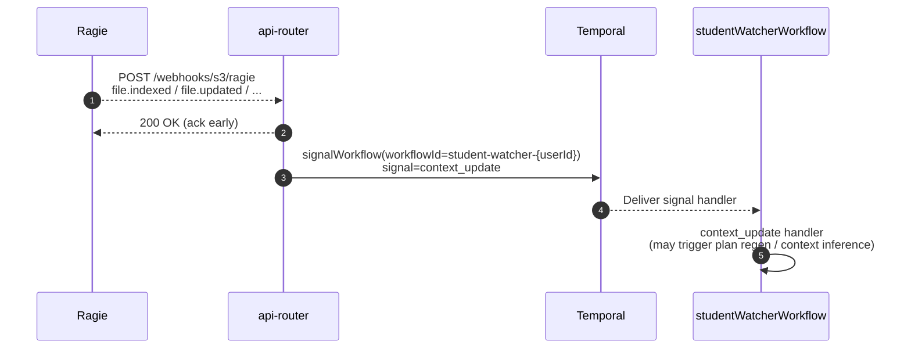

### 7.4 Daily loop (what it does without any external signals)

The workflow ticks every 5 minutes:

- At **5:00 AM** user time: generate the DayPlan for the new day and attempt notifications.
- At evening briefing time (defaults are in the workflow + preferences): send evening briefing when appropriate.
- Roughly hourly: check whether calendar/canvas sync is stale and run sync workflows.
- At local midnight: `continueAsNew()` (Temporal best practice).

Code:

- `.repos/dormway-platform/services/engine/src/workflows/studentWatcher.simplified.workflow.ts`

```mermaid
flowchart TD
  A[Tick (every 5 min)] --> B{5:00 AM user time<br/>and new day?}
  B -- yes --> C[generateMorningPlan(sendNotifications=true)]
  B -- no --> D{Evening briefing time?}
  D -- yes --> E[sendEveningBriefing]
  D -- no --> F{Hourly check}
  F -- calendar stale --> G[executeChild(scheduleProcessor)]
  F -- canvas stale --> H[executeChild(canvas sync)]
  F -- none --> I[Sleep 5 min]
  C --> I
  E --> I
  G --> I
  H --> I
  I --> J{Midnight user time?}
  J -- yes --> K[continueAsNew()]
  J -- no --> A
```

### 7.5 Plan generation pipeline inside StudentWatcher

`generateMorningPlan()` (inside the workflow file) orchestrates:

1) (Optional) “server-mode context prediction” capture
2) Run `scheduleProcessor` as a child workflow to reconcile calendars before generating a plan
3) Run `processSemester` as a child workflow (overlay/aggregate freshness)
4) Generate the DayPlan via `dayPlanActivities.generateDayPlan`
5) Send push + email (based on preferences and the caller’s `sendNotifications` intent)
6) Persist watcher state / notification dates

Code:

- `.repos/dormway-platform/services/engine/src/workflows/studentWatcher.simplified.workflow.ts`
- Deep dive: [processSemester Workflow Deep Dive (Current)](/docs/engineering/technical/engine/processsemester-workflow-deep-dive-current)

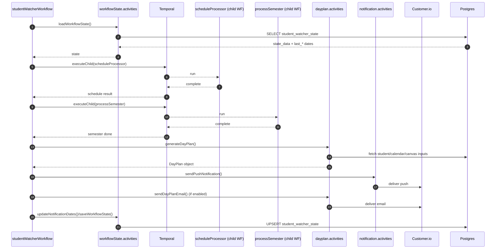

### 7.6 State persistence (`student_watcher_state`)

The workflow stores its durable state in Postgres (e.g., last email date, last plan generation, and a JSON blob for extra fields).

Loader and saver:

- `.repos/dormway-platform/services/engine/src/activities/workflowState.activities.ts`

Notable details:

- Timezone is read from `accounts.public_data->>'timezone'` (with fallback).
- Preferences are read from `user_preferences` where `key = 'preferences'`.
- State is stored in `student_watcher_state` using an UPSERT.

#### 7.6.1 Trigger function: keep `updated_at` correct

`student_watcher_state.updated_at` is kept current via a simple trigger function:

- Migration: `.repos/dormway-platform/infrastructure/database/migrations/20250818a_create_student_watcher_state.sql`
  - `update_student_watcher_state_updated_at()` (plpgsql trigger function)
  - Trigger `BEFORE UPDATE` on `student_watcher_state`

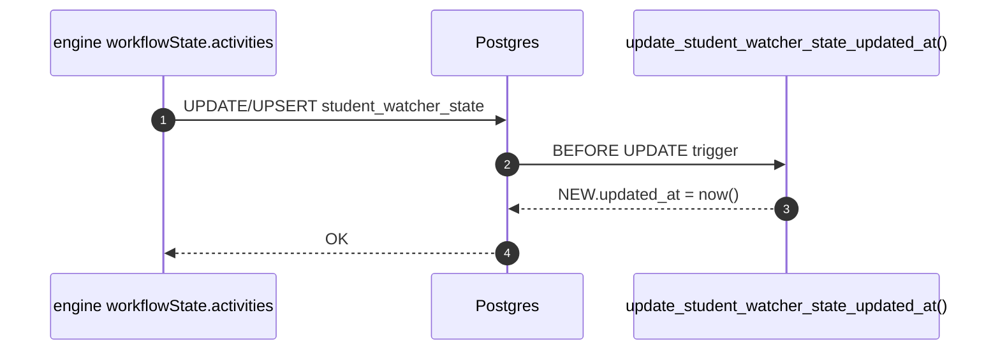

#### 7.6.2 Worker maintenance functions (workflow health monitoring)

The repo also defines DB-side support for monitoring StudentWatcher workflow health and recording maintenance actions.

- Migration: `.repos/dormway-platform/migrations/031_worker_maintenance_tables.sql`

Key objects:

- `current_worker_status` (view)
- `get_workflow_health_stats()` (aggregate health stats)
- `get_workflows_needing_attention()` (prioritized list of “missing/failed/needs refresh” workflows)
- `update_workflow_health_updated_at()` (trigger function for `workflow_health_checks.updated_at`)

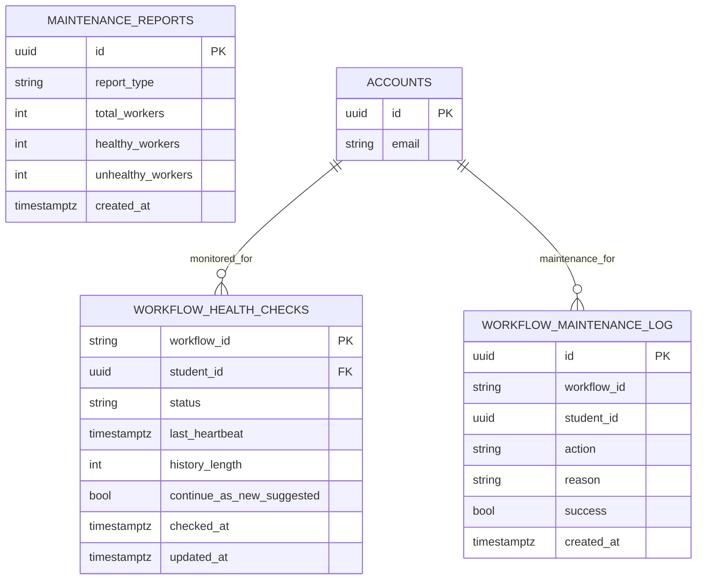

---

### 7.7 Schedule Processing + `time_blocks` / `student_time_blocks`

This is the “calendar reconciliation” pipeline that keeps the timeline (classes, assignments, busy blocks) fresh for:

- dashboard + briefing generation
- schedule / planner UI (LockedIn + mobile)
- downstream task scheduling (“place this task on my timeline”)

Deep dive: [Schedules, Time Blocks, and Reconciliation](/docs/engineering/technical/calendar/schedules-time-blocks-and-reconciliation)
Deep dive: [Dashboard v2 & Widget Strategy (Current)](/docs/engineering/architecture/dashboard-v2-widget-strategy-current)
Deep dive: [Tasks, Task Bank, and Planner Block Scheduling Deep Dive (Current)](/docs/engineering/technical/tasks/tasks-task-bank-and-planner-block-scheduling-deep-dive-current)

Dashboard v2 specific nuance:

- The schedule widget reads `student_time_blocks` overlapping “today” and currently computes “today” using UTC boundaries (see `SE-011`).

#### 7.7.1 Data model (high-level)

There are **two related stores** in the current codebase:

- `student_time_blocks` — student timeline blocks (queried and mutated by `api-router` and the engine)
- `time_blocks` — generic time blocks for any context (e.g., course schedule imports), queried by the engine as inputs to reconciliation

Important nuance (current reality):

- `student_time_blocks` is both a **reconciliation target** *and* an **ingestion sink** for some sources (e.g., Canvas assignment deadlines in the PAT/OAuth2 sync path, and LMS ICS calendars via `fetchStudentLMSData`).
- `time_blocks` is primarily used for **context-scoped** events (notably schedule import class meetings by course context) that reconciliation can consume.

Key references:

- Uniqueness rule for student timeline blocks: `.repos/dormway-platform/infrastructure/database/migrations/085_fix_time_block_unique_constraint_source.sql`
- Lifecycle status updates (`completed`): `.repos/dormway-platform/infrastructure/database/migrations/083_add_completed_lifecycle_status.sql`
- Generic `time_blocks` schema (engine migrations): `.repos/dormway-platform/services/engine/migrations/create_generic_time_blocks.sql`

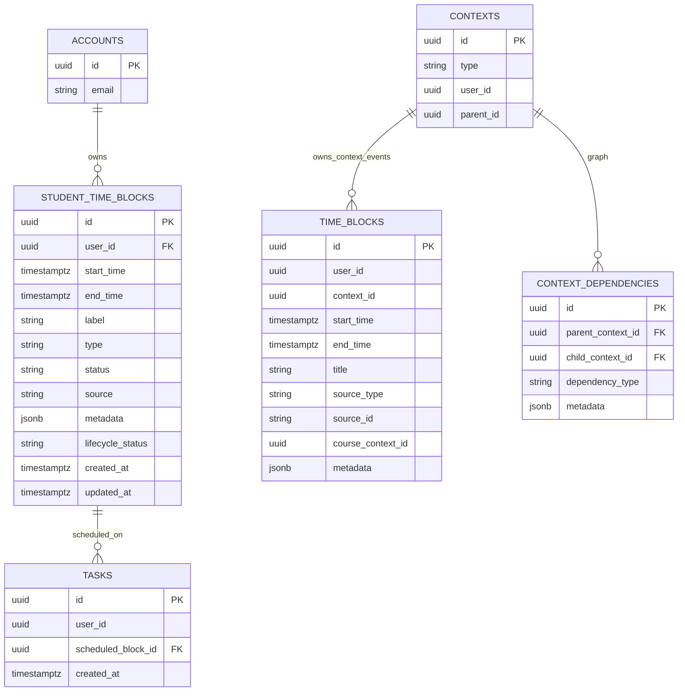

#### 7.7.2 `scheduleProcessor` workflow (calendar reconciliation)

Implementation:

- Workflow: `.repos/dormway-platform/services/engine/src/workflows/studentProcessor.workflow.ts` (function `scheduleProcessor`)
- Normalization: `.repos/dormway-platform/services/engine/src/activities/student.activities.ts` (function `normalizeCalendars`)
- Consolidation + persistence: `.repos/dormway-platform/services/engine/src/activities/student.activities.ts` (function `consolidateAndStoreCalendarEvents`)

Deep dive: [scheduleProcessor Workflow Deep Dive (Current)](/docs/engineering/technical/calendar/scheduleprocessor-workflow-deep-dive-current)
Source precedence + pitfalls: [Schedule Sources & Precedence (Current)](/docs/engineering/technical/calendar/schedule-sources-precedence-current)
Course drop propagation: [Course Drops: Downstream Effects (Current)](/docs/engineering/technical/calendar/course-drops-downstream-effects)

At runtime, `scheduleProcessor` pulls multiple calendar sources, normalizes them to a common `TimeBlock` shape, then performs a diff against existing stored blocks and applies batch delete/upsert/update.

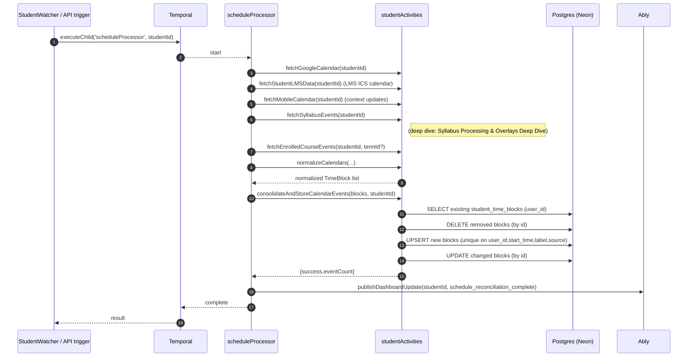

Additional nuance (Canvas):

- Canvas PAT/OAuth2 assignment deadlines are written directly to `student_time_blocks` during Canvas sync (not via `time_blocks`).
- This interacts with reconciliation deletion semantics (SE-001/DORM-773, **resolved 2025-12-26**) and is traced in [Canvas Sync, Storage, and UI Surfacing (Current)](/docs/engineering/technical/canvas/canvas-sync-storage-and-ui-surfacing-current).

#### 7.7.3 Where schedule imports fit (`time_blocks` → reconciliation input)

Schedule import writes course schedule blocks to `time_blocks` (by course context), then `scheduleProcessor` reads them as **authoritative “enrolled” events** to deduplicate against Google/mobile calendar class blocks.

- Import workflow: `.repos/dormway-platform/services/engine/src/workflows/scheduleImport.workflow.ts`
- Deep dive: [scheduleImport Workflow Deep Dive (Current)](/docs/engineering/technical/calendar/scheduleimport-workflow-deep-dive-current)
- Removal workflow: `.repos/dormway-platform/services/engine/src/workflows/scheduleRemoval.workflow.ts`
- Deep dive: [scheduleRemoval Workflow Deep Dive (Current)](/docs/engineering/technical/calendar/scheduleremoval-workflow-deep-dive-current)
- Fetch for reconciliation: `.repos/dormway-platform/services/engine/src/activities/student.activities.ts` (function `fetchEnrolledCourseEvents`)
  - Queries `time_blocks` with `source = 'schedule_import'` and `contextId = courseContextId` and then normalizes them to `source: 'enrolled'`
- Syllabus events: Syllabus processing extracts dates from uploaded syllabi and surfaces them in `fetchSyllabusEvents`.
  - Deep dive: [Syllabus Processing & Overlays Deep Dive (Current)](/docs/engineering/technical/syllabus/syllabus-processing-overlays-deep-dive-current)

#### 7.7.4 Timezone + "wallclock time" hygiene

The schedule pipeline is very sensitive to “floating” times. Current hardening includes:

- DB-level timezone consistency notes + indexes: `.repos/dormway-platform/infrastructure/database/migrations/20250820_fix_timezone_consistency.sql`
- Admin tooling to audit/fix wallclock times: `.repos/dormway-platform/services/api-router/src/routes/admin/schedule-maintenance-routes.ts`

#### 7.7.5 Term management (the `termId` that powers filtering)

Several calendar + course flows depend on a consistent `termId`:

- Schedule import resolves a term from `campus_configs` and writes it onto enrollments (`context_dependencies.term_id` + `metadata.term`) via `createCourseEnrollments`.
- API Router dashboard resolves the campus current term and filters courses by `edge.metadata.term`.
- Semester/term workflows resolve “current term” separately (Engine activities) and `@dormway/core` aggregates a `Term` from enrollment edges.

Deep dive: [Term Management & Term Resolution Deep Dive (Current)](/docs/engineering/technical/engine/term-management-term-resolution-deep-dive-current)
Deep dive: [Context Model: Hierarchy vs Graph (Current)](/docs/engineering/technical/ai/context/context-model-hierarchy-vs-graph)

#### 7.7.6 Course lifecycle (manual add/drop/swap)

DormWay has explicit “course lifecycle” endpoints that mutate enrollments and can optionally manipulate schedule rows:

- API endpoints: `POST /api/courses/add|drop|swap|reenroll` start Temporal workflows.
- Writes enrollment edges in `context_dependencies` (e.g. `enrolled_in`, `dropped`) and logs `course_lifecycle_events`.
- Optional schedule effect: dropping can soft-delete `student_time_blocks` for a course; re-enrolling restores them.
- Each operation signals StudentWatcher via `context_update` so DayPlan can regenerate.

Deep dive: [Course Lifecycle (Add-Drop-Swap) Deep Dive (Current)](/docs/engineering/technical/engine/course-lifecycle-add-drop-swap-deep-dive-current)

#### 7.7.7 Term transitions + term smart notifications

DormWay has explicit workflows for term-end warnings and term transitions:

- `scheduledTermEndCheckWorkflow` sends a deduped “term ending soon” warning per user+term (tracked in `student_watcher_state.state_data.term_notifications`).
- `termTransitionWorkflow` / `campusTermTransitionWorkflow` archive enrollments from the ending term and can prompt the user to upload the next term schedule.
- Separate “smart notifications” workflows can send term-related reminders (term end, drop deadline, finals, workload prediction).

Deep dive: [Term Transition & Smart Notifications Deep Dive (Current)](/docs/engineering/technical/engine/term-transition-smart-notifications-deep-dive-current)

---

### 7.8 Home V2 dashboard widget delivery (LockedIn)

Home V2 (web) is **batch-first** and uses widget envelopes rather than the legacy composite BFF.

Key behaviors:
- LockedIn fetches `GET /v2/widgets/batch?types=...` via the `/api/proxy/*` layer (Zuplo in front).
- Default widget set for Home V2: `today`, `schedule`, `tasks`, `courses`, `headsup`.
- `GET /v2/widgets/home-types` returns the canonical allowed set; Home V2 uses it to enforce strict mode.
- Widget data is cached with React Query (`staleTime: 30s`) and ETag responses are respected.
- Widgets consume data via `WidgetDataContext` + `useWidgetDataV2` selectors.

Schedule-specific note:
- Schedule widget v2 consumes `ScheduleContent.timeline` from the batch payload (pre-merged dayplan + time blocks).
- Client-side filtering still narrows the timeline to “today” (see schedule section above).

### 7.8.1 Freshness API (`/v2/freshness`)

The system includes a global freshness endpoint for checking data staleness across different data types.

**Endpoint**: `GET /v2/freshness` (admin only)

**Scopes**:

| Scope | Description |
|-------|-------------|
| `user` | Per-user freshness across all data types |
| `campus` | Aggregated freshness for all students at a campus |
| `city` | City-level data freshness (weather) |
| `system` | System-wide freshness metrics |

**Data types with default thresholds**:

| Type | Threshold | Description |
|------|-----------|-------------|
| `schedule` | 5 min | Time blocks from student_time_blocks |
| `headsup` | 5 min | Feed cards from Redis cache |
| `tasks` | 15 min | Canvas assignments |
| `courses` | 15 min | Syllabus processing data |
| `weather` | 30 min | Weather data from service_data |
| `dayplan` | 6 hours | Daily plan generation |

**Query parameters**:

| Parameter | Required | Description |
|-----------|----------|-------------|
| `scope` | Yes | `campus`, `city`, or `system` |
| `scopeId` | For campus/city | Context ID for the scope |
| `types` | No | Comma-separated list of types (default: all) |
| `strict` | No | Treat missing data as stale (default: `true`) |
| `thresholds` | No | JSON object for custom thresholds |

**Response format**:
```json
{
  "success": true,
  "data": {
    "scope": "campus",
    "scopeId": "uuid",
    "generatedAt": "2025-12-26T...",
    "freshness": {
      "schedule": {
        "lastUpdated": "2025-12-26T...",
        "isStale": false,
        "maxAgeSeconds": 300,
        "reason": null
      }
    }
  }
}
```

**Stale reasons**:

| Reason | Description |
|--------|-------------|
| `never_synced` | Data has never been fetched |
| `threshold_exceeded` | Data is older than threshold |
| `sync_failed` | Last sync attempt failed |
| `source_unavailable` | Source temporarily unavailable |

**Detailed format** (with `format=detailed`):
Includes `sourceBreakdown` for schedule/tasks showing per-source freshness (canvas, gcal, planner, manual).

**Caching**: Redis caching with 30-60 second TTLs by scope.

Key files:
- Route: `.repos/dormway-platform/services/api-router/src/routes/v2/freshness.routes.ts`
- Service: `.repos/dormway-platform/services/shared/dormway-core/src/domains/freshness/freshness.service.ts`
- Types: `.repos/dormway-platform/services/shared/dormway-core/src/domains/freshness/freshness.types.ts`

Deep dive: [Data Freshness & Validity Rules](/docs/engineering/architecture/sot-data-freshness-validity-rules)

Key files:
- `.repos/dormway-platform/services/dormway-lockedin/src/hooks/home/useWidgetBatchV2.ts`
- `.repos/dormway-platform/services/dormway-lockedin/src/hooks/home/useWidgetDataV2.ts`
- `.repos/dormway-platform/services/dormway-lockedin/src/contexts/WidgetDataContext.tsx`
- `.repos/dormway-platform/services/api-router/src/routes/v2/widgets.routes.ts`
- `.repos/dormway-platform/services/api-router/src/interfaces/layout.ts`

---

## 8) LLM + Retrieval: How “AI Stuff” Works

DormWay uses **two related patterns**:

1) **Managed prompts** (IDs in a registry, synced to Portkey)
2) **Direct model calls** (Portkey chat completions with inline prompts)

And it uses **Ragie** for retrieval so answers can cite user/course/org content.

### 8.1 Prompt registry + managed prompts

Managed prompts are identified by a stable `promptId` (e.g. `schedule-ocr-parsing`) and mapped to a Portkey prompt ID.

Shared implementation:

- `.repos/dormway-platform/services/shared/dormway-core/src/llm/prompt-loader.ts`
- `.repos/dormway-platform/services/shared/dormway-core/src/llm/llm-caller.ts` (`callPortkeyPrompt`)

Engine also has a local prompt loader in:

- `.repos/dormway-platform/services/engine/src/utils/portkey.ts`

### 8.2 DayPlan generation (LLM usage)

DayPlan V2 uses a direct LLM call with runtime-configurable model settings:

- V2 strategy: `.repos/dormway-platform/services/engine/src/activities/dayplan/v2-strategy.ts`
  - Reads model settings via SystemConfig keys like `llm.dayplan_model`, `llm.dayplan_temperature`, `llm.dayplan_max_tokens`.

StudentWatcher calls DayPlan generation via activities:

- `.repos/dormway-platform/services/engine/src/workflows/studentWatcher.simplified.workflow.ts`

Deep dives:

- [DayPlan & Semester Summary Generation Deep Dive (Current)](/docs/engineering/technical/engine/dayplan-semester-summary-generation-deep-dive-current)
- [DayPlan V2 Architecture](/docs/engineering/architecture/dayplan-v2-architecture)

### 8.3 Ace (chat/Q&A) = Ragie retrieval + Portkey completion

High-level:

1) API Router queries Ragie for relevant sources in one or more partitions (user/course/org).
2) It composes a chat prompt including extracted snippets.
3) It calls Portkey `chat.completions` to produce a final answer.
4) If the LLM call fails, it falls back to Ragie’s answer text.

Code:

- Route layer: `.repos/dormway-platform/services/api-router/src/routes/ace-llm-routes.ts`
- Service layer: `.repos/dormway-platform/services/api-router/src/services/ace-llm.ts`

Deep dive: [Ragie Ingestion, Webhooks, and ACE Query Pipeline Deep Dive (Current)](/docs/engineering/technical/ai/rag/ragie-ingestion-webhooks-and-ace-query-pipeline-deep-dive-current)

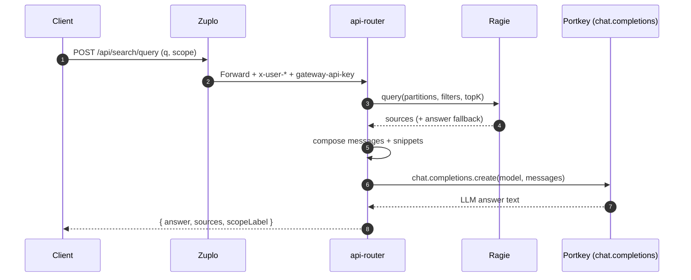

### 8.4 Schedule import (OCR / PDF / ICS) = workflows + LLM parsers

Schedule import is implemented as a Temporal workflow with multiple input modes:

- OCR text → Portkey managed prompt `schedule-ocr-parsing`
- ICS content → GPT-5 based parser
- PDF uploads → OpenAI file-based parsing + GPT-5 parsing call

Code:

- `.repos/dormway-platform/services/engine/src/workflows/scheduleImport.workflow.ts`
- Portkey activity wrapper: `.repos/dormway-platform/services/engine/src/activities/portkey.activities.ts`

```mermaid
flowchart TD
  A[Schedule Import Request] --> B{mode}
  B -- image --> C[Vision/OCR path<br/>imageData]
  B -- pdf --> D[OpenAI Files upload<br/>fileId]
  B -- ics --> E[ICS parse path<br/>parseICSWithGPT5]
  B -- text --> F[Portkey prompt<br/>schedule-ocr-parsing]

  C --> G[Parse to ParsedCourse list]
  D --> G
  E --> G
  F --> G

  G --> H[Upsert contexts/courses/schedule items]
  H --> I[Publish progress updates]
  I --> J[Signal StudentWatcher (if needed)]
```

### 8.5 Generic content ingestion (classification + Ragie indexing)

Generic ingestion does:

- resolve identity to a Ragie partition (registered users: `user_${uuid}`, unregistered: `user_email_${hash}`)
- extract text from documents (PDF/DOCX/etc)
- classify and route to specialized handlers
- index content into Ragie for later retrieval

Code:

- `.repos/dormway-platform/services/engine/src/activities/genericContent.activities.ts`

Important interaction with login:

- Unregistered user uploads can be indexed under an email-hash partition.
- When the user later registers via Clerk, the Clerk webhook *claims* content by email and logs Ragie “migration needed”.
  - See `.repos/dormway-platform/services/api-router/src/routes/webhooks/clerk-routes.ts`.

```mermaid
sequenceDiagram
  autonumber
  participant U as User (unregistered)
  participant API as api-router
  participant Engine as engine worker
  participant DB as Postgres
  participant Ragie as Ragie
  participant Clerk as Clerk

  U->>API: Upload content (email only)
  API->>Engine: Start/trigger generic ingestion
  Engine->>DB: Lookup account by email
  DB-->>Engine: none
  Engine->>Engine: Use partition user_email_{hash}
  Engine->>Ragie: index document (partition=user_email_{hash})

  Note over Clerk,API: Later: user registers in Clerk
  Clerk-->>API: user.created webhook
  API->>DB: Create/merge account + assign backend_user_id
  API->>DB: Claim content by email (set user_id)
  API-->>API: Log "Ragie migration needed" (email-hash -> user_{uuid})
```

---

## 9) System Settings (Runtime Configuration)

DormWay uses a **database-backed runtime configuration system** that allows changing operational parameters without code deployments. The system currently has **28 migrated settings** across 12 categories.

### 9.1 What it is

`SystemConfigService` is a domain service in `@dormway/core` that:

- Stores configuration values in the `system_config` Postgres table
- Provides type-safe accessors (`getNumber`, `getString`, `getBoolean`, `getJson`)
- Supports Redis + in-memory caching with configurable TTL (default: 1 minute)
- Logs all changes to `system_config_audit` table for compliance/debugging
- Enables migration tracking (code that has been updated to use the service vs hardcoded values)

Key references:

- Domain module: `.repos/dormway-platform/services/shared/dormway-core/src/domains/system-config/`
- Config helpers: `.repos/dormway-platform/services/shared/dormway-core/src/domains/system-config/config-helpers.ts`
- Admin UI: `.repos/dormway-platform/services/dormway-admin/src/pages/system-settings/index.tsx`

### 9.2 Configuration Categories

| Category | Icon | Description | Example Keys |
|----------|------|-------------|--------------|
| `sync` | CloudSync | Data synchronization operations | `sync.max_concurrent_cities`, `sync.max_concurrent_campuses` |
| `processing` | Settings | Task processing and execution | `processing.city_weather_batch_size` |
| `student` | School | Student-facing features and limits | `student.max_courses` |
| `dayplan` | Schedule | Day plan and scheduling configuration | `dayplan.generation_hour` |
| `llm` | Psychology | AI model selection and parameters | `llm.dayplan_model`, `llm.dayplan_temperature`, `llm.dayplan_max_tokens` |
| `ratelimits` | Speed | API rate limiting configuration | `ratelimits.api_default_rpm` |
| `batching` | Storage | Batch processing and queue settings | `batching.queue_size` |
| `limits` | Tune | Various system-wide limits | `limits.max_upload_size_mb` |
| `canvas` | Extension | Canvas LMS integration settings | `canvas.sync_interval_hours` |
| `defaults` | Code | Default fallback values | `defaults.timezone` |
| `temporal` | Timer | Temporal workflow configuration | `temporal.task_queue_concurrency` |
| `workflow` | Settings | General workflow settings | `workflow.retry_max_attempts` |

### 9.3 Usage in Code

**Type-safe config helpers (preferred):**

```typescript
import { getConfigNumber, getConfigString, getConfigBoolean, getConfigJson } from '@dormway/core';

// Get values with defaults (returns default if service not initialized or key missing)
const batchSize = await getConfigNumber('processing.city_weather_batch_size', 10);
const model = await getConfigString('llm.dayplan_model', 'gpt-4o-mini');
const enabled = await getConfigBoolean('feature.enabled', false);
const schedule = await getConfigJson<SyncSchedule>('sync.schedule', defaultSchedule);
```

**Direct service access (when you need more control):**

```typescript
import { getSystemConfigService, isSystemConfigServiceInitialized } from '@dormway/core';

if (isSystemConfigServiceInitialized()) {
  const service = getSystemConfigService();

  // Get with explicit options
  const value = await service.getNumber('key', defaultValue, { skipCache: true });

  // Set with audit logging
  await service.set('key', newValue, {
    changedBy: userId,
    changeReason: 'Increasing capacity for holiday weekend',
    ipAddress: req.ip,
  });
}
```

### 9.4 Service Initialization

The service must be initialized at app startup before use:

```typescript
import { initializeSystemConfigService } from '@dormway/core';

// During service initialization (api-router, engine)
await initializeSystemConfigService({
  pool,                    // PostgreSQL connection pool
  logger,                  // Optional: structured logger
  cacheAdapter,            // Optional: Redis cache adapter
  cacheTtlMs: 60000,       // Optional: cache TTL (default 1 minute)
});
```

### 9.5 Admin UI

The admin dashboard (`dormway-admin`, port 3004) provides a **System Settings** page at `/system-settings`:

**Features:**
- Browse settings by category (accordion view)
- Search across all settings
- Filter by: All / Modified / Migrated / Pending Migration
- Edit values with type-appropriate inputs (switches, number fields, JSON editors, enum dropdowns)
- Reset to defaults with confirmation dialog
- Track migration status (mark settings as migrated when code is updated)
- View complete audit history (who changed what, when, why)

**Stats displayed:**
- Total settings count
- Modified count (non-default values)
- Migrated count (28 currently)
- Pending migration count
- Categories count (12)

### 9.6 Database Schema

```mermaid
erDiagram
  SYSTEM_CONFIG {
    uuid id PK
    varchar key UK
    jsonb value
    varchar category
    text description
    varchar value_type
    jsonb default_value
    jsonb constraints
    uuid updated_by
    timestamptz updated_at
    timestamptz created_at
    boolean is_migrated
    text migration_notes
  }

  SYSTEM_CONFIG_AUDIT {
    uuid id PK
    varchar config_key
    jsonb previous_value
    jsonb new_value
    uuid changed_by
    timestamptz changed_at
    text change_reason
    inet ip_address
    text user_agent
  }

  SYSTEM_CONFIG ||--o{ SYSTEM_CONFIG_AUDIT : changes
```

**Value types supported:** `number`, `string`, `boolean`, `json`

**Constraints (for validation):**
- `min`/`max` for numbers
- `enum` for allowed string values

### 9.7 Database Functions

Two helper functions exist for atomic operations:

```sql
-- Set a config value with automatic audit logging
SELECT set_system_config(
  'sync.max_concurrent_cities',     -- key
  '5'::jsonb,                        -- value
  'user-uuid'::uuid,                 -- changed_by
  'Increasing capacity'::text,       -- change_reason
  '192.168.1.1'::inet,              -- ip_address
  'Chrome/...'::text                 -- user_agent
);

-- Reset config to default with audit logging
SELECT reset_system_config(
  'sync.max_concurrent_cities',     -- key
  'user-uuid'::uuid,                 -- changed_by
  'Reverting test change'::text      -- change_reason
);

-- Validate a value against constraints
SELECT validate_config_value('key', 'value'::jsonb);
```

### 9.8 Caching Strategy

The service uses a two-tier cache:

1. **In-memory cache** (per-process): Fast, expires based on TTL
2. **Redis cache** (optional): Shared across processes, expires based on TTL

On cache miss:
1. Check memory cache → return if valid
2. Check Redis cache → populate memory cache if valid
3. Query database → populate both caches

Cache invalidation:
- Automatic on `set()` and `reset()` calls
- Memory cache cleared immediately
- Redis relies on TTL expiration (no pattern-based deletion)

### 9.9 Migration Tracking

Each setting has migration tracking fields:
- `is_migrated` (boolean): Whether code has been updated to use SystemConfigService
- `migration_notes` (text): File paths or notes about where migration was applied

**Migration workflow:**
1. Find hardcoded value or environment variable in code
2. Replace with `getConfigNumber/String/Boolean/Json()` call
3. Mark setting as migrated in admin UI with notes (e.g., "Updated in services/engine/src/activities/sync.activities.ts")

---

## 10) Useful "Follow the Trace" Entry Points

If you need to re-derive flows quickly, start here:

- Zuplo auth + header injection: `.repos/dormway-api-2/config/policies.json`, `.repos/dormway-api-2/modules/clerk-enrichment.ts`
- API Router gateway + auth: `.repos/dormway-platform/services/api-router/src/server.ts`, `.repos/dormway-platform/services/api-router/src/middleware/auth.ts`
- Clerk webhook provisioning: `.repos/dormway-platform/services/api-router/src/routes/webhooks/clerk-routes.ts`
- StudentWatcher workflow: `.repos/dormway-platform/services/engine/src/workflows/studentWatcher.simplified.workflow.ts`
- Watcher state persistence: `.repos/dormway-platform/services/engine/src/activities/workflowState.activities.ts`
- DayPlan V2 strategy (LLM settings): `.repos/dormway-platform/services/engine/src/activities/dayplan/v2-strategy.ts`
- Ace (RAG + LLM): `.repos/dormway-platform/services/api-router/src/services/ace-llm.ts`
- System Settings (runtime config): `.repos/dormway-platform/services/shared/dormway-core/src/domains/system-config/`
