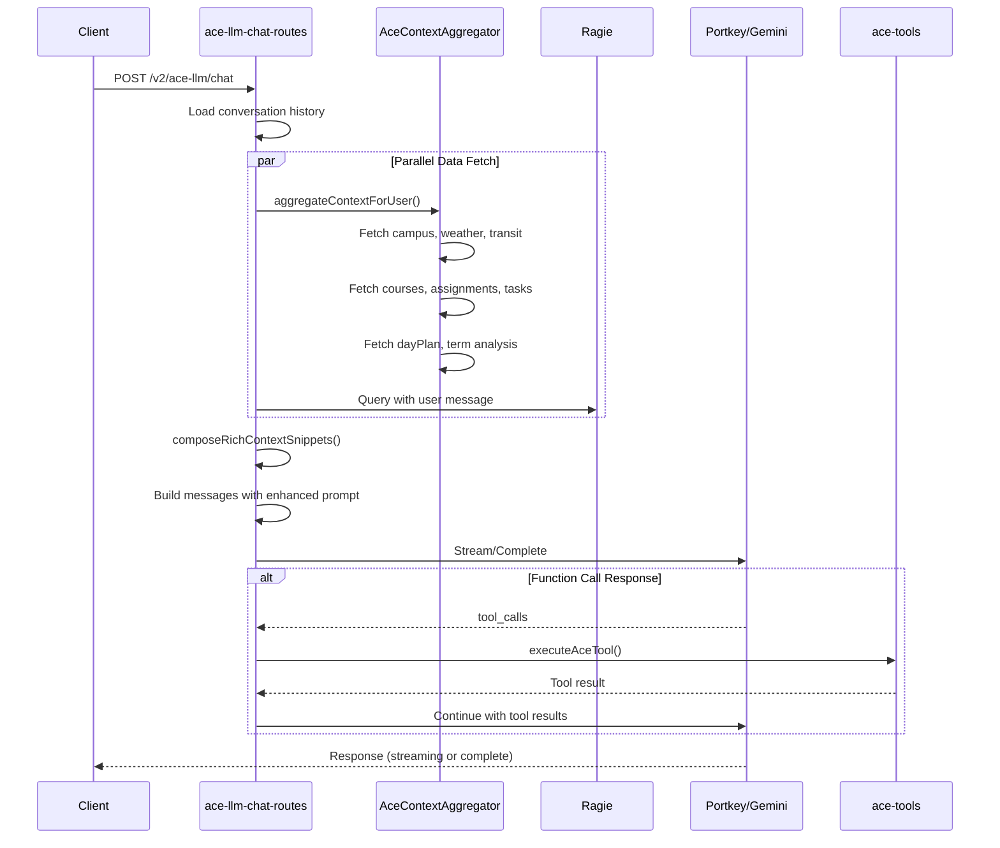
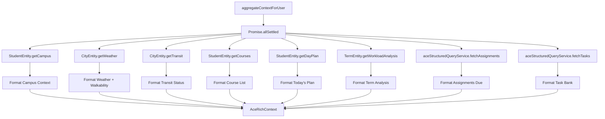
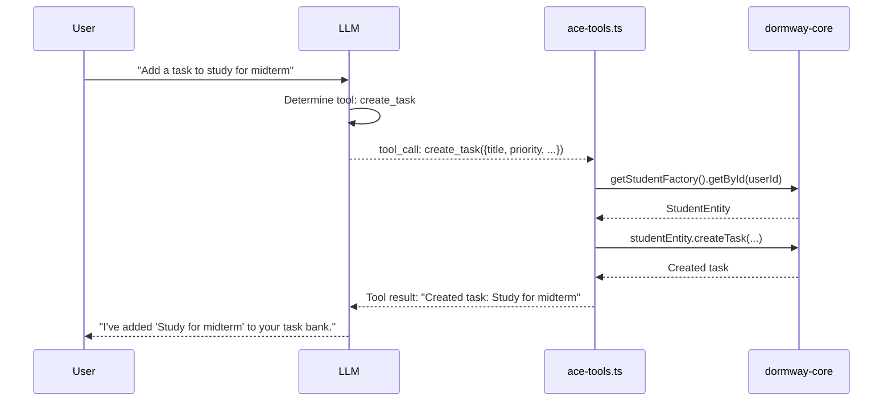

# SoT - Ace LLM

## Scope / Non-goals
- **Scope**: Ace LLM chat architecture, rich context injection, function calling tools, structured data queries, context formatting, and chat pipeline flow.
- **Non-goals**: Document ingestion/RAG indexing (see [BrainGains & RAG](/docs/engineering/architecture/sot-braingains-rag)), DayPlan generation logic (see [DayPlan V2](/docs/engineering/architecture/sot-dayplan-v2)), iOS/LockedIn UI presentation.

## Invariants & Contracts

### Chat Pipeline
- All Ace chat requests flow through `/v2/ace-llm/chat` (non-streaming) or `/v2/ace-llm/chat/stream` (streaming). Both endpoints use the same `runChatPipeline()` with rich context injection. (`services/api-router/src/routes/ace-llm-chat-routes.ts`)
- Rich context is aggregated via `AceContextAggregator.aggregateContextForUser()` which fetches ALL data sources in parallel using `Promise.allSettled()` for graceful degradation. (`services/api-router/src/services/ace-context-aggregator.ts`)
- Context aggregation is controlled by `USE_RICH_CONTEXT` feature flag (defaults to `true`). When disabled, falls back to RAG-only mode.

### Data Source Priority
- System prompt instructs LLM to prioritize data in this order:
  1. **Current Date & Time** - Ground answers in actual current date/time
  2. **Campus & Conditions** - Weather, transit, walkability for commute queries
  3. **Structured Data** - Assignments, tasks, schedule for "what's due" queries
  4. **Term Analysis** - Workload, conflicts for planning queries
  5. **Document Snippets** (RAG) - Notes, lectures for content/concept queries

### Function Calling / Tools
- Ace supports OpenAI-compatible function calling via `ACE_TOOLS` definitions. Tools execute using dormway-core entity pattern (not raw SQL). (`services/api-router/src/services/ace-tools.ts`)
- Available tools: `create_task`, `complete_task`, `list_tasks`
- Tool execution uses `getStudentFactory().getById(userId)` to get StudentEntity, then calls entity methods.
- Function calls are processed in the chat pipeline loop: if model returns `tool_calls`, execute each tool and append results as `tool` role messages.

### Structured Queries
- Assignment/task data comes from `aceStructuredQueryService` which uses dormway-core entities. (`services/api-router/src/services/ace-structured-queries.ts`)
- Task interface includes `source` field: `'manual' | 'canvas' | 'syllabus' | 'ai_suggestion'`
- Tasks can be filtered by: `priority`, `dueBefore`, `dueAfter`, `source`, `courseCode`

### Context Formatting
- All data sources are formatted into structured text snippets via formatters in `ace-context-formatters.ts`. Each formatter returns `string[]`.
- Tasks are sorted by priority (urgent > high > medium > low), then by due date.
- Output uses emojis for visual scanning: priority (🔴🟠🟡🟢), source (📝🎓📄🤖), overdue warnings (⚠️).

### Model Configuration
- Default model: `gemini-2.5-flash-lite` (1M context, cost-effective)
- Model selection: `process.env.ACE_LLM_MODEL || process.env.PORTKEY_MODEL || 'gemini-2.5-flash-lite'`
- Provider detection: `detectProvider(model)` returns `'google'` for gemini models, routes through Portkey.

### Scheduling Recommendations
- Ace does NOT implement its own scheduling recommendations. This is handled by **DayPlan V2**.
- DayPlan V2 provides `v2_suggestedBlocks` with `start`, `end`, `duration`, `reason`, `confidence`.
- studentWatcher workflow regenerates DayPlan on context changes and detects deviations.
- Ace injects DayPlan data as context; LLM references it when users ask "when should I work on X?"

## Key Flows (High-Level)

### Chat Pipeline Flow



### Rich Context Aggregation



### Function Calling Flow



## Data Models / IDs / Terminology

### AceRichContext Interface
```typescript
interface AceRichContext {
  // Real-time grounding
  currentTime: string;
  timezone: string;
  currentTermName: string;
  currentWeekNumber: number;

  // Campus & Conditions
  campus: CampusContext | null;
  weather: WeatherContext | null;
  transit: TransitContext | null;

  // Academic Data
  courses: CourseContext[];
  assignments: Assignment[];
  tasks: Task[];
  dayPlan: DayPlan | null;

  // Term Analysis (from BrainGains)
  workloadAnalysis: BrainGainsWorkloadAnalysis | null;
  conflictAnalysis: BrainGainsConflictAnalysis | null;
  crossCourseInsights: BrainGainsCrossCourseInsights | null;
  earlyWarnings: BrainGainsEarlyWarning[] | null;

  // Metadata
  dataSources: DataSourceMeta[];
}
```

### Task Interface
```typescript
interface Task {
  id: string;
  userId: string;
  title: string;
  estimatedDuration: number;  // minutes
  priority: 'urgent' | 'high' | 'medium' | 'low';
  courseCode?: string;
  dueDate?: Date;
  status: 'pending' | 'scheduled' | 'completed';
  scheduledBlockId?: string;
  completedAt?: Date;
  source?: 'manual' | 'canvas' | 'syllabus' | 'ai_suggestion';
  metadata?: any;
}
```

### ACE_TOOLS Definitions
```typescript
const ACE_TOOLS = [
  {
    type: 'function',
    function: {
      name: 'create_task',
      parameters: { title, priority?, estimatedMinutes?, courseCode?, dueDate? }
    }
  },
  {
    type: 'function',
    function: {
      name: 'complete_task',
      parameters: { taskId }
    }
  },
  {
    type: 'function',
    function: {
      name: 'list_tasks',
      parameters: { status?, courseCode?, limit? }
    }
  }
];
```

## Key Files (Code + Docs)

### Core Services
- `services/api-router/src/routes/ace-llm-chat-routes.ts` - Chat endpoints and pipeline
- `services/api-router/src/services/ace-context-aggregator.ts` - Rich context aggregation
- `services/api-router/src/services/ace-context-formatters.ts` - Context → text formatting
- `services/api-router/src/services/ace-tools.ts` - Function calling tools
- `services/api-router/src/services/ace-structured-queries.ts` - Assignment/task queries
- `services/api-router/src/services/ace-llm-helpers.ts` - System prompt, model config
- `services/api-router/src/services/ace-llm.ts` - RAG query service

### Supporting Files
- `services/shared/dormway-core/src/entities/student/student.entity.ts` - Task CRUD methods
- `services/shared/dormway-core/src/entities/city/city.entity.ts` - Weather/transit data
- `services/engine/src/workflows/studentWatcher.simplified.workflow.ts` - DayPlan regeneration

### Documentation
- `obsidian-vault/DormWay/Engineering/Technical/API/Ace-Context-Data-Sources.md` - Data source details

## Update Checklist

- If you add new tools to `ACE_TOOLS`, add execution logic in `executeAceTool()` and update this doc.
- If you change context aggregation sources, update `AceRichContext` interface and formatters.
- If you modify the chat pipeline flow, update `runChatPipeline()` and the sequence diagram above.
- If you change model configuration, update `ace-llm-helpers.ts` and environment variable docs.
- If you add new task filters, update `aggregateContextForUser()` options and `fetchTasks()`.

## Recent Changes

- **2026-01-03**: Created SoT document. Documented function calling tools (`create_task`, `complete_task`, `list_tasks`), rich context aggregation, task filtering, and enhanced formatters with priority sorting and source indicators.
- **2026-01-03**: Confirmed DORM-348 (Smart Scheduling) is covered by DayPlan V2's `v2_suggestedBlocks` and studentWatcher recalibration - Ace does not implement its own scheduling.
- **2026-01-03**: Fixed weather/transit context to use travel location (not campus) via `findNearestCity(lat, lng)`.

## Known Discrepancies / Risks

- **Caching**: Context aggregation does not yet have Redis caching (5-min TTL planned but not implemented).
- **Tool Expansion**: Only 3 tools implemented. Future tools (calendar, reminders) may need additional entity methods.
- **Model Migration**: Migration from gpt-4o-mini to gemini-2.5-flash-lite is pending system_config table update.
