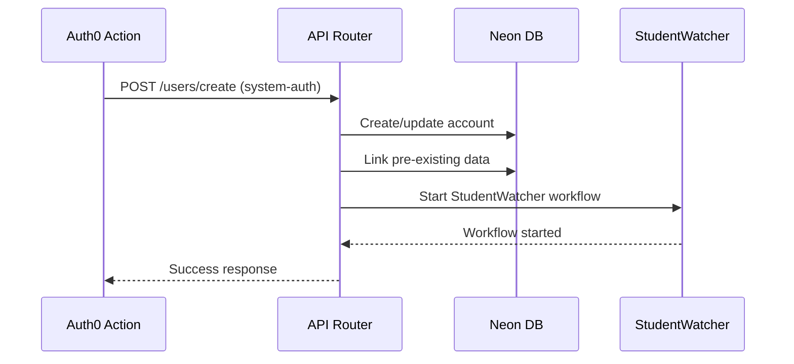
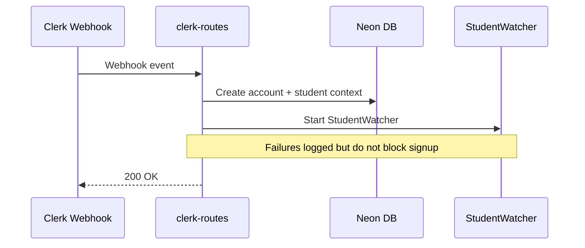
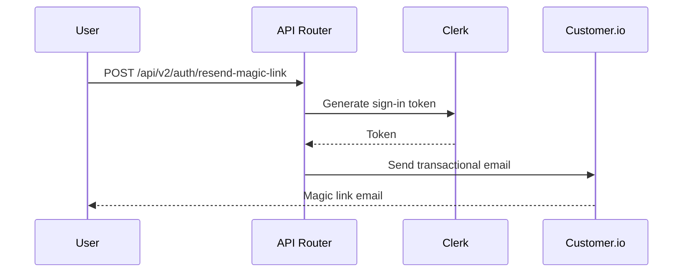
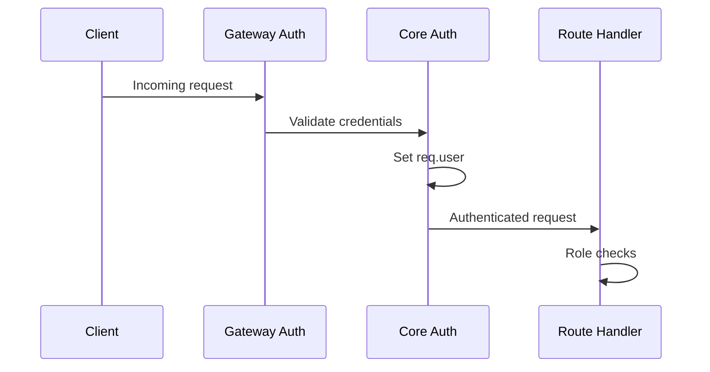

# SoT - Auth & Identity

## Scope
- API Router authentication middleware stack (gateway auth + core auth + app auth).
- Identity provisioning via Auth0 actions and Clerk webhooks.
- Magic link resend flow for PLG users (Clerk + Customer.io).
- System/cron/internal service authentication contracts.

## Non-goals
- OAuth provider integration details (Google OAuth) beyond API Router contracts.
- Authorization rules inside domain services (role enforcement is out of scope).
- Client UI auth flows (web/iOS screens).

## Invariants & Contracts
- Gateway auth expects `gateway-api-key` header (Zuplo); internal services may bypass with `Authorization: Bearer ${API_KEY}`.
- Core auth order: internal API key -> Temporal worker key -> device key -> Clerk JWT -> API Gateway `x-user-*` headers -> direct JWT verification.
- Clerk JWT maps `backend_user_id` (or `sub` fallback) to `req.user.id`.
- Auth0 system routes require `SYSTEM_API_KEY` and `x-auth0-action` (`post-registration` or `post-login`).
- Cron routes require `API_KEY` via `Authorization: Bearer` or `x-cron-api-key`.
- Auth0 `/users/:userId/context` returns custom claims including `https://dormway.app/user_id` and roles from `public_data.roles`.
- App auth uses `x-app-signature` + `x-app-timestamp` HMAC; invalid or missing signatures keep `req.appAuth.isVerified = false`.

## Key Flows (High-Level)

### Auth0 Signup Provisioning

### Clerk Webhook Provisioning

### PLG Magic Link Resend

### Request Auth Flow

## Data Models / IDs / Terminology
- Backend user ID: UUID used as `req.user.id` and emitted as `https://dormway.app/user_id` in Auth0 claims.
- Auth sources (`req.user.source`): `internal`, `temporal`, `device`, `jwt-clerk`, `api-gateway`, `jwt-direct`, `system`, `cron`.
- Auth0 IDs are stored on accounts and mapped into token claims alongside backend UUIDs.

## Key Files (Code + Docs)
- `services/api-router/src/middleware/auth.ts` (core auth wiring)
- `services/shared/dormway-core/src/middleware/factories/auth.factory.ts` (auth order + claim extraction)
- `services/api-router/src/middleware/gateway-auth.ts` + `services/shared/dormway-core/src/middleware/factories/gateway-auth.factory.ts` (Zuplo gateway auth)
- `services/api-router/src/middleware/system-auth.ts` (Auth0 actions auth)
- `services/api-router/src/middleware/cron-auth.ts` (cron auth)
- `services/api-router/src/middleware/internal-auth.ts` (internal service/Temporal/device key auth)
- `services/api-router/src/middleware/app-auth.ts` (app signature auth)
- `services/api-router/src/routes/auth0-routes.ts` (Auth0 user provisioning + claim context)
- `services/api-router/src/routes/webhooks/clerk-routes.ts` (Clerk provisioning webhook)
- `services/api-router/src/routes/v2/auth.routes.ts` (magic link resend)

## Update Checklist
- Changing accepted auth headers/order: update `auth.factory.ts` and `services/api-router/src/middleware/auth.ts`.
- Changing gateway auth semantics: update `gateway-auth.factory.ts` and Zuplo gateway configuration.
- Changing Auth0 claim mapping: update `auth0-routes.ts` and JWT extraction in `auth.factory.ts`.
- Changing system/cron keys: update the relevant middleware and any callers that set the headers.
- Changing provisioning flows: update `auth0-routes.ts` and `clerk-routes.ts`.

## Recent Changes
- 2025-12-22: Populated and verified against auth middleware and provisioning routes.
