# SoT - BrainGains & RAG

## Scope / Non-goals
- Scope: BrainGains document ingestion, processing, and Ragie RAG indexing/query flows; BrainGains chat storage; term-level BrainGains service_data outputs; syllabus dedup/cache mechanisms.
- Non-goals: UI layout/UX details, front-end widget presentation, or any non-Ragie RAG providers not present in code.

## Invariants & Contracts
- BrainGains documents persist in `braingains_documents` with `document_type` and `processing_status` (`pending` -> `processing` -> `indexed` or `failed`). (`services/engine/src/activities/braingains.activities.ts`, `infrastructure/docker/init-scripts/01-schema.sql`)
- API upload flow indexes in Ragie first; `processDocument` only links Ragie ids and never re-uploads. Syllabi use deterministic Ragie external ids (`syllabus_ctx_{courseContextId}`) when provided; other document types use a generated `doc_<timestamp>_<rand>`. (`services/api-router/src/routes/braingains-routes.ts`, `services/engine/src/workflows/brainGainsProcessor.workflow.ts`)
- Ragie partitions are lowercase-safe keys. User partitions are `user_{sanitizedUserId}`; Ace LLM scopes map to `user_`, `course_`, `org_`, or multi-scope partitions, and course scope includes the user partition as fallback. (`services/api-router/src/services/ace-llm.ts`, `services/shared/dormway-core/src/adapters/ragie/ragie.adapter.ts`)
- Syllabus processing writes BrainGains outputs to `service_data` under course contexts using fixed method names (see Data Models). These records are not user-specific (`user_id` is null in inserts). (`services/engine/src/workflows/syllabusProcessor.workflow.ts`)
- Engine RAG query is intentionally disabled: `queryUserDocuments` throws and should not be used in production; API routes must query Ragie directly. (`services/engine/src/activities/braingains.activities.ts`)
- Syllabus dedup uses SHA-256 content hashes and `SYLLABUS_PARSER_VERSION` to gate cache hits; invalidation is explicit by parser version. (`services/engine/src/activities/braingains.activities.ts`, `services/shared/dormway-core/src/domains/syllabus-cache/types.ts`, `services/engine/src/services/syllabusHasher.ts`)
- Syllabus sharing to classmates is explicit: `pushSyllabusToEnrolledStudents` indexes the syllabus into each enrolled student's Ragie partition via `context_dependencies` (`dependency_type='enrolled_in'`). (`services/engine/src/activities/ragie.activities.ts`)

## Key Flows (High-Level)

### Upload Non-Syllabus Document

```mermaid
sequenceDiagram
    participant Client
    participant API
    participant S3
    participant Ragie
    participant Workflow as processDocument
    participant DB as braingains_documents

    Client->>API: Upload document
    API->>S3: Store file
    API->>Ragie: Index document
    API->>Workflow: Start processDocument
    Workflow->>DB: Create document record
    Workflow->>Workflow: Extract text
    Workflow->>DB: Link Ragie IDs
    Workflow->>DB: Update status → indexed
    Workflow->>DB: Track usage
```

### Upload Syllabus

### BrainGains Chat

### RAG Query

### Syllabus Cache Flow

## Data Models / IDs / Terminology
- `braingains_documents` (table): stores BrainGains documents with `document_type`, `processing_status`, `content_url`, `extracted_text`, and legacy Ragie fields `vectara_corpus_key`/`vectara_document_id`. Migration adds `ragie_partition_key`/`ragie_document_id`. (`infrastructure/docker/init-scripts/01-schema.sql`, `migrations/2025-09-06_ragie_rename.sql`)
- Document types: `syllabus`, `lecture_notes`, `assignment`, `textbook`, `presentation`, `research_paper`, `general` (plus `syllabus_insight` used in workflows). (`infrastructure/docker/init-scripts/01-schema.sql`, `services/engine/src/workflows/syllabusProcessor.workflow.ts`)
- Insight documents: stored as separate `braingains_documents` rows with `metadata.content_type='processed_insight'`, `metadata.insight_type`, and `metadata.parent_document_id` pointing to the syllabus id. (`services/engine/src/workflows/syllabusProcessor.workflow.ts`)
- `braingains_analysis` (table): structured analysis per document; stored via `storeBrainGainsAnalysis` activity when invoked. (`infrastructure/docker/init-scripts/01-schema.sql`, `services/engine/src/activities/braingains.activities.ts`)
- `braingains_usage` (table): monthly usage counters updated by `trackDocumentUpload` and `trackQuery`. (`infrastructure/docker/init-scripts/01-schema.sql`, `services/engine/src/activities/braingains.activities.ts`)
- `braingains_chats` + `braingains_chat_messages`: chat session storage with RLS policies. (`services/api-router/migrations/20250714_braingains_chat.sql`, `services/api-router/src/routes/braingains-chat-routes.ts`)
- `service_data` methods (course context): `braingains_basic_structure`, `braingains_normalized_dates`, `braingains_prioritized_assignments`, `braingains_highlighted_policies`, `braingains_syllabus_structure`, `processed_syllabus_crew`, `braingains_syllabus_insights`, `braingains_course_costs`, `braingains_email_design`, `braingains_web_experience`. (`services/engine/src/workflows/syllabusProcessor.workflow.ts`)
- `service_data` methods (student context): `braingains_semester_workload_analysis`, `braingains_schedule_conflict_detection`, `braingains_cross_course_insights`, `braingains_semester_planning`, `braingains_early_warnings`. (`services/engine/src/activities/semester.activities.ts`, `services/shared/dormway-core/src/entities/term/term.entity.ts`)
- Ragie partitions: `user_{id}`, `course_{id}`, `org_{id}` with id sanitized to lowercase and `[a-z0-9_-]`. (`services/api-router/src/services/ace-llm.ts`, `services/shared/dormway-core/src/adapters/ragie/ragie.adapter.ts`)
- Syllabus cache: `SYLLABUS_PARSER_VERSION = 2.0.0` with hash-based dedup entries (cache hit/miss) managed by `SyllabusCacheService`. (`services/shared/dormway-core/src/domains/syllabus-cache/types.ts`, `services/shared/dormway-core/src/domains/syllabus-cache/syllabus-cache.service.ts`)

## Key Files (Code + Docs)
- `services/engine/src/workflows/brainGainsProcessor.workflow.ts`
- `services/engine/src/workflows/syllabusProcessor.workflow.ts`
- `services/engine/src/activities/braingains.activities.ts`
- `services/engine/src/activities/ragie.activities.ts`
- `services/engine/src/activities/semester.activities.ts`
- `services/engine/src/services/syllabusHasher.ts`
- `services/shared/dormway-core/src/adapters/ragie/ragie.adapter.ts`
- `services/shared/dormway-core/src/domains/syllabus-cache/syllabus-cache.service.ts`
- `services/shared/dormway-core/src/entities/term/term.entity.ts`
- `services/api-router/src/routes/braingains-routes.ts`
- `services/api-router/src/routes/braingains-chat-routes.ts`
- `services/api-router/src/services/braingains-knowledge.ts`
- `services/api-router/src/services/ace-llm.ts`
- `migrations/2025-09-06_ragie_rename.sql`
- `services/api-router/migrations/20250714_braingains_chat.sql`
- `infrastructure/docker/init-scripts/01-schema.sql`

## Update Checklist
- If you change Ragie partitioning or filters, update `ace-llm.ts`, `braingains-knowledge.ts`, and `/api/braingains/query` filters.
- If you alter BrainGains processing outputs, update the `service_data` method list and any consumers (`term.entity.ts`, feed/term consumers).
- If you modify syllabus dedup logic, update `SYLLABUS_PARSER_VERSION`, cache invalidation scripts, and any backfill utilities.
- If you change document schema (ragie/vectara fields), update `migrations/2025-09-06_ragie_rename.sql` and related queries in braingains routes.
- If you touch BrainGains chat storage, update `braingains-chat-routes.ts` and the chat migration RLS policies.

## Recent Changes
- 2025-12-22: Documented BrainGains workflows, Ragie contracts, service_data outputs, and cache semantics.

## Known Discrepancies / Risks
- `queryBrainGains` workflow depends on `queryUserDocuments`, which is disabled and throws in engine; production queries must go through API routes. (`services/engine/src/workflows/brainGainsProcessor.workflow.ts`, `services/engine/src/activities/braingains.activities.ts`)
- Insight documents written by `storeDocumentInRagie` only populate legacy `vectara_*` fields; `ragie_*` columns remain null unless linked elsewhere. Endpoints that filter on `ragie_document_id` may omit these rows. (`services/engine/src/activities/braingains.activities.ts`, `services/api-router/src/routes/braingains-routes.ts`)
