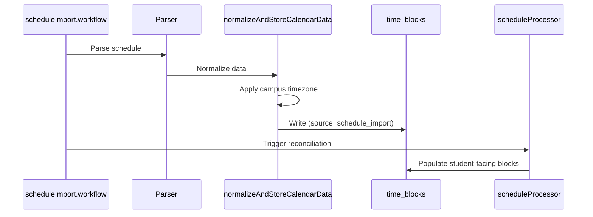
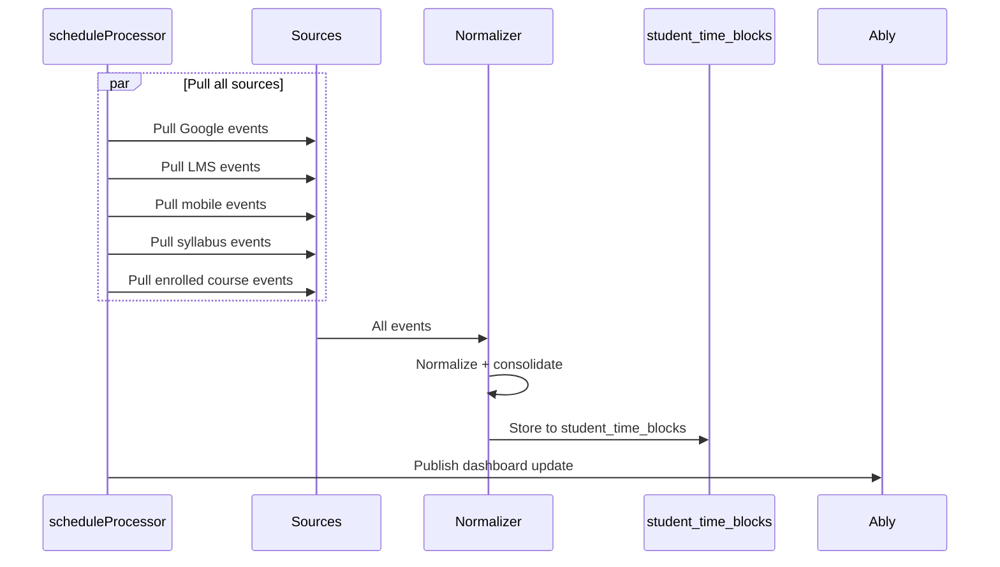
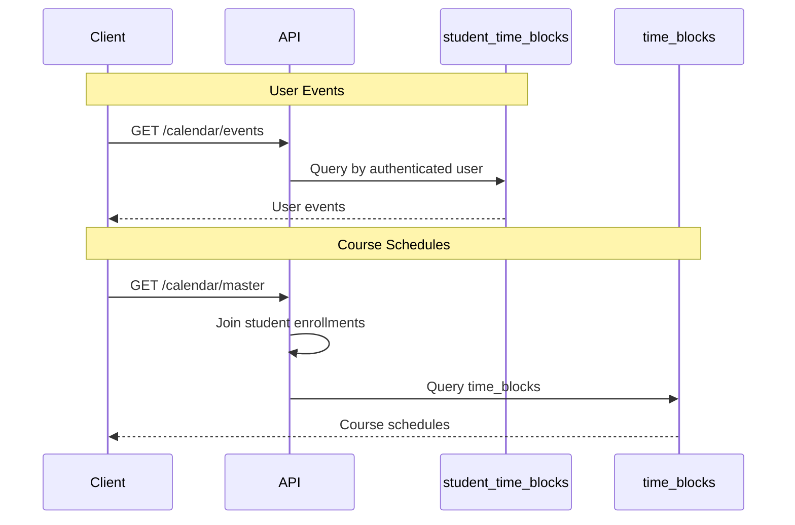

# SoT - Calendar, Time Blocks, Timezones

## Scope
- Calendar event normalization and storage for student + context schedules.
- Time block storage contracts (`time_blocks`, `student_time_blocks`) and API query paths.
- Timezone handling for calendar ingestion and UTC storage.

## Non-goals
- DayPlan generation and StudentWatcher orchestration (see their SoT docs).
- Planner/task scheduling logic (covered in SoT - Tasks, Assignments, Planner Blocks).
- UI rendering and formatting details for calendar widgets or schedule pages.

## Web Schedule Surface Alignment (Current vs Target)
- Current: Web Schedule reads v2 range events for the main timeline; legacy/mobile endpoints remain only for secondary class-detail deadline lookups.
- Target: Web Schedule uses a single v2 timeline source (calendar/time blocks) with composite legacy-only.
- Plan: `services/dormway-lockedin/docs/LOCKEDIN_WEB_OS_CONSISTENCY_PLAN.md`.

## Preference Alignment (Current vs Target)
- Current: Web stores display timezone in `preferences.calendar.displayTimezone`; schedule rules read timezone from account metadata. Quiet hours + working hours exist in preferences, but naming is inconsistent (`quietHours` vs `quiet_hours`), and Schedule UI does not yet consume `schedule.*`.
- Target: A canonical preference resolver normalizes aliases and exposes one schedule preference contract (working hours, quiet hours, display timezone, show weekends, first day of week) that Schedule UI + scheduling APIs both consume.
- Plan: add preference mapping + enforcement in schedule-rule materialization and availability checks (see `Plans/Smart-Schedule-Intent-Plan.md`).

## Invariants & Contracts
- `time_blocks` enforces exactly one owner: either `user_id` or `context_id` (check constraint in table DDL).
- `time_blocks` deduplicates by `source_type + source_id + (user_id or context_id)` (unique index).
- Calendar storage validates timezone strings and normalizes to UTC (`normalizeToProperUTC`); floating times without timezone are warned and treated as server-local.
- ICS all-day detection: `normalizeICSData` sets `all_day` via date-only ICS markers (`datetype: date`, `VALUE=DATE`), and Canvas assignment normalization preserves `assignment.all_day` to avoid timezone shifts.
- `student_time_blocks` is **currently a BASE TABLE** (not a view) in production Neon. It was intended to be a view alias to `v_student_calendar_events` but the migration creating the view did not convert the existing table. User-only sources (e.g., `enrolled`, schedule rules) write directly to this table. Data deletion operations must clear both `time_blocks` and `student_time_blocks`. API reads from `student_time_blocks` and filters by active lifecycle.
- API reads:
  - `GET /calendar/events` queries `student_time_blocks` for the authenticated user.
  - `GET /v2/students/me/calendar/events` is the web schedule canonical endpoint (v2 range wrapper over calendar events).
- `POST /v2/students/me/time-blocks` creates manual time blocks for web tasks/schedule.
- `DELETE /v2/students/me/time-blocks/:id` soft-deletes manual time blocks.
- `scheduleProcessor` must not return an empty enrolled schedule solely due to missing term metadata; it retries enrollment resolution using `term_id` and then unfiltered enrollments before giving up.
- `GET /v2/students/me/preferences` provides calendar timezone display preferences.
- `GET /calendar/master` joins student enrollments to `time_blocks` for course schedules.
- `POST /v2/students/me/schedule/intent` parses natural-language scheduling intent; it does not create blocks (UI must call time-blocks).
- `schedule_rules` stores recurring habit definitions; `POST /v2/students/me/schedule-rules` creates rules and materializes `student_time_blocks` with `metadata.schedule_rule_id`. `PATCH /v2/students/me/schedule-rules/:id` updates rule status/fields; `POST /v2/students/me/schedule-rules/:id/materialize` extends blocks.
- Schedule rules must honor canonical schedule preferences (working hours + quiet hours) unless the intent explicitly overrides them.

## Roadmap (Current)
- Add v2 equivalents for course schedules and personal blocks (`/v2/students/me/calendar/master`, `/v2/students/me/calendar/personal-blocks`) so web schedule can fully drop legacy mobile calendar routes.
- Storage routing rules:
  - `schedule_import` and `ics_lms` with both `userId` + `contextId` write to `time_blocks` (context-level).
  - `ics_lms` is additionally mirrored to `student_time_blocks` for now; `schedule_import` is not.
  - User-only sources write to `student_time_blocks`; context-only sources write to `time_blocks`.
- Add canonical preference resolver and enforce preference-aware scheduling windows + availability (quiet hours, working hours, display timezone).
- Decide calendar preference semantics: hidden calendars vs blocking for auto-scheduling.

## Key Flows (High-Level)

### Schedule Import

### Schedule Reconciliation

### API Calendar Reads

## Data Models / IDs / Terminology
- Normalized calendar event: `NormalizedCalendarEvent` (source_id, source_type, event_type, start/end ISO, timezone metadata).
- `time_blocks`: generic calendar table keyed by `source_type`/`source_id`, with `user_id` or `context_id`, and UTC `start_time`/`end_time`.
- `student_time_blocks` view: `id`, `user_id`, `start_time`, `end_time`, `label`, `type`, `status`, `source`, `metadata`, `is_deadline`, timestamps.
- Calendar sources include `google`, `ics_campus`, `ics_lms`, `ics_atlas`, `syllabus`, `academic`, `manual`, `schedule_import`, `canvas`, `system`.

## Key Files (Code + Docs)
- `services/engine/src/activities/calendar.activities.ts` (normalize + store calendar events; storage routing)
- `services/engine/src/services/calendarNormalization.service.ts` (normalization contract + source/event enums)
- `services/engine/src/activities/student.activities.ts` (legacy normalization in scheduleProcessor)
- `services/engine/src/workflows/scheduleImport.workflow.ts` (schedule import → calendar normalization)
- `services/engine/src/workflows/studentProcessor.workflow.ts` (`scheduleProcessor` orchestration)
- `services/engine/src/utils/timezone.utils.ts` (UTC storage guidance + timezone helpers)
- `services/engine/migrations/create_generic_time_blocks.sql` (`time_blocks` DDL + `v_student_calendar_events`)
- `infrastructure/database/migrations/099_create_student_time_blocks_view.sql` (Neon alias view)
- `infrastructure/database/migrations/20250820_fix_timezone_consistency.sql` (UTC timestamp guidance)
- `services/api-router/src/routes/mobile-routes.ts` (calendar API queries)
- `services/api-router/src/services/schedule-intent-classifier.ts` (smart schedule intent parsing)
- `services/api-router/src/services/schedule-rule-scheduler.ts` (rule creation + materialization)
- `services/dormway-lockedin/src/hooks/useCampusCurrentTerm.ts`
- `services/dormway-lockedin/src/app/dashboard/schedule/page.tsx`
- `services/dormway-lockedin/src/components/settings/PreferencesContent.tsx`
- `services/dormway-lockedin/src/contexts/TimezoneContext.tsx`
- `services/dormway-lockedin/docs/LOCKEDIN_WEB_OS_CONSISTENCY_PLAN.md`
- `obsidian-vault/DormWay/Engineering/Architecture/LockedIn Settings & Preferences Spec (Web).md`

## Update Checklist
- Adding a new calendar source: update `CalendarSourceType`, `normalizeCalendarData`, and storage mapping in `calendar.activities.ts`.
- Changing timezone conversion: update `normalizeToProperUTC` and ensure callers pass `options.timezone`.
- Changing `time_blocks` schema or constraints: update DDL migration and `v_student_calendar_events`/`student_time_blocks` views.
- Changing calendar API filters: update `mobile-routes.ts` queries and any downstream consumers.

## Recent Changes
- 2026-01-13: schedule import now verifies reconciliation and retries `scheduleProcessor` if enrolled class blocks are missing; enrollment lookup falls back to `term_id` and unfiltered enrollments when term metadata is absent.
- 2026-01-07: Documented that `student_time_blocks` is currently a BASE TABLE (not a view) in production; data deletion must clear both tables.
- 2026-01-07: Fixed schedule import to handle concatenated day abbreviations (MoWe, TuTh) in `calendarNormalization.service.ts`.
- 2026-01-06: Unified course color palette derivation for schedule event blocks across light/dark themes to preserve hue consistency.
- 2026-01-05: Web Schedule reads canonical schedule preferences (week start, time format, work hours) for its grid defaults.
- 2026-01-05: Schedule rules now resolve display timezone and placement constraints from canonical preferences (work hours + quiet hours).
- 2026-01-05: Documented preference alignment gaps + preference-aware scheduling requirements for Smart Schedule.
- 2026-01-04: Added schedule rules table + v2 schedule-rules endpoint to materialize recurring habits into `student_time_blocks`.
- 2026-01-04: Google Calendar connect now triggers an immediate schedule reconciliation; web schedule relies on v2 calendar events for personal calendar coverage.
- 2026-01-04: Documented smart schedule intent parsing as a stateless calendar/time-block helper endpoint.
- 2026-01-03: LockedIn schedule/inbox/timezone clients standardized on v2 calendar events, time-blocks, and preferences endpoints.
- 2026-01-02: Documented `/v2/students/me/calendar/events` as the web canonical timeline endpoint.
- 2026-01-01: Linked settings/preferences spec for timezone and schedule settings.
- 2025-12-28: Added v2 range calendar events endpoint for Schedule and removed composite dependency in LockedIn mainline.
- 2025-12-27: Added a lightweight campus term hook to hydrate timezone without loading the full semester aggregate.
- 2025-12-27: Schedule page beta framing now routes quick suggestions into Quick Add instead of placeholder toasts.
- 2025-12-27: Canvas ICS all-day events now honor `all_day` to keep timezone normalization correct.
- 2025-12-27: Added web Schedule alignment target and linked OS consistency plan.
- 2025-12-22: Populated and verified against current engine, migrations, and API routes.
