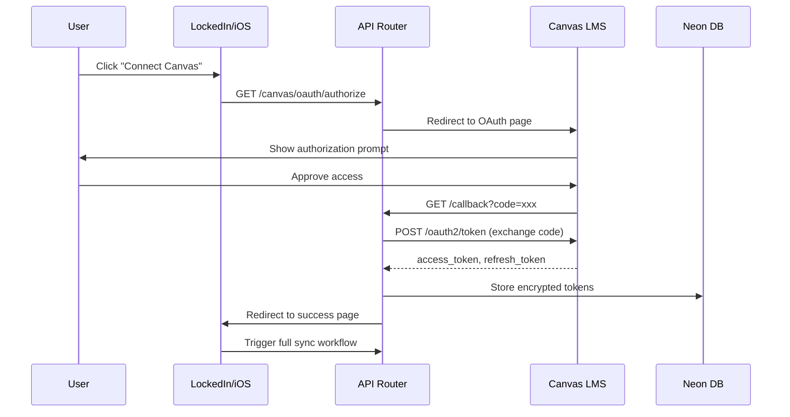
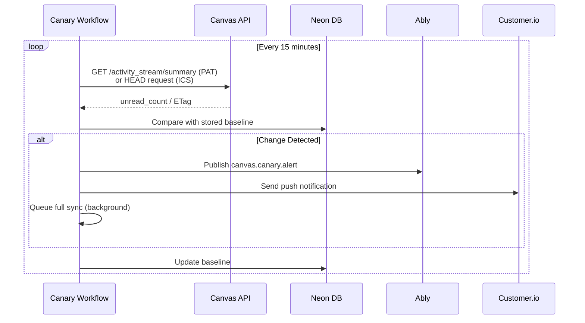
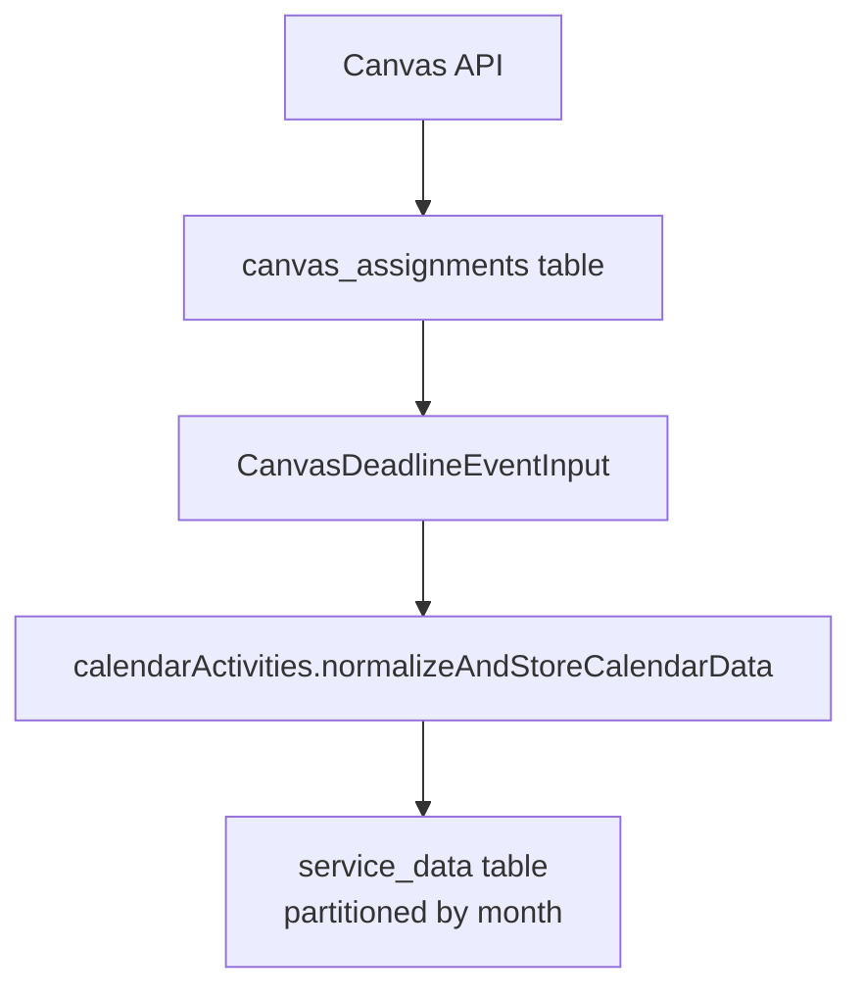
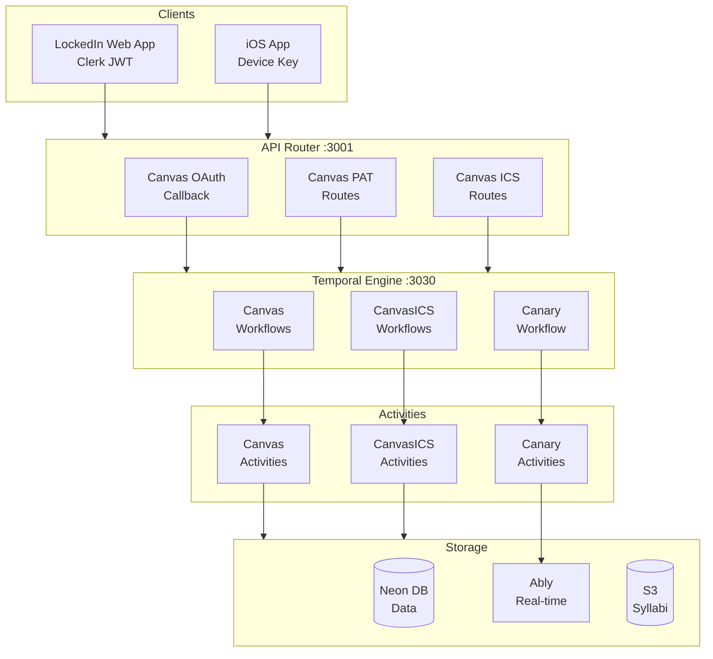

# Canvas Integration State of Things (SoT)

> **Last Updated**: 2026-01-03
> **Status**: Active
> **Owner**: Platform Team

## Overview

The DormWay Canvas integration is a sophisticated, multi-layered system supporting both **PAT (Personal Access Token)** and **OAuth2** authentication models, with a lightweight **ICS calendar feed** alternative. The system has evolved from scheduled polling (deprecated) to event-driven sync, focusing on cost efficiency and real-time responsiveness.

---

## 1. Canvas API Sync

### Authentication Methods

#### PAT (Personal Access Token)
- **File**: `services/engine/src/activities/canvas.activities.ts`
- **Implementation**: Direct `Authorization: Bearer ${token}` headers
- **Storage**: Encrypted in `canvas_accounts.access_token` (AES-256-GCM)
- **Key characteristic**: No `refresh_token` field in `canvas_accounts` table
- **Detection logic**: `checkCanvasConnectionType` checks for absence of `refresh_token`

#### OAuth2 Flow
- **File**: `services/api-router/src/routes/canvas-routes.ts`
- **Authorization**: `GET /canvas/oauth/authorize` → redirect to Canvas OAuth page
- **Callback**: `GET /canvas/oauth/callback` → exchange code for tokens
- **Token storage**: Both `access_token` AND `refresh_token` stored encrypted
- **Token refresh**: Refresh token is stored, but the Temporal sync path does not auto-refresh today.
- **Refresh implementation**: Legacy `services/canvas-sync/src/utils/canvasClient.ts` includes `refreshAccessToken()`; not wired into engine sync.



#### ICS Calendar Sync (PAT Alternative)
- **File**: `services/engine/src/activities/canvasICS.activities.ts`
- **URL Storage**: Plain HTTP/HTTPS URLs in `service_credentials.credentials` JSON
- **LMS Types Supported**: Canvas, Moodle, Blackboard, Google Classroom, Brightspace, Schoology
- **Connection type detection**: ICS marked when `canvas_instance_id` starts with `'ics-'` or `service_credentials` has `ics_lms`

### API Endpoints Called

| Endpoint | Notes |
|----------|-------|
| `GET /api/v1/courses` | Active enrollments, includes term/students/enrollments |
| `GET /courses/{id}/assignments` | Includes score_statistics |
| `GET /courses/{id}/assignments/{id}/submissions/self` | Submission details |
| `GET /calendar_events` | Class meetings (type='event') |
| `GET /courses/{id}/discussion_topics` | Announcements only |
| `GET /courses/{id}/users` | Classmates |
| `GET /users/self/activity_stream/summary` | Canary check |

### Rate Limiting & Error Handling

**Temporal Retry Policy** (canvas sync workflows):
```typescript
{
  initialInterval: '10 seconds',
  maximumInterval: '1 minute',
  backoffCoefficient: 2,
  maximumAttempts: 3
}
```

**Page Size Configuration** (DORM-693):
- Configurable via `system_config` table
- Default: 100 items per page
- Runtime resolution: `getCanvasPageSize()` function

**Error Response Handling** (engine sync):

| Status | Description | Action | File Location |
|--------|-------------|--------|---------------|
| 429 | Rate Limited | Temporal retry policy handles retries | canvasSync.workflow.ts (proxy retry config) |
| 404 | Not Found | Submission fetch returns null and continues | canvas.activities.ts (`fetchCanvasSubmission`) |
| 401/403 | Unauthorized/Forbidden | No auto-refresh in engine; workflow fails and requires reconnect | canvas.activities.ts |

### Data Transformation

**Course Code Normalization** (line 374-397):
- Parses `course_code`, `sis_course_id`, or `name` field
- Extracts primary tokens (subject + number)
- Example: `"ASTRO 104 001"` → `"ASTRO 104"`

**Term Normalization** (line 421-472):
- Uses `normalizeTermId()` function
- Canonical format: `fall_2025` (lowercase with underscore)
- Fallback chain: campus config → course term → current year calculation

---

## 2. Canvas ICS Sync

### ICS URL Handling & Parsing

**URL Validation** (line 318-345 canvasICS.activities.ts):
- Must be HTTPS/HTTP protocol
- Must end with `.ics` OR contain `calendar`/`feeds` in path
- Returns `{ valid: boolean; error?: string }`

**ICS Feed Fetching** (line 141-189):
- Timeout: 30 seconds
- Max content: 10MB
- Validates response contains `BEGIN:VCALENDAR`

**ICS Parsing** (line 539-681):
- **Parser**: `node-ical` (native JavaScript parser)
- **LMS-specific parsers**:
  - **Canvas**: `"Assignment [COURSE CODE SECTION TERM]"` format
  - **Moodle**: `"COURSE CODE: Assignment"` or `"COURSECODE - Assignment"`
  - **Generic**: Tries Canvas first, then Moodle

### Timezone Handling

**All-Day Event Detection** (line 641-671):
```typescript
// Flag detection
ev.datetype === 'date' || ev.start?.dateOnly === true
```

**Critical Issue (PR #671)**:
- Canvas ICS uses `VALUE=DATE` format parsed as midnight UTC
- Problem: Shows as previous day in negative UTC offset timezones
- **Fix**: All-day events converted to `23:59:59Z` to ensure correct date display

**Timezone Resolution** (line 125-176):
Hierarchy: Course → Campus → Student → Default (`America/New_York`)

---

## 3. Real-time Sync & Change Detection

### Canary Pattern Architecture

**File**: `services/engine/src/workflows/canvasSync.workflow.ts` (lines 529-767)

**Concept**: Lightweight background monitoring for Canvas changes without full syncs



| User Type | Check Method | Cost | Polling |
|-----------|--------------|------|---------|
| PAT | Activity Stream summary | ~1 API call | 15 min |
| ICS | HEAD request (ETag) | ~$0.0001 | 15 min |

**PAT Users - Activity Stream Check** (line 1971-2077):
- Compares unread count to stored baseline
- Metadata in `canvas_accounts.metadata.activity_stream_*` fields

**ICS Users - ETag/Last-Modified Check** (line 2089-2210):
- HEAD request only (no content download)
- ETag storage: `service_credentials.credentials.ics_etag`
- Fallback: SHA-256 checksum if ETag unavailable

### Temporal Workflows

| Workflow | Trigger | Description |
|----------|---------|-------------|
| `canvasAppOpenSyncWorkflow` | App open | 15-min cooldown, validates feed before sync |
| `canvasOnDemandSyncWorkflow` | Pull-to-refresh | No cooldown, routes to ICS or PAT |
| `canvasFullSyncWithSyllabiWorkflow` | OAuth callback | Includes automatic syllabus fetching |
| `canvasCanaryWorkflow` | Background | Every 15 min, sends notifications on changes |

**Deprecated**: `canvasScheduledSyncWorkflow` (line 200-215)
- Ran every 30 minutes in infinite loop
- Cost at 100K users: **288M API calls/day**
- Now exits after single sync (backwards compatibility only)

### Sync Frequency

| Event | Cooldown | Notes |
|-------|----------|-------|
| App Open Sync | 15 minutes | After sync, must wait before next |
| Pull-to-Refresh | None | Bypasses cooldown |
| Canary Poll | 15 minutes | Resets every 96 iterations (~24h) |

---

## 4. Data Integration & DayPlan Flow

### Canvas → DayPlan Pipeline

**File**: `services/engine/src/activities/canvas.activities.ts` (line 904-926)



### Class Meeting Integration (line 1651-1721)

- Fetches `calendar_events` with `type='event'` (not assignments)
- Normalized as `source_type: 'ics_lms'`
- Dual storage:
  - `time_blocks` (course-level enrichment)
  - `student_time_blocks` (student-specific view)

### Course Enrollment Detection

**File**: `services/engine/src/activities/canvas.activities.ts` (line 548-557)

```typescript
createCourseEnrollments(studentContextId, courseContextIds, organizationId, { termId, termYear })
```

Creates relationships in `context_dependencies` table:
- `dependency_type`: `'enrolled_in'`
- Parent: `student_context_id`
- Child: `course_context_id`

---

## 5. Sharp Edges & Known Issues

### Unimplemented LMS Parsers

| LMS | Status | Fallback | Linear Issue |
|-----|--------|----------|--------------|
| Blackboard | ❌ Not implemented | Canvas format fallback | - |
| Google Classroom | ❌ Not implemented | Canvas format fallback | - |
| Brightspace | ⚠️ Generic parser | Generic fallback | - |
| Schoology | ⚠️ Generic parser | Generic fallback | - |

**Code References**:
- `canvasICS.activities.ts:476` - "TODO: Implement when we get real Blackboard ICS examples"
- `canvasICS.activities.ts:491` - "TODO: Implement when we get real Google Classroom ICS examples"

### Timezone Handling (Resolved)

| Issue | Status | Fix | PR |
|-------|--------|-----|-----|
| All-day events show as previous day in negative UTC zones | ✅ Fixed | Convert to 23:59:59Z | PR #671 |

**Timezone Resolution Hierarchy** (working as designed):
```
Course → Campus → Student → Default (America/New_York)
```

This is intentional fallback behavior, not a bug.

### Silent Failures & Graceful Degradation

| Scenario | Behavior | Logging | Risk |
|----------|----------|---------|------|
| ICS credentials missing feed URL | Returns null, logs warning | `logger.warn` | User sees no assignments |
| Canvas account not found | Skips sync, logs warning | `logger.warn` | Silent no-op |
| Missing campus parent context | Throws error, workflow fails | `logger.error` | Full sync failure |
| Course context creation fails | Skips course, continues | `logger.warn` | Partial data |
| Assignment without course context | Skips assignment | `logger.warn` | Missing assignments |

### Data Consistency Edge Cases

| Scenario | Handling | Code Location |
|----------|----------|---------------|
| Empty/invalid course codes | Falls back to `CANVAS-{id}` | line 382 |
| ICS-only users (no Canvas account) | Skip submission fetching | line 864 |
| Duplicate syllabi | First-upload-wins, skip reprocess | line 1138 |
| Multi-section courses | De-duplicates by course context ID | line 581 |
| Course with no term ID | Fallback to current academic year | line 469 |

### Rate Limiting & API Constraints

**Canvas API Rate Limits**:

| Limit Type | Value | Response | Handling |
|------------|-------|----------|----------|
| Burst | ~150 req/min/user | 429 or 403 | Exponential backoff |
| Sustained | Lower rate | 429 | Temporal retry policy |
| Page size | 100 (configurable) | - | DORM-693: `getCanvasPageSize()` |

**ICS ETag Optimization**:

| Scenario | Cost | Handling |
|----------|------|----------|
| 304 Not Modified | $0 | Skip content download |
| ETag missing | Higher | SHA-256 checksum fallback |
| File > 10MB | Blocked | Prevents memory bloat |

### Deprecated Code

| Code | Status | Replacement | Notes |
|------|--------|-------------|-------|
| `canvasScheduledSyncWorkflow` | ⚠️ Deprecated | `canvasAppOpenSyncWorkflow` | Kept for backwards compatibility |
| Local `findExistingCourseContext()` | ❌ Removed | DORM-455 centralized function | See line 105 |

**Cost at Scale (Why Deprecated)**:
Scheduled sync ran every 30 min in infinite loop → **288M API calls/day at 100K users**

### Known Linear Issues

| Issue | Description | Status |
|-------|-------------|--------|
| DORM-430 | Canvas ICS sync implementation | ✅ Complete |
| DORM-455 | Centralized course context matching | ✅ Phase 1 Complete |
| DORM-473 | ICS-only path course context linking | ✅ Fixed |
| DORM-693 | Configurable Canvas page size | ✅ Implemented |
| DORM-777 | Unify term ID contract | ✅ Fixed |
| DORM-779 | Term year in enrollments | ✅ Fixed |
| DORM-791 | Duplicate syllabus prevention | ✅ Fixed |

### Workflow History Bloat

**Problem**: Long-running canary workflow accumulates Temporal history events.

**Solution**: `continueAsNew` every 96 iterations (~24 hours)

```typescript
// canvasSync.workflow.ts:526
const MAX_ITERATIONS = 96;

// Reset iteration counter to prevent history bloat
if (iteration >= MAX_ITERATIONS) {
  await continueAsNew<typeof canvasCanaryWorkflow>(userId, 0);
}
```

### OAuth Token Refresh Edge Cases

| Scenario | Behavior | Risk |
|----------|----------|------|
| Refresh token expired | Full re-auth required | User must reconnect Canvas |
| Canvas returns new refresh token | Stored, old token replaced | None |
| 401 during sync | Auto-retry with refreshed token | May fail if token invalid |
| PAT user gets 401 | No refresh possible | User must generate new PAT |

---

## 6. Key Database Tables

| Table | Purpose | Key Fields |
|-------|---------|------------|
| `canvas_accounts` | PAT/OAuth tokens (encrypted) | `access_token`, `refresh_token`, `sync_status` |
| `canvas_courses` | Course ID → context mapping | `course_context_id`, `course_code` |
| `canvas_assignments` | Synced assignments | `course_id`, entire Canvas JSON |
| `canvas_submissions` | Student submissions | Lifecycle status, grade tracking |
| `service_credentials` | ICS feed URLs | `credentials` (JSON), `ics_etag` |

---

## 7. Real-Time Communication

### Ably Publishing

**Channels**: `user:${userId}:updates`

| Event | Trigger |
|-------|---------|
| `canvas.sync.complete` | Full sync finished |
| `canvas.assignments.updated` | Assignment changes |
| `canvas.grades.updated` | Grade changes |
| `canvas.canary.alert` | Change detected |

### Customer.io Push

- Template ID: `'canvas_canary_alert'`
- Payload: `{ title, body, changeType, timestamp }`
- Delivery: APNS/FCM for lock-screen alerts

---

## 8. Architecture Diagram



---

## 9. Summary

The Canvas integration represents a **sophisticated, cost-optimized system** that has evolved from inefficient polling to intelligent event-driven sync.

### Key Strengths

1. **Multi-auth support** (PAT, OAuth2, ICS)
2. **Canary pattern** for lightweight change detection
3. **Comprehensive error handling** with exponential backoff
4. **Timezone-aware all-day event handling** (PR #671)
5. **Unified course context matching** across all data sources
6. **Dual-storage pattern** for rich calendar data
7. **Real-time notifications** via Ably + Customer.io

### Known Gaps

- Blackboard ICS parser: Not implemented (uses generic fallback)
- Google Classroom ICS parser: Not implemented (uses generic fallback)
- Brightspace/Schoology: Use generic parser

---

## 10. Roadmap Alignment

- Consolidate Canvas + Google status checks into `GET /v2/students/me/integrations/status` per the v2 standardization roadmap.
- Keep existing OAuth/PAT/ICS flows unchanged; this endpoint only surfaces connection state for clients.
- Tracking: `obsidian-vault/DormWay/Engineering/Technical/API/V2-Standardization-Roadmap (Current).md`.

---

## Related Documents

- DayPlan V2 - State of Things
- Canvas ICS Sync Implementation
- Temporal Workflow Patterns
