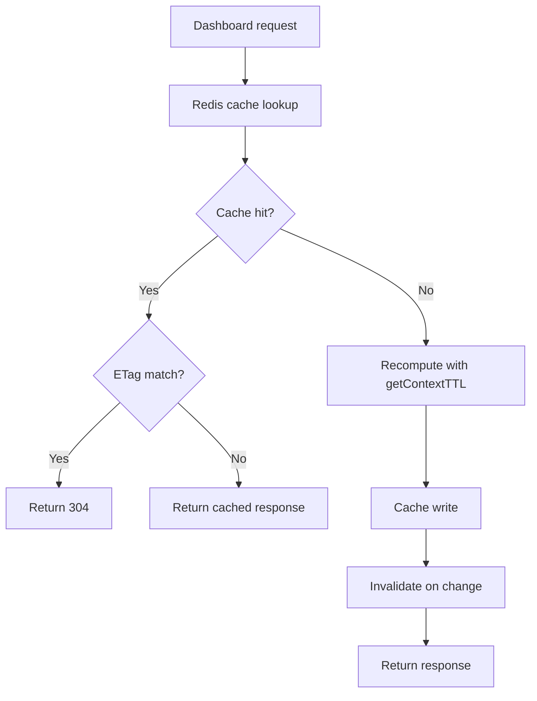
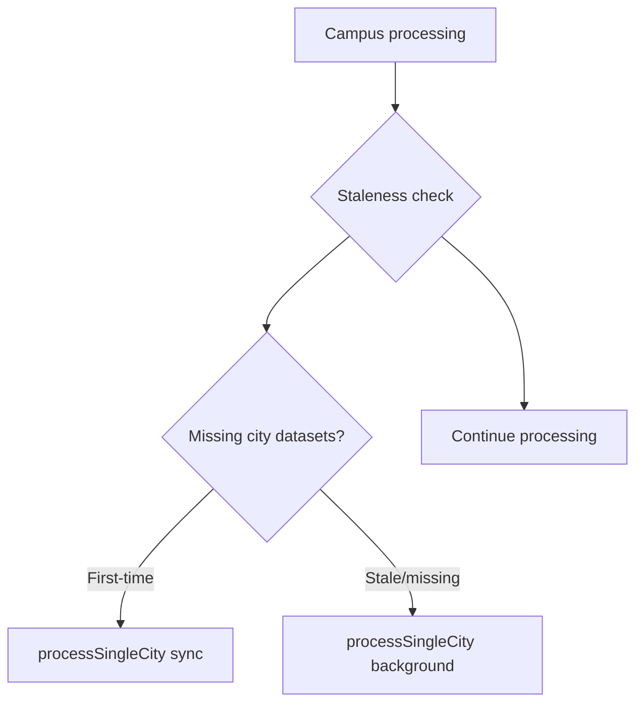
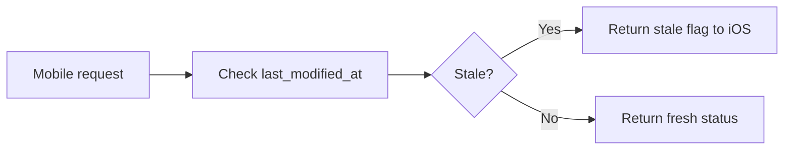
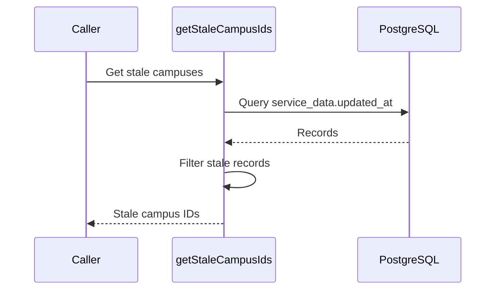
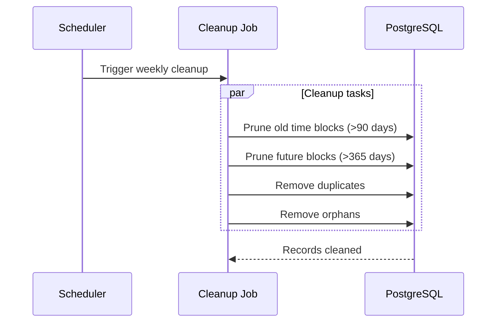
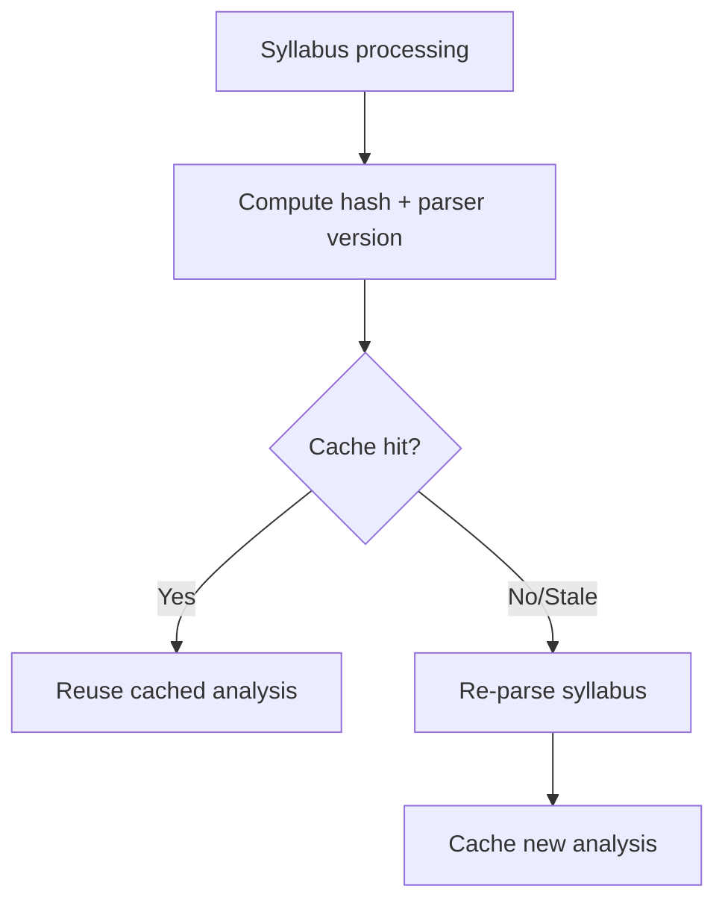
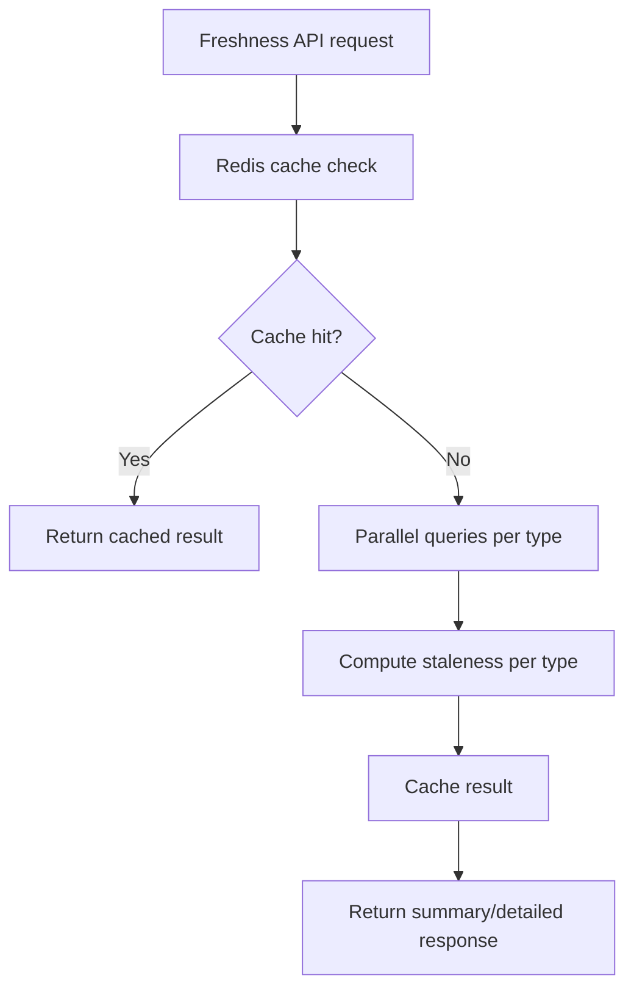

# SoT - Data Freshness & Validity Rules

## Scope
- Cache TTL and staleness rules that gate dashboard responses and context-driven data.
- Freshness checks for campus/city sync status and campus enrichment data.
- Data retention/cleanup rules that prune invalid time blocks.
- Cache validity rules for syllabus parsing and service_data recency queries.

## Non-goals
- Sync orchestration scheduling and cadence (see SoT - Sync Orchestration & Schedules).
- Calendar/time block normalization logic (see SoT - Calendar, Time Blocks, Timezones).
- Notification delivery freshness or BrainGains/RAG ingestion rules.

## Invariants & Contracts
- Dashboard v1 composite caching uses Redis keys `dashboard:v1:${userId}:${tab}:${context}` plus `:${startDate}:${endDate}` when date range is provided; TTL uses `getContextTTL(context)` and `Cache-Control: private, no-cache` is always set.
- Dashboard ETags are returned on cache hits and used for 304 responses when `If-None-Match` matches; cache invalidation publishes `resource: 'dashboard'` when ETag changes.
- Redis single-flight uses a 5-second lock; if a refresh is requested while the lock is held, stale cache may be served with `X-Cache-Stale: true`.
- Campus dashboard caching uses `dashboard:campus:${campusId}:${userContext}` with a 1-hour TTL.
- DayPlan data is stale if `lastUpdated` is missing or older than 24 hours; stale DayPlan data is excluded from schedule fallbacks and DayPlan widget construction.
- City staleness is `contexts.next_sync_at < NOW()`; missing city rows, null `next_sync_at`, or errors are treated as stale.
- Mobile campus sync status is stale if `campus_configs.last_modified_at` is missing or older than 24 hours.
- Campus enrichment staleness is computed from `service_data.updated_at` for `service_name='campus_enrichment'` and `data_type IN ('campus_metadata','academic_calendar')`; null or older-than-threshold rows are stale.
- Time block cleanup deletes blocks older than 90 days in the past or more than 365 days in the future by default; duplicate cleanup de-dupes by `(start_time, end_time, title, source_type, type)`.
- Cache TTLs: `getContextTTL` falls back to 300s for unknown contexts; `CONTEXT_CACHE_TTL` maps API context types to fixed TTLs; `DASHBOARD_TTL` provides default dashboard cache durations.
- Engine caches: Preferences/Campus/Term/Student factories use 600s TTL; SystemConfig uses 60s TTL.
- Syllabus cache validity uses SHA-256 hash of raw PDF + parser version; parser version mismatch forces a cache miss and reparse.
- Latest `service_data` reads use `fetched_at DESC` (or `created_at DESC` fallback for processed syllabi) and honor dev_tag filtering when configured.
- Global Freshness API: `FreshnessService.getFreshness()` aggregates per-type freshness using parallel queries; cache keys include query options suffix for isolation; user scope uses 30s TTL, aggregate scopes use 60s TTL.
- Freshness thresholds are defined in `FRESHNESS_THRESHOLDS`: schedule (5m), headsup (5m), tasks (15m), courses (15m), weather (30m), dayplan (6h).
- Stale reasons are: `never_synced` (null timestamp), `threshold_exceeded` (age > maxAge), `sync_failed` (last sync errored), `source_unavailable` (service down), or `null` (fresh).

## Key Flows (High-Level)

### Dashboard Request Flow



### Campus Processing Staleness



### Mobile Campus Sync Status



### Campus Enrichment Selection



### Weekly Cleanup Flow



### Syllabus Processing Cache



### Global Freshness API



## Data Models / IDs / Terminology
- `contexts.next_sync_at`: authoritative staleness boundary for city sync freshness.
- `campus_configs.last_modified_at`: campus sync freshness timestamp; `isStale` when missing or older than 24h.
- `service_data.fetched_at` / `service_data.updated_at`: recency for service_data queries and campus enrichment freshness checks.
- `dayPlan.lastUpdated`: freshness guard for DayPlan timeline usage.
- `getContextTTL(context)` and `CONTEXT_CACHE_TTL[type]`: cache lifetimes used for dashboard and context-related caching.

## Global Freshness API (Implemented)
Status: Implemented (mainline).

### Endpoint
- `GET /v2/students/me/freshness` — User's data freshness (authenticated)
- `GET /v2/students/:id/freshness` — Specific user's freshness (admin only)
- `GET /v2/freshness` — Admin scope endpoint for campus/city/system freshness

### Parameters
- `scope`: `user` | `campus` | `city` | `system` (default: `user`)
- `scopeId`: required for `campus` and `city`; ignored for `user`
- `types`: comma list (default: `schedule,tasks,courses,headsup,weather,dayplan`)
- `format`: `summary` | `detailed` (default: `summary`)
- `sources`: comma list (optional) `canvas,gcal,planner,manual,weather_api`
- `include`: comma list (optional) `lastUpdated,isStale,maxAgeSeconds,staleReason,counts`
- `strict`: `true|false` (default: `true`) missing timestamps treated as stale
- `thresholds`: JSON map override (admin only) `{"schedule":300,"tasks":900}`

### Response (Summary)
```json
{
  "scope": "user",
  "generatedAt": "2025-12-25T19:13:00Z",
  "freshness": {
    "schedule": { "lastUpdated": "...", "isStale": false, "maxAgeSeconds": 300, "reason": null },
    "tasks":    { "lastUpdated": "...", "isStale": true,  "maxAgeSeconds": 900, "reason": "canvas_sync_stale" },
    "courses":  { "lastUpdated": "...", "isStale": false, "maxAgeSeconds": 900, "reason": null },
    "headsup":  { "lastUpdated": "...", "isStale": false, "maxAgeSeconds": 300, "reason": null },
    "weather":  { "lastUpdated": "...", "isStale": false, "maxAgeSeconds": 1800, "reason": null }
  }
}
```

### Response (Detailed)
- Includes `sourceBreakdown` and optional counts per type.
- Example fields: `sourceBreakdown.canvas.lastUpdated`, `sourceBreakdown.gcal.isStale`.

### Default Thresholds (Draft)
- Schedule: 5 minutes
- HeadsUp: 5 minutes
- Tasks: 15 minutes
- Courses: 15 minutes
- Weather: 30 minutes
- DayPlan: 6 hours

### Scope Rules
- `user` scope is derived from auth; no `scopeId` allowed.
- `campus`/`city`/`system` scope requires admin role or service token.
- `/v2/students/:id/freshness` requires admin role or service token and ignores `scope`/`scopeId`, always resolving to the target student.
- If `types` omitted, defaults should reflect the Home V2 widget set.

### Intended Usage
- UI: surface a single System Health HeadsUp card when any core type is stale.
- Ops: campus/city/system scope for monitoring without user auth context.

## Related Status Endpoint (Existing)
Setup readiness is tracked separately from freshness. This endpoint should not be treated as a freshness signal, but it is used to decide which setup CTAs to show.

- `GET /api/v2/setup/status` (gateway alias: `/v2/students/me/setup-status`)

Response:
```json
{
  "success": true,
  "data": {
    "flags": {
      "schedule_uploaded": true,
      "canvas_connected": false,
      "syllabi_uploaded": false,
      "integrations_connected": false
    }
  }
}
```

## Key Files (Code + Docs)

### Global Freshness API (NEW)
- `services/shared/dormway-core/src/domains/freshness/freshness.types.ts` — Types, thresholds, cache keys
- `services/shared/dormway-core/src/domains/freshness/freshness.service.ts` — FreshnessService with per-type freshness methods
- `services/api-router/src/routes/v2/freshness.routes.ts` — Admin scope endpoints (`GET /v2/freshness`)
- `services/api-router/src/routes/v2/students.routes.ts` — User freshness endpoint (`GET /v2/students/me/freshness`)

### Dashboard & Cache
- `services/api-router/src/routes/dashboard-routes.ts` (Redis cache keys, ETag handling, invalidate endpoint, campus dashboard TTL)
- `services/api-router/src/services/dashboard-composite-transformer.ts` (DayPlan staleness check)
- `services/api-router/src/routes/mobile-campus-sync-routes.ts` (campus sync staleness logic)
- `services/api-router/src/routes/setup-v2.ts` (setup status flags)

### Engine & Workflows
- `services/engine/src/activities/city.activities.ts` (city staleness via `next_sync_at`)
- `services/engine/src/workflows/campusProcessor.workflow.ts` (stale/missing city dataset triggers)
- `services/engine/src/activities/campusEnrichment.activities.ts` (stale campus enrichment selection)
- `services/engine/src/activities/timeBlockCleanup.activities.ts` (retention and duplicate cleanup)
- `services/engine/src/index.ts` (engine cache TTL initialization)
- `services/engine/src/services/syllabusHasher.ts` (hash + parser version cache validity)
- `services/engine/src/services/auroraDb.ts` (latest service_data selection)

### Shared Core
- `services/shared/dormway-core/src/adapters/cache/ttl-constants.ts` (TTL constants, `getContextTTL`)
- `services/api-router/src/interfaces/context.ts` (`CONTEXT_CACHE_TTL` by context type)

## Update Checklist
- Changing dashboard cache TTLs or key composition: update `dashboard-routes.ts` and `ttl-constants.ts`.
- Changing DayPlan staleness thresholds: update `dashboard-composite-transformer.ts` and validate widget fallback behavior.
- Changing city/campus staleness rules: update `city.activities.ts` and `mobile-campus-sync-routes.ts`; confirm campus processor behavior.
- Changing campus enrichment freshness criteria: update `campusEnrichment.activities.ts` query and any downstream workflows.
- Changing cleanup horizons: update `timeBlockCleanup.activities.ts` and any scheduler config that invokes cleanup.
- Changing service_data recency ordering: update `auroraDb.ts` and any consumers that depend on newest data.
- Changing freshness thresholds: update `FRESHNESS_THRESHOLDS` in `freshness.types.ts`.
- Adding new freshness data types: add method to `FreshnessService`, update `FreshnessType` union, add to `FRESHNESS_THRESHOLDS`.
- Changing freshness cache TTLs: update `FRESHNESS_CACHE_TTL` in `freshness.types.ts`.

## Recent Changes
- 2026-01-01: Verified freshness endpoints + core service in mainline; updated status notes.
- 2025-12-22: Populated with code-backed freshness contracts, cache TTLs, and cleanup rules.
- 2025-12-25: Added proposed global freshness API contract (later implemented).
- 2025-12-25: Documented setup status endpoint as a related (non-freshness) signal.
- 2025-12-25: **Implemented Global Freshness API** (now in mainline):
  - Created `FreshnessService` in `@dormway/core` with per-type freshness checks
  - Added `GET /v2/students/me/freshness` endpoint for user scope
  - Added `GET /v2/freshness` endpoint for admin scopes (campus/city/system)
  - Redis caching with 30s TTL for user scope, 60s for aggregate scopes
  - Summary and detailed response formats with source breakdown
