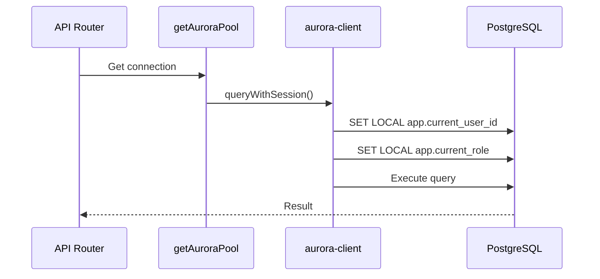
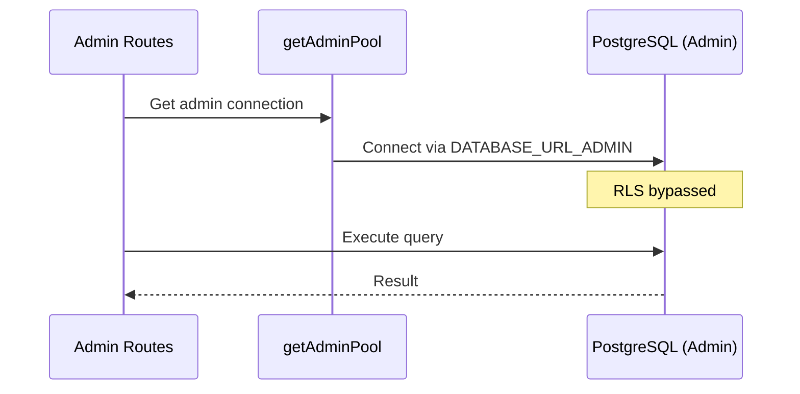
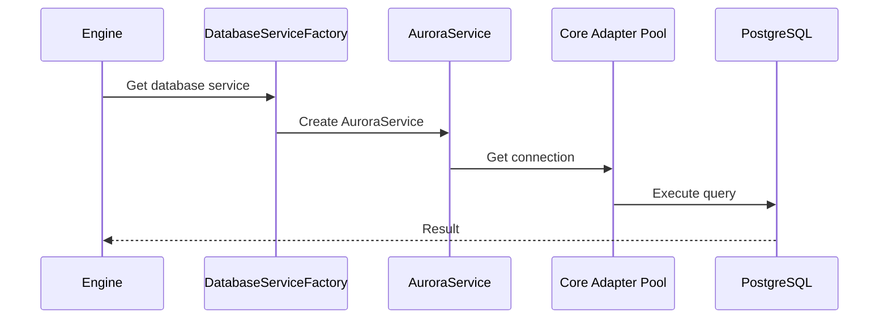
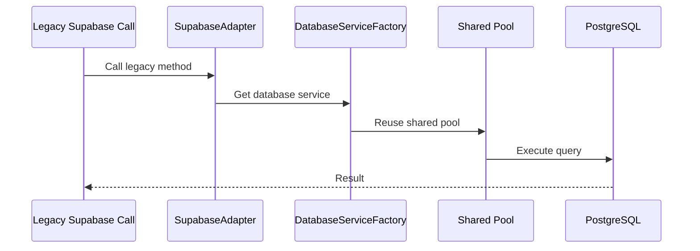
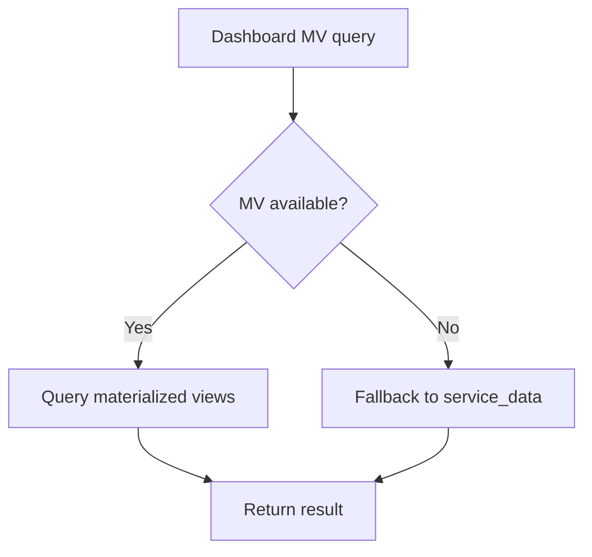
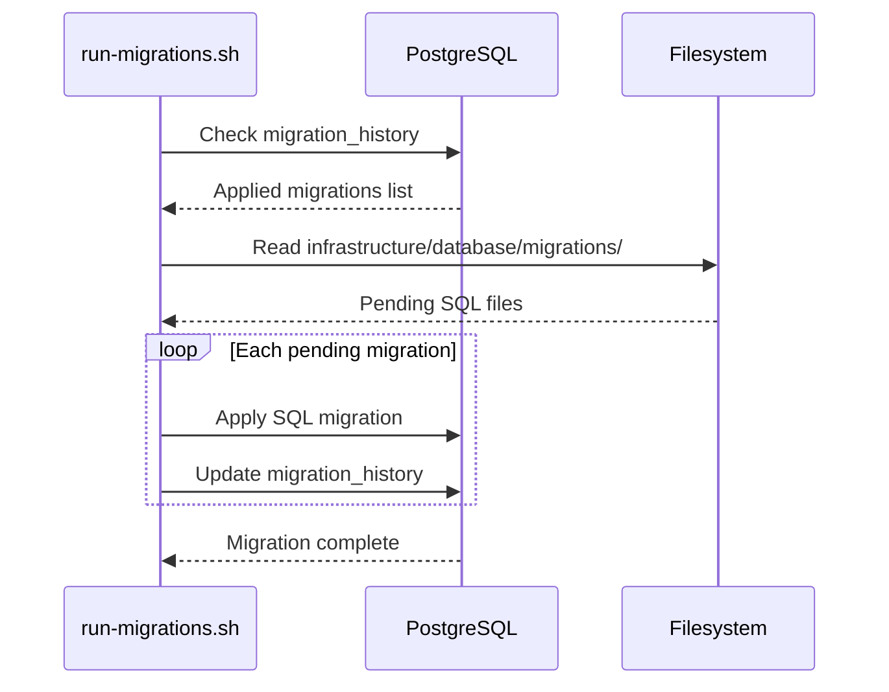

# SoT - Database Model & Access Patterns (Neon)

## Scope
- PostgreSQL connectivity and pooling for platform services (Neon via `DATABASE_URL` and admin via `DATABASE_URL_ADMIN`).
- Core adapters/wrappers used by api-router and engine for DB access and RLS session handling.
- Canonical tables/views referenced across services (contexts graph, service_data, schedule/time blocks, materialized views).
- Migration runner and tracking contracts.

## Non-goals
- Full schema or column-level documentation for every table.
- Data model or feature behavior outside DB access contracts.
- Infra provisioning details for Neon or Supabase services.

## Invariants & Contracts
- Core Postgres adapter requires `DATABASE_URL` with `postgres://` or `postgresql://` and uses a pooled connection (default max 20, 30s idle, 2s connect timeout).
- SSL is auto-detected: Neon/Railway hosts use `rejectUnauthorized: false`, local hosts disable SSL, other hosts use standard SSL.
- RLS session queries set `app.current_user_id`, `app.current_role`, and optional `app.current_context_id` via `SET LOCAL` inside a transaction; roles are limited to `authenticated`, `admin`, `demo`, `service`.
- api-router standard pool uses `DATABASE_URL` (RLS enforced); admin pool uses `DATABASE_URL_ADMIN` to bypass RLS and falls back to standard pool if not configured.
- engine uses `DATABASE_URL_ADMIN` (RLS bypass) with fallback to `DATABASE_URL`.
- Supabase client is still used for some tables (e.g., `user_devices`, `app_device_tokens`) via `SUPABASE_URL` + service role key.
- Migration runner uses Neon connection strings (prefers `DATABASE_URL_ADMIN`) and records applied migrations in `migration_history` with checksums.
- Adapter migration status checks default core tables: `accounts`, `roles`, `contexts`, `external_services`, `config`, `accounts_memberships`, `role_permissions`, `user_preferences`.
- Dashboard MV access is gated by `DASHBOARD_USE_MV`; when enabled it queries `mv_recent_assignments`, `mv_recent_schedule`, and `mv_dayplan_blocks`, otherwise falls back to `service_data`.

## Key Flows (High-Level)

### API Router DB Access

### Admin DB Access

### Engine DB Access

### Legacy Supabase Interfaces

### Dashboard Materialized View Queries

### Database Migrations

## Data Models / IDs / Terminology
- `contexts` and `context_dependencies`: canonical context graph tables referenced by api-router and engine.
- `service_data`: canonical ingestion/output store keyed by `method` and `fetched_at`.
- `time_blocks` and `student_time_blocks`: schedule/time block contracts used for dashboard and reminders.
- `engine_user_notification_preferences`: notification channel and quiet-hours preferences used by engine.
- `app_device_tokens` and `user_devices`: device token storage (queried via Supabase client).
- `migration_history`: migration tracking table used by the migration runner.
- Materialized views: `mv_recent_assignments`, `mv_recent_schedule`, `mv_dayplan_blocks`.

## Key Files (Code + Docs)
- `services/shared/dormway-core/src/adapters/database/postgres.adapter.ts` (Postgres adapter, SSL auto-detect, RLS session helpers)
- `services/shared/dormway-core/src/adapters/database/types.ts` (SessionContext roles, adapter contract)
- `services/shared/dormway-core/src/database/connection-manager.ts` (Neon connection pool helper)
- `services/api-router/src/services/auroraDb.ts` (standard/admin pools, admin fallback)
- `services/api-router/src/services/aurora-client.ts` (RLS session queries, legacy wrapper)
- `services/api-router/src/services/amplitude-trait-service.ts` (time_blocks access for schedule traits)
- `services/engine/src/services/auroraDb.ts` (engine pool, admin connection selection)
- `services/engine/src/services/database.ts` (DatabaseServiceFactory -> AuroraService)
- `services/engine/src/services/supabaseAdapter.ts` (legacy Supabase interface over Aurora)
- `services/api-router/src/services/supabase-client.ts` + `services/api-router/src/config/index.ts` (Supabase service role client)
- `services/api-router/src/services/dashboard-mv-queries.ts` (materialized view access + service_data fallback)
- `scripts/database/run-migrations.sh` + `infrastructure/database/migrations/` (migration runner + SQL source)

## Update Checklist
- Adding or changing schema: add SQL in `infrastructure/database/migrations`, run `scripts/database/run-migrations.sh`, and ensure `migration_history` tracking stays intact.
- Adding a new RLS-sensitive query: use `queryWithSession()` and ensure the session variables are set for the role you expect.
- Changing admin access rules: update `DATABASE_URL_ADMIN` usage in `services/api-router/src/services/auroraDb.ts` and `services/engine/src/services/auroraDb.ts`.
- Adding a new materialized view for dashboard: add migration + update `dashboard-mv-queries.ts` fallback logic.
- Changing DB connection behavior/SSL: update `postgres.adapter.ts` and `connection-manager.ts`.

## Recent Changes
- 2025-12-22: Populated with Neon access patterns, RLS session contracts, and migration workflow.
