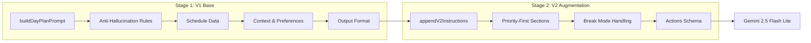
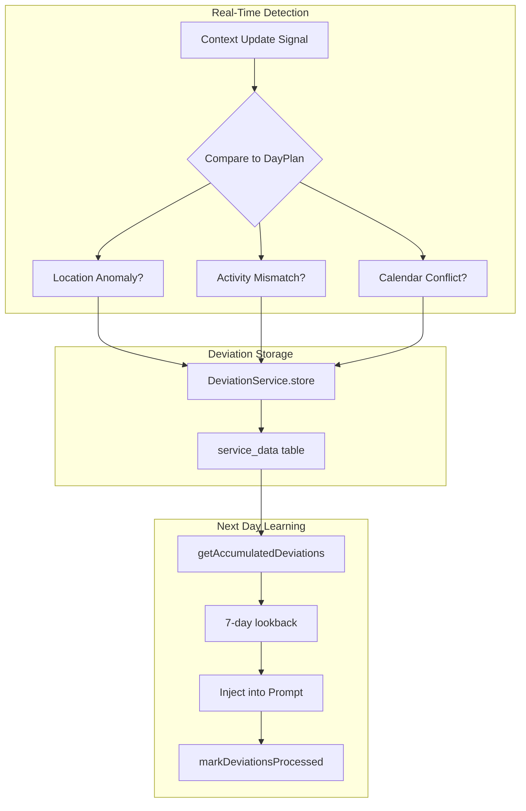
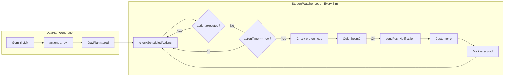

# SoT - DayPlan V2

## Executive Summary

- **DayPlan** is the core daily intelligence artifact generated at **5 AM user time**
- **V2** is the current production path - "priority-first daily brief" vs V1's "micromanaging scheduler"
- **Generated via LLM** (Gemini 2.5 Flash Lite) with anti-hallucination rules
- **Stored** in `service_data` table (method: `dayplan`)
- **Drives feed cards** - DayPlan generation triggers feed card generation
- **currentState** updated separately - excluded from feed regeneration to prevent UI thrashing

---

## Table of Contents

1. [DayPlan V2 Interface](#dayplan-v2-interface)
2. [Generation Flow](#generation-flow)
3. [5 AM Trigger Logic](#5-am-trigger-logic)
4. [Data Sources](#data-sources)
5. [LLM Generation](#llm-generation)
6. [Prompt Structure Deep Dive](#prompt-structure-deep-dive)
7. [Deviation Learning System](#deviation-learning-system)
8. [Actions → Notifications Pipeline](#actions--notifications-pipeline)
9. [V2 vs V1 Philosophy](#v2-vs-v1-philosophy)
10. [currentState Field](#currentstate-field)
11. [Storage & Retrieval](#storage--retrieval)
12. [API Endpoints](#api-endpoints)
13. [Key Files](#key-files)
14. [Sharp Edges & Technical Debt](#sharp-edges--technical-debt)

---

## DayPlan V2 Interface

**File:** `services/engine/src/types/dayplan.types.ts`

### Core Structure

```typescript
interface DayPlan {
  // === Metadata ===
  planId: string;
  studentId: string;
  date: string;                    // ISO format (YYYY-MM-DD)
  timezone: string;
  version: number;                 // Revision counter
  schemaVersion?: 'v1' | 'v2';
  generationStatus?: 'full' | 'cold_start' | 'fallback';  // How the plan was generated
  fallbackReason?: string;         // Debug info when status is 'fallback'
  generatedAt: string;
  lastUpdated: string;

  // === Timeline (V1 legacy, still populated) ===
  events: TimelineEvent[];
  actions: ScheduledAction[];
  dayFlow: DayFlow;
  metrics: PlanMetrics;

  // === V2 Priority-First Fields ===
  dueToday?: AssignmentItem[];       // Assignments due TODAY (hero field)
  hardCommitments?: HardCommitment[]; // Classes, exams, fixed events
  conflicts?: ConflictAlert[];        // Schedule conflicts surfaced
  suggestedBlocks?: SuggestedBlock[]; // AI-suggested work blocks (labeled as suggestions)
  nearFuture?: AssignmentItem[];      // Next 2-3 days deadlines
  summary?: DayPlanSummary;           // Natural language day summary

  // === Briefing Content ===
  eveningBriefing?: EveningBriefingContent;
  notificationContent?: NotificationContent;

  // === Break Detection ===
  isOnBreak?: boolean;
  breakInfo?: BreakInfo;

  // === Weather ===
  weather?: WeatherData;

  // === Real-Time State (updated throughout day) ===
  currentState: {
    currentEventId?: string;
    lastDeviationCheck?: string;
    activeDeviations: Deviation[];
  };
}
```

### V2 Supporting Types

| Type | Purpose | Key Fields |
|------|---------|------------|
| `AssignmentItem` | Due assignments | `title`, `courseName`, `dueTime`, `estimatedMinutes`, `priority` |
| `HardCommitment` | Fixed events | `type` (class/exam/meeting), `startTime`, `endTime`, `location` |
| `ConflictAlert` | Schedule conflicts | `type` (overlap/tight_gap/deadline_during_class), `affectedItems` |
| `SuggestedBlock` | AI work suggestions | `title`, `startTime`, `confidence`, `relatedAssignment` |
| `DayPlanSummary` | Day overview | `oneLiner`, `dayLoad`, `highlights[]`, `stats` |
| `Deviation` | Real-time anomalies | `type`, `severity`, `description`, `handled` |

---

## Generation Flow

```mermaid
flowchart TB
    subgraph Trigger["5 AM Trigger"]
        T1[StudentWatcher Loop]
        T2{userHour == 5?}
        T3{needsNewDayPlan?}
    end

    subgraph Orchestration["generateMorningPlan"]
        O1[Load Workflow State]
        O2[Check 5-min Cooldown]
        O3[Capture Server Context]
        O4[Run scheduleProcessor]
        O5[Run processSemester]
        O6[Get Yesterday's Deviations]
    end

    subgraph Activity["generateDayPlan Activity"]
        A1[Check DB for Existing]
        A2[Fetch Data via DayPlanDataService]
        A3[Detect Academic Break]
        A4[Build V2 Raw Input]
    end

    subgraph V2Strategy["V2 Strategy"]
        V1[buildDayPlanPrompt]
        V2[buildV2Context]
        V3[appendV2Instructions]
        V4[callLLM - Gemini 2.5]
        V5[parseResponseWithV2Fields]
    end

    subgraph Output["Output"]
        OUT1[Save to service_data]
        OUT2[Generate Feed Cards]
        OUT3[Publish via Ably]
        OUT4[Send Morning Email]
    end

    T1 --> T2
    T2 -->|Yes| T3
    T3 -->|Yes| O1

    O1 --> O2
    O2 --> O3
    O3 --> O4
    O4 --> O5
    O5 --> O6
    O6 --> A1

    A1 -->|Not Found| A2
    A2 --> A3
    A3 --> A4
    A4 --> V1

    V1 --> V2
    V2 --> V3
    V3 --> V4
    V4 --> V5
    V5 --> OUT1

    OUT1 --> OUT2
    OUT2 --> OUT3
    OUT3 --> OUT4
```



---

## 5 AM Trigger Logic

**File:** `studentWatcher.simplified.workflow.ts:1360-1404`

```typescript
// Main loop runs every 5 minutes
if (userHour === 5 && userMinute < 5 && needsNewDayPlan && !isPlanGenerationInProgress) {
  const result = await generateMorningPlan(
    studentId,
    timezone,
    false,              // forceRegenerate
    userPreferences,
    true,               // sendNotifications (email enabled)
    lastEmailSentDate,
    lastPushSentDate,
    // ... sync timestamps
  );
}
```

### Key Conditions

| Condition | Check | Purpose |
|-----------|-------|---------|
| `userHour === 5` | User's local hour | Timezone-aware triggering |
| `userMinute < 5` | Within first 5 mins | Prevents multiple triggers |
| `needsNewDayPlan` | `planDate !== today` | Only generate once per day |
| `!isPlanGenerationInProgress` | Lock flag | Prevents concurrent generation |

### Timezone Handling

```typescript
// Line 1348: Convert to user's timezone
const userTimeString = new Date().toLocaleString('en-US', { timeZone: timezone });
const userTime = new Date(userTimeString);
const userHour = userTime.getHours();
```

---

## Data Sources

**File:** `dayplan.activities.ts:1074-1177`

All data fetched via `DayPlanDataService.getDayPlanInputs()`:

```typescript
const [dayPlanDataResult, recentContext, wellness, dailyIntelligence] = await Promise.all([
  dayPlanService.getDayPlanInputs({
    userId: input.studentId,
    date: input.date,
    includeWeather: true,
    timezone
  }),
  getRecentContext(input.studentId),
  getWellnessData(input.studentId),
  getDailyIntelligenceSafe(input.studentId)
]);
```

### Data Source Table

| Source | Method | Contains | Used For |
|--------|--------|----------|----------|
| **Schedule** | `timeBlocks` | Class times, recurring meetings | `hardCommitments` |
| **Calendar** | `calendarEvents` | Google/Outlook events | `events`, conflicts |
| **Canvas** | `assignments` | Due dates, points, status | `dueToday`, `nearFuture` |
| **Weather** | `weather` | Temperature, conditions | Weather cards, briefing |
| **Campus Context** | `campusContext` | News, alerts, logistics | Contextual awareness |
| **City Context** | `cityContext` | Transit, events | City-level data |
| **Semester Insights** | `semesterInsights` | Milestones, peak weeks | Early warnings |
| **Travel Data** | `recentContext.travel` | Distance from campus | Travel mode detection |
| **Deviations** | `getAccumulatedDeviations()` | Yesterday's anomalies | Improved planning |

### Break Detection

```typescript
// Uses TermFactory to detect academic breaks
const { isOnBreak, breakInfo } = await detectAcademicBreak(studentId, date);

// Break types: winter_break, summer_break, spring_break, fall_break, other
```

---

## LLM Generation

**File:** `dayplan/v2-strategy.ts:778-816`

### Model Configuration

| Setting | Config Key | Default |
|---------|------------|---------|
| Model | `llm.dayplan_model` | `gemini-2.5-flash-lite` |
| Temperature | `llm.dayplan_temperature` | `0.5` |
| Max Tokens | `llm.dayplan_max_tokens` | `16000` |

### Generation Pipeline

```typescript
// 1. Build comprehensive prompt (V1 base)
const v1Prompt = buildDayPlanPrompt(rawInput);

// 2. Extract V2 context for priority-first fields
const v2Context = this.buildV2ContextFromRawData(rawInput);

// 3. Append V2-specific instructions
const fullPrompt = this.appendV2Instructions(v1Prompt, v2Context, rawInput);

// 4. Call LLM with JSON response format
const llmResponse = await this.callLLM(fullPrompt, studentId);

// 5. Parse response into DayPlan structure
const dayPlan = this.parseResponseWithV2Fields(llmResponse, rawInput, v2Context);
```

### Anti-Hallucination Rules

Built into the prompt (`dayplan.activities.ts:3472-3483`):

```
- ONLY use explicitly provided events
- DO NOT invent classes, meetings, or study sessions
- DO NOT assume recurring events exist
- Respect academic break mode (no phantom classes)
- If no data provided, return empty arrays
```

---

## Prompt Structure Deep Dive

The DayPlan V2 prompt uses a **two-stage construction approach**: V1 base prompt + V2 augmentation.

### Two-Stage Prompt Architecture



### V1 Base Prompt (`buildDayPlanPrompt`)

**File:** `dayplan.activities.ts:3416-4482`

The V1 base prompt is a ~1000 line structured prompt with these sections:

#### 1. Anti-Hallucination Header (Lines 3472-3483)

```
## CRITICAL INSTRUCTIONS - ANTI-HALLUCINATION RULES

1. ONLY use events and information explicitly provided below
2. DO NOT invent, assume, or generate ANY events not listed
3. If no classes are listed, DO NOT add any classes
4. If no meetings are listed, DO NOT add any meetings
5. If no assignments/Canvas data, DO NOT create generic "study blocks"
6. [Wellness rule - conditional]
7. Every event you create MUST be justified by the provided data
8. [Empty data rule - conditional]
9. Consider weather conditions when suggesting outdoor vs indoor activities
```

#### 2. Break Mode Instructions (Lines 3452-3470)

When `isOnBreak === true`:

```
## 🎄 ACADEMIC BREAK MODE - CRITICAL
The student is currently on [Break Name]. This changes EVERYTHING:

1. DO NOT recommend studying, homework, assignments
2. DO NOT create study blocks or prep sessions
3. DO NOT mention upcoming deadlines or coursework
4. IGNORE any Canvas assignments - the student is ON BREAK
5. Focus on RELAXATION, REST, and ENJOYMENT
6. Suggest: sleeping in, family time, hobbies, entertainment
7. Summary should acknowledge break and encourage rest
8. Keep the plan minimal - breaks are for unwinding
```

#### 3. Schedule Data Sections (Lines 3495-3803)

Data is categorized and formatted:

| Section | Source | Purpose |
|---------|--------|---------|
| CLASSES | `categorizedBlocks.classes` | Fixed class schedule |
| ASSIGNMENTS/DEADLINES | `categorizedBlocks.assignments` | Time block deadlines |
| CANVAS ASSIGNMENTS | `data.assignments` | LMS-sourced assignments |
| Study Recommendations | `prepSuggestions` | Computed prep blocks |
| Upcoming Milestones | `semesterInsights.milestones` | Next 21 days |
| Upcoming Peak Weeks | `semesterInsights.peakWeeks` | Next 35 days |
| Cross-Course Synergies | `semesterInsights.learningSynergies` | Study optimization |
| Risk Alerts | `semesterInsights.earlyWarnings` | Early warnings |
| MEETINGS | `categorizedBlocks.meetings` | Calendar meetings |
| EXAMS/ASSESSMENTS | `categorizedBlocks.assessments` | Exam schedule |
| CLUBS | `categorizedBlocks.clubs` | Club meetings |
| SPORTS/ATHLETICS | `categorizedBlocks.sports` | Athletic events |

#### 4. Context Sections (Lines 3805-4138)

| Section | When Included | Content |
|---------|---------------|---------|
| Current Context State | `recentContext.currentState` exists | Primary state, wellness, location |
| Behavior Patterns | `recentContext.patterns` exists | Last 7 days state distribution |
| Weather Forecast | `data.weather` exists | Current + 3-day forecast |
| Travel Status | `data.travel.isTraveling` | Distance, travel weather |
| Campus & City Context | `campusAndCityContext` exists | Events, news, logistics |
| Wellness Insights | `data.wellness` exists | Mobile health, trends |

#### 5. User Preferences Section (Lines 4235-4322)

Complete preference injection:

```
## User Preferences

### Academic Preferences
- Study break interval: 45 minutes
- Class reminder: 15 minutes before
- Assignment reminder: 2 days before

### Wellness Preferences
- Wake time: 07:00
- Bed time: 23:00
- Movement reminders: every 60 minutes

### Notification Preferences
- Quiet hours: 22:00 - 08:00
- Weekend notifications: enabled/disabled

### Communication Style
- Personality: coach/friend/assistant/mentor
- Tone: motivating/professional/casual
```

#### 6. Output Format (Lines 4334-4479)

Specifies exact JSON structure with:

- **events[]**: Scheduled events with type constraints
- **actions[]**: Notifications (class_reminder, study_reminder, wellness_reminder, bedtime_reminder)
- **dayFlow**: Overall pacing, energy curve, stress points
- **notificationContent**: Push notification and email content

### V2 Augmentation (`appendV2Instructions`)

**File:** `v2-strategy.ts:456-691`

The V2 layer adds priority-first structure on top of V1:

#### V2 Priority-First Sections

```
## V2 PRIORITY-FIRST OUTPUT REQUIREMENTS

### 1. DUE TODAY - THE HERO SECTION
List all assignments/tasks due TODAY. This is the most important section.

### 2. HARD COMMITMENTS
Classes, exams, scheduled meetings only. No AI suggestions here.

### 3. DETECTED CONFLICTS
Surface any overlaps, tight gaps, or deadline collisions.

### 4. FREE TIME SLOTS FOR SUGGESTIONS
Identify windows where AI can suggest work blocks.

### 5. COMING UP (NEAR FUTURE)
Deadlines in next 2-3 days for planning awareness.
```

#### V2 Output Fields

```typescript
// V2-specific response fields
{
  v2_summary: {
    oneLiner: string;      // "Big chemistry exam day with 2 assignments due"
    dayLoad: 'light' | 'moderate' | 'heavy';
    highlights: string[];  // Key moments
    stats: { dueCount, classCount, freeHours };
  },
  v2_suggestedBlocks: SuggestedBlock[],
  v2_emailContent: EmailContent,
  v2_eveningBriefing: EveningBriefingContent
}
```

#### Actions Schema (Notification Scheduling)

```
## ACTIONS - THE "MUSIC SCORE" OF THE DAY

Schedule these notification types:
- morning_briefing: 5:00-5:05 AM user time
- class_reminder: 15 minutes before each class
- assignment_reminder: Based on urgency (due today = 2 hours before)
- evening_briefing: 8:00 PM user time

Each action:
{
  actionTime: ISO timestamp with timezone,
  actionType: one of above,
  title: Notification title,
  message: Personalized message using communication style,
  metadata: { priority, relatedEventId }
}
```

#### Break Mode V2 Override

When on break, V2 instructions are dramatically simplified:

```
## V2 ACADEMIC BREAK MODE

Keep it simple during break:
- NO DUE TODAY section (it's break!)
- NO suggested study blocks
- Summary should celebrate the break
- Only include voluntary activities
```

### User Preference Integration

Preferences modify prompt behavior:

| Preference | Impact on Prompt |
|------------|------------------|
| `coaching_level: minimal` | Fewer suggestions, shorter summaries |
| `coaching_level: coach` | Full suggestions with encouragement |
| `show_suggestions: false` | `v2_suggestedBlocks` empty array |
| `show_coming_up: false` | Near future section omitted |
| `show_wellness: false` | No meal/break/exercise blocks generated |
| `personalityStyle: friend` | Casual, warm notification messages |
| `personalityStyle: assistant` | Professional, efficient messages |

### Anti-Hallucination Enforcement

The prompt includes multiple reinforcement points:

1. **Header rules** (lines 3472-3483) - Main instructions
2. **Empty section markers** - "CLASSES: NONE SCHEDULED - DO NOT ADD ANY"
3. **Critical output requirements** (lines 4334-4340) - Pre-output reminder
4. **Type constraints** - Event types must be from specified list only
5. **V2 rules** - Additional reminders in V2 augmentation

### LLM System Prompt

**File:** `v2-strategy.ts:800-815`

```typescript
const systemPrompt = `You are a student day planning assistant.
Return ONLY valid JSON matching the specified format.
Do not include markdown code blocks or explanations.
Strictly follow the anti-hallucination rules provided.`;
```

---

## Deviation Learning System

Deviations are **real-time anomalies** detected when student behavior differs from the plan. They're accumulated and fed back into the next day's prompt for improved planning.

### Deviation Detection Flow



### Deviation Types

**File:** `studentWatcher.simplified.workflow.ts:2181-2340`

| Type | Trigger | Severity | Example |
|------|---------|----------|---------|
| `location_anomaly` | GPS vs expected event location | medium/critical | "Student at Starbucks but expected at Physics Lab" |
| `schedule_change` | Detected activity ≠ planned type | low/high | "User sleeping but plan expected class" |
| `calendar_conflict` | New calendar event overlaps plan | medium | "New meeting conflicts with study block" |
| `weather` | Severe weather impacts | high | "Snow storm, outdoor classes may cancel" |
| `campus_event` | Unexpected campus disruption | varies | "Campus closure due to emergency" |

### Detection Logic

```typescript
// Location deviation example (lines 2204-2237)
if (update.data.distanceFromCampus > 50) { // 50+ miles
  deviations.push({
    type: 'location_anomaly',
    description: `Student is ${distance} miles from campus`,
    severity: 'critical',
    metadata: { requiresNotification: true }
  });
}

// Activity mismatch (lines 2240-2267)
if (detectedActivity !== plannedActivity) {
  deviations.push({
    type: 'schedule_change',
    severity: plannedActivity === 'class' ? 'high' : 'low'
  });
}
```

### Accumulation for Learning

**File:** `dayplan.activities.ts:5039-5078`

```typescript
// Get unprocessed deviations from last 7 days
export async function getAccumulatedDeviations(
  studentId: string,
  daysBack: number = 7
): Promise<Deviation[]> {
  const { deviationService } = await getCoreServices();
  return deviationService.getUnprocessed({ studentId, daysBack, limit: 100 });
}
```

### Prompt Injection

**File:** `dayplan.activities.ts:4324-4331`

```typescript
if (deviationContext.previousDeviations.length > 0) {
  prompt += `## Learning from Previous Patterns\n`;
  prompt += `Recent deviations to account for:\n`;
  deviationContext.previousDeviations.forEach((d) => {
    prompt += `- ${d.type}: ${d.description}\n`;
  });
  prompt += `\nAdjust today's plan based on these patterns.\n\n`;
}
```

---

## Actions → Notifications Pipeline

The `actions[]` array in DayPlan contains **scheduled notifications** that the StudentWatcher workflow executes at the appropriate times.

### Action Execution Flow



### Action Types (LLM-Generated)

| Type | When Scheduled | Example Message |
|------|----------------|-----------------|
| `morning_briefing` | 5:00 AM | "Good morning! 3 classes today, starting at 9 AM" |
| `class_reminder` | 15 min before class | "Chemistry 101 in 15 minutes - Room 204" |
| `study_reminder` | Before study block | "Time for that calc review before tomorrow's exam" |
| `assignment_reminder` | 2 hours before due | "Essay due at 11:59 PM - final stretch!" |
| `evening_briefing` | 8:00 PM | "Nice work today! Tomorrow: light schedule, 2 classes" |
| `wellness_reminder` | Per preference interval | "Time to stretch - you've been studying for 45 minutes" |

### Execution Logic

**File:** `studentWatcher.simplified.workflow.ts:2088-2175`

```typescript
async function checkScheduledActions(plan: DayPlan, studentId: string, timezone: string) {
  const now = new Date();

  for (const action of plan.actions) {
    if (action.executed) continue;

    const actionTime = new Date(action.actionTime);
    const fiveMinutesAgo = new Date(now.getTime() - 5 * 60 * 1000);

    // Skip old actions (prevent burst on regeneration)
    if (actionTime < fiveMinutesAgo) {
      action.executed = true;
      continue;
    }

    // Execute if due (within 5-minute window)
    if (actionTime <= now) {
      switch (action.actionType) {
        case 'notification':
          await executeNotificationAction(studentId, action, plan);
          break;
        // ... other action types
      }
      action.executed = true;
      action.executedAt = now.toISOString();
    }
  }
}
```

### Preference Checking

**File:** `studentWatcher.simplified.workflow.ts:2386-2476`

Before sending any notification:

1. **Quiet hours check**: Skip if current time is within `quietHoursStart` - `quietHoursEnd`
2. **Type-specific preferences**:
   - `classReminders === false` → skip class_reminder
   - `assignmentDeadlines === false` → skip assignment_reminder
3. **Delivery via Customer.io**: Uses template IDs for push/email/SMS

### Action Lifecycle

| State | Description |
|-------|-------------|
| Generated | Created by LLM with `actionTime` |
| Pending | Stored in DayPlan, awaiting execution |
| Due | `actionTime <= now` (within 5-min window) |
| Executed | `action.executed = true`, `executedAt` set |
| Skipped | Past action (>5 min ago) auto-marked executed |

---

## V2 vs V1 Philosophy

| Aspect | V1 (Deprecated) | V2 (Current) |
|--------|-----------------|--------------|
| **Approach** | Micromanaging scheduler | Priority-first daily brief |
| **Hero Field** | `events[]` timeline | `dueToday[]` assignments |
| **Commitments** | Mixed with suggestions | `hardCommitments[]` only fixed events |
| **AI Suggestions** | Presented as requirements | `suggestedBlocks[]` clearly labeled |
| **Conflicts** | Hidden in events | `conflicts[]` surfaced proactively |
| **LLM Model** | GPT-4o-mini | Gemini 2.5 Flash Lite |

### V2 Design Principles

1. **Due Today is HERO** - Assignments/deadlines front and center
2. **Hard commitments only** - No AI-generated schedule pollution
3. **Conflicts surfaced** - Proactively shown to student
4. **Suggestions labeled** - AI blocks clearly marked as optional
5. **Anti-hallucination** - Strict rules prevent phantom events

---

## currentState Field

### Structure

```typescript
currentState: {
  currentEventId?: string;        // Event happening now
  lastDeviationCheck?: string;    // ISO timestamp
  activeDeviations: Deviation[];  // Real-time anomalies
}
```

### Deviation Types

```typescript
type: 'schedule_change' | 'location_anomaly' | 'weather' | 'campus_event' | 'user_action'
severity: 'low' | 'medium' | 'high' | 'critical'
```

### Why currentState is Special

**File:** `dayplan.activities.ts:1844-1874`

```typescript
// CRITICAL: currentState is EXCLUDED from feed regeneration triggers
const shouldRegenerateFeedCards = (
  Object.prototype.hasOwnProperty.call(updates, 'summary') ||
  Object.prototype.hasOwnProperty.call(updates, 'dueToday') ||
  Object.prototype.hasOwnProperty.call(updates, 'hardCommitments') ||
  // ... other V2 fields
  // NOTE: currentState NOT included!
);
```

**Why:**
- StudentWatcher updates `currentState` frequently (location pings, activity detection)
- Regenerating feed on every update causes:
  - "Twitchy" UI (cards appearing/disappearing)
  - Excessive Redis cache invalidation
  - Excessive Ably messaging noise
- Solution: `currentState` changes stored but don't trigger feed regen

### Context Pings vs Plan Updates

| Update Type | Stored As | Triggers Feed Regen? |
|-------------|-----------|---------------------|
| Location ping | `dayplan_context_update` | No |
| Activity prediction | `dayplan_context_prediction` | No |
| `currentState` change | Within DayPlan | No |
| `dueToday` change | Within DayPlan | Yes |
| `conflicts` change | Within DayPlan | Yes |
| `weather` change | Within DayPlan | Yes |

---

## Storage & Retrieval

### Database Storage

**Table:** `service_data` (partitioned by month)

```typescript
// Save
await serviceDataService.insertServiceData({
  userId: dayPlan.studentId,
  method: 'dayplan',
  data: dayPlan,
  fetchedAt: new Date(),
});

// Retrieve
const res = await serviceDataService.queryServiceData({
  userId: studentId,
  method: 'dayplan',
  limit: 50,
  orderBy: 'fetched_at',
  orderDirection: 'DESC',
});
const todaysPlan = res.data.items.find(item => item.data?.date === today);
```

### Cache Layer

- **Redis** used for timezone/preferences caching
- **TTL:** 1 hour for frequently-accessed data
- **Key pattern:** `dayplan:preferences:{userId}`

---

## API Endpoints

**File:** `api-router/src/routes/dayplan-routes.ts`

### GET /dayplan/latest

Returns most recent dayplan (no date filter).

```typescript
// Response
{
  planId: string;
  date: string;
  events: TimelineEvent[];
  // ... full DayPlan
}
```

### GET /dayplan/today

Returns today's V2 dayplan with priority-first fields.

```typescript
// Response (V2 focused)
{
  planId: string;
  date: string;
  dueToday: AssignmentItem[];
  hardCommitments: HardCommitment[];
  conflicts: ConflictAlert[];
  suggestedBlocks: SuggestedBlock[];
  nearFuture: AssignmentItem[];
  summary: DayPlanSummary;
  events: TimelineEvent[];  // V1 fallback
}
```

### GET /dayplan/today/summary

Quick-load endpoint for dashboard summaries.

```typescript
// Response (minimal)
{
  planId: string;
  version: number;
  summary: DayPlanSummary;
  counts: {
    dueToday: number;
    commitments: number;
    conflicts: number;
  }
}
```

---

## Key Files

### Type Definitions

```
services/engine/src/types/dayplan.types.ts
├── DayPlan interface (lines 6-118)
├── AssignmentItem, HardCommitment, etc. (lines 265-375)
├── Deviation interface (lines 229-238)
└── V2-specific types
```

### Generation Logic

```
services/engine/src/activities/dayplan.activities.ts
├── generateDayPlan() - main activity (lines 1024-1374)
├── updateDayPlan() - incremental updates (lines 1844-1877)
├── buildDayPlanPrompt() - V1 base prompt (lines 3416-4482)
│   ├── Anti-hallucination rules (lines 3472-3483)
│   ├── Break mode instructions (lines 3452-3470)
│   ├── Schedule data formatting (lines 3495-3803)
│   ├── Context sections (lines 3805-4138)
│   ├── User preferences (lines 4235-4322)
│   └── Output format spec (lines 4334-4479)
└── saveDayPlanToDB() / getDayPlanFromDB() (lines 2331-2357)

services/engine/src/activities/dayplan/v2-strategy.ts
├── DayPlanV2Strategy class (lines 142-1090)
├── appendV2Instructions() - V2 augmentation (lines 456-691)
│   ├── Priority-first sections
│   ├── Actions schema (notifications)
│   └── Break mode override
├── callLLM() - Gemini integration (lines 778-816)
└── parseResponseWithV2Fields() - response parsing
```

### Workflow Integration

```
services/engine/src/workflows/studentWatcher.simplified.workflow.ts
├── 5 AM trigger logic (lines 1360-1404)
├── generateMorningPlan() (lines 1730-2000+)
├── contextUpdateSignal handler (lines 229-295)
└── Main 5-minute loop (lines 1480+)
```

### API Routes

```
services/api-router/src/routes/dayplan-routes.ts
├── GET /dayplan/latest (lines 31-87)
├── GET /dayplan/today (lines 91-208)
└── GET /dayplan/today/summary (lines 211-283)
```

---

## Sharp Edges & Technical Debt

Known issues, incomplete implementations, and edge cases requiring attention.

### ✅ FIXED: Deviation Learning (PR #670)

~~**Was:** Placeholder functions returned `[]` instead of calling real activities.~~

**Fixed 2025-12-27:** `getAccumulatedDeviations()` and `clearProcessedDeviations()` now call the real activities:
- `dayPlanActivities.getAccumulatedDeviations(studentId)` - queries DeviationService
- `dayPlanActivities.markDeviationsProcessed(studentId, deviationIds)` - marks as processed

The deviation learning loop is now operational.

### ✅ FIXED: Fire-and-Forget Event Tracking (PR #670)

~~**Was:** Feed card generation failures were only logged, not tracked.~~

**Fixed 2025-12-27:** All 4 fire-and-forget `generateFeedCardsFromDayPlan` calls now track events to Amplitude:
- `feed_cards_generated` - on success, includes `cardCount`, `planId`, `trigger`
- `feed_cards_generation_failed` - on failure, includes `error`, `planId`, `trigger`

Triggers: `context_update`, `dayplan_v2`, `dayplan_v1`, `dayplan_update`

### 🟢 Non-Issue: Unimplemented Action Types

**Status:** These action types exist in the enum but are never generated by the LLM.

| Action Type | Status | Notes |
|-------------|--------|-------|
| `notification` | ✅ Working | Only type LLM generates |
| `widget_update` | 🔒 Stub | LLM constrained - never generates |
| `data_refresh` | 🔒 Stub | LLM constrained - never generates |
| `context_check` | 🔒 Stub | LLM constrained - never generates |

**Why not a problem:** The LLM prompt (line 4386) constrains output to reminder types only, and `actionTypeMap` maps all valid types to `notification`. The stub handlers exist for potential future use.

### ✅ FIXED: Timezone Edge Cases (Canvas ICS Midnight) - PR #671

**Investigation Date:** 2025-12-27

#### Root Cause

Canvas ICS feeds use **DATE-only format** (RFC 5545 `VALUE=DATE`) for assignment due dates:

```
DTSTART;VALUE=DATE:20241215
```

When `node-ical` parses this, it returns a JavaScript Date at **UTC midnight** (00:00:00Z). For students in negative UTC offset timezones, this UTC midnight maps to the **previous calendar day**:

| Student Timezone | UTC Value | Local Display |
|------------------|-----------|---------------|
| PST (UTC-8) | 2024-12-15T00:00:00Z | Dec 14, 4:00 PM ❌ |
| EST (UTC-5) | 2024-12-15T00:00:00Z | Dec 14, 7:00 PM ❌ |
| UTC | 2024-12-15T00:00:00Z | Dec 15, 12:00 AM ✅ |
| IST (UTC+5:30) | 2024-12-15T00:00:00Z | Dec 15, 5:30 AM ✅ |

#### Data Flow (Where the Problem Occurs)

```
Canvas ICS Feed
  ↓ DTSTART;VALUE=DATE:20241215
canvasICS.activities.ts:parseICSToCanvasFormat()
  ↓ due_at: ev.start (Date object at UTC midnight)
canvasICSSync.workflow.ts → normalizeAndStoreCalendarData()
  ↓ stored as timestamptz in PostgreSQL
student_time_blocks table
  ↓ start_time: '2024-12-15T00:00:00Z'
dayplan.activities.ts:getStudentSchedule()
  ↓ filters by timezone-aware date comparison
DayPlan Generation
  ↓ ❌ Assignment shows on Dec 14 for PST students
```

#### Affected Code Locations

| File | Line | Issue |
|------|------|-------|
| `canvasICS.activities.ts` | 644 | `due_at: ev.start` - no all-day detection |
| `canvasICS.activities.ts` | 356-418 | `parseCanvasICSFormat()` - doesn't check `event.datetype` |
| `dayplan.activities.ts` | 2410-2425 | Filter has comment but UTC date remains wrong |

#### Existing Mitigation (Incomplete)

The code at `dayplan.activities.ts:2410-2425` attempts timezone-aware filtering:

```typescript
// CRITICAL: Canvas ICS assignments stored at UTC midnight...
const todayInUserTZ = timezone
  ? new Date().toLocaleDateString('en-CA', { timeZone: timezone })
  : new Date().toISOString().split('T')[0];

const blockDate = timezone
  ? new Date(block.start_time).toLocaleDateString('en-CA', { timeZone: timezone })
  : new Date(block.start_time).toISOString().split('T')[0];
```

**Problem:** The underlying UTC midnight value `2024-12-15T00:00:00Z` still converts to Dec 14 in PST when `toLocaleDateString` is called.

#### Potential Solutions

**Option A: Fix at Parse Time (Recommended)**

In `canvasICS.activities.ts:parseICSToCanvasFormat()`, detect all-day events and store as end-of-day:

```typescript
// Check if it's an all-day event (no time component)
const isAllDay = ev.datetype === 'date' || ev.start?.dateOnly === true;

let dueAt = ev.start;
if (isAllDay && dueAt) {
  // Store as 23:59:59 on the due date (interpreted as "due by end of day")
  const dateStr = format(dueAt, 'yyyy-MM-dd');
  dueAt = `${dateStr}T23:59:59`;  // Store as naive datetime, let timezone conversion happen at display
}

return {
  id: assignmentId,
  name: assignmentName,
  due_at: dueAt || null,
  // ...
};
```

**Option B: Store `all_day` Flag**

1. Add `all_day: boolean` column to `student_time_blocks`
2. Store all-day events with a flag
3. At display time, treat all-day events as "entire day in user's timezone"

**Option C: Fix at Retrieval Time**

In `dayplan.activities.ts:getStudentSchedule()`, detect midnight UTC timestamps and interpret as all-day events belonging to that date regardless of timezone.

#### Recommended Fix

**Option A** is recommended because:
- Fixes the problem at the source
- Doesn't require schema changes
- 23:59:59 is semantically correct for "due by end of day"
- Works correctly across all timezones

#### Impact Assessment

| Severity | Scope | Frequency |
|----------|-------|-----------|
| Medium | Students with ICS sync in negative UTC timezones | Every Canvas assignment |

**User Impact:** Assignments appear due on the wrong day, potentially causing missed deadlines.

**Status:** ✅ Fixed in PR #671 - Detects all-day events and stores as 23:59:59

### 🟡 V1 Fallback Still Active

**File:** `dayplan.activities.ts:1378-1379`

```typescript
// Deprecated but still used as fallback when V2 fails
if (v2Strategy.failed) {
  logger.warn('V2 failed, falling back to V1');
  return generateV1DayPlan(input);  // Deprecated code path
}
```

**Impact:** If V2 strategy fails (LLM timeout, parsing error), student gets V1-style plan without priority-first fields. May cause UI inconsistencies.

### ✅ FIXED: Cold-Start & Fallback DayPlan (PR #672)

~~**Was:** Cold-start plan generated 7 fake "exploratory schedule" events (Morning routine, Campus Discovery Time, Lunch break, etc.) pretending to have data we don't have. Fallback plans returned minimal skeletons with no indication of failure cause.~~

**Fixed 2025-12-27:** Complete philosophy change - honest empty state with real value.

#### New Cold-Start Behavior

- **Removed** all fake exploratory events
- **Added** `generationStatus` field: `'full' | 'cold_start' | 'fallback'`
- **Added** `fallbackReason` field for debugging when status is `'fallback'`
- **Includes** real campus events and weather when available
- **Honest copy**: "Upload your schedule to see your classes and free time"
- **V2 fields** all populated (empty but defined) - prevents UI errors

#### Status Differentiation

| Scenario | `generationStatus` | `fallbackReason` | Summary |
|----------|-------------------|------------------|---------|
| New user, no data | `cold_start` | undefined | "Upload your schedule..." |
| LLM validation failed | `fallback` | "LLM response failed validation" | Same honest UI |
| LLM empty events | `fallback` | "LLM returned empty events array" | Same honest UI |
| Exception during gen | `fallback` | "Generation error: {message}" | Same honest UI |

#### Amplitude Tracking

Events tracked for monitoring:
- `dayplan_cold_start` - new users with no schedule data
- `dayplan_fallback` - error cases with reason attached

Properties: `hasCampusEvents`, `hasWeather`, `campusName`, `fallbackReason`, `contextFetchFailed`

### 🟡 Logger.warn Patterns

Search for `logger.warn` in dayplan code reveals ~40 warning conditions that are logged but not surfaced:

- Missing Canvas data
- Failed weather fetch
- Invalid timezone
- Missing semester context
- Calendar sync stale

**Impact:** Operational issues may go unnoticed without log monitoring.

### Sharp Edges Summary Table

| Issue | Severity | Status | Notes |
|-------|----------|--------|-------|
| Deviation learning | ✅ Fixed | PR #670 | Learning loop operational |
| Fire-and-forget tracking | ✅ Fixed | PR #670 | Events tracked to Amplitude |
| Unimplemented actions | 🟢 Non-issue | - | LLM constrained to notification only |
| Canvas ICS timezone | ✅ Fixed | PR #671 | All-day events stored as 23:59:59 |
| Cold-start fake events | ✅ Fixed | PR #672 | Honest empty state with real value |
| V1 fallback active | 🟡 Open | Low priority | V2 is stable |

---

## Related Documents

- [Feed Cards](/docs/engineering/architecture/sot-feed-cards) - Feed cards generated from DayPlan
- StudentWatcher Workflow - Orchestrates DayPlan generation
- DormWay Platform Architecture - System overview

---

**Last Updated**: 2025-12-27
**Document Type**: State of Things (SoT)
