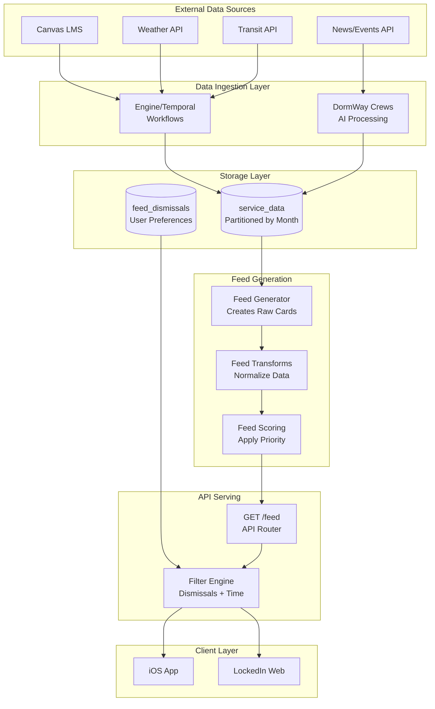
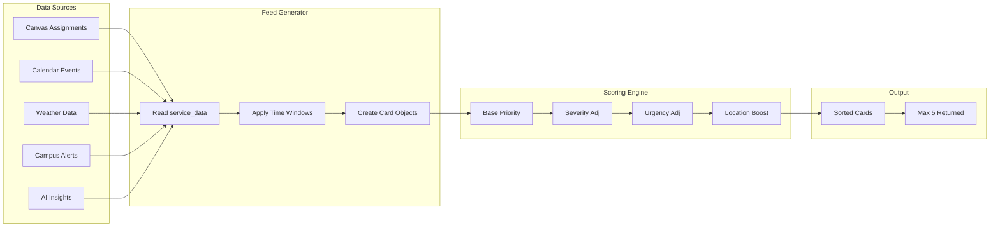
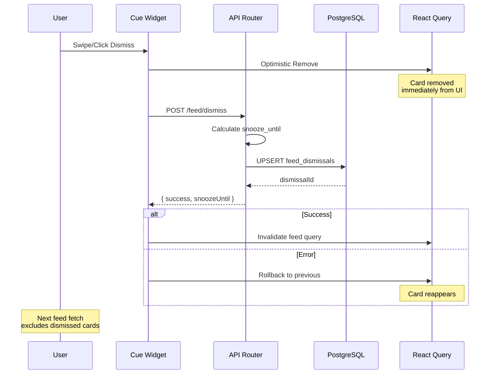
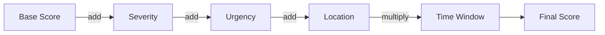
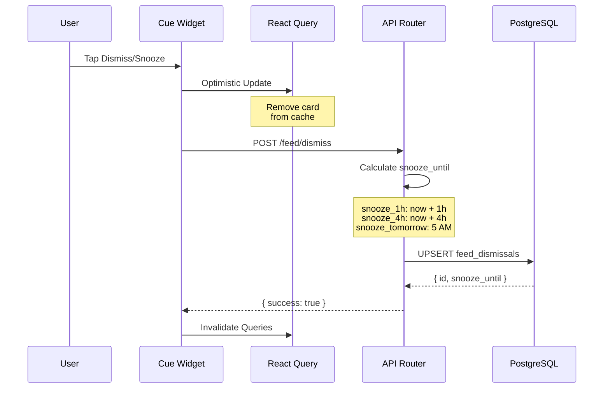
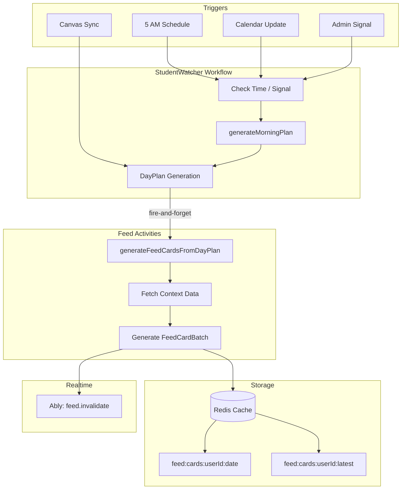

# SoT - Feed Cards

Terminology note:
- Cue is the user-facing label for the Heads Up signal layer. Code and some docs still use `headsup`/HeadsUp identifiers. This doc uses Cue except when referencing identifiers or filenames.

## Executive Summary

- **47+ card types** organized into 14 categories
- **6 primary data sources**: Canvas, DayPlan, Weather, Campus, City, AI-Generated
- **Priority scoring**: 0-100 scale with severity/urgency adjustments
- **Time relevance**: Widgets display only during valid time windows
- **Max 5 cards** returned per feed request
- **Dismissal system**: Permanent dismiss or snooze (1h, 4h, tomorrow)
- **Copy rules**: titles/subtitles stay short, action-first, and avoid AI phrasing

---

## Table of Contents

1. [Data Pipeline](#data-pipeline)
2. [Card Type Deep Dive](#card-type-deep-dive)
3. [Copy & Scannability Rules](#copy--scannability-rules)
4. [Priority Scoring Algorithm](#priority-scoring-algorithm)
5. [Time Relevance System](#time-relevance-system)
6. [Dismissal & Snooze System](#dismissal--snooze-system)
7. [API Response Format](#api-response-format)
8. [Key Files](#key-files)

---

## Data Pipeline

### End-to-End Flow



### Card Generation Flow



### Dismissal Flow



---

## Card Type Deep Dive

### Core FeedCard Interface

All cards follow this structure:

```typescript
interface FeedCard {
  // Identification
  id: string;                    // Format: {type}-{sourceId}-{hash}
  type: CardType;                // Card type enum
  source: DataSource;            // 'canvas' | 'dayplan' | 'weather' | etc.
  sourceId: string;              // Link to source entity
  category: CardCategory;        // For deduplication

  // Display Fields
  label: string;                 // Top label ("DUE TODAY")
  title: string;                 // Main title
  subtitle: string;              // Description
  time?: string;                 // Time display ("2:30 PM")
  timeLabel?: string;            // Time context ("Due by")
  icon?: string;                 // SF Symbol name
  accentColor?: string;          // Hex color

  // Expandable Content
  hasReveal: boolean;
  revealText?: string;           // Preview text
  revealContent?: string;        // Full markdown content

  // Scoring
  priority: CardPriority;        // critical | high | normal | low
  basePriority: number;          // 0-100
  computedScore?: number;        // Calculated at request time
  timeWindow?: TimeWindow;       // {start, end, peak}

  // State
  isDismissed: boolean;
  generatedAt: string;
  expiresAt?: string;

  // Actions & Metadata
  actions?: CardAction[];
  metadata?: Record<string, unknown>;  // See "URL Access Pattern" below
}
```

### 🔴 RevealContent Pattern (PR #711, #712)

**Critical Rule:** `revealContent` must only contain **NEW information not already visible in `subtitle`**.

iOS and web clients show `subtitle` always visible, and `revealContent` is shown when the card is expanded. If both contain the same text, users see duplicate content.

**Pattern:**
```typescript
// ❌ WRONG - Duplicates subtitle text
subtitle: data.description,
revealContent: `**Details:**\n${data.description}`,  // Same as subtitle!

// ✅ CORRECT - Only new information
subtitle: data.description,
revealContent: data.additionalDetails ? `**More:**\n${data.additionalDetails}` : undefined,
```

**Cards fixed in PR #712 (2026-01-05):**
- `LocalOpportunity` - valueProp only shown if different from studentBenefit
- `DayConditions` - conditionsSummary removed from reveal
- `MorningBriefing` - skip first highlight in revealContent
- `PortfolioOpportunity` - description removed from reveal
- `SynergyHighImpact` - only suggestedAction in reveal
- `EveningReview` - dayRecapMessage removed from reveal
- `WeatherChange` - current conditions removed from reveal
- `CommunityPulse` - jobMarket removed from reveal
- `TrafficAlert` - workaround removed from reveal
- `TransitionAlert` - source/travelTime removed from reveal

**Testing:** After generating cards, expand each card type in iOS to verify no duplicate text appears.

---

### URL Access Pattern (DORM-817)

Cards with external URLs store the URL in `metadata.url` for simpler access. This enables "tap anywhere to open link" functionality.

**Card types with `metadata.url`:**
- `campus_news` - News article URL
- `local_news` - News article URL
- `local_opportunity` - Job/internship URL
- `events` - Event details URL
- `deals` - Deal/offer URL

**Backend (Cue builder, `headsup` in code):**
```typescript
// headsup-builder.ts - Checks metadata.url first, falls back to actions array
const metadataUrl = card.metadata?.url as string | undefined;
if (metadataUrl) {
  primaryCta = { label: action?.label || 'Open', kind: 'url', value: metadataUrl };
}
```

**iOS (FeedCard convenience accessor):**
```swift
// FeedModels.swift
public var metadataUrl: URL? {
    guard let urlString = metadata?["url"]?.stringValue,
          let url = URL(string: urlString) else { return nil }
    return url
}

// FeedCardView.swift - Tap gesture uses metadataUrl
.onTapGesture {
    if let url = card.metadataUrl {
        UIApplication.shared.open(url)
    } else if card.hasReveal {
        isExpanded.toggle()
    }
}
```

**Web (Cue widget, `HeadsUpWidget` in code):**
Already handled via `primaryCta.kind === 'url'` from Cue builder transformation (`headsup` in code).

---

### Guidance Widget Transform (DORM-826)

Campus processing crews generate `guidance` widgets with `key_insights[]` containing actionable recommendations. These are now transformed into FeedCards instead of being dropped.

**Input format from crews:**
```json
{
  "widget_type": "guidance",
  "content": {
    "key_insights": [
      { "type": "opportunity", "message": "Join the free Pilates class", "action": "Participate on January 5" },
      { "type": "warning", "message": "Parking is limited", "action": "Consider alternative transportation" }
    ]
  }
}
```

**Transform mapping:**

| `key_insights[].type` | Output Card Type | Notes |
|-----------------------|------------------|-------|
| `warning` | `CampusAlertData` | `severity: 'warning'`, message → title, action → description |
| `opportunity` | `LocalOpportunityData` | message → title, action → valueProp/studentBenefit |
| `optimization` | `LocalOpportunityData` | Same as opportunity |
| `tip` | `LocalOpportunityData` | Same as opportunity |
| `wellbeing` | `LocalOpportunityData` | Same as opportunity |

**Card ID format:** `guidance-{alert|opportunity}-{widgetId}-{index}`

**Files:**
- `transforms.ts:610` - `transformGuidanceWidgets()` function
- `generator.ts:4015,4043,4084` - Called for news, events, logistics widgets

---

### Time-Triggered Cards

#### `morning_briefing`

| Property | Value |
|----------|-------|
| **Source** | `dayplan` |
| **Category** | `current` |
| **Base Priority** | 70 |
| **Time Window** | 5:00 AM - 10:00 AM (Peak: 7:00 AM) |

```typescript
{
  label: "MORNING BRIEFING",
  title: "Your day at a glance",
  subtitle: "3 classes, 2 assignments due",
  hasReveal: true,
  revealText: "3 highlights",
  revealContent: "• Physics lecture at 9 AM\n• Essay due at 5 PM\n• Study group at 7 PM",
  metadata: {
    bullet1: "Physics lecture at 9 AM",
    bullet2: "Essay due at 5 PM",
    bullet3: "Study group at 7 PM",
    bulletCount: 3
  }
}
```

#### `current_event`

| Property | Value |
|----------|-------|
| **Source** | `canvas` |
| **Category** | `current` |
| **Base Priority** | 55 |
| **Time Window** | 30 min before - class end (Peak: 15 min before) |

```typescript
{
  label: "CLASS",
  title: "Biology 101",
  subtitle: "Science Building 205",
  time: "2:30 PM",
  timeLabel: "Now",
  hasReveal: false,
  metadata: {
    courseId: "course-123",
    courseName: "Biology 101",
    isRecurring: true,
    progress: 0.45,
    eventStartTime: "2:30 PM",
    eventEndTime: "4:00 PM"
  }
}
```

#### `next_event`

| Property | Value |
|----------|-------|
| **Source** | `canvas` |
| **Category** | `next` |
| **Base Priority** | 70 |
| **Time Window** | 30 min before - event end (Peak: 15 min before) |

```typescript
{
  label: "NEXT CLASS",
  title: "Chemistry Lab",
  subtitle: "Chemistry Building Room 102",
  time: "In 30 min",
  timeLabel: "At 3:30 PM",
  metadata: {
    courseId: "course-456",
    progress: 0.0,
    eventStartTime: "3:30 PM",
    eventEndTime: "5:30 PM"
  }
}
```

#### `transition_alert`

| Property | Value |
|----------|-------|
| **Source** | `dayplan` |
| **Category** | `alert` |
| **Base Priority** | 75 |
| **Time Window** | Travel time before next event |

```typescript
{
  label: "LEAVE NOW",
  title: "15 min walk to Chemistry",
  subtitle: "From Science Building to Chemistry Building",
  time: "Leave by 3:15",
  accentColor: "#F59E0B",
  metadata: {
    fromLocation: "Science Building",
    toLocation: "Chemistry Building",
    travelTimeMinutes: 15,
    travelMode: "walk"
  }
}
```

#### `evening_review`

| Property | Value |
|----------|-------|
| **Source** | `dayplan` |
| **Category** | `current` |
| **Base Priority** | 25 |
| **Time Window** | 5:00 PM - 2:00 AM (Peak: 9:00 PM) |

```typescript
{
  label: "EVENING RECAP",
  title: "Your Day in Review",
  subtitle: "You completed all tasks today.",
  hasReveal: true,
  revealText: "See tomorrow preview",
  revealContent: "**Today**\nGreat work!\n\n**Tomorrow**\nTwo classes, one assignment",
  metadata: {
    greeting: "Great work today!",
    hasWeekAhead: true
  }
}
```

---

### Task Cards

#### `due_today`

| Property | Value |
|----------|-------|
| **Source** | `canvas` |
| **Category** | `due` |
| **Base Priority** | 75 |
| **Time Window** | 2 hours before due - due time (Peak: 30 min before) |

```typescript
{
  label: "DUE TODAY",
  title: "Problem Set 4",
  subtitle: "Physics 101",
  time: "5:00 PM",
  timeLabel: "Due by",
  hasReveal: false,
  metadata: {
    courseId: "course-123",
    estimatedMinutes: 120,
    submissionStatus: "not_submitted",
    tag1: "DUE TODAY",
    tag1Color: "#F59E0B",
    tag2: "Physics 101",
    tag2Color: "#3B82F6"
  },
  actions: [{
    type: "external",
    label: "Open in Canvas",
    url: "https://canvas.school.edu/assignments/123"
  }]
}
```

#### `due_tomorrow`

| Property | Value |
|----------|-------|
| **Source** | `canvas` |
| **Category** | `due` |
| **Base Priority** | 55 |
| **Time Window** | 6:00 PM today - 10:00 AM tomorrow (Peak: 8:00 PM) |

```typescript
{
  label: "DUE TOMORROW",
  title: "Lab Report",
  subtitle: "Chemistry 201",
  time: "11:59 PM",
  timeLabel: "Due",
  metadata: {
    tag1: "DUE TOMORROW",
    tag1Color: "#3B82F6"
  }
}
```

#### `overdue`

| Property | Value |
|----------|-------|
| **Source** | `canvas` |
| **Category** | `due` |
| **Base Priority** | 85 |
| **Priority** | `critical` |
| **Time Window** | Up to 4 hours after original due time |

```typescript
{
  label: "OVERDUE",
  title: "Essay Draft",
  subtitle: "English 102",
  time: "2:00 PM",
  timeLabel: "Was due",
  accentColor: "#EF4444",
  priority: "critical",
  metadata: {
    tag1: "OVERDUE",
    tag1Color: "#EF4444"
  }
}
```

#### `due_soon`

| Property | Value |
|----------|-------|
| **Source** | `canvas` |
| **Category** | `due` |
| **Base Priority** | 50 |
| **Time Window** | 8:00 AM - 9:00 PM |

```typescript
{
  label: "COMING UP",
  title: "Research Paper",
  subtitle: "History 301 • Friday",
  time: "3:00 PM",
  timeLabel: "Due",
  metadata: {
    courseId: "course-789",
    estimatedMinutes: 180
  }
}
```

#### `midterm_alert`

| Property | Value |
|----------|-------|
| **Source** | `canvas` |
| **Category** | `alert` |
| **Base Priority** | 80 |

```typescript
{
  label: "EXAM ALERT",
  title: "Midterm in 3 days",
  subtitle: "Physics 101 • Covers Chapters 1-5",
  accentColor: "#EF4444",
  hasReveal: true,
  revealContent: "Review topics:\n• Newton's Laws\n• Energy Conservation\n• Momentum"
}
```

---

### Insight Cards (AI-Generated)

#### `brain_gains`

| Property | Value |
|----------|-------|
| **Source** | `ai_generated` |
| **Category** | `insight` |
| **Base Priority** | 40 |
| **Time Window** | 8:00 AM - 8:00 PM (Peak: 2:00 PM) |

```typescript
{
  label: "BRAIN GAINS",
  title: "Machine Learning Fundamentals",
  subtitle: "Connects: CS 101 & Statistics 201",
  icon: "brain.head.profile",
  hasReveal: true,
  revealText: "See how to apply",
  revealContent: "Use clustering techniques from Stats in your CS project",
  metadata: {
    courses: ["CS 101", "Statistics 201"],
    courseIds: ["course-1", "course-2"],
    confidence: 0.92
  }
}
```

#### `synergy`

| Property | Value |
|----------|-------|
| **Source** | `ai_generated` |
| **Category** | `insight` |
| **Base Priority** | 35 |
| **Time Window** | 9:00 AM - 9:00 PM (Peak: 3:00 PM) |

```typescript
{
  label: "SYNERGY",
  title: "Business & Ethics Overlap",
  subtitle: "3 courses connected",
  icon: "link.circle.fill",
  hasReveal: true,
  revealText: "3 courses connected",
  revealContent: "Business 101, Economics 202, Ethics 150",
  metadata: {
    courses: ["Business 101", "Economics 202", "Ethics 150"],
    confidence: 0.85
  }
}
```

#### `week_load`

| Property | Value |
|----------|-------|
| **Source** | `ai_generated` |
| **Category** | `workload` |
| **Base Priority** | 45 |
| **Time Window** | 6:00 AM - 10:00 PM (Peak: 8:00 AM) |

```typescript
{
  label: "HEAVY WEEK",
  title: "28h this week",
  subtitle: "Classes: 8h • Assignments: 12h • Study: 8h",
  icon: "chart.bar.fill",
  hasReveal: true,
  revealText: "Get tips",
  revealContent: "This is a heavy week. Consider starting assignments early.",
  accentColor: "#F59E0B",
  metadata: {
    totalHours: 28,
    breakdown: {
      classes: 8,
      assignments: 12,
      studying: 8,
      exams: 0
    },
    comparedToAverage: "much_heavier",
    heaviestDay: "Wednesday"
  }
}
```

#### `peak_warning`

| Property | Value |
|----------|-------|
| **Source** | `ai_generated` |
| **Category** | `workload` |
| **Base Priority** | 50 |

```typescript
{
  label: "PEAK DAY",
  title: "Wednesday is packed",
  subtitle: "8 items • 12h estimated",
  icon: "exclamationmark.triangle.fill",
  accentColor: "#F59E0B",
  metadata: {
    peakDate: "2025-12-24",
    items: 8,
    totalHours: 12,
    affectedCourses: ["CS 101", "Physics 201"]
  }
}
```

---

### Campus Cards

#### `campus_alert`

| Property | Value |
|----------|-------|
| **Source** | `campus` |
| **Category** | `alert` |
| **Base Priority** | 90 |
| **Priority** | `critical` |

```typescript
{
  label: "CAMPUS ALERT",
  title: "Campus closed for weather",
  subtitle: "All buildings closed until 10 AM",
  accentColor: "#EF4444",
  priority: "critical",
  hasReveal: false,
  metadata: {
    type: "weather_closure",
    severity: "critical"
  }
}
```

#### `campus_news`

| Property | Value |
|----------|-------|
| **Source** | `campus` |
| **Category** | `campus` |
| **Base Priority** | 35 |
| **Time Window** | 8:00 AM - 10:00 PM (Peak: 12:00 PM) |

```typescript
{
  label: "SPORTS",
  title: "Football Game This Saturday",
  subtitle: "Kickoff at 1 PM. Free student tickets.",
  icon: "newspaper.fill",
  hasReveal: true,
  revealText: "Read more",
  revealContent: "Full article text...",
  metadata: {
    category: "sports",
    publishedAt: "2025-12-20T10:00:00Z",
    imageUrl: "https://..."
  },
  actions: [{
    type: "external",
    label: "Read full story",
    url: "https://news.school.edu/..."
  }]
}
```

#### `study_spots`

| Property | Value |
|----------|-------|
| **Source** | `campus` |
| **Category** | `campus` |
| **Base Priority** | 45 |
| **Time Window** | 8:00 AM - 11:00 PM (Peak: 2:00 PM) |

```typescript
{
  label: "STUDY SPOT",
  title: "Library 3rd Floor",
  subtitle: "Main Building • Low occupancy",
  time: "11 PM",
  timeLabel: "Open until",
  icon: "book.closed.fill",
  accentColor: "#4ADE80",
  hasReveal: true,
  revealText: "2 more options",
  revealContent: "**Other options:**\n• Student Center Cafe\n• Quad Commons",
  metadata: {
    currentOccupancy: "low",
    features: ["Quiet", "WiFi", "Power outlets"],
    distanceMeters: 250
  }
}
```

---

### City/Local Cards

#### `weather`

| Property | Value |
|----------|-------|
| **Source** | `weather` |
| **Category** | `weather` |
| **Base Priority** | 65 |
| **Time Window** | 6:00 AM - 10:00 PM (Peak: 8:00 AM) |

```typescript
{
  label: "WEATHER",
  title: "72° Partly Cloudy",
  subtitle: "H: 78° L: 65° • 20% rain",
  icon: "cloud.sun.fill",
  hasReveal: true,
  revealContent: "• Dress for warmth\n• Bring umbrella just in case",
  metadata: {
    temp: 72,
    condition: "Partly Cloudy",
    high: 78,
    low: 65,
    precipitationChance: 20,
    temperature: "72°",
    weatherDetails: "H: 78° L: 65°"
  }
}
```

#### `transit`

| Property | Value |
|----------|-------|
| **Source** | `city` |
| **Category** | `city` |
| **Base Priority** | 50 |
| **Time Window** | 30 min before - departure |

```typescript
{
  label: "BUS ARRIVING",
  title: "Route 5 to Downtown",
  subtitle: "Stop: Main Street • In 12 min",
  time: "2:15 PM",
  timeLabel: "Departs",
  hasReveal: true,
  revealText: "2 more options",
  revealContent: "**Next departures:**\n• Route 7 - 2:45 PM\n• Route 12 - 3:00 PM",
  metadata: {
    routeName: "Route 5",
    routeNumber: "5",
    destination: "Downtown Station",
    vehicleType: "bus",
    minutesAway: 12,
    isRealtime: true
  }
}
```

#### `dining`

| Property | Value |
|----------|-------|
| **Source** | `city` |
| **Category** | `city` |
| **Base Priority** | 40 |
| **Time Window** | Meal times (breakfast/lunch/dinner) |

```typescript
{
  label: "DINING",
  title: "Main Dining Hall",
  subtitle: "Open until 7 PM • Taco Tuesday",
  time: "7:00 PM",
  timeLabel: "Open until",
  metadata: {
    name: "Main Dining Hall",
    type: "dining_hall",
    currentWait: "short",
    menuHighlight: "Taco Tuesday",
    acceptsMealPlan: true
  }
}
```

#### `traffic_alert`

| Property | Value |
|----------|-------|
| **Source** | `city` |
| **Category** | `alert` |
| **Base Priority** | 72 |
| **Time Window** | Context-driven |

```typescript
{
  label: "ROAD CLOSURE",
  title: "Topanga Canyon Blvd closed due to storm impacts",
  subtitle: "Use alternate routes",
  hasReveal: true,
  revealText: "View details",
  revealContent: "**Duration:** Through Friday\n\n**Workaround:** Use CA-27 detour\n\n**Location:** Topanga Canyon Blvd",
  metadata: {
    alertType: "road_closure",
    duration: "Through Friday"
  }
}
```

**Scoring Notes:**
- `road_closure` alerts are marked `high` priority; other types default to `normal`.

#### `local_opportunity`

| Property | Value |
|----------|-------|
| **Source** | `city` |
| **Category** | `city` |
| **Base Priority** | 55 |
| **Time Window** | Event date or ongoing |

```typescript
{
  label: "INTERNSHIP",
  title: "Campus Sustainability Internship",
  subtitle: "Paid role supporting campus energy audits",
  time: "2026-02-01",
  timeLabel: "Date",
  hasReveal: true,
  revealText: "Learn more",
  revealContent: "**Why this matters:**\nHands-on sustainability work for credit.\n\n**For students:**\nPaid role + flexible hours.",
  actions: [
    { type: "external", label: "Read More", url: "https://city.example.edu/opportunities/123" }
  ],
  metadata: {
    opportunityType: "internship",
    date: "2026-02-01",
    url: "https://city.example.edu/opportunities/123",
    source: "City Chronicle"
  }
}
```

**Notes:**
- If `date` is `"Ongoing"`, `timeLabel` is blank.
- `actions` only appear when a URL is present.

---

### Special Cards

#### `on_break`

| Property | Value |
|----------|-------|
| **Source** | `dayplan` |
| **Category** | `break` |
| **Base Priority** | 80 |

```typescript
{
  label: "ON BREAK",
  title: "Winter Break",
  subtitle: "Enjoy your time off! No classes or assignments to worry about.",
  icon: "sparkles",
  hasReveal: true,  // Derived from revealContent existence
  revealText: "See when classes resume",
  revealContent: "**Classes Resume:** Monday, January 6\n**Break Ends:** January 6",
  metadata: {
    breakType: "winter_break",
    breakName: "Winter Break",
    startDate: "2025-12-15",
    endDate: "2026-01-06",
    nextTermStart: "2026-01-06"
  }
}
```

**Note (2026-01-05):** `revealContent` contains **only date info**, not the subtitle message. This prevents duplicate text when iOS expands the card (subtitle + revealContent are shown separately). See PR #711.

#### `travel_mode`

| Property | Value |
|----------|-------|
| **Source** | `dayplan` |
| **Category** | `travel` |
| **Base Priority** | 85 |

```typescript
{
  label: "AWAY FROM CAMPUS",
  title: "Welcome to Chicago",
  subtitle: "58°F Cloudy • Local time 2:30 PM",
  metadata: {
    detectedCity: "Chicago",
    localWeather: { temp: 58, condition: "Cloudy" },
    distanceFromCampus: 280
  }
}
```

#### `local_news`

| Property | Value |
|----------|-------|
| **Source** | `city` |
| **Category** | `city` |
| **Base Priority** | 45 |

**Added:** 2025-12-27 - Travel-aware news from nearest city when student is traveling.

```typescript
{
  label: "LOCAL NEWS",
  title: "Storm Warning in West Hills",
  subtitle: "Weather advisory in effect until Friday",
  hasReveal: true,
  revealContent: "Full article text...",
  metadata: {
    cityId: "city-uuid",
    cityName: "West Hills",
    articleCount: 3,
    source: "city_news"
  }
}
```

#### `local_transit`

| Property | Value |
|----------|-------|
| **Source** | `city` |
| **Category** | `alert` |
| **Base Priority** | 55 (dynamic: 25 if no incidents) |

**Added:** 2025-12-27 - Transit alerts from nearest city when student is traveling.

```typescript
{
  label: "TRANSIT ALERT",
  title: "Road closure in West Hills",
  subtitle: "SR-27 (Topanga Canyon Blvd) fully closed due to storm impacts",
  hasReveal: true,
  revealContent: "Full incident details...",
  metadata: {
    cityId: "city-uuid",
    cityName: "West Hills",
    totalIssues: 1,
    tag1: "Road Closure",
    tag1Color: "red"
  }
}
```

**Scoring Notes:**
- Uses `alert` category to avoid deduplication with `travel_mode`
- Dynamic priority: 55 when has incidents, 25 when "clear conditions" (empty)
- Boosted 1.5× when context is `traveling`

---

## Copy & Scannability Rules

- **Title = the thing.** Short noun/action (course, task, event). No framing or filler.
- **Subtitle = the context.** One line that answers "why now" or "what changed."
- **No AI voice.** Avoid "I noticed", "It looks like", "Based on", "I can help".
- **Length caps.** Titles <= 64 chars; subtitles <= 72 chars (truncate with "...").
- **Details live in reveal.** Longer explanations belong in `revealContent`, not subtitles.
- **Source-first cleanup.** City + AI cards strip AI-style lead-ins at generation time.

Enforcement points:

- Generator copy normalization: `.repos/dormway-platform/services/shared/dormway-core/src/domains/feed/generator.ts`
- iOS scannability: `.repos/ios-clean/App/Views/Feed/FeedCardView.swift` (1-line subtitle)
- iOS keyline context: `.repos/ios-clean/App/Views/Feed/FeedCardView.swift` (uses metadata: `courseName`, `courseCode`, `location`)

---

## Priority Scoring Algorithm

### Score Scale (0-100)

| Range | Level | Examples |
|-------|-------|----------|
| 90-100 | CRITICAL | Overdue, campus closures, current events |
| 70-89 | IMPORTANT | Due today, upcoming classes, alerts |
| 50-69 | RELEVANT | Weather, transit, study spots |
| 30-49 | NICE TO HAVE | Weekly outlook, insights, trends |
| 0-29 | LOW | Suggestions, historical data |

### Scoring Formula



```
computedScore = (basePriority + severityAdj + urgencyAdj + locationBoost) × timeMultiplier
```

#### Severity Adjustment
| Severity | Adjustment |
|----------|------------|
| Critical | +20 |
| High | +10 |
| Normal | 0 |
| Low | -10 |

#### Urgency Adjustment (Time-Based)
| Time Until Event | Urgency | Adjustment |
|------------------|---------|------------|
| ≤ 30 minutes | High | +15 |
| ≤ 2 hours | Medium | +5 |
| > 2 hours | Low | 0 |

#### Location Boost
| Location Status | Boost |
|-----------------|-------|
| At location | +20 |
| Nearby (< 500m) | +10 |
| On campus | +5 |
| Off campus | 0 |

#### Time Window Multiplier
| Status | Multiplier |
|--------|------------|
| At peak time | 2.0× |
| Within window | 1.0× |
| Near window edge | 0.5× |
| Outside window | 0× (hidden) |

### Scoring Examples

```python
# Overdue assignment
base = 85
computed = (85 + 20) × 1.0 = 105 → capped at 100 → CRITICAL

# Class starting in 20 minutes
base = 70
computed = (70 + 0 + 15) × 1.5 = 127.5 → capped at 100 → CRITICAL

# Weather update (morning peak)
base = 65
computed = (65 + 0 + 0) × 2.0 = 130 → capped at 100 → CRITICAL

# Weekly outlook (off-peak)
base = 35
computed = (35 + 0 + 0) × 0.5 = 17.5 → LOW
```

---

## Time Relevance System

### Time Window Structure

```typescript
interface TimeWindow {
  start: string;    // ISO timestamp
  end: string;      // ISO timestamp
  peak?: string;    // ISO timestamp (optional)
}

interface TimeRelevance {
  valid_start: string;  // "HH:MM" format
  valid_end: string;    // "HH:MM" format
  days?: string[];      // ["monday", "tuesday", ...]
}
```

### Standard Time Windows

| Window | valid_start | valid_end | Peak | Cards |
|--------|-------------|-----------|------|-------|
| Early Morning | 05:00 | 08:00 | 06:30 | `morning_briefing` |
| Morning | 08:00 | 12:00 | 10:00 | `weather`, `transit` |
| Lunch | 11:00 | 14:00 | 12:30 | `dining` |
| Afternoon | 12:00 | 17:00 | 14:00 | `study_spots`, `brain_gains` |
| Evening | 17:00 | 23:59 | 20:00 | `evening_review` |
| All Day | 00:00 | 23:59 | — | `due_today`, `campus_alert` |

### Day Filtering

```json
{
  "time_relevance": {
    "valid_start": "08:00",
    "valid_end": "17:00",
    "days": ["monday", "tuesday", "wednesday", "thursday", "friday"]
  }
}
```

---

## Dismissal & Snooze System

### Dismissal Options

| Type | Duration | Behavior |
|------|----------|----------|
| `permanent` | Forever | Card never shown again |
| `snooze_1h` | 1 hour | Card reappears after 1 hour |
| `snooze_4h` | 4 hours | Card reappears after 4 hours |
| `snooze_tomorrow` | Until 5 AM | Card reappears with next DayPlan |

### Database Schema

```sql
CREATE TABLE feed_dismissals (
  id uuid PRIMARY KEY DEFAULT gen_random_uuid(),
  user_id uuid NOT NULL REFERENCES accounts(id),
  card_id text NOT NULL,
  card_type text NOT NULL,
  source_id text,
  dismissal_type text NOT NULL DEFAULT 'permanent'
    CHECK (dismissal_type IN ('permanent', 'snooze_1h', 'snooze_4h', 'snooze_tomorrow')),
  snooze_until timestamptz,
  dismissed_from text,
  metadata jsonb DEFAULT '{}',
  created_at timestamptz DEFAULT NOW(),
  UNIQUE(user_id, card_id)
);
```

### Dismissal Flow



### Snooze Calculation

```typescript
// From feed-routes.ts
let snoozeUntil: Date | null = null;

if (dismissalType === 'snooze_1h') {
  snoozeUntil = new Date(now.getTime() + 60 * 60 * 1000);
} else if (dismissalType === 'snooze_4h') {
  snoozeUntil = new Date(now.getTime() + 4 * 60 * 60 * 1000);
} else if (dismissalType === 'snooze_tomorrow') {
  snoozeUntil = new Date(now);
  snoozeUntil.setDate(snoozeUntil.getDate() + 1);
  snoozeUntil.setHours(5, 0, 0, 0);  // 5 AM tomorrow
}
// permanent: snoozeUntil = null
```

### Filter Query

```sql
-- Get active dismissals for user
SELECT card_id, dismissal_type, snooze_until
FROM feed_dismissals
WHERE user_id = $1
  AND (
    dismissal_type = 'permanent'
    OR (snooze_until IS NOT NULL AND snooze_until > NOW())
  )
```

### Frontend Hook

```typescript
// useHeadsUpDismiss.ts
const { mutate: dismissCard } = useHeadsUpDismiss();

// Dismiss with snooze
dismissCard({
  cardId: item.id,
  cardType: item.cardType,
  sourceId: item.sourceId,
  dismissalType: 'snooze_4h',
  dismissedFrom: 'headsup'
});
```

---

## API Response Format

### GET /feed Response

```json
{
  "success": true,
  "data": {
    "cards": [
      {
        "id": "due_today-assign-123-abc12345",
        "type": "due_today",
        "source": "canvas",
        "sourceId": "assign-123",
        "category": "due",
        "priority": "high",
        "label": "DUE TODAY",
        "title": "Problem Set 4",
        "subtitle": "Physics 101",
        "time": "5:00 PM",
        "timeLabel": "Due by",
        "hasReveal": false,
        "basePriority": 75,
        "computedScore": 92.5,
        "isDismissed": false,
        "generatedAt": "2025-12-27T10:30:00Z",
        "expiresAt": "2025-12-27T21:00:00Z",
        "timeWindow": {
          "start": "2025-12-27T15:00:00Z",
          "end": "2025-12-27T17:00:00Z",
          "peak": "2025-12-27T16:30:00Z"
        },
        "metadata": {
          "courseId": "course-123",
          "tag1": "DUE TODAY",
          "tag1Color": "#F59E0B"
        },
        "actions": [{
          "type": "external",
          "label": "Open in Canvas",
          "url": "https://canvas.school.edu/..."
        }]
      }
    ],
    "meta": {
      "totalAvailable": 8,
      "maxReturned": 5,
      "generatedAt": "2025-12-27T06:00:00Z",
      "nextRefreshAt": "2025-12-27T10:31:00Z"
    }
  }
}
```

### POST /feed/dismiss Request/Response

```typescript
// Request
{
  cardId: "due_today-assign-123-abc12345",
  cardType: "due_today",
  sourceId: "assign-123",
  dismissalType: "snooze_4h",
  dismissedFrom: "headsup"
}

// Response
{
  success: true,
  dismissalId: "uuid-here",
  snoozeUntil: "2025-12-27T14:30:00Z"
}
```

---

## Key Files

### Core Feed System
```
services/shared/dormway-core/src/domains/feed/
├── types.ts        # Card types, interfaces (47+ types)
├── generator.ts    # Card generation logic
├── scoring.ts      # Scoring algorithm
└── transforms.ts   # Data transformations
```

### API Router
```
services/api-router/src/
├── routes/feed-routes.ts              # GET /feed, POST /feed/dismiss
└── services/headsup/
    ├── headsup-builder.ts             # Widget builder
    └── headsup-types.ts               # Cue types (file name uses headsup)
```

### Frontend
```
services/dormway-lockedin/src/
├── hooks/home/useHeadsUpDismiss.ts    # Cue dismissal mutation (file name uses HeadsUp)
└── app/dashboard/home-v2/widgets/
    ├── HeadsUpWidget.tsx              # Cue widget UI (file name uses HeadsUp)
    └── types.ts                       # Widget types
```

### Database
```
infrastructure/database/migrations/
└── 20251217_add_feed_dismissals.sql   # Dismissal table
```

### DormWay Crews (AI)
```
services/dormway-crews/
├── shared/models/widget_models.py     # Widget validators
├── shared/agents/widget_conformance.py # Score bands
└── crews/student_daily_intelligence_v3.py # Score calculation
```

---

## Card Categories (Deduplication)

Only **1 card per category** returned to prevent duplicates:

| Category | Description | Example Cards |
|----------|-------------|---------------|
| `alert` | Urgent notifications | `campus_alert`, `transition_alert` |
| `current` | Currently happening | `current_event`, `morning_briefing` |
| `next` | Next scheduled | `next_event` |
| `due` | Task deadlines | `due_today`, `overdue` |
| `weather` | Weather info | `weather`, `weather_change` |
| `insight` | AI insights | `brain_gains`, `synergy` |
| `workload` | Academic load | `week_load`, `peak_warning` |
| `campus` | Campus-specific | `campus_news`, `study_spots` |
| `city` | Local content | `transit`, `dining`, `events` |

---

## Feed Generation in StudentWatcher

### Generation Triggers

| Trigger | Location | Notes |
|---------|----------|-------|
| **5 AM Daily Generation** | `studentWatcher.simplified.workflow.ts:1332-1340` | Morning DayPlan triggers feed generation |
| **Calendar Update** | `studentWatcher.simplified.workflow.ts:241-294` | User calendar changes → plan regen → feed regen |
| **Manual Signal** | `studentWatcher.simplified.workflow.ts:1051-1104` | Admin sends `generateFeedCardsSignal` |
| **DayPlan Field Updates** | `dayplan.activities.ts:1844-1877` | Feed-relevant field changes only |
| **Canvas/Schedule Sync** | 6-hour intervals | Triggers DayPlan → feed regeneration |
| **Context Updates (DORM-761)** | `studentWatcher.simplified.workflow.ts:568-596` | Location/campus/dining/weather updates |

### Context Updates That Trigger Feed Regeneration

Per DORM-761, certain `context_update` signals trigger immediate feed regeneration **without** full DayPlan regeneration:

```typescript
// studentWatcher.simplified.workflow.ts:570-579
const isCampusOrLocationUpdate =
  update.type === 'location' ||
  update.type?.startsWith('dining_') ||
  update.type?.startsWith('campus_') ||
  update.type?.startsWith('city_') ||
  update.type?.startsWith('building_') ||
  originalEventType?.includes('campus') ||
  originalEventType?.includes('dining') ||
  originalEventType?.includes('weather') ||
  originalEventType?.includes('city');
```

| Update Type Pattern | Example | Triggers Feed Regen |
|---------------------|---------|---------------------|
| `location` | User location ping | ✅ Yes |
| `dining_*` | `dining_hall_update` | ✅ Yes |
| `campus_*` | `campus_alert`, `campus_news` | ✅ Yes |
| `city_*` | `city_weather_update` | ✅ Yes |
| `building_*` | `building_hours_change` | ✅ Yes |
| originalEventType contains `campus` | — | ✅ Yes |
| originalEventType contains `dining` | — | ✅ Yes |
| originalEventType contains `weather` | — | ✅ Yes |
| originalEventType contains `city` | — | ✅ Yes |
| `schedule_update` | — | ❌ No (uses DayPlan path) |
| `preference_change` | — | ❌ No |

**Why this matters:** These updates refresh feed cards to reflect real-time campus/location context without waiting for the next 5 AM generation or full DayPlan rebuild.

### Generation Flow



### Conditional Regeneration

Feed only regenerates when these DayPlan fields change:

```typescript
// dayplan.activities.ts:1844-1877
const feedRelevantFields = [
  'summary',
  'dueToday',
  'hardCommitments',
  'conflicts',
  'nearFuture',
  'eveningBriefing',
  'weather',
  'events',
  'actions',
  'isOnBreak',
  'breakInfo'
];

// EXCLUDED: 'currentState' - prevents twitchy UI from context pings
```

### Cache Keys & TTL

| Key Pattern | TTL | Purpose |
|-------------|-----|---------|
| `feed:cards:{userId}:{YYYY-MM-DD}` | 24h | Daily card batch |
| `feed:cards:{userId}:latest` | 24h | Points to current date |
| `feed:scored:{userId}:*` | Variable | Scored results cache |

---

## Card ID Stability & Dismissal Persistence

### Card ID Generation

Card IDs are **deterministically generated** from type + sourceId:

```typescript
// generator.ts:420-434
function generateCardId(type: CardType, sourceId: string): string {
  const hash = createHash('sha256')
    .update(`${type}:${sourceId}`)
    .digest('hex')
    .slice(0, 8);
  return `${type}-${sourceId}-${hash}`;
}
```

**Format:** `{type}-{sourceId}-{8-char-hash}`

**Example:** `due_today-assignment-xyz-a1b2c3d4`

### How Dismissals Survive Regeneration

1. **User dismisses card:** ID `due_today-assignment-123-abc12345`
2. **Database stores:** `feed_dismissals.card_id = 'due_today-assignment-123-abc12345'`
3. **Feed regenerates:** Same assignment → same type + sourceId → **same card ID**
4. **Filter matches:** Card ID found in dismissals → card excluded

```typescript
// feed-routes.ts:240-248
let cards = cachedBatch.cards.filter((card) => {
  if (permanentIds.has(card.id)) return false;  // Exact ID match
  if (snoozedCards.has(card.id)) return false;
  return true;
});
```

### Stable ID Examples

| Card Type | sourceId Source | Stable? |
|-----------|-----------------|---------|
| `due_today` | Canvas assignment ID | ✅ Yes |
| `morning_briefing` | `morning-{date}` | ✅ Yes |
| `weather` | Date string | ✅ Yes |
| `current_event` | Course ID | ✅ Yes |
| `campus_alert` | Alert ID | ✅ Yes |

---

## ✅ Sharp Edges - Resolved

> **Note:** These issues were identified and fixed. Documented here for historical reference.

### Issue #1: TravelMode Cards ~~Use Timestamp~~ → FIXED

**File:** `generator.ts:2929-2935`

```typescript
// ✅ FIXED - Now uses stable date + rounded coordinates
const stableTravelId = `travel-${dateForId}-${Math.round(data.latitude * 100)}-${Math.round(data.longitude * 100)}`;

return {
  id: generateCardId(CardType.TravelMode, `${data.latitude}-${data.longitude}`),
  sourceId: stableTravelId,  // ✅ Stable across regenerations
};
```

**Resolution:** `sourceId` now uses date + rounded coordinates instead of `Date.now()`. Dismissals persist correctly.

---

### Issue #2: ConflictWarning Fallback ~~Uses Timestamp~~ → FIXED

**File:** `generator.ts:4037-4041`

```typescript
// ✅ FIXED - Generate stable fallback ID from conflict properties
const stableConflictId = conflict.id ||
  `conflict-${(conflict.title || 'unknown').replace(/\s+/g, '-').toLowerCase().slice(0, 30)}-${(conflict.affectedItems || []).slice(0, 2).join('-').replace(/\s+/g, '').slice(0, 20)}`;

conflictWarnings.push({
  id: stableConflictId,  // ✅ Deterministic from content
});
```

**Resolution:** Fallback now generates deterministic ID from `title` + `affectedItems` instead of `Date.now()`. Dismissals persist even without upstream `conflict.id`.

---

### Remaining Best Practices

1. **All card IDs should be deterministic** - derived from stable entity properties, not timestamps
2. **Test dismissal persistence** - verify dismissed cards stay dismissed after feed regeneration
3. **Monitor for new timestamp usage** - grep for `Date.now()` in card ID generation code

---

## Related Documents

- [DayPlan V2](/docs/engineering/architecture/sot-dayplan-v2) - DayPlan structure that drives feed generation
- [Admin Dashboard - ServiceDataView Component](/docs/engineering/frontend/admin-dashboard-servicedataview-component) - Service data visualization
- DormWay Platform Architecture - System overview
- Dashboard Intelligence - Dashboard BFF patterns
- [StudentWatcher Workflow](/docs/engineering/technical/studentwatcher/studentwatcher-workflow-deep-dive-current) - Workflow documentation

---

**Last Updated**: 2026-01-05
**Document Type**: State of Things (SoT)
