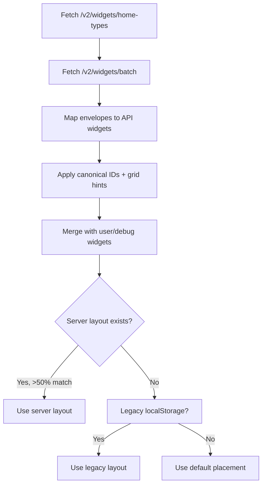
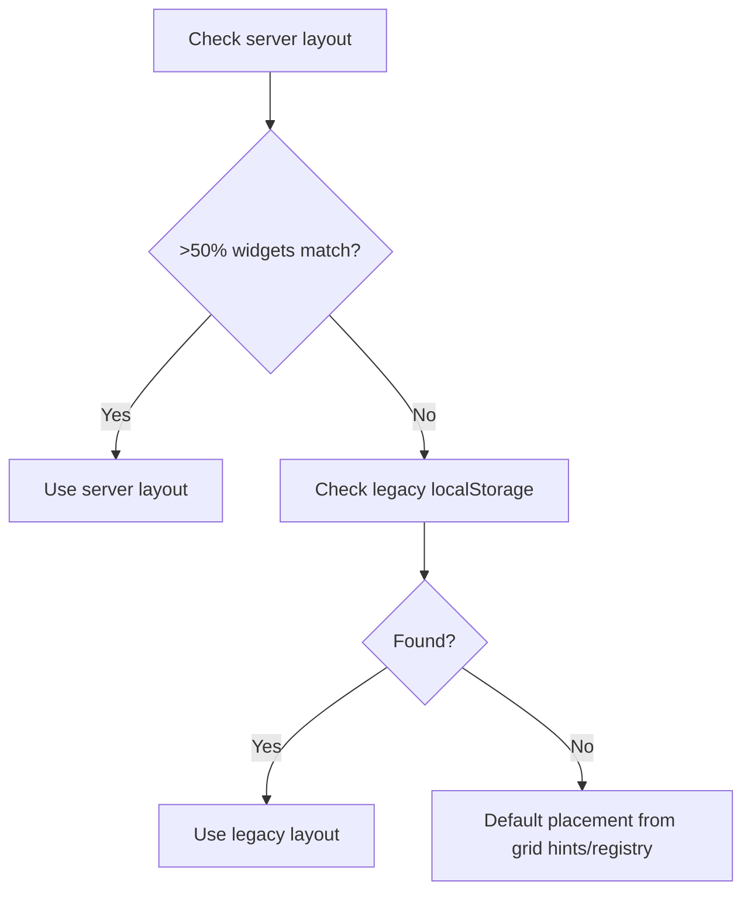
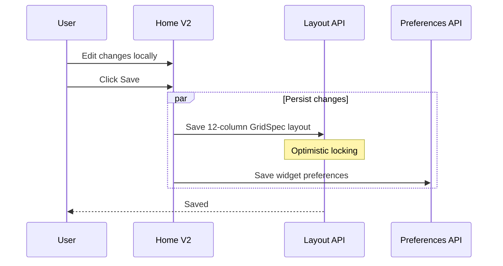
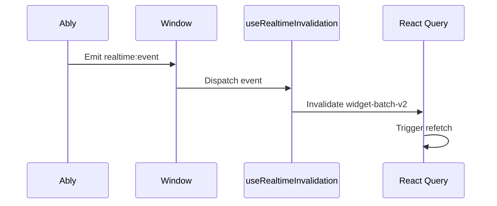
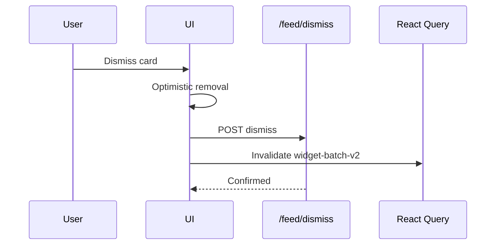

# SoT - Home & Widgets

## Scope
- Home V2 widget system for the LockedIn web app (batch widgets, layout, widget prefs).
- V2 widget envelope contract + batch ETag rules from API v2.
- Widget catalog (types, aliases, registry metadata) and default Home widget set.
- HeadsUp widget pipeline (cached feed cards + dismissals) used on Home V2.

## Non-goals
- iOS WidgetKit or mobile dashboards.
- Legacy V1 composite dashboard contract except as a fallback data source.
- Widget UI and visual design details; see [LockedIn-Schedule-UX-Guidelines](/docs/product/design/lockedin-schedule-ux-guidelines).
- Feed scoring internals beyond the HeadsUp widget contract.

## Current vs Target

- Current: Home V2 is batch-first for web; composite remains for legacy web surfaces while mobile proxy uses the v2 schedule slice.
- Target: Web mainline uses V2 widgets only; composite is legacy-only during a sunset window.
- Plan: `services/dormway-lockedin/docs/DASHBOARD_V2_OPTION_A_PLAN.md` (phase-gated plan + DoD).
- Plan: `services/dormway-lockedin/docs/LOCKEDIN_WEB_OS_CONSISTENCY_PLAN.md` (web IA + OS consistency rollout).
- Plan: `services/dormway-lockedin/docs/DASHBOARD_V2_COMPOSITE_REMOVAL_PLAN.md` (composite sunset sequencing).
- Plan: `obsidian-vault/DormWay/Plans/Workplan/Home-V2-Schedule-Widget-Scale-Plan.md` (schedule widget speed + batch-first alignment).

## Roadmap (Current)
- Keep Home V2 batch-first and remove any residual legacy activity dependencies; rely on `/v2/students/me/feed` metadata for context cards.
- Consider folding `home-types` + widget preferences into the batch payload to reduce cold-start calls.
- Roadmap: [V2-Standardization-Roadmap (Current)](/docs/engineering/technical/api/v2-standardization-roadmap-current)

## Invariants & Contracts
- The Widget Contract Table below is the single source of truth for Home V2 widget types, aliases, instance policy, ownership, and eligibility.
- Home V2 renders from `/v2/widgets/batch` via `WidgetDataProvider`; per-widget endpoints are not used by Home V2.
- Today widget derives `nextEvent` from the schedule timeline when available and falls back to `/v2/widgets/today` only if the schedule payload is missing; weather display prefers the weather widget payload when present.
- Schedule widget reads from batch only on Home V2 load; dayplan/time-block reads are disabled by default and not part of the widget refresh path.
- Schedule widget renders the batch timeline as-is (no client-side "today" truncation) and keeps ordering aligned to event start times.
- Schedule timeline suppresses DayPlan events that have a matching time block override (`metadata.originalEventId` and variants).
- Widgets using `useWidgetDataHybrid` prefer V2 context when present; otherwise they fall back to V1 props (or `forceV1`/`forceV2`).
- Widget envelopes include `id`, `type`, `gridHints`, `content`, `generatedAt`; API uses canonical `widget:${type}` IDs.
- Frontend canonicalizes non-custom IDs to `widget:${normalizedType}`; custom IDs (`user-*`, `debug-*`, `widget:user:*`, `widget:debug:*`) are preserved.
- Registry aliases exist for legacy/non-Home flows (`dayplan`, `schedule_v2` -> `schedule`, `canvas` -> `courses`), but the Home V2 pipeline does not accept aliases; server rejects alias types on save.
- Home V2 resolves batch types via `/v2/widgets/home-types` using defaults + prefs + layout; the client uses that list to call `/v2/widgets/batch`.
- Batch endpoint supports partial failures: errors are keyed per widget type and do not block the response.
- Home widget types are served with an ETag and are eligible for conditional fetch caching.
- Layout persistence stores geometry only (no runtime data): `gridLayoutToLayoutData` saves id/type/grid + `content.displayType` with empty `data`.
- Layout saves use `/api/proxy/api/v2/layouts` with optimistic locking (`version`); layout service caches `dw.layout.cache` for offline fallback.
- Home V2 saves canonical 12-column layouts derived from the active breakpoint so edits persist across refresh.
- Home V2 layouts only persist the 5 canonical types (no legacy or random widgets on the `home` tab).
- Layout service rejects non-canonical IDs/types and duplicate Home V2 types on save for the `home` tab (no auto-normalization).
- Legacy localStorage layout (`dashboard-home-v2-layout`) migrates once into server layouts and is cleared after success.
- Widget prefs persist under `general.widgetPreferences[tab]` via `/api/proxy/api/v2/students/me/preferences`; saved on exit edit mode.
- Batch ETag excludes `generatedAt` and sorts keys; per-widget ETag is content-only; 304 on `If-None-Match` match.
- `authorizedFetch` supports conditional ETag caching, but `useWidgetBatchV2` does not enable it; caching is React Query + invalidation.
- HeadsUp uses cached feed batches + `feed_dismissals` filtering; `includeEmpty: true` yields empty content with a version tied to cache + dismissals.

## Widget Contract Table (Source of Truth)

This table defines the Home V2 widget contract and should drive both API validation and the LockedIn registry.

| widgetType | canonicalId | aliases | instancePolicy | ownership | eligibility |
| --- | --- | --- | --- | --- | --- |
| today | widget:today | none | SINGLETON | api | home-v2-default |
| schedule | widget:schedule | dayplan, day_plan, schedule_v2 | SINGLETON | api | home-v2-default |
| tasks | widget:tasks | none | SINGLETON | api | home-v2-default |
| courses | widget:courses | canvas | SINGLETON | api | home-v2-default |
| headsup | widget:headsup | none | SINGLETON | api | home-v2-default |

Sources:
- `services/dormway-lockedin/src/app/dashboard/home-v2/widgets/registry.ts`
- `services/api-router/src/routes/v2/widgets.routes.ts`

## Key Flows (High-Level)

### Home V2 Boot Sequence

### Layout Initialization

### Edit/Save Flow

### Realtime Invalidation

### HeadsUp Dismissal

## Data Models / IDs / Terminology
- WidgetEnvelope: `{ id, type, gridHints, content, generatedAt }` returned by `/v2/widgets/batch`.
- WidgetTypeId: frontend union in `widgetV2Types.ts` (Home V2 uses `today`, `schedule`, `tasks`, `courses`, `headsup` by default).
- Canonical widget ID: `widget:${type}` for API widgets; `user-*`, `debug-*`, `widget:user:*`, `widget:debug:*` for custom widgets.
- LayoutData: `{ gridSpec, widgets[] }` with `LayoutWidget` containing id/type/grid and `content.displayType`.
- Widget preferences: `general.widgetPreferences[tab]` with `hiddenWidgetIds` and `userWidgets`.

## Key Files (Code + Docs)
- `services/api-router/src/routes/v2/widgets.routes.ts` (WidgetEnvelope, grid hints, batch endpoint)
- `services/api-router/src/services/headsup/headsup-builder.ts` (cached feed + dismissal filtering)
- `services/api-router/src/services/headsup/headsup-types.ts` (HeadsUp types + limits)
- `services/dormway-lockedin/src/hooks/home/widgetV2Types.ts` (envelope/content types, default widget list)
- `services/dormway-lockedin/src/hooks/home/useWidgetBatchV2.ts` (batch query + cache keys)
- `services/dormway-lockedin/src/contexts/WidgetDataContext.tsx` (batch data provider)
- `services/dormway-lockedin/src/app/dashboard/home-v2/page.tsx` (layout + prefs + batch wiring)
- `services/dormway-lockedin/src/app/dashboard/home-v2/widgets/registry.ts` (canonical types + registry)
- `services/dormway-lockedin/src/app/dashboard/home-v2/WidgetToolbar.tsx` (type parsing + smart organize)
- `services/dormway-lockedin/src/hooks/home/useWidgetPreferences.ts` (hidden/user widget prefs)
- `services/dormway-lockedin/src/hooks/useRealtimeInvalidation.ts` (Ably invalidation -> widget batch refetch)
- `services/dormway-lockedin/src/components/RealtimeProvider.tsx` (Ably subscription + event bridge)
- `services/dormway-lockedin/src/lib/authorizedFetch.ts` (conditional ETag cache support)
- `services/dormway-lockedin/src/lib/dashboard/layout-service.ts` (layout API client + cache)
- `services/dormway-lockedin/src/lib/dashboard/useLayoutService.ts` (layout persistence hook)
- `services/dormway-lockedin/src/lib/preferences.ts` (widget prefs persistence)
- `obsidian-vault/DormWay/Engineering/Architecture/Home V2 Batch-First Widgets (Long-Term Spec).md`
- `obsidian-vault/DormWay/Product/Features/Dashboard/Student Life Surfaces - Widgets and HeadsUp Spec (Draft).md`
- `obsidian-vault/DormWay/Product/Design/LockedIn-Schedule-UX-Guidelines.md`
- `obsidian-vault/DormWay/Engineering/Architecture/LockedIn Settings & Preferences Spec (Web).md`
- `services/dormway-lockedin/docs/LOCKEDIN_WEB_OS_CONSISTENCY_PLAN.md`
- `services/dormway-lockedin/docs/DASHBOARD_V2_COMPOSITE_REMOVAL_PLAN.md`

## Update Checklist
- Adding a widget type: update `GRID_HINTS` + batch switch in `widgets.routes.ts`, update `HOME_V2_WIDGET_TYPES`/`normalizeHomeV2WidgetType` in `interfaces/layout.ts`, then update `widgetV2Types.ts`, `widgets/registry.ts`, and widget components.
- Changing widget IDs: update `createWidgetEnvelope` plus canonicalization/migrations in `home-v2/page.tsx`.
- Changing default Home set: update `DEFAULT_WIDGET_TYPES`, `HOME_DEFAULT_WIDGET_TYPES`, and registry defaults.
- Changing layout persistence: update `layout-service.ts`, `useLayoutService.ts`, and `gridLayoutToLayoutData` conversion rules.
- Changing widget prefs: update `useWidgetPreferences.ts` and any migration logic in `home-v2/page.tsx`.
- Changing HeadsUp rules: update `headsup-builder.ts`, `headsup-types.ts`, and `useHeadsUpDismiss.ts` integration.

## Recent Changes
- 2026-01-02: Disabled schedule widget dayplan/time-block reads on Home V2 load; mutations refresh via batch.
- 2026-01-02: Removed client-side "today" filtering and aligned schedule ordering to timeline start times.
- 2026-01-02: Added schedule low-signal filtering via metadata/type, all-day pill details, and event type selection in the schedule form.
- 2026-01-02: Added Home V2 schedule widget scale + speed plan.
- 2026-01-01: Linked settings/preferences spec for widget personalization controls.
- 2025-12-31: Adopted curated library packs (essential-91 + essential-icons-1) for sidebar icons and refreshed the Lottie library index/preview labels.
- 2025-12-29: Linked schedule UX guidelines for widget UI and schedule surface rules.
- 2025-12-27: Aligned Home V2 page framing with the Today header for beta navigation consistency.
- 2025-12-26: Added v2 mobile schedule slice, v2 layouts alias, and core-widget fallback warnings for V1 visibility.
- 2025-12-26: Added Option A plan doc and clarified current vs target for composite deprecation.
- 2025-12-27: Linked web OS consistency + composite removal plans for long-term rollout sequencing.
- 2025-12-24: Expanded student life surfaces spec with OS hierarchy, beta gating, and HeadsUp governance.
- 2025-12-23: Moved Home V2 batch type resolution to `/v2/widgets/home-types` (server-resolved).
- 2025-12-23: Enforced strict Home V2 layout validation (canonical IDs/types only; no alias normalization).
- 2025-12-23: Added the Home V2 Widget Contract table as the single source of truth for widget types and policies.
- 2025-12-22: Added the Home V2 migration runbook and step-by-step checklist.
- 2025-12-22: Enforced API widget singletons in Home V2 by pruning duplicate user widgets and un-hiding canonical IDs.
- 2025-12-22: Pruned Home V2 registry to the spec default widget set and migrated prefs to drop unsupported user widgets.
- 2025-12-22: Verified Home V2 batch + layout + prefs contracts against current API/router and LockedIn code.
