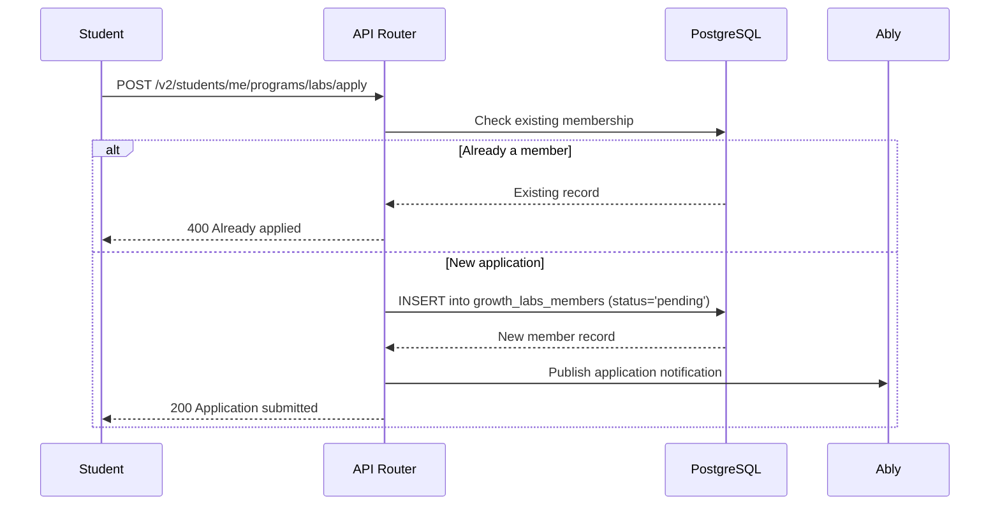
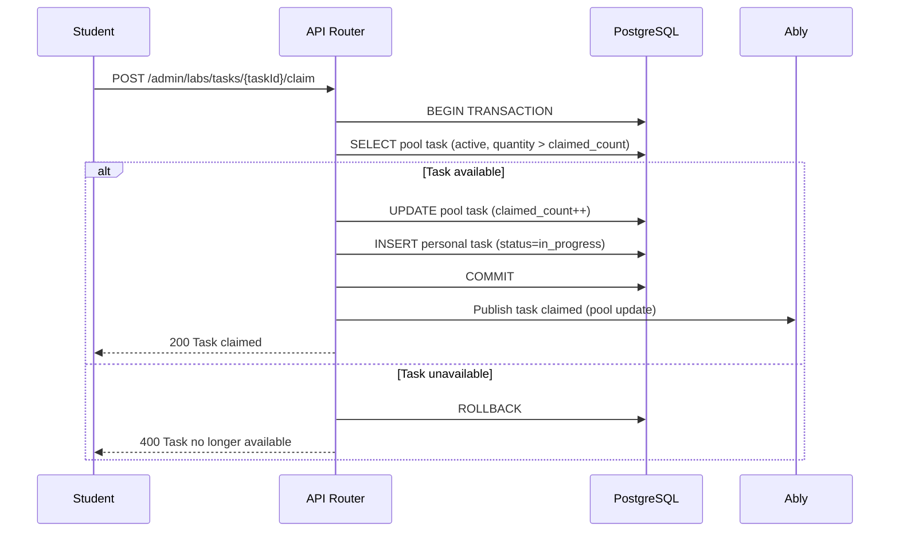
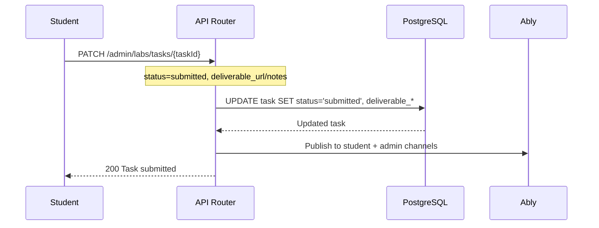
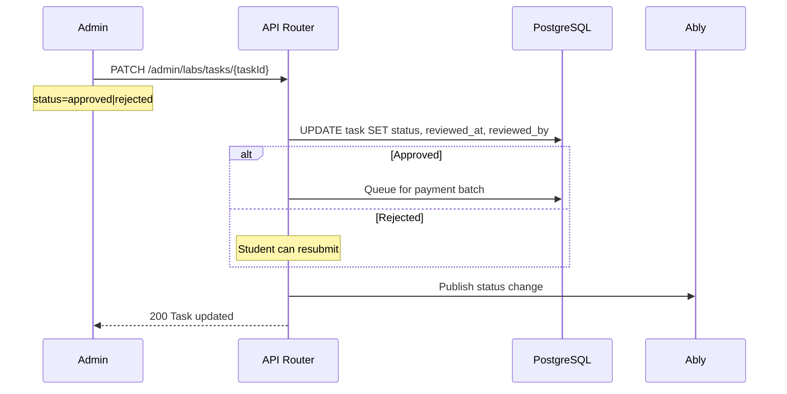

# SoT - Labs Program (FCFS Task Pool)

## Scope

- **DormWay Labs Program** - A student engagement program where students earn money by completing tasks (uploading syllabi, reporting bugs, QA testing, research)
- **FCFS (First-Come-First-Serve) Task Pool Model** - Students browse available tasks and claim them; no manual assignment
- Covers student-facing Labs dashboard, admin management, task lifecycle, payments, and real-time updates
- Includes bug report submission integrated with Labs

## Non-goals

- Campus Ambassador program (referral-based earnings) - see SoT - Ambassador Program when created
- Campus Outreach CRM - separate system in Growth Ops
- Payment processing integration (Gusto/PayPal) - handled externally

## Invariants & Contracts

- **Task claiming is atomic**: A task can only be claimed by one student; the `claimed_count` check must happen in a transaction
- **Students can only see approved tasks**: Tasks must have `is_active = true` AND `quantity > claimed_count`
- **Deadlines are enforced**: Unclaimed tasks auto-expire; claimed but unsubmitted tasks return to pool after deadline
- **Payout is in cents**: All `payout_cents` values are integers (e.g., 500 = $5.00)
- **Status progression**: Task status follows: `unclaimed` → `in_progress` → `submitted` → `approved|rejected` → `paid`
- **Member status required**: Only `active` Labs members can claim tasks
- **Campus filtering**: If a task has `campus_id`, only students from that campus can see/claim it

## Key Flows (High-Level)

### Student Applies to Labs



### Student Claims a Task (FCFS)



### Student Submits Task



### Admin Reviews Submission



## Data Models / IDs / Terminology

### Database Tables

**`growth_labs_members`** - Labs program membership:
| Column | Type | Description |
|--------|------|-------------|
| `id` | UUID | Primary key |
| `account_id` | UUID | FK to accounts.id |
| `status` | TEXT | `pending`, `active`, `inactive` |
| `motivation` | TEXT | Application motivation text |
| `social_reach` | INTEGER | Self-reported social media reach |
| `campus_id` | UUID | FK to contexts.id (campus) |
| `joined_at` | TIMESTAMP | When approved |
| `created_at` | TIMESTAMP | When applied |

**`growth_labs_pool_tasks`** - Task pool (admin-created templates):
| Column | Type | Description |
|--------|------|-------------|
| `id` | UUID | Primary key |
| `title` | TEXT | Task title |
| `description` | TEXT | Task instructions |
| `task_type` | TEXT | `syllabus_upload`, `bug_report`, `qa_testing`, `research`, `other` |
| `payout_cents` | INTEGER | Payment amount in cents |
| `quantity` | INTEGER | Total available (set high for unlimited) |
| `claimed_count` | INTEGER | How many have been claimed |
| `deadline` | TIMESTAMP | When claims must be submitted by |
| `campus_id` | UUID | Optional campus restriction |
| `is_active` | BOOLEAN | Visible to students |
| `created_by` | UUID | Admin who created it |

**`growth_labs_tasks`** - Individual claimed/assigned tasks:
| Column | Type | Description |
|--------|------|-------------|
| `id` | UUID | Primary key |
| `pool_task_id` | UUID | FK to pool task (null for legacy) |
| `member_id` | UUID | FK to growth_labs_members.id |
| `title` | TEXT | Copied from pool task |
| `description` | TEXT | Copied from pool task |
| `task_type` | TEXT | Inherited from pool |
| `status` | TEXT | `in_progress`, `submitted`, `approved`, `rejected`, `paid` |
| `payout_cents` | INTEGER | Payout for this specific task |
| `deadline` | TIMESTAMP | Inherited from pool |
| `deliverable_url` | TEXT | Link to completed work |
| `notes` | TEXT | Free-text deliverable notes |
| `claimed_at` | TIMESTAMP | When claimed |
| `submitted_at` | TIMESTAMP | When submitted |
| `reviewed_at` | TIMESTAMP | When approved/rejected |
| `reviewed_by` | UUID | Admin who reviewed |
| `paid_at` | TIMESTAMP | When payment processed |

### Status Enums

**Member Status**: `pending` → `active` (approved) | `inactive` (deactivated)

**Task Status**:
```
unclaimed (pool only)
    ↓ (student claims)
in_progress
    ↓ (student submits)
submitted
    ↓ (admin reviews)
approved | rejected
    ↓ (if approved, payment processed)
paid
```

### Task Types

| Type | Description | Typical Payout |
|------|-------------|----------------|
| `syllabus_upload` | Upload course syllabi | $2-5 |
| `bug_report` | Find and document bugs | $5-20 |
| `qa_testing` | Test specific features | $5-15 |
| `research` | User interviews, surveys | $10-25 |
| `other` | Custom tasks | Varies |

## Key Files (Code + Docs)

### Backend (api-router)

- `services/api-router/src/routes/admin/labs-routes.ts` - All Labs API endpoints (1400+ lines)
  - Member CRUD, task pool CRUD, task claiming, submissions, payments
  - Real-time notifications via Ably

- `services/api-router/src/routes/v2/programs.routes.ts` - Student program status endpoint
  - `GET /v2/students/me/programs` - Unified Labs + Ambassador status

### Frontend (dormway-lockedin)

- `services/dormway-lockedin/src/app/dashboard/labs/page.tsx` - Student Labs dashboard
  - Task pool browser, My Work view, earnings tracker
  - Real-time task claiming with optimistic updates

- `services/dormway-lockedin/src/app/dashboard/programs/page.tsx` - Program application page
  - Apply to Labs and/or Ambassador programs

### Admin (dormway-admin)

- `services/dormway-admin/src/pages/growth/labs/index.tsx` - Admin Labs dashboard (1500+ lines)
  - Applications tab, Members tab, Task Pool tab, Submissions tab, Analytics tab
  - Full CRUD for all Labs entities

### Database

- `infrastructure/database/migrations/100_labs_fcfs_pool.sql` - Pool task tables
- `infrastructure/database/migrations/068_growth_ops_tables.sql` - Base Labs tables
- `infrastructure/database/migrations/099_labs_task_pool_fields.sql` - Added pool_task_id

### Documentation

- `mintlify-docs/docs/growth-ops/labs.mdx` - Admin dashboard guide
- `mintlify-docs/docs/growth-ops/labs-student-guide.mdx` - Student guide

## API Endpoints

### Student Endpoints

| Method | Path | Description |
|--------|------|-------------|
| `GET` | `/v2/students/me/programs` | Get Labs + Ambassador status |
| `POST` | `/v2/students/me/programs/labs/apply` | Apply to Labs |
| `GET` | `/admin/labs/pool` | Get available tasks (filtered by campus) |
| `GET` | `/admin/labs/tasks/me` | Get my claimed tasks |
| `POST` | `/admin/labs/tasks/{id}/claim` | Claim a task |
| `POST` | `/admin/labs/tasks/{id}/unclaim` | Unclaim a task |
| `PATCH` | `/admin/labs/tasks/{id}` | Submit task (status, deliverable) |

### Admin Endpoints

| Method | Path | Description |
|--------|------|-------------|
| `GET` | `/admin/labs/applications` | List pending applications |
| `PATCH` | `/admin/labs/applications/{id}` | Approve/reject application |
| `GET` | `/admin/labs/members` | List all members |
| `PATCH` | `/admin/labs/members/{id}` | Update member status |
| `GET` | `/admin/labs/pool` | List all pool tasks |
| `POST` | `/admin/labs/pool` | Create pool task |
| `PATCH` | `/admin/labs/pool/{id}` | Update pool task |
| `DELETE` | `/admin/labs/pool/{id}` | Delete pool task |
| `GET` | `/admin/labs/tasks` | List all submissions |
| `PATCH` | `/admin/labs/tasks/{id}` | Review submission |
| `POST` | `/admin/labs/payouts/mark-paid` | Bulk mark as paid |

## Real-Time Updates (Ably)

### Channels

| Channel | Subscribers | Events |
|---------|-------------|--------|
| `growth:labs-pool` | All Labs members | `pool-updated` (task added/claimed/removed) |
| `growth:labs-tasks:{accountId}` | Individual student | `task-updated` (status change) |
| `growth:admin-tasks` | Admins | All task events |

### Event Payloads

```typescript
// pool-updated
{
  type: 'pool-updated',
  taskId: string,
  action: 'created' | 'claimed' | 'updated' | 'deleted',
  remainingQuantity?: number
}

// task-updated
{
  type: 'task-updated',
  taskId: string,
  status: string,
  reviewedAt?: string
}
```

## Update Checklist

- **If adding a new task type**: Update the `task_type` check constraint in migrations and frontend select options
- **If changing payout logic**: Update both `labs-routes.ts` (calculation) and admin UI (display)
- **If modifying pool visibility rules**: Update `GET /admin/labs/pool` query and frontend filter logic
- **If adding new member status**: Update enum, status badges, and filter chips in all UIs
- **If changing deadline behavior**: Update both pool check and task expiry logic

## Known Discrepancies / Risks

- **Legacy tasks without `pool_task_id`**: Some older tasks were manually assigned before the pool model; they have null `pool_task_id`
- **No automatic deadline enforcement**: Currently tasks don't auto-expire; requires manual admin cleanup or future Temporal workflow
- **Payment integration manual**: Payouts are marked as "paid" manually after external processing (Gusto/PayPal)

## Recent Changes

- 2026-01-19: Major FCFS Task Pool model implementation
  - Added `growth_labs_pool_tasks` table for admin-managed task templates
  - Added task claiming flow with atomic quantity checks
  - Added `deliverable_notes` field for free-text submissions (not just URLs)
  - Added unified `/v2/students/me/programs` endpoint
  - Added real-time pool updates via Ably
  - Fixed sidebar icon (earn → megaphone animation)
  - Created comprehensive Mintlify documentation
