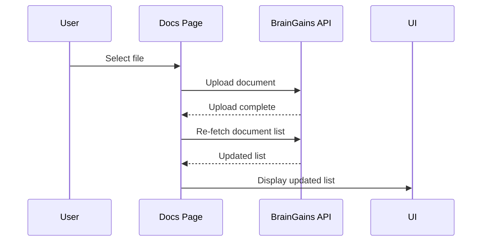
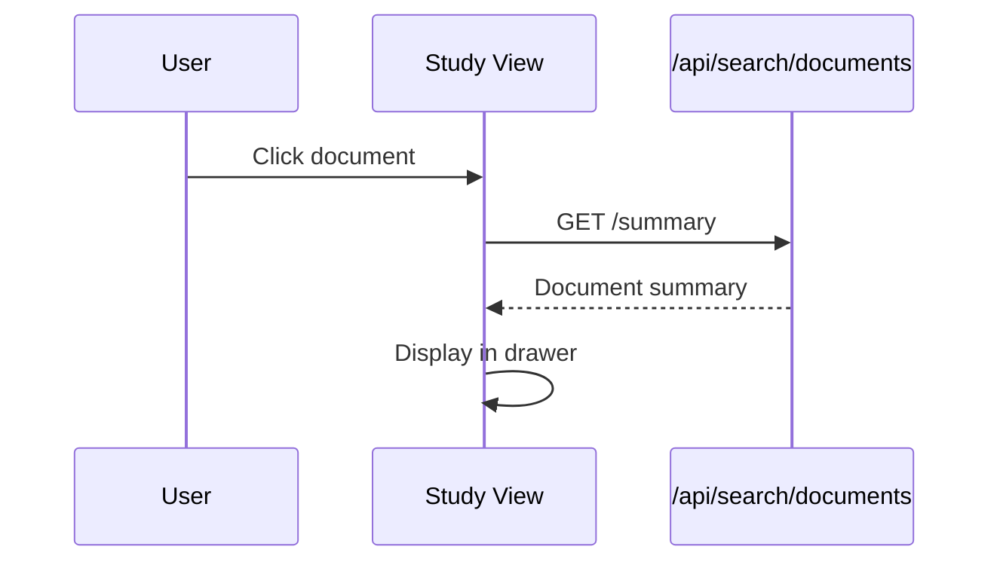
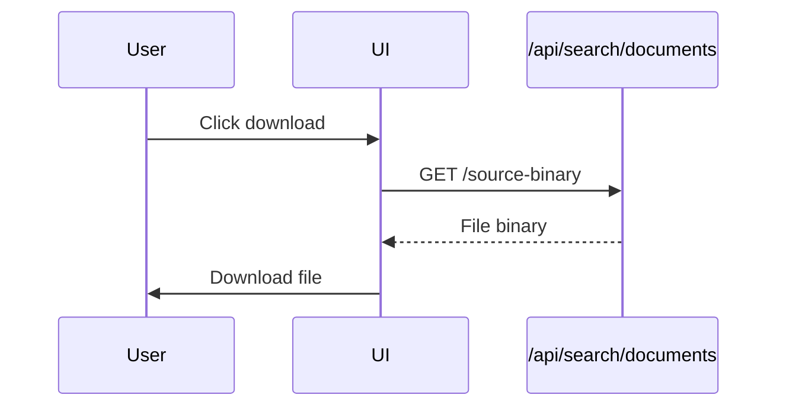
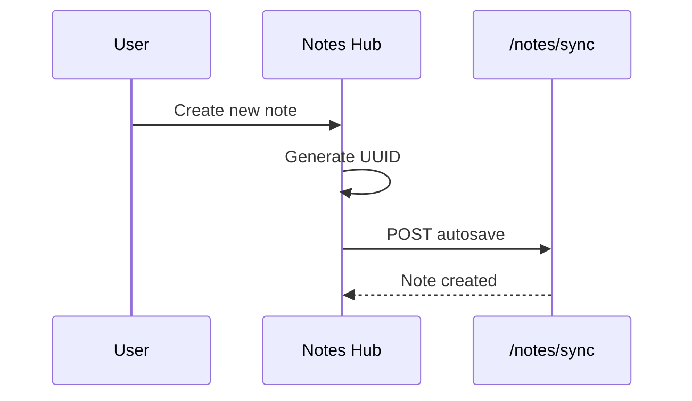
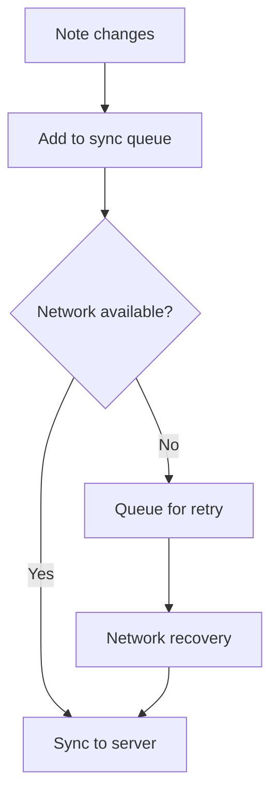
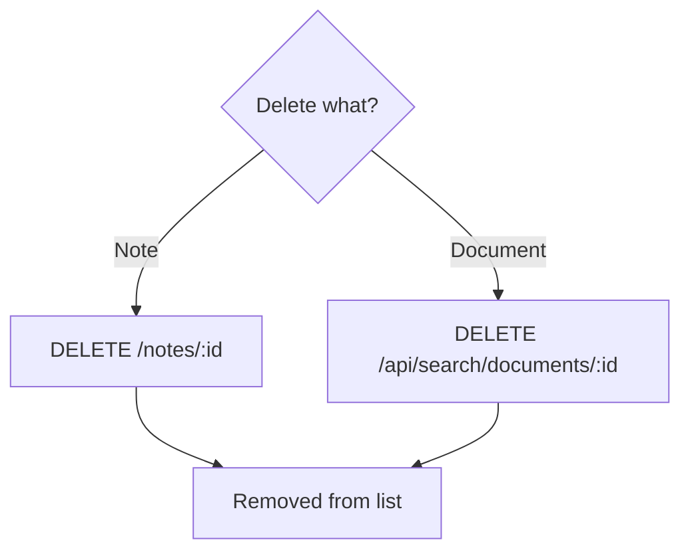

# SoT - Library (Docs & Notes)

## Scope / Non-goals
- Scope: the LockedIn web Docs surface (`/dashboard/documents`) and Notes editor (`/dashboard/notes-hub`) as one Library system.
- Non-goals: future `/dashboard/library` route, full focus panel contract, or iOS notes.

## Invariants & Contracts
- Docs is the **Library** surface in the current web nav (Docs label) and owns files + notes.
- Primary entry route is `/dashboard/documents`; Notes is accessed via Docs tabs/CTAs and `/dashboard/notes-hub`.
- Notes is not a standalone sidebar tab.
- Notes sync uses `/notes/*` endpoints with a durable offline queue and revision tracking.
- Documents list uses BrainGains document APIs (`/api/braingains/documents/my-files` with fallback to `/api/braingains/documents`).
- Course-aware filtering uses `contextId` (course context UUID) from `/student/courses`.

## Current Surface Map
- Overview/Files/Notes/Search tabs: `/dashboard/documents` (Overview landing + tab switcher; Search is stubbed).
- Files: `/dashboard/documents` (documents list + upload, filters; Study View default on doc click; summary lives in Study View drawer).
- Notes: `/dashboard/notes-hub` (notes list + editor + autosave/sync; Docs Notes tab surfaces recent notes + CTAs).
- Legacy: `/dashboard/notes` redirects to Notes Hub.

## North Star Path (Target)
- Default landing is Overview (Continue Studying, Recent docs, Recent notes, Inbox).
- Doc click opens Study View (viewer + notes panel) by default.
- Notes remain under Docs, but doc-linked notes are surfaced first.
- Unified search covers docs + notes.
- Two-click access from Home: Docs tab -> target.

Plan: [Docs-Library-North-Star-Path](/docs/plans/workplan/docs-library-north-star-path)

## Roadmap Alignment
- Standardize notes APIs under `/v2/notes/*` endpoints (list, detail, recent, sync) per the v2 standardization roadmap.
- Track status in `obsidian-vault/DormWay/Engineering/Technical/API/V2-Standardization-Roadmap (Current).md`.

## Required Metadata (Current Reality)
Notes metadata (web):
- `title` (string)
- `classId` (course context UUID, optional)
- `documentType` (currently `"Notes"` for student notes)
- `tags` (optional)

Document metadata (web):
- `document_type` or `metadata.document_type` (BrainGains types)
- `courseContextId` or equivalent course metadata (optional)
- `processing_status` (pending/processing/indexed/failed)

## Target Metadata (Docs v1 spec)
These fields are required by the Docs Library v1 spec but are not persisted by the current notes sync payload.

Notes (target):
- `noteType` (`class | reading | assignment | exam | general`)
- `linkedDocIds` (array)
- `linkedTaskIds` (array, optional)

Documents (target):
- `documentType` normalized to Student OS contract
- `courseId` normalized to course context UUID

## Key Flows (High-Level)

### Upload Document

### Preview Document

### Download Document

### Create Note

### Sync Notes

### Delete Note/Document

## Key Files (Code + Docs)
- `services/dormway-lockedin/src/app/dashboard/documents/page.tsx`
- `services/dormway-lockedin/src/app/dashboard/notes-hub/page.tsx`
- `services/dormway-lockedin/src/components/NotesList.tsx`
- `services/dormway-lockedin/src/components/docs/DocsSwitcher.tsx`
- `services/dormway-lockedin/src/lib/notes-sync.ts`
- `services/dormway-lockedin/src/lib/noteLinks.ts`
- `services/dormway-lockedin/docs/LOCKEDIN_IA_AND_CONTRACTS.md`
- `docs/beta-page-map.md`
- `obsidian-vault/DormWay/Product/Design/LockedIn-Docs-Viewer-Notes-Panel-Spec.md`

## Known Gaps / Risks
- Unified search across docs + notes is missing (Search tab is stubbed).
- Notes deep links drop context due to `/dashboard/notes` redirect losing query params.
- Doc-linked notes are filtered client-side from `/notes/recent`; no server-side query by document id yet.
- Docs route does not yet honor `noteId` deep links for opening a specific note in Study View.

## Update Checklist
- If Docs routes or labels change, update `LOCKEDIN_IA_AND_CONTRACTS.md`, `beta-page-map.md`, and sidebar specs.
- If notes metadata fields change, update `notes-sync.ts`, Notes Hub UI, and this SoT.
- If doc APIs change, update `documents/page.tsx` fetch paths and this SoT.

## Recent Changes
- 2026-01-02: Added north star path target and plan link; metadata targets aligned with doc-linked notes.
- 2026-01-03: Docs lands on Overview, Study View is default, summary moved into Study View drawer, Notes/Search tabs added, Docs switcher removed in favor of Docs tabs/Notes Hub link.
- 2026-01-03: Docs lists now use React Query caching with idle-gated fetches and explicit invalidation after uploads/deletes.
