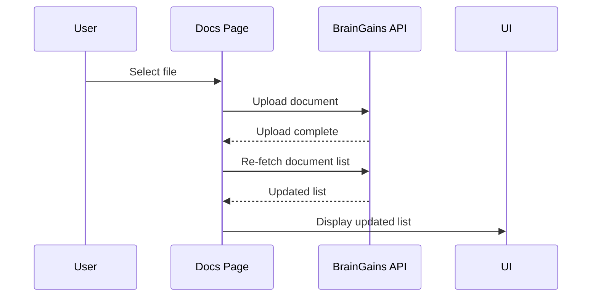
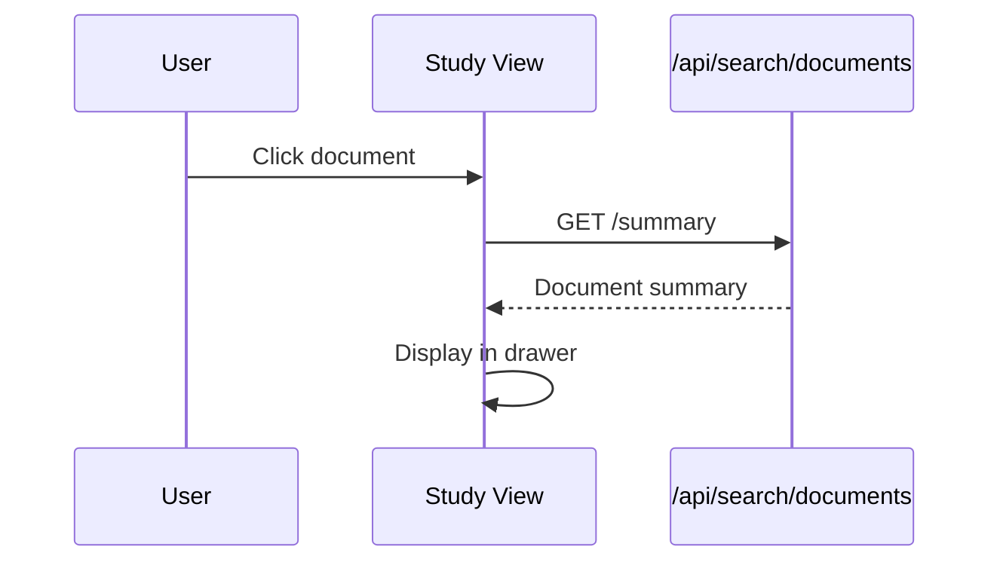
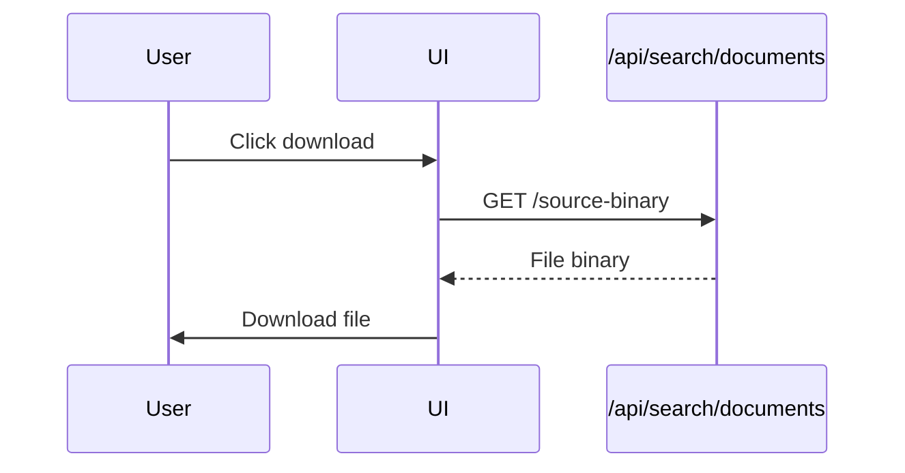
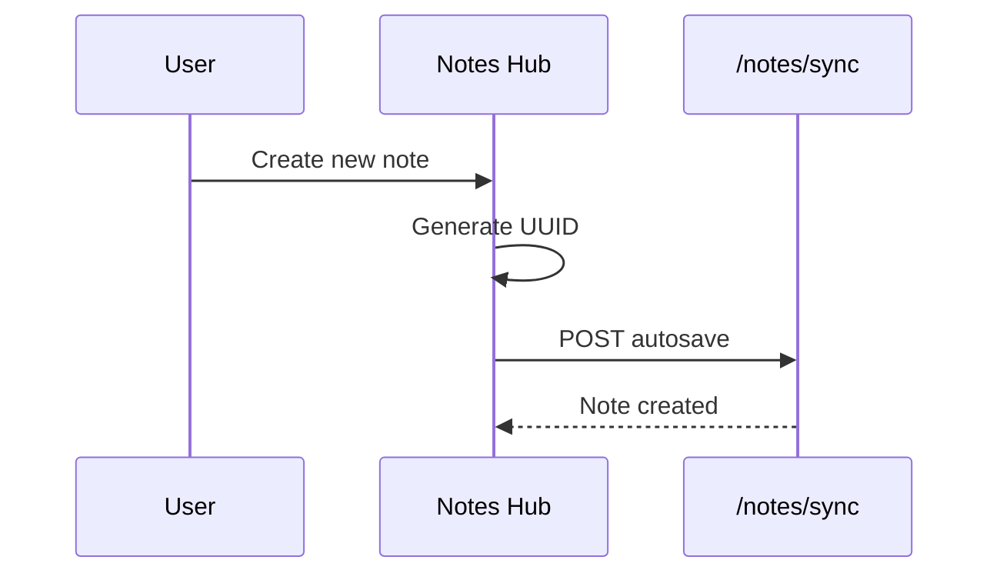
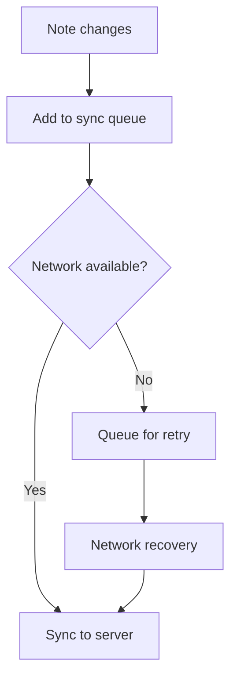
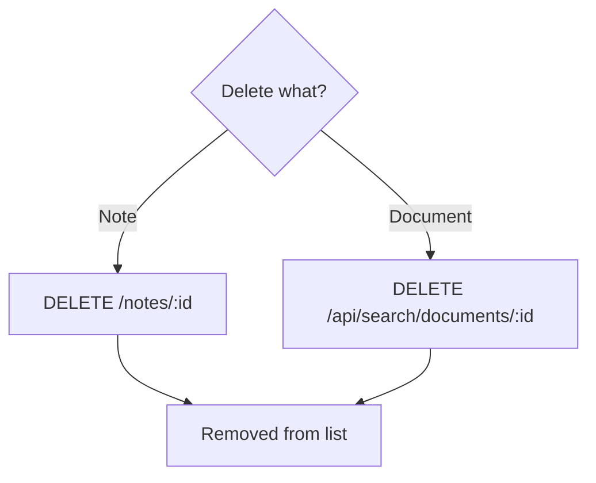

# SoT - Library (Docs & Notes)

## Scope / Non-goals
- Scope: the LockedIn web Library surface (`/dashboard/library`) plus legacy Docs (`/dashboard/documents`) and Notes Hub (`/dashboard/notes-hub`) as one Library system.
- Non-goals: full focus panel contract or iOS notes.

## Invariants & Contracts
- Library is the **primary** knowledge hub for files + notes (`/dashboard/library`, knowledge-first target with course grouping today).
- Legacy entry routes (`/dashboard/documents`, `/dashboard/notes-hub`) remain supported for deep links.
- Notes is not a standalone sidebar tab.
- Notes sync uses `/notes/*` endpoints with a durable offline queue and revision tracking.
- Documents list uses BrainGains document APIs (`/api/braingains/documents/my-files` with fallback to `/api/braingains/documents`).
- Course-aware filtering uses `contextId` (course context UUID) from `/student/courses`.
- Notebook/topic lookups are indexed on `notes_metadata_topic_idx` (noteKind + topicType + topicId).

## Notebook Format (Current Intent)
- **One canonical notebook per course** (course topic). Notes Hub and Library resolve course notebooks via `/v2/notes/notebook`.
- **Session notes live inside the course notebook**, not as separate per-day documents.
- **Term + day headings are auto-inserted** for class notes:
  - Term heading example: `## Winter 2026`
  - Day heading example: `### Jan 13`
- The editor renders a **Term -> Day jump nav**, with term sections collapsible to reduce long-scroll friction.
- Canonical notebook metadata uses `noteKind: notebook` with `topicType: course` and `topicId` as the course context UUID.

## Current Surface Map
- Library (knowledge-first target): `/dashboard/library` (course sidebar by term, quick jump grid, search across notes/files/lectures, course notebook panel with materials, and personal notebooks opened in-place; roadmap adds Global Collections polish).
- Legacy: `/dashboard/documents` (files surface), `/dashboard/notes-hub` (notes editor), `/dashboard/notes` redirects to Notes Hub.

## North Star Path (Target)
- Default landing is Overview (Continue Studying, Recent docs, Recent notes, Inbox).
- Doc click opens Study View (viewer + notes panel) by default.
- Notes remain under Docs, but doc-linked notes are surfaced first.
- Unified search covers docs + notes.
- Two-click access from Home: Docs tab -> target.

Plan: [Docs-Library-North-Star-Path](/docs/plans/workplan/docs-library-north-star-path)
Plan (knowledge hub model): [Library-Knowledge-Hub-Plan](/docs/plans/workplan/library-knowledge-hub-plan)

## Roadmap Alignment
- Standardize notes APIs under `/v2/notes/*` endpoints (list, detail, recent, sync) per the v2 standardization roadmap.
- Track status in `obsidian-vault/DormWay/Engineering/Technical/API/V2-Standardization-Roadmap (Current).md`.

## Required Metadata (Current Reality)
Notes metadata (web):
- `title` (string)
- `classId` (course context UUID, optional)
- `courseCode` (string, optional)
- `documentType` (currently `"Notes"` for student notes)
- `tags` (optional)
- `noteKind` (`notebook` for canonical notebooks, optional)
- `topicType` (`course | personal`, optional)
- `topicId` (course context UUID or personal key, optional)
- `source` (`course | personal | inbox`, optional)
- `termId` / `termLabel` (optional)

Document metadata (web):
- `document_type` or `metadata.document_type` (BrainGains types)
- `courseContextId` or equivalent course metadata (optional)
- `processing_status` (pending/processing/indexed/failed)

## Target Metadata (Docs v1 spec)
These fields are required by the Docs Library v1 spec but are not persisted by the current notes sync payload.

Notes (target):
- `noteType` (`class | reading | assignment | exam | general`)
- `linkedDocIds` (array)
- `linkedTaskIds` (array, optional)

Documents (target):
- `documentType` normalized to Student OS contract
- `courseId` normalized to course context UUID

## Key Flows (High-Level)

### Upload Document

```mermaid
sequenceDiagram
    participant User
    participant Docs as Docs Page
    participant BG as BrainGains API
    participant UI

    User->>Docs: Select file
    Docs->>BG: Upload document
    BG-->>Docs: Upload complete
    Docs->>BG: Re-fetch document list
    BG-->>Docs: Updated list
    Docs->>UI: Display updated list
```

### Preview Document

```mermaid
sequenceDiagram
    participant User
    participant UI as Study View
    participant API as /api/search/documents

    User->>UI: Click document
    UI->>API: GET /summary
    API-->>UI: Document summary
    UI->>UI: Display in drawer
```

### Download Document

```mermaid
sequenceDiagram
    participant User
    participant UI
    participant API as /api/search/documents

    User->>UI: Click download
    UI->>API: GET /source-binary
    API-->>UI: File binary
    UI->>User: Download file
```

### Create Note

```mermaid
sequenceDiagram
    participant User
    participant Hub as Notes Hub
    participant Sync as /notes/sync

    User->>Hub: Create new note
    Hub->>Hub: Generate UUID
    Hub->>Sync: POST autosave
    Sync-->>Hub: Note created
```

### Sync Notes

```mermaid
flowchart TD
    A[Note changes] --> B[Add to sync queue]
    B --> C{Network available?}
    C -->|Yes| D[Sync to server]
    C -->|No| E[Queue for retry]
    E --> F[Network recovery]
    F --> D
```

### Delete Note/Document

```mermaid
flowchart TD
    A{Delete what?}
    A -->|Note| B["DELETE /notes/:id"]
    A -->|Document| C["DELETE /api/search/documents/:id"]
    B --> D[Removed from list]
    C --> D
```

## Key Files (Code + Docs)
- `services/dormway-lockedin/src/app/dashboard/documents/page.tsx`
- `services/dormway-lockedin/src/app/dashboard/notes-hub/page.tsx`
- `services/dormway-lockedin/src/components/NotesList.tsx`
- `services/dormway-lockedin/src/components/docs/DocsSwitcher.tsx`
- `services/dormway-lockedin/src/lib/notes-sync.ts`
- `services/dormway-lockedin/src/lib/noteLinks.ts`
- `scripts/ops/backfill-course-notebooks.sh`
- `services/dormway-lockedin/docs/LOCKEDIN_IA_AND_CONTRACTS.md`
- `docs/beta-page-map.md`
- `obsidian-vault/DormWay/Product/Design/LockedIn-Docs-Viewer-Notes-Panel-Spec.md`

## Known Gaps / Risks
- Unified search across docs + notes is missing (Search tab is stubbed).
- Notes deep links drop context due to `/dashboard/notes` redirect losing query params.
- Doc-linked notes are filtered client-side from `/notes/recent`; no server-side query by document id yet.
- Docs route does not yet honor `noteId` deep links for opening a specific note in Study View.

## Update Checklist
- If Docs routes or labels change, update `LOCKEDIN_IA_AND_CONTRACTS.md`, `beta-page-map.md`, and sidebar specs.
- If notes metadata fields change, update `notes-sync.ts`, Notes Hub UI, and this SoT.
- If doc APIs change, update `documents/page.tsx` fetch paths and this SoT.

## Recent Changes
- 2026-01-02: Added north star path target and plan link; metadata targets aligned with doc-linked notes.
- 2026-01-03: Docs lands on Overview, Study View is default, summary moved into Study View drawer, Notes/Search tabs added, Docs switcher removed in favor of Docs tabs/Notes Hub link.
- 2026-01-03: Docs lists now use React Query caching with idle-gated fetches and explicit invalidation after uploads/deletes.
- 2026-01-20: Notes Hub uses course notebooks (single notebook per course), supports courseCode deep links, and auto-adds date sections for class notes.
- 2026-02-01: Documented course-first Library surface and added notebook hierarchy plan.
- 2026-02-01: Added `/v2/notes/notebook` endpoint and notebook metadata (noteKind/topicType/topicId/source/term).
- 2026-01-22: Library becomes the primary surface (`/dashboard/library`) with term-grouped notebooks, schedule-aware auto focus, and lectures auto-scoped to current/next class.
- 2026-02-02: Added LibraryFilesManager component with list/grid view toggle, sorting (name/date/type/course), multi-filter dropdowns (file type + course), local search, Deep overlay for document preview with Ragie AI summary, download functionality, and pin/unpin. Fixed search input race condition using searchTypingRef guard. Fixed hydration errors in LibrarySearchResults (button nesting) and ConditionalGoogleOneTap (mounted state pattern).
- 2026-02-03: Consolidated notebook format (canonical course notebook + term/day headings + jump nav) into this SoT.
