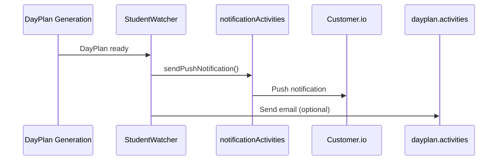
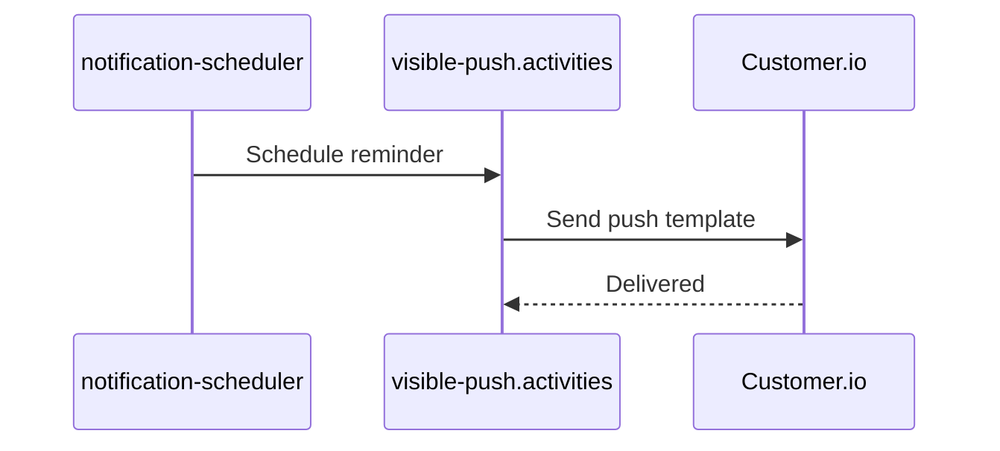
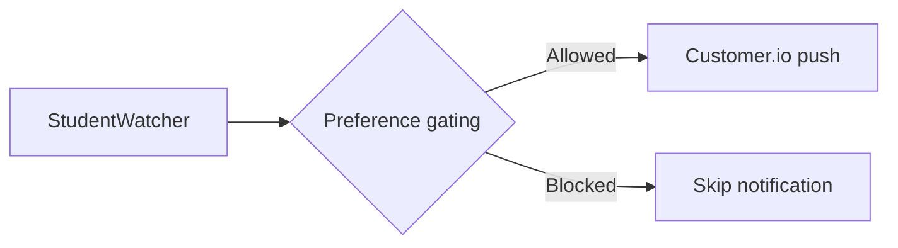
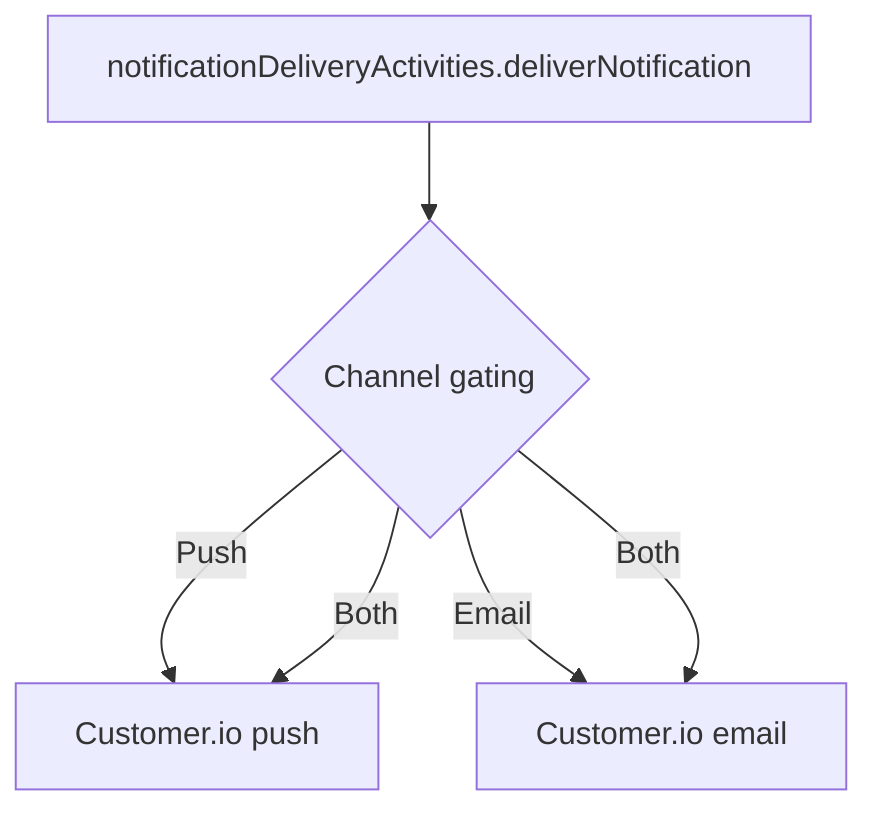
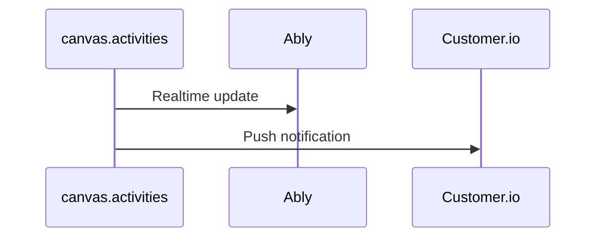
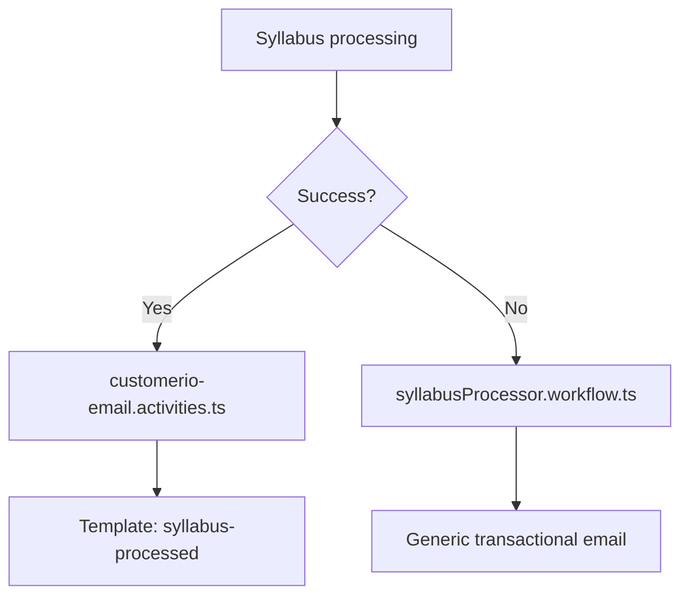
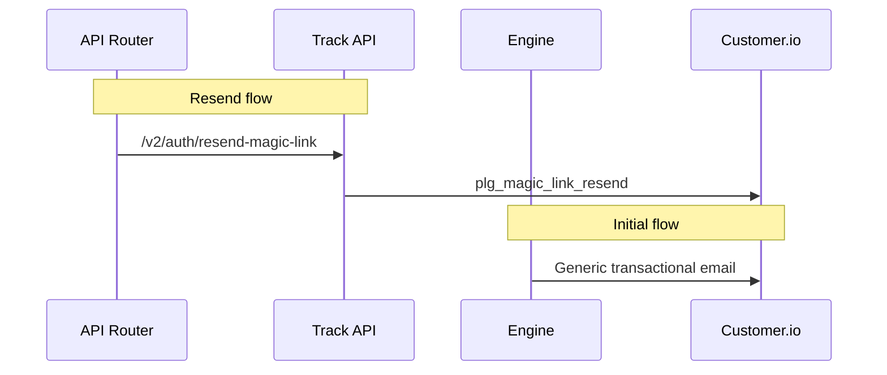
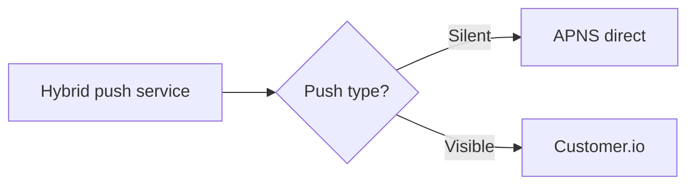

# SoT - Notifications (Customer.io)

## Scope
- Customer.io adapter configuration and API usage (Track API + App API).
- Engine activities and workflows that send Customer.io pushes and transactional emails.
- API router Customer.io entry points (magic link resend, hybrid push).
- Preference gating and scheduling logic that controls notification delivery.

## Non-goals
- APNS key management and device token registration details outside Customer.io.
- Ably/in-app notification delivery (see realtime docs).
- Frontend Customer.io analytics snippets (syllabus-webviewer).

## Invariants & Contracts
- Customer.io adapter disables Track API if `CUSTOMER_IO_SITE_ID` or `CUSTOMER_IO_TRACK_API_KEY` is missing; App API features (push/transactional) require `CUSTOMER_IO_API_KEY`.
- All Customer.io user identifiers are normalized to lowercase before sending.
- Track API events include a unix `timestamp` and are sent via `trackEvent`; transactional messages and push use App API `/send/email` or `/send/push`.
- Push payloads default to `to: 'last_used'` and include silent push support (`content-available`).
- No idempotency keys are attached in Customer.io payloads; de-duplication is handled by workflow logic and Temporal retries.
- `trackCustomerIOServerEvent` accepts event types: `user_registered`, `onboarding_completed`, `first_syllabus_uploaded`, `dashboard_generated`, `context_predicted`, `context_prediction_background`, `weekly_summary_generated`, `braingains_completed`, `schedule_synced`, `milestone_achieved`.
- Batch customer.io trait/event updates process 10 records at a time with a 100ms delay between batches.
- Notification template routing:
  - Real-time push (`notification.activities.ts`): currently always uses `realtime_generic_push` (no per-type mapping yet).
  - Scheduled briefings (`notificationDeliveryActivities.ts`): template IDs come from env (`CUSTOMERIO_*_PUSH_TEMPLATE_ID`, `CUSTOMERIO_*_EMAIL_TEMPLATE_ID`); missing IDs throw.
  - DayPlan email uses `CUSTOMER_IO_DAYPLAN_EMAIL_ID` or default `dayplan_morning`.
  - Syllabus email uses transactional ID `syllabus-processed`; syllabus failure email uses `generic_email` or metadata override.
  - Magic link resend uses transactional ID `plg_magic_link_resend` (Track API send).
  - Canvas alerts use tracking ID `canvas_canary_alert`.
  - Visible push tracking IDs include `weather_alert`, `academic_deadline`, `class_reminder`, `calendar_<eventType>`, `campus_<direction>`.
- Preference gating:
  - DayPlan emails skip light days when `dayplan.email_on_light_days === false`.
  - StudentWatcher action notifications respect quiet hours and per-type flags (`classReminders`, `assignmentDeadlines`).
  - Notification delivery filters channels based on `engine_user_notification_preferences` and quiet hours; push implies in-app.
- Settings UI writes notification preferences per `LockedIn Settings & Preferences Spec (Web)` and must preserve existing keys.
- Silent push routing uses `USE_CUSTOMER_IO_PUSH` to select Customer.io vs API router.

## Key Flows (High-Level)

### DayPlan Push Notification

### Scheduled Reminders

### DayPlan Action Reminders

### Briefings/Check-ins

### Canvas Updates

### Syllabus Processing Notifications

### Magic Link Flows

### Hybrid Push (API Router)

## Data Models / IDs / Terminology
- Customer.io traits (`CustomerIOUserTraits`) and event properties (`CustomerIOEventProperties`) are the Track API payloads.
- Transactional message IDs used in code: `dayplan_morning`, `syllabus-processed`, `generic_email`, `plg_magic_link_resend`, `onboarding_complete_push`, `canvas_canary_alert`, `realtime_*_push`.
- Notification IDs are generated per send (`notif-*`, `dayplan-generated-*`, `dayplan-action-*`) and included in payload data.
- `engine_user_notification_preferences` drives channel gating and quiet hours.

## Key Files (Code + Docs)
- `services/shared/dormway-core/src/adapters/customerio/customerio.adapter.ts` (Track/App API implementation)
- `services/shared/dormway-core/src/adapters/customerio/types.ts` (traits, event, push payload types)
- `services/engine/src/services/customerio-adapter.ts` + `services/api-router/src/services/customerio-adapter.ts` (adapter wiring)
- `services/engine/src/services/customerio.ts` (engine-level wrappers)
- `services/engine/src/services/customerio-templates.ts` (push template content)
- `services/engine/src/activities/customerio.ts` (Customer.io activities)
- `services/engine/src/activities/notification.activities.ts` (realtime push template mapping)
- `services/engine/src/activities/notificationDeliveryActivities.ts` (briefing delivery, template IDs, preferences)
- `services/engine/src/activities/visible-push.activities.ts` + `services/engine/src/activities/silent-push.activities.ts` (scheduled push delivery)
- `services/engine/src/activities/dayplan.activities.ts` (DayPlan email sending + light-day gating)
- `services/engine/src/activities/customerio-email.activities.ts` (syllabus processed email)
- `services/engine/src/services/auroraDb.ts` (notification preferences store)
- `services/engine/src/workflows/studentWatcher.simplified.workflow.ts` (preference gating + push/email triggers)
- `services/engine/src/workflows/studentProcessor.workflow.ts` (onboarding push templates)
- `services/engine/src/workflows/syllabusProcessor.workflow.ts` (failure email template selection)
- `services/engine/src/activities/clerkAuth.activities.ts` (magic link email)
- `services/api-router/src/routes/v2/auth.routes.ts` (magic link resend)
- `services/api-router/src/services/hybrid-push-service.ts` (Customer.io for visible pushes)
- `services/engine/src/activities/canvas.activities.ts` (Canvas push alerts)
- `obsidian-vault/DormWay/Engineering/Architecture/LockedIn Settings & Preferences Spec (Web).md`

## Update Checklist
- Adding a new notification type: update `notification.activities.ts` template mapping and add Customer.io template ID.
- Changing briefing templates or channels: update `notificationDeliveryActivities.ts` and environment variables.
- Changing DayPlan email rules: update `dayplan.activities.ts` gating and template ID.
- Changing magic link templates: update `v2/auth.routes.ts` and `clerkAuth.activities.ts`.
- Changing Customer.io credentials or region: update adapter wiring in engine/api-router and environment config.
- Changing silent push routing: update `silent-push.activities.ts` (USE_CUSTOMER_IO_PUSH).
- Changing event type names: update `activities/customerio.ts` and call sites.

## Known Discrepancies / Risks
- `sendDirectPushNotification` in `services/engine/src/activities/student.activities.ts` returns early with push disabled; any code paths relying on it will not send.

## Recent Changes
- 2026-01-01: Linked settings/preferences spec for notification controls and gating keys.
- 2025-12-22: Populated with Customer.io adapter contracts, template routing, and preference gating.
