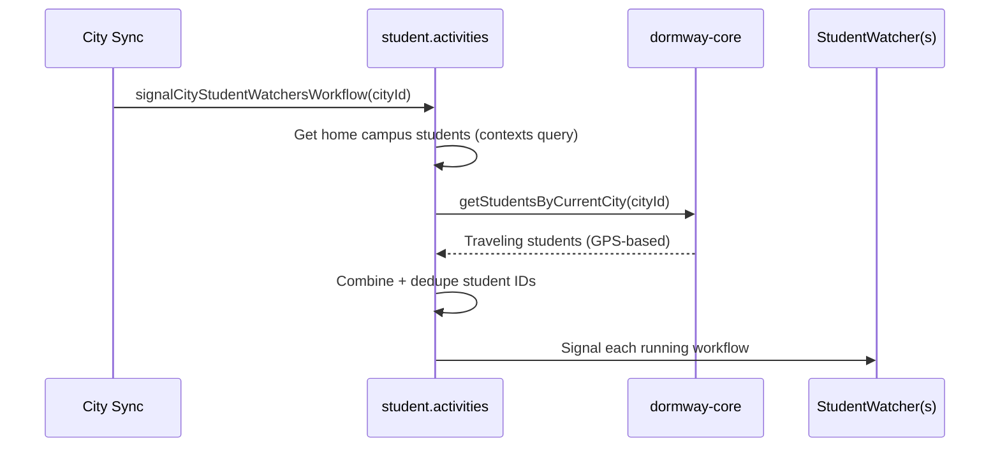

# SoT - StudentWatcher

## Scope
- Temporal `studentWatcherWorkflow` digital twin (signals, schedule loop, auto-sync triggers).
- StudentWatcher start/stop and signal entry points (engine + API router).
- Workflow state persistence and timezone selection.

## Non-goals
- DayPlan generation internals (see `dayplan.activities.ts`).
- Calendar ingestion/normalization or schedule import (covered in calendar SoT).
- UI implementations (admin panel, web widgets, iOS views).

## Invariants & Contracts
- Workflow type is `studentWatcherWorkflow` (used in Temporal queries and start calls).
- Canonical workflow ID is `student-watcher-${userId}` when started by engine activities and onboarding flows.
- Supported signals: `daily_plan`, `context_update`, `generate_plan`, `preferences_update`, `trigger_calendar_sync`, `trigger_canvas_sync`, `send_evening_briefing`, `generate_feed_cards`, `test_push_notification`, `send_push_notification`, `trigger_dayplan_push`.
- Workflow loop runs every 5 minutes (288 checks/day); `continueAsNew` triggers at midnight in the user’s timezone.
- Daily plan generation runs at 5 AM user time when the plan date changes; evening briefing runs at configured hour (default 20:00).
- Auto-sync cadence: calendar + Canvas sync are evaluated hourly and fire when last sync is ≥ 6 hours old.
- Auto-sync plan regeneration is throttled to once every 30 minutes (per `AUTO_SYNC_REGEN_INTERVAL_MS`).

## Key Flows (High-Level)

### Start on Onboarding

### Start on Clerk Signup

### Admin-Driven Signals

### City-Level Signals (DORM-806)

When a city syncs (e.g., weather update), `signalCityStudentWatchersWorkflow` signals all students who should receive city updates:

**Traveling Student Detection:**
- `getStudentsByCurrentCity()` uses PostGIS spatial queries (`ST_DWithin`)
- Finds students whose recent GPS location (24-hour window) is within 5km of any campus in the target city
- Filters to "traveling" students: those whose **home campus is NOT** in the target city
- Prevents duplicate signals by deduping with home campus students

**Parameters:**
- `maxAgeHours`: GPS recency window (default: 24 hours)
- `radiusMeters`: Proximity threshold (default: 5000m)
- `travelingOnly`: Exclude students whose home is already in target city (default: true)

**Debug Endpoint:**
`GET /api/admin/debug/traveling-students/:cityId` - Test traveling student detection

### Runtime Loop

## Known Discrepancies / Risks
- Workflow ID mismatch: `preferences-routes` uses `studentWatcher-${userId}` while canonical IDs use `student-watcher-${userId}`; signals from this route may miss the active workflow. (`services/api-router/src/routes/admin/preferences-routes.ts`)

## Data Models / IDs / Terminology
- `ContextUpdateSignal.type`: `location`, `activity`, `calendar`, `preference`, `syllabus_update`, `syllabus_added`, `course_enrollment_changed`.
- `WorkflowState`: persisted in `student_watcher_state` (last email/push, last plan generation, state data).
- `WorkflowStatus` query returns `studentId`, `currentPlanId`, `lastPlanGeneration`, and `dayPlanVersion`.

## Key Files (Code + Docs)
- `services/engine/src/workflows/studentWatcher.simplified.workflow.ts` (signals, scheduling loop, auto-sync)
- `services/engine/src/activities/student.activities.ts` (start workflow + timezone lookup + city signal targeting)
- `services/engine/src/activities/workflowState.activities.ts` (load/save workflow state)
- `services/engine/src/types/dayplan.types.ts` (signal payload types)
- `services/engine/src/workflows/studentProcessor.workflow.ts` (onboarding start + broadcast signals)
- `services/shared/dormway-core/src/entities/student/student.factory.ts` (traveling student detection via GPS)
- `services/api-router/src/routes/webhooks/clerk-routes.ts` (signup start)
- `services/api-router/src/routes/admin/dayplan-admin-actions.ts` (manual regenerate/email signals)
- `services/api-router/src/routes/admin/preferences-routes.ts` (preferences update signal)
- `services/api-router/src/routes/admin-routes.ts` (debug endpoints including traveling students)

## Update Checklist
- Changing workflow ID or task queue: update start points in `student.activities.ts`, `studentProcessor.workflow.ts`, and webhook/admin routes.
- Changing signal names/payloads: update `dayplan.types.ts` and every caller that signals StudentWatcher.
- Adjusting schedule or sync cadence: update constants in `studentWatcher.simplified.workflow.ts` and any test scripts.
- Adding new context update types: update `ContextUpdateSignal` and handler logic.

## Recent Changes
- 2026-01-04: DORM-806 - Added traveling student detection. `getStudentWatcherWorkflowIdsByCity` now includes students whose GPS location is near campuses in the target city (not just home campus students). Uses PostGIS spatial queries via `getStudentsByCurrentCity()` in dormway-core.
- 2025-12-22: Populated and verified against current workflow + API entry points.
