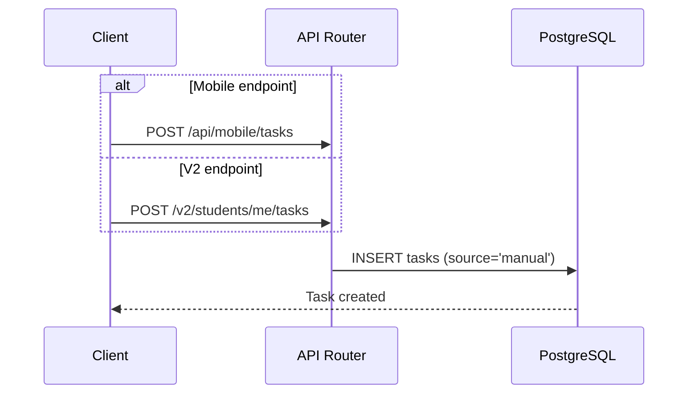
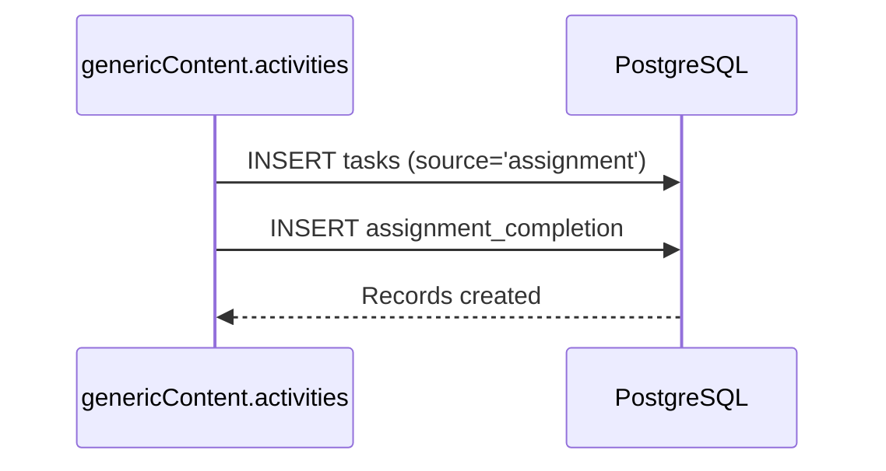
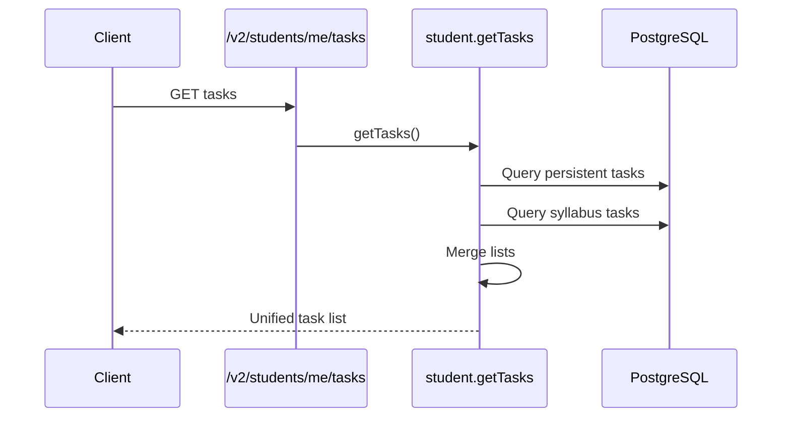
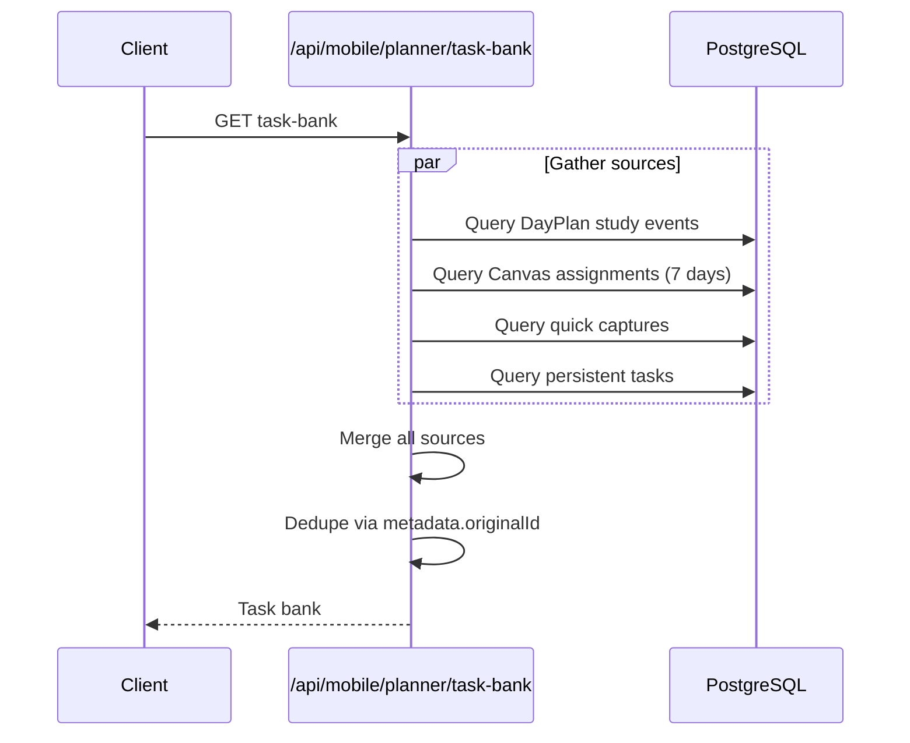
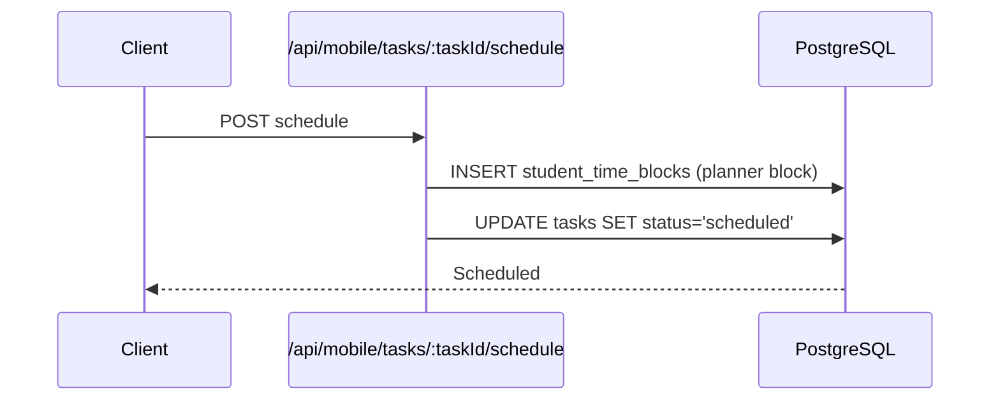
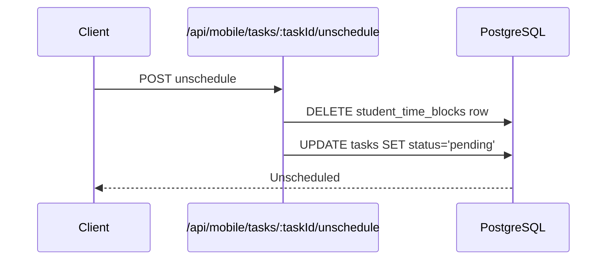
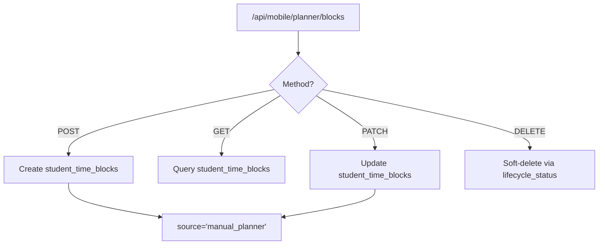
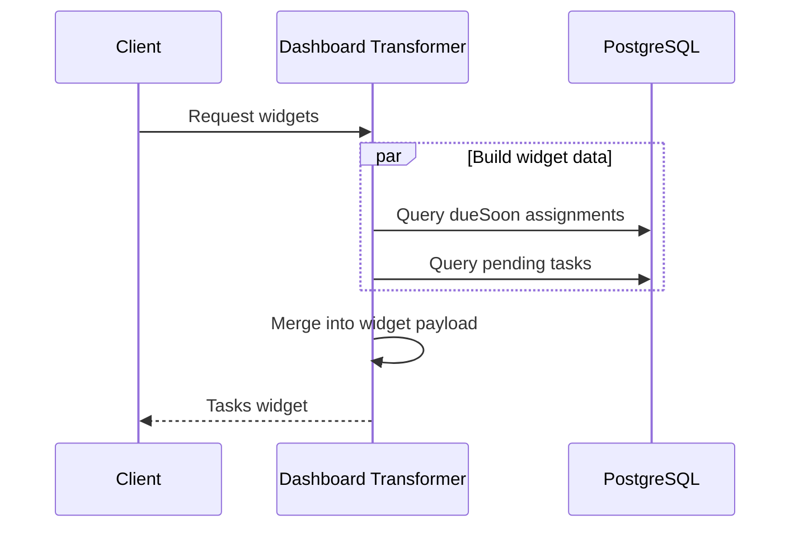

# SoT - Tasks, Assignments, Planner Blocks

## Scope / Non-goals
- Scope: persistent task lifecycle (`tasks`), assignment completion tracking (`assignment_completion`), assignment deadlines in `student_time_blocks`, planner blocks (manual/scheduled time blocks), and how these feed task bank and dashboard widgets.
- Non-goals: UI layout details, Canvas sync internals, or notification content beyond the task/assignment data contracts.

## Invariants & Contracts
- `tasks` is the canonical persistent task table with status in `pending|scheduled|completed|deleted` and `scheduled_block_id` FK to `student_time_blocks` (ON DELETE SET NULL). RLS restricts access to the owner. (`infrastructure/database/migrations/20251009_add_tasks_table.sql`)
- `assignment_completion` is partitioned by `created_at` and stores `assignment_id` as text plus completion metadata; RLS is enforced on the parent table. (`infrastructure/database/migrations/20251003_create_assignment_completion.sql`, `infrastructure/database/migrations/20251202_rls_user_tables.sql`)
- `/v2/students/me/tasks` is non-cacheable and merges persistent tasks with synthetic syllabus tasks from `service_data`. (`services/api-router/src/routes/v2/students.routes.ts`, `services/shared/dormway-core/src/entities/student/student.entity.ts`)
- Syllabus tasks use IDs `syllabus-{courseContextId}-{index}` and can only be marked `completed`; other updates are rejected. (`services/shared/dormway-core/src/entities/student/student.entity.ts`, `services/api-router/src/routes/v2/students.routes.ts`)
- Assignments used in DayPlan are read from `student_time_blocks` where `type='assignment'` and `lifecycle_status='active'`. (`services/shared/dormway-core/src/domains/day-plan-data/day-plan-data.service.ts`)
- Canvas assignments in dashboard views are derived from `student_time_blocks` joined to Canvas submissions, marking `isCompleted` when `submission_status` is `submitted` or `graded`. (`services/api-router/src/services/dashboard-aurora-service.ts`)
- DueSoon items drop placeholders, skip items beyond ~45 days (non-syllabus) and older than 3 days overdue, and mark submitted items as `completed` before applying `overdue` logic. (`services/api-router/src/services/dashboard-composite-transformer.ts`)
- Scheduling a task creates a `student_time_blocks` row (`source='manual_planner'`, `type='other'`) and updates the task to `scheduled`; unscheduling deletes the block and resets the task to `pending`. (`services/api-router/src/routes/task-routes.ts`)
- Manual planner blocks use `student_time_blocks` with `source='manual_planner'` and are soft-deleted via `lifecycle_status='deleted'`. (`services/api-router/src/routes/mobile-routes.ts`)
- DayPlan scheduling reads pending, unscheduled tasks and generates plan events without mutating task rows. (`services/engine/src/activities/dayplan.activities.ts`)

## Web Surface Alignment (Current vs Target)
- Current: Web Tasks renders a unified list powered by `/v2/students/me/tasks` with deliverables as fallback coverage (no gaps).
- Target: Web Tasks remains the canonical "all tasks" inbox with V2 authoritative status and schedule/unschedule actions; composite is legacy-only.
- Plan: `services/dormway-lockedin/docs/LOCKEDIN_WEB_OS_CONSISTENCY_PLAN.md`.

## Roadmap (Current)
- Add `GET /v2/students/me/academic-summary` to replace `/api/proxy/academic/*`, `/api/proxy/canvas/assignments`, and `/api/proxy/student/courses` fan-out.
- Move deliverables, completion, and weekly matrix into the summary payload with a stable `meta.partialFailures` field.
- Keep `/v2/students/me/tasks` as the authoritative task list; summary provides context only.
- Roadmap: [V2-Standardization-Roadmap (Current)](/docs/engineering/technical/api/v2-standardization-roadmap-current)

## Web Tasks Merge + Status Rules (LockedIn)
- Dedup priority: V2 `metadata.canvasAssignmentId` (matches `Deliverable` canvas IDs) before fallback composite key (`courseContextId|courseCode + normalized title + due day`).
- Row identity: when a V2 task matches, the row uses the V2 `task.id`; fallback deliverables are prefixed (`fallback:<deliverable.id>`).
- Status mapping: V2 `completed`/`scheduled` is authoritative; scheduled inference from time blocks is only used for fallback deliverables. Urgency buckets (overdue/due-soon/later) are derived from `dueAt` and completion, independent of scheduled state.
- Capacity bar: required hours are computed from the unified task rows due in the current week (personal tasks count only when due in-week); scheduled hours come from planner time blocks plus scheduled V2 tasks that do not yet surface as blocks (using estimated minutes).

## Key Flows (High-Level)

### Create Manual Task

### Create Assignment-Backed Task

### Fetch Tasks

### Task Bank

### Schedule Task

### Unschedule Task

### Manual Planner Blocks

### DueSoon + Tasks Widgets

## Data Models / IDs / Terminology
- `tasks` table: `id` UUID, `status`, `priority`, `course_code`, `due_date`, `scheduled_block_id`, `assignment_id`, and JSON `metadata`. (`infrastructure/database/migrations/20251009_add_tasks_table.sql`, `services/api-router/src/types/tasks.ts`)
- Task sources: `manual`, `assignment`, `dayplan`, `ai_suggestion`. (`infrastructure/database/migrations/20251009_add_tasks_table.sql`, `services/api-router/src/types/tasks.ts`)
- Syllabus task IDs: `syllabus-{courseContextId}-{index}`; they are synthetic and completion-only. (`services/shared/dormway-core/src/entities/student/student.entity.ts`)
- `assignment_completion`: partitioned table keyed by `(id, created_at)` with `assignment_id` text and `completion_source` enums. (`infrastructure/database/migrations/20251003_create_assignment_completion.sql`)
- `student_time_blocks`: schedule/assignment storage with `type` from `time_block_type` enum (no `planner_block` value). Planner blocks are stored as `type='other'` with `source='manual_planner'`. (`infrastructure/docker/init-scripts/01-schema.sql`, `services/api-router/src/routes/task-routes.ts`, `services/api-router/src/routes/mobile-routes.ts`)
- Task metadata: `originalId` is used for Task Bank dedupe when ephemeral tasks are converted to persistent. (`services/api-router/src/types/tasks.ts`, `services/api-router/src/routes/mobile-routes.ts`)
- Task Bank: unified unscheduled work list built from dayplan study events, Canvas assignments, quick captures, and persistent tasks. (`services/api-router/src/routes/mobile-routes.ts`)

## Key Files (Code + Docs)
- `services/api-router/src/routes/task-routes.ts`
- `services/api-router/src/routes/v2/students.routes.ts`
- `services/api-router/src/routes/v2/widgets.routes.ts`
- `services/api-router/src/routes/mobile-routes.ts`
- `services/api-router/src/services/dashboard-aurora-service.ts`
- `services/api-router/src/services/dashboard-composite-transformer.ts`
- `services/api-router/src/types/tasks.ts`
- `services/shared/dormway-core/src/entities/student/student.entity.ts`
- `services/shared/dormway-core/src/domains/day-plan-data/day-plan-data.service.ts`
- `services/engine/src/activities/dayplan.activities.ts`
- `services/engine/src/activities/genericContent.activities.ts`
- `services/engine/src/activities/student.activities.ts`
- `infrastructure/database/migrations/20251009_add_tasks_table.sql`
- `infrastructure/database/migrations/20251003_create_assignment_completion.sql`
- `infrastructure/docker/init-scripts/01-schema.sql`
- `services/dormway-lockedin/src/app/dashboard/tasks/page.tsx`
- `services/dormway-lockedin/src/hooks/home/useTasksV2.ts`
- `services/dormway-lockedin/src/types/tasks-v2.ts`
- `services/dormway-lockedin/src/hooks/useSemesterAggregate.ts`
- `services/dormway-lockedin/docs/LOCKEDIN_WEB_OS_CONSISTENCY_PLAN.md`

## Update Checklist
- If you change task lifecycle or sources, update `tasks.ts` types and routes in `task-routes.ts` and `v2/students.routes.ts`.
- If you modify scheduling/unscheduling, update `student_time_blocks` usage and any dashboard cache invalidation.
- If you change assignment ingestion, update `day-plan-data.service.ts`, `dashboard-aurora-service.ts`, and the dueSoon transformer.
- If you change syllabus task IDs or completion semantics, update `student.entity.ts` and completion routes.
- If you touch Task Bank composition, update `/mobile/planner/task-bank` and `TaskMetadata.originalId` handling.

## Related Documentation
- [Tasks Page Canonical Merge Notes](/docs/engineering/technical/tasks/tasks-page-canonical-merge-notes)
- Plans/Tasks-Page-Canonicalization-Plan

## Recent Changes
- 2025-12-30: Standardized task creation UI on `TaskCreateModal`; legacy `AddTaskModal` is deprecated.
- 2025-12-29: Tasks page details + planning now expand inline (no drawers); planner uses a weekly grid with drag-to-select blocks, plus delete for manual tasks and inline filter panel controls.
- 2025-12-28: Web Tasks now merges V2 tasks with deliverable fallback coverage and computes weekly required hours from the unified task list.
- 2025-12-27: Gated semester aggregate fetch to the Forecast tab and aligned Tasks page framing with the beta IA.
- 2025-12-27: Hid intelligence-only tabs behind dev mode to keep Tasks focused on core deadlines in beta.
- 2025-12-27: Added web Tasks alignment target and linked OS consistency plan.
- 2025-12-22: Expanded contracts for task lifecycle, assignment sources, and planner block storage.

## Known Discrepancies / Risks
- Planner blocks are stored as `student_time_blocks.type='other'` with `source='manual_planner'`, but UI grouping logic checks for `event.type === 'planner_block'`. The enum `time_block_type` also lacks `planner_block`. (`services/api-router/src/routes/task-routes.ts`, `services/api-router/src/routes/mobile-routes.ts`, `infrastructure/docker/init-scripts/01-schema.sql`, `services/dormway-lockedin/src/components/schedule/SemesterView.tsx`)
- Deletion semantics differ: planner blocks are soft-deleted via `lifecycle_status='deleted'`, while task unscheduling hard-deletes the `student_time_blocks` row. (`services/api-router/src/routes/mobile-routes.ts`, `services/api-router/src/routes/task-routes.ts`)
