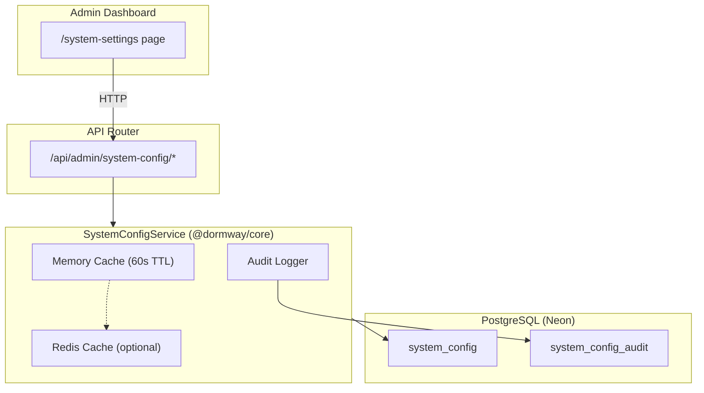
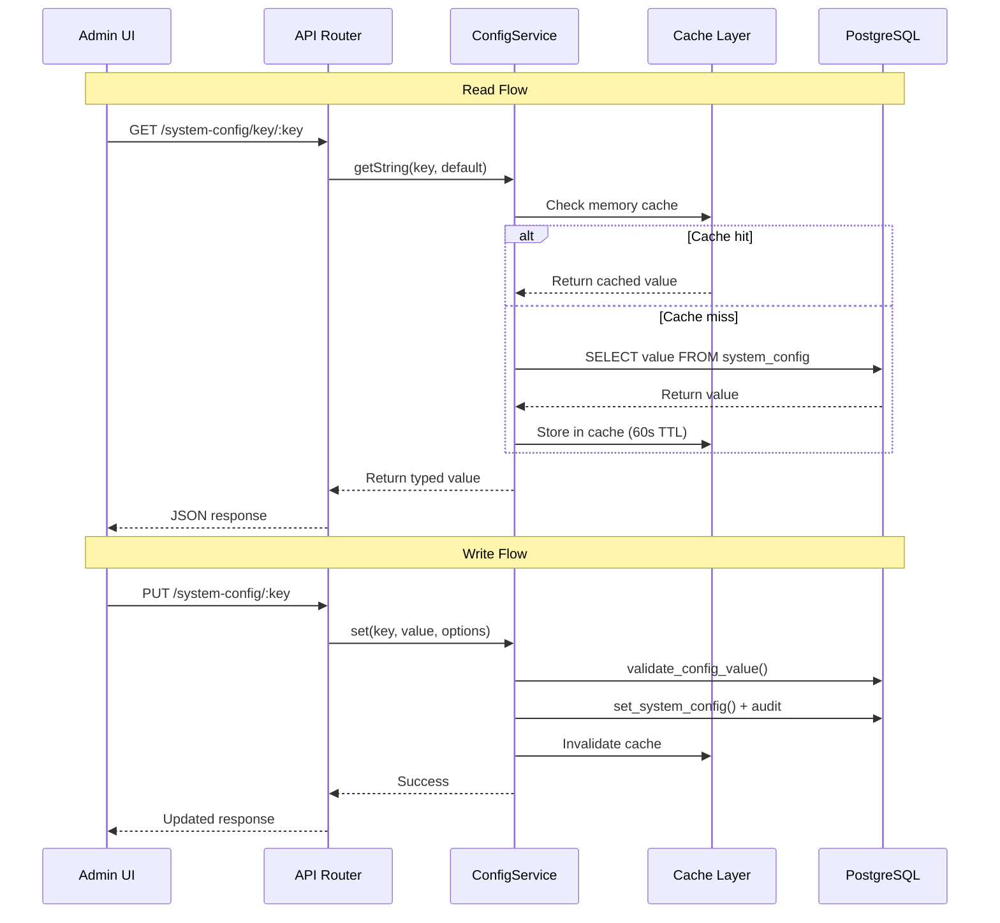

# System Config - Runtime Configuration

> **Related Issues**: DORM-676 (Infrastructure), DORM-691 (Migration)
> **Status**: Implemented
> **Last Updated**: 2025-12-05

## Overview

The System Config service provides database-backed runtime configuration for DormWay platform operations. It enables operators to adjust system behavior without code deployments, with full audit logging and caching for performance.

## Architecture



### Data Flow



## Database Schema

### system_config Table

```sql
CREATE TABLE system_config (
    id UUID PRIMARY KEY DEFAULT gen_random_uuid(),
    key VARCHAR(100) UNIQUE NOT NULL,      -- e.g., 'sync.max_concurrent_cities'
    value JSONB NOT NULL,                   -- Current value
    category VARCHAR(50) NOT NULL,          -- Category for grouping
    description TEXT,                       -- Human-readable description
    value_type VARCHAR(20) NOT NULL,        -- 'number', 'string', 'boolean', 'json'
    default_value JSONB NOT NULL,           -- Original default
    constraints JSONB,                      -- Validation constraints
    updated_at TIMESTAMPTZ DEFAULT NOW(),
    updated_by UUID REFERENCES accounts(id),
    created_at TIMESTAMPTZ DEFAULT NOW()
);
```

### system_config_audit Table

```sql
CREATE TABLE system_config_audit (
    id UUID PRIMARY KEY DEFAULT gen_random_uuid(),
    config_key VARCHAR(100) NOT NULL,
    previous_value JSONB,
    new_value JSONB NOT NULL,
    changed_by UUID REFERENCES accounts(id),
    changed_at TIMESTAMPTZ DEFAULT NOW(),
    change_reason TEXT,
    ip_address INET,
    user_agent TEXT
);
```

## Configuration Categories

| Category | Description | Example Keys |
|----------|-------------|--------------|
| `sync` | Data synchronization | `sync.max_concurrent_cities`, `sync.stale_threshold_hours` |
| `processing` | Task execution | `processing.max_parallel_tasks`, `processing.timeout_seconds` |
| `student` | Student features | `student.max_courses`, `student.max_syllabi_per_course` |
| `dayplan` | Day plan generation | `dayplan.default_lookahead_days`, `dayplan.max_items` |
| `llm` | AI model settings | `llm.dayplan_model`, `llm.syllabus_model`, `llm.temperature` |
| `ratelimits` | API rate limiting | `ratelimits.api_requests_per_minute` |
| `batching` | Batch processing | `batching.max_batch_size`, `batching.flush_interval_ms` |
| `limits` | System limits | `limits.max_context_depth`, `limits.max_file_size_mb` |
| `canvas` | Canvas LMS | `canvas.sync_interval_minutes`, `canvas.max_retries` |
| `defaults` | Fallback values | `defaults.timezone`, `defaults.locale` |
| `temporal` | Workflow config | `temporal.max_workflow_retries`, `temporal.activity_timeout` |
| `workflow` | General workflow | `workflow.enable_auto_retry`, `workflow.max_concurrent` |

## Service API

### Initialization

Initialize once at service startup:

```typescript
import { initializeSystemConfigService } from '@dormway/core';
import { getAuroraPool } from '../services/auroraDb';
import { getRedisAdapter } from '@dormway/core/adapters/cache';

const pool = await getAuroraPool();
const cacheAdapter = getRedisAdapter(); // Optional but recommended

initializeSystemConfigService({
  pool,
  cacheAdapter,
  logger: myLogger,
  cacheTtlMs: 60_000, // 1 minute cache
});
```

### Reading Configuration

```typescript
import { getSystemConfigService } from '@dormway/core';

const configService = getSystemConfigService();

// Type-safe getters with required defaults
const maxCities = await configService.getNumber('sync.max_concurrent_cities', 2);
const model = await configService.getString('llm.dayplan_model', 'gpt-4o-mini');
const enabled = await configService.getBoolean('feature.auto_sync', false);
const config = await configService.getJson<MyConfigType>('some.json_config', defaultObj);

// Skip cache for fresh value
const fresh = await configService.getNumber('sync.max_cities', 2, { skipCache: true });
```

### Writing Configuration (Admin Only)

```typescript
// Set with audit logging
await configService.set('sync.max_concurrent_cities', 5, {
  changedBy: adminUserId,
  changeReason: 'Increasing capacity for holiday weekend',
  ipAddress: req.ip,
  userAgent: req.headers['user-agent'],
});

// Bulk update
await configService.setBulk([
  { key: 'llm.dayplan_model', value: 'gpt-4o' },
  { key: 'llm.temperature', value: 0.8 },
], {
  changedBy: adminUserId,
  changeReason: 'Switching to GPT-4o for better quality',
});

// Reset to default
await configService.reset('sync.max_concurrent_cities', {
  changedBy: adminUserId,
  changeReason: 'Reverting after load test',
});
```

### Querying Configuration

```typescript
// Get all configs
const allConfigs = await configService.getAll();

// Filter by category
const syncConfigs = await configService.getByCategory('sync');

// Get with filters
const modified = await configService.getAll({
  modifiedOnly: true,
  search: 'concurrent',
});

// Get single entry with full metadata
const entry = await configService.getEntry('sync.max_concurrent_cities');
// Returns: { id, key, value, defaultValue, isDefault, constraints, updatedAt, ... }

// Get audit history
const history = await configService.getAuditHistory({
  configKey: 'sync.max_concurrent_cities',
  limit: 10,
});
```

## Admin API Endpoints

All endpoints require admin role authentication.

| Method | Endpoint | Description |
|--------|----------|-------------|
| GET | `/api/admin/system-config` | Get all configs (supports ?category, ?search, ?modifiedOnly) |
| GET | `/api/admin/system-config/categories` | Get category list with counts |
| GET | `/api/admin/system-config/category/:category` | Get configs in category |
| GET | `/api/admin/system-config/key/:key` | Get single config by key |
| PUT | `/api/admin/system-config/:key` | Update single config |
| PUT | `/api/admin/system-config/bulk` | Bulk update multiple configs |
| POST | `/api/admin/system-config/:key/reset` | Reset to default value |
| GET | `/api/admin/system-config/audit` | Get audit history |

### Request/Response Examples

**Update a config:**
```bash
curl -X PUT "https://api.dormway.app/api/admin/system-config/sync.max_concurrent_cities" \
  -H "Authorization: Bearer $TOKEN" \
  -H "Content-Type: application/json" \
  -d '{
    "value": 5,
    "reason": "Increasing capacity for load test"
  }'
```

**Response:**
```json
{
  "success": true,
  "key": "sync.max_concurrent_cities",
  "previous": 2,
  "current": 5,
  "message": "Config 'sync.max_concurrent_cities' updated successfully"
}
```

## Admin UI

The System Settings page is available at `/system-settings` in dormway-admin.

### Features

- **Category Accordions**: Configs grouped by category with descriptions
- **Inline Editing**: Edit values directly with type-appropriate controls
- **Validation**: Respects min/max constraints for numbers, enum options for strings
- **Modified Indicator**: Visual indicator for non-default values
- **Reset to Default**: One-click reset with confirmation
- **Audit Log**: View change history with who/when/why
- **Search & Filter**: Find configs by key, description, or category

### UI Components

- Number inputs with min/max constraints
- String inputs with enum dropdown when constrained
- Boolean toggle switches
- JSON editor for complex values
- Reason field for audit trail

## Caching Strategy

### Two-Tier Cache

1. **In-Memory Cache** (always enabled)
   - Map-based cache in the service instance
   - Default TTL: 60 seconds
   - Fastest access for hot paths

2. **Redis Cache** (optional, recommended for production)
   - Shared across service instances
   - Same TTL as memory cache
   - Provides consistency in multi-instance deployments

### Cache Invalidation

- Automatic invalidation on write (`set`, `setBulk`, `reset`)
- Manual invalidation: `configService.invalidateCache(key)` or `invalidateCache()` for all
- TTL-based expiration as safety net

## Validation

### Constraint Types

```typescript
interface ConfigConstraints {
  min?: number;      // Minimum value for numbers
  max?: number;      // Maximum value for numbers
  enum?: string[];   // Allowed values for strings
}
```

### Database Validation Function

```sql
-- Validates a config value against its constraints
SELECT validate_config_value('sync.max_concurrent_cities', '5'::jsonb);
-- Returns: true/false
```

Validation is performed:
1. Before any write operation
2. By the API before persisting
3. By the database function for extra safety

## Migration Guide

### Migrating from Hardcoded Values

**Before:**
```typescript
const MAX_CONCURRENT_CITIES = 2;
// ... used throughout code
```

**After:**
```typescript
import { getSystemConfigService } from '@dormway/core';

const configService = getSystemConfigService();
const maxCities = await configService.getNumber('sync.max_concurrent_cities', 2);
```

### Migrating from Environment Variables

**Before:**
```typescript
const model = process.env.DAYPLAN_MODEL || 'gpt-4o-mini';
```

**After:**
```typescript
const model = await configService.getString('llm.dayplan_model', 'gpt-4o-mini');
```

### Important: Keep Defaults

Always provide a sensible default value to the getter. This ensures:
- Service works even if database is unavailable
- No breaking changes during migration
- Clear documentation of expected default behavior

## Best Practices

1. **Use Descriptive Keys**: Follow `category.specific_setting` naming convention
2. **Always Provide Defaults**: Service should work without database
3. **Document Changes**: Include reason when updating via admin UI
4. **Test with Fresh Values**: Use `skipCache: true` when debugging
5. **Monitor Audit Log**: Review changes periodically
6. **Gradual Migration**: Migrate settings incrementally, not all at once
7. **Cache TTL**: Balance freshness vs database load (60s default is good)

## Files Reference

| File | Purpose |
|------|---------|
| `infrastructure/database/migrations/20251205_create_system_config.sql` | Database schema |
| `infrastructure/database/migrations/20251205b_seed_system_config.sql` | Initial seed data |
| `services/shared/dormway-core/src/domains/system-config/` | Core service |
| `services/api-router/src/routes/admin/system-config-routes.ts` | Admin API |
| `services/dormway-admin/src/pages/system-settings/index.tsx` | Admin UI |

## Related Documentation

- [Database-Migration-Process](/docs/engineering/database-migration-process) - How migrations are run
- [API v2 Design - Resource-Oriented REST](/docs/engineering/architecture/api-v2-design-resource-oriented-rest) - API design patterns
- [DormWay Platform – System Architecture](/docs/engineering/architecture/dormway-platform-system-architecture) - Overall architecture
