# Task Management System - Persistent Storage Architecture

---
status: approved
last_reviewed: 2025-12-03
owner: engineering
implementation_status: in_progress
related_features: task-bank, dayplan, timeline-drag-drop
decision_type: architectural
related_docs: [Tasks vs Assignments - Two-Table Architecture Decision](/docs/engineering/architecture/tasks-vs-assignments-two-table-architecture-decision)
---

## Executive Summary

This document outlines the architecture for persistent task storage in DormWay, addressing a critical gap in the current system where unscheduled tasks lack permanent storage. The solution introduces a dedicated `tasks` table that enables full task lifecycle management while maintaining backward compatibility with existing drag-and-drop workflows.

> **📖 Important**: The `tasks` table is separate from `assignment_completion` by design. See [Tasks vs Assignments - Two-Table Architecture Decision](/docs/engineering/architecture/tasks-vs-assignments-two-table-architecture-decision) for the architectural rationale on why these are two tables (tasks = work sessions, assignments = academic deliverables).

**Problem**: Unscheduled tasks currently exist only in ephemeral `service_data` (dayplan widget), preventing manual task creation and causing data loss when Temporal workflows fail or partitions are pruned. RLS now exists on `service_data`, but persistence for unscheduled tasks still requires the dedicated `tasks` table.

**Solution**: Add a persistent `tasks` table with full CRUD API, enabling manual task creation, editing, scheduling, unscheduling, and completion tracking.

**Impact**: Students can manually create tasks, Task Bank always has content, and task data survives system failures.

---

## Current State Analysis

### Existing Data Model

```
┌──────────────────────────────────────────────────────────────┐
│ service_data (partitioned by month, ephemeral)               │
│  ├─ method='dayplan'                                          │
│  │   └─ data: { blocks: [...unscheduledTasks] }             │
│  │                                                            │
│  ├─ Pruned after retention period (30-90 days)               │
│  └─ Lost when Temporal workflow fails                        │
│                                                              │
│ student_time_blocks (persistent)                             │
│  ├─ Stores ALL scheduled events                              │
│  │   ├─ Classes (type='class', source='schedule_import')    │
│  │   ├─ Planner blocks (type='other', source='manual_planner')│
│  │   └─ Focus blocks (type='focus', source='ai_suggestion') │
│  │                                                            │
│  └─ ❌ NO relationship to unscheduled tasks                  │
│                                                              │
│ ❌ NO persistent storage for unscheduled tasks               │
└──────────────────────────────────────────────────────────────┘
```

### Current Workflow (Drag-and-Drop)

**✅ APPROVED - This workflow is architecturally sound and will remain unchanged**

```mermaid
sequenceDiagram
    participant TW as Temporal StudentWatcher
    participant SD as service_data
    participant FE as Frontend (Task Bank)
    participant API as API Router
    participant STB as student_time_blocks

    TW->>SD: Generate dayplan → method='dayplan'
    SD->>FE: Dashboard BFF fetches dayplan widget
    FE->>FE: Extract blocks array → Display in Task Bank

    Note over FE: User drags task to timeline

    FE->>API: POST /api/mobile/planner/blocks
    API->>STB: INSERT planner_block
    API->>FE: 201 Created
    FE->>FE: Invalidate dashboard cache
    FE->>FE: Task disappears (now scheduled)
```



**Libraries Used**:
- `@dnd-kit/core` - Industry-standard drag-and-drop
- `@tanstack/react-query` - Data fetching and cache invalidation
- Proper collision detection and drop zone highlighting

**Code Quality**: ✅ Production-ready, no refactoring needed

---

## Critical Gaps Identified

### Gap #1: No Persistent Unscheduled Task Storage

**Severity**: 🔴 **Critical**

**Problem**:
- Unscheduled tasks only exist in `service_data` (dayplan widget)
- `service_data` is **partitioned by month** and **pruned** for retention (see migration `082_service_data_pruning_foundation.sql`)
- **Manual tasks have nowhere to be stored**
- Tasks exist only if Temporal workflow runs successfully

**Evidence from Code**:
```typescript
// From useDashboardComposite.ts (lines 349-372)
const dayplanWidget = widgets.find(w => w.type === 'dayplan');
const blocks = dayplanWidget?.content?.data?.blocks || [];
// ❌ If dayplan doesn't exist, blocks = []
```

**Real-World Impact**:
- Student wants to manually create task → ❌ **Can't be saved**
- Temporal StudentWatcher workflow fails → ❌ **Task Bank completely empty**
- Dayplan partition pruned (30-90 days) → ❌ **Tasks permanently lost**
- Browser refresh regenerates different task IDs → ❌ **State inconsistency**

**Obsidian Documentation Evidence**:
From "Today Vertical Slice - Technical Implementation":
> Timeline component with task bank drag/drop interaction
> ⚠️ **No mention of persistent task storage in spec**

This confirms the gap was not originally planned for but is necessary for production use.

---

### Gap #2: No Task Lifecycle Management

**Severity**: 🟡 **High**

**Problem**: Tasks can only move in one direction (unscheduled → scheduled)

**Missing Capabilities**:
- ❌ Drag scheduled block back to Task Bank (unschedule)
- ❌ Edit task duration, priority, or title after creation
- ❌ Mark task as "completed" without deleting it
- ❌ Track task history or completion metrics
- ❌ Reschedule task to different time

**Current Limitation**:
```typescript
// Can only CREATE and SCHEDULE
createPlannerBlock.mutate({ taskId, title, startTime, endTime });

// But no:
// - updateTask(taskId, { duration: 90 })
// - unscheduleTask(taskId) // Move back to Task Bank
// - completeTask(taskId)
// - deleteTask(taskId)
```

**User Impact**:
- Student schedules task for wrong time → Must delete and recreate
- Task takes longer than estimated → No way to extend without rescheduling
- Task completed → Stays on timeline forever (clutters view)

---

### Gap #3: Assignment → Task Conversion is Volatile

**Severity**: 🟡 **High**

**Problem**: Tasks auto-generated from assignments aren't persisted

```typescript
// From useDashboardComposite.ts (lines 374-392)
for (const assignment of dueSoon) {
  if (!hasTaskBlock && assignment.status === 'pending') {
    // ❌ This is an in-memory object, regenerated on every fetch
    unscheduledTasks.push({
      id: `task-from-assignment-${assignment.id}`, // Volatile ID
      title: `Work on: ${assignment.title}`,
      estimatedDuration: 60,
    });
  }
}
```

**Impact**:
- Refresh page → Task ID changes
- Can't track which assignment tasks were scheduled
- No way to mark assignment task as "in progress" vs "not started"

---

### Gap #4: API Endpoint Naming Inconsistency

**Severity**: 🟢 **Low** (works but confusing)

**Issue**:
```typescript
// Frontend (usePlannerBlocks.ts line 31)
fetch(proxyPath('/planner-blocks'), { method: 'POST' })
// Expects: /api/planner-blocks

// Backend (mobile-routes.ts line 1493)
router.post('/planner/blocks', ...)
// Actually: /api/mobile/planner/blocks
```

**Status**: ⚠️ Works through proxy rewriting, but inconsistent naming

**Fix**: Align frontend to use `/api/mobile/planner/blocks` explicitly

---

## Proposed Solution: Add `tasks` Table

### Architecture Overview

```
┌──────────────────────────────────────────────────────────────┐
│ NEW: tasks (persistent, source of truth)                     │
│  ├─ id: uuid PRIMARY KEY                                     │
│  ├─ user_id: uuid (owner)                                    │
│  ├─ title: text                                              │
│  ├─ estimated_duration_minutes: integer                      │
│  ├─ priority: enum (low, medium, high, urgent)               │
│  ├─ course_code: text (optional)                             │
│  ├─ due_date: timestamptz (optional)                         │
│  ├─ status: enum (pending, scheduled, completed, deleted)    │
│  ├─ scheduled_block_id: uuid → student_time_blocks(id)       │
│  ├─ source: enum (manual, assignment, dayplan, ai_suggestion)│
│  ├─ metadata: jsonb (flexible storage)                       │
│  └─ created_at, updated_at: timestamptz                      │
│                                                              │
│ Lifecycle: pending → scheduled → completed                   │
│            pending → deleted                                 │
│            scheduled → pending (unscheduled)                 │
└──────────────────────────────────────────────────────────────┘

┌──────────────────────────────────────────────────────────────┐
│ EXISTING: student_time_blocks (unchanged)                    │
│  ├─ Stores scheduled events on timeline                      │
│  └─ Now optionally references tasks(id) via metadata         │
└──────────────────────────────────────────────────────────────┘
```

### Data Flow with New Architecture

#### **Creating a Manual Task**
```
User clicks "+ Add Task" in Task Bank
  ↓
POST /api/mobile/tasks
  { title, estimatedDuration, priority, courseCode }
  ↓
INSERT INTO tasks (user_id, title, ..., status='pending')
  ↓
Frontend refreshes Task Bank
  ↓
SELECT * FROM tasks WHERE user_id=$1 AND status='pending'
  ↓
Task appears in Task Bank (persistent!)
```

#### **Scheduling a Task (Drag to Timeline)**
```
User drags task from Task Bank to timeline
  ↓
POST /api/mobile/tasks/:taskId/schedule
  { startTime, endTime }
  ↓
BEGIN TRANSACTION
  INSERT INTO student_time_blocks (...)
    RETURNING id as block_id
  UPDATE tasks
    SET status='scheduled',
        scheduled_block_id=block_id
END TRANSACTION
  ↓
Frontend invalidates cache
  ↓
Task disappears from Task Bank (status='scheduled')
Timeline shows new planner block
```

#### **Unscheduling a Task**
```
User drags timeline block back to Task Bank
  ↓
POST /api/mobile/tasks/:taskId/unschedule
  ↓
BEGIN TRANSACTION
  DELETE FROM student_time_blocks
    WHERE id = (SELECT scheduled_block_id FROM tasks WHERE id=$1)
  UPDATE tasks
    SET status='pending',
        scheduled_block_id=NULL
END TRANSACTION
  ↓
Task reappears in Task Bank
Timeline block removed
```

#### **Completing a Task**
```
User marks task as complete (checkbox)
  ↓
POST /api/mobile/tasks/:taskId/complete
  ↓
UPDATE tasks SET status='completed', completed_at=NOW()
  ↓
Task hidden from Task Bank (completed)
Optional: Track in analytics/productivity metrics
```

---

## Database Schema

### Migration: `tasks` Table

```sql
-- Migration: 083_add_tasks_table.sql
-- Purpose: Persistent storage for unscheduled and scheduled tasks
-- Status: Approved for implementation

CREATE TABLE tasks (
  id uuid PRIMARY KEY DEFAULT gen_random_uuid(),
  user_id uuid NOT NULL REFERENCES accounts(id) ON DELETE CASCADE,

  -- Task content
  title text NOT NULL,
  estimated_duration_minutes integer NOT NULL DEFAULT 30
    CHECK (estimated_duration_minutes > 0 AND estimated_duration_minutes <= 480),

  -- Organization
  priority text NOT NULL DEFAULT 'medium'
    CHECK (priority IN ('low', 'medium', 'high', 'urgent')),
  course_code text,
  due_date timestamptz,

  -- Lifecycle
  status text NOT NULL DEFAULT 'pending'
    CHECK (status IN ('pending', 'scheduled', 'completed', 'deleted')),
  scheduled_block_id uuid REFERENCES student_time_blocks(id)
    ON DELETE SET NULL,
  completed_at timestamptz,

  -- Provenance
  source text NOT NULL DEFAULT 'manual'
    CHECK (source IN ('manual', 'assignment', 'dayplan', 'ai_suggestion')),
  assignment_id uuid, -- Optional: Link to assignments if exists

  -- Flexible storage
  metadata jsonb DEFAULT '{}'::jsonb,

  -- Timestamps
  created_at timestamptz NOT NULL DEFAULT NOW(),
  updated_at timestamptz NOT NULL DEFAULT NOW()
);

-- Indexes for common queries
CREATE INDEX idx_tasks_user_status
  ON tasks(user_id, status)
  WHERE status != 'deleted';

CREATE INDEX idx_tasks_user_pending
  ON tasks(user_id)
  WHERE status = 'pending';

CREATE INDEX idx_tasks_scheduled_block
  ON tasks(scheduled_block_id)
  WHERE scheduled_block_id IS NOT NULL;

CREATE INDEX idx_tasks_due_date
  ON tasks(user_id, due_date)
  WHERE status IN ('pending', 'scheduled') AND due_date IS NOT NULL;

-- Updated_at trigger
CREATE TRIGGER update_tasks_updated_at
  BEFORE UPDATE ON tasks
  FOR EACH ROW EXECUTE FUNCTION update_updated_at_column();

-- RLS Policies (security)
ALTER TABLE tasks ENABLE ROW LEVEL SECURITY;

CREATE POLICY "Users can view own tasks"
  ON tasks FOR SELECT
  USING (user_id = auth.uid());

CREATE POLICY "Users can create own tasks"
  ON tasks FOR INSERT
  WITH CHECK (user_id = auth.uid());

CREATE POLICY "Users can update own tasks"
  ON tasks FOR UPDATE
  USING (user_id = auth.uid());

CREATE POLICY "Users can delete own tasks"
  ON tasks FOR DELETE
  USING (user_id = auth.uid());

-- Comments
COMMENT ON TABLE tasks IS
  'Persistent storage for student tasks (unscheduled, scheduled, and completed).
   Replaces ephemeral dayplan widget blocks with permanent records.';

COMMENT ON COLUMN tasks.status IS
  'Task lifecycle: pending (unscheduled) → scheduled (on timeline) → completed.
   Can also be soft-deleted (status=deleted).';

COMMENT ON COLUMN tasks.scheduled_block_id IS
  'Foreign key to student_time_blocks when task is scheduled on timeline.
   NULL when task is pending or completed without scheduling.';

COMMENT ON COLUMN tasks.source IS
  'Origin of task: manual (user-created), assignment (from LMS),
   dayplan (Temporal workflow suggestion), ai_suggestion (AI crew recommendation).';
```

### Example Data

```sql
-- Manual task created by user
INSERT INTO tasks (user_id, title, estimated_duration_minutes, priority, course_code)
VALUES (
  'user-123',
  'Study for EECS 281 Midterm',
  120,
  'high',
  'EECS 281'
);

-- Task auto-created from assignment
INSERT INTO tasks (
  user_id, title, estimated_duration_minutes, priority,
  course_code, due_date, source, assignment_id
)
VALUES (
  'user-123',
  'Work on: Essay Draft',
  90,
  'urgent',
  'ENGLISH 125',
  '2025-10-15 23:59:00+00',
  'assignment',
  'assignment-456'
);

-- Scheduled task (on timeline)
INSERT INTO tasks (
  user_id, title, estimated_duration_minutes,
  status, scheduled_block_id, source
)
VALUES (
  'user-123',
  'Review Lecture Notes',
  60,
  'scheduled',
  'block-789', -- References student_time_blocks.id
  'dayplan'
);
```

---

## API Endpoints

### Task CRUD Operations

#### **POST /api/mobile/tasks** - Create Task
```typescript
Request:
{
  title: string;
  estimatedDuration: number; // minutes
  priority?: 'low' | 'medium' | 'high' | 'urgent';
  courseCode?: string;
  dueDate?: string; // ISO timestamp
  metadata?: Record<string, any>;
}

Response (201):
{
  success: true;
  task: {
    id: string;
    title: string;
    estimatedDuration: number;
    priority: string;
    status: 'pending';
    createdAt: string;
  }
}
```

#### **GET /api/mobile/tasks** - List Tasks
```typescript
Query params:
  ?status=pending|scheduled|completed  // Default: pending
  ?courseCode=EECS281                  // Optional filter
  ?includeDeleted=false                // Default: false

Response (200):
{
  tasks: Task[];
  count: number;
}
```

#### **PUT /api/mobile/tasks/:taskId** - Update Task
```typescript
Request:
{
  title?: string;
  estimatedDuration?: number;
  priority?: string;
  dueDate?: string;
}

Response (200):
{
  success: true;
  task: Task;
}
```

#### **DELETE /api/mobile/tasks/:taskId** - Delete Task
```typescript
// Soft delete (status='deleted')
Response (200):
{
  success: true;
  deletedAt: string;
}
```

### Task Lifecycle Operations

#### **POST /api/mobile/tasks/:taskId/schedule** - Schedule Task
```typescript
Request:
{
  startTime: string; // ISO timestamp
  endTime: string;   // ISO timestamp
}

Response (201):
{
  success: true;
  scheduledBlock: {
    id: string;
    startTime: string;
    endTime: string;
  };
  task: {
    id: string;
    status: 'scheduled';
    scheduledBlockId: string;
  }
}
```

#### **POST /api/mobile/tasks/:taskId/unschedule** - Unschedule Task
```typescript
Response (200):
{
  success: true;
  task: {
    id: string;
    status: 'pending';
    scheduledBlockId: null;
  };
  deletedBlockId: string; // student_time_blocks.id that was removed
}
```

#### **POST /api/mobile/tasks/:taskId/complete** - Mark Complete
```typescript
Response (200):
{
  success: true;
  task: {
    id: string;
    status: 'completed';
    completedAt: string;
  }
}
```

---

## Frontend Changes

### Updated Task Bank Data Source

**Before** (current):
```typescript
// Only reads from dayplan widget
const dayplanWidget = widgets.find(w => w.type === 'dayplan');
const blocks = dayplanWidget?.content?.data?.blocks || [];
```

**After** (proposed):
```typescript
// Reads from tasks table + dayplan widget (backward compatible)
const { data: persistentTasks } = useQuery({
  queryKey: ['tasks', 'pending'],
  queryFn: () => fetch('/api/mobile/tasks?status=pending').then(r => r.json())
});

const { data: dashboardData } = useDashboardComposite();

// Merge persistent tasks + dayplan suggestions
const allTasks = [
  ...(persistentTasks?.tasks || []),
  ...(dashboardData?.unscheduledTasks || []) // Fallback to dayplan
];

// Deduplicate by ID
const uniqueTasks = deduplicateById(allTasks);
```

### Task Creation Modal

```typescript
// New component: TaskCreateModal.tsx
interface TaskCreateModalProps {
  isOpen: boolean;
  onClose: () => void;
}

function TaskCreateModal({ isOpen, onClose }: TaskCreateModalProps) {
  const createTask = useMutation({
    mutationFn: (task) =>
      fetch('/api/mobile/tasks', {
        method: 'POST',
        body: JSON.stringify(task)
      })
  });

  return (
    <Modal isOpen={isOpen}>
      <form onSubmit={handleSubmit}>
        <input name="title" placeholder="Task title" required />
        <input name="duration" type="number" placeholder="60" />
        <select name="priority">
          <option value="low">Low</option>
          <option value="medium">Medium (default)</option>
          <option value="high">High</option>
          <option value="urgent">Urgent</option>
        </select>
        <input name="courseCode" placeholder="EECS 281 (optional)" />
        <button type="submit">Create Task</button>
      </form>
    </Modal>
  );
}
```

### Updated Drag-and-Drop Handler

```typescript
// Updated DragDropContext.tsx
const handleDragEnd = async (event: DragEndEvent) => {
  const { active, over } = event;
  if (!over) return;

  const taskId = active.id as string;
  const task = tasks.find(t => t.id === taskId);

  // Parse time slot
  const timeSlot = over.id.replace('timeline-slot-', '');
  const [hours, minutes] = timeSlot.split(':').map(Number);

  const startTime = new Date();
  startTime.setHours(hours, minutes, 0, 0);

  const endTime = new Date(startTime);
  endTime.setMinutes(startTime.getMinutes() + task.estimatedDuration);

  // NEW: Use task scheduling endpoint
  await fetch(`/api/mobile/tasks/${taskId}/schedule`, {
    method: 'POST',
    body: JSON.stringify({
      startTime: startTime.toISOString(),
      endTime: endTime.toISOString()
    })
  });

  // Refresh dashboard
  queryClient.invalidateQueries({ queryKey: ['dashboard-composite'] });
  queryClient.invalidateQueries({ queryKey: ['tasks'] });
};
```

---

## Implementation Phases

### Phase 1: Foundation (2-3 hours) ✅ **APPROVED**

**Goal**: Add persistent task storage without breaking existing functionality

**Tasks**:
1. ✅ Create database migration `083_add_tasks_table.sql`
2. ✅ Add backend API endpoints:
   - `POST /api/mobile/tasks` (create)
   - `GET /api/mobile/tasks` (list)
   - `PUT /api/mobile/tasks/:id` (update)
   - `DELETE /api/mobile/tasks/:id` (soft delete)
3. ✅ Add "+ Add Task" button to Task Bank empty state
4. ✅ Create `TaskCreateModal` component
5. ✅ Update `useDashboardComposite` to fetch from tasks table
6. ✅ Update drag-and-drop to call `/tasks/:id/schedule`

**Deliverables**:
- Students can manually create tasks
- Tasks persist across browser refreshes
- Existing drag-and-drop continues working
- Task Bank no longer empty when dayplan fails

**Risk**: 🟢 **Low** - Additive only, no breaking changes

**Testing**:
```bash
# Manual test plan
1. Click "+ Add Task" in Task Bank
2. Fill in: "Study for Midterm", 90 min, High priority
3. Create task
4. Refresh page → Task still visible (persistence verified)
5. Drag task to 2:00 PM on timeline
6. Verify task disappears from Task Bank
7. Verify timeline shows scheduled block at 2:00 PM
8. Check database: task.status='scheduled', scheduled_block_id set
```

---

### Phase 2: Full Lifecycle (4-5 hours) 🔶 **FUTURE**

**Goal**: Complete task lifecycle management

**Tasks**:
1. Add lifecycle endpoints:
   - `POST /api/mobile/tasks/:id/unschedule`
   - `POST /api/mobile/tasks/:id/complete`
2. Add drag handler for timeline → Task Bank (unscheduling)
3. Add task completion checkbox in timeline blocks
4. Add task editing modal (inline edit)
5. Add task history view (completed tasks)

**Deliverables**:
- Students can unschedule tasks (move back to Task Bank)
- Students can mark tasks complete
- Students can edit tasks after creation
- Students can view completed task history

**Risk**: 🟢 **Low** - Independent features, no coupling

---

### Phase 3: Temporal Integration (8-10 hours) 🔶 **FUTURE**

**Goal**: Migrate Temporal dayplan workflow to use tasks table

**Tasks**:
1. Update StudentWatcher workflow to write tasks to `tasks` table
2. Deprecate dayplan widget's `blocks[]` array
3. Update assignment sync to create tasks (source='assignment')
4. Add AI task suggestions (source='ai_suggestion')
5. Migrate existing dayplan data to tasks table (one-time script)

**Deliverables**:
- Temporal workflow populates tasks table
- Dayplan widget becomes read-only (deprecated)
- All task sources unified in one table
- Zero reliance on service_data for tasks

**Risk**: 🟡 **Medium** - Requires Temporal workflow changes

---

## Backward Compatibility

### Ensuring No Breaking Changes

**Strategy**: Dual-read during migration

```typescript
// Phase 1: Read from BOTH sources
const persistentTasks = await getTasks({ status: 'pending' });
const dayplanTasks = dashboardData?.unscheduledTasks || [];

// Merge and deduplicate
const allTasks = [...persistentTasks, ...dayplanTasks];

// Phase 3 (future): Remove dayplan fallback after migration
const allTasks = await getTasks({ status: 'pending' });
```

**Benefits**:
- ✅ Existing dayplan workflow continues working
- ✅ New manual tasks work immediately
- ✅ Gradual migration reduces risk
- ✅ Can rollback Phase 3 if needed

---

## Security Considerations

### Row-Level Security (RLS)

**Critical**: Tasks contain personal information

```sql
-- Prevents users from viewing other students' tasks
CREATE POLICY "Users can view own tasks"
  ON tasks FOR SELECT
  USING (user_id = auth.uid());

-- Prevents task creation on behalf of other users
CREATE POLICY "Users can create own tasks"
  ON tasks FOR INSERT
  WITH CHECK (user_id = auth.uid());
```

**Attack Prevention**:
- ❌ User cannot query `SELECT * FROM tasks` (see everyone's tasks)
- ❌ User cannot `INSERT INTO tasks (user_id='victim-id', ...)`
- ❌ User cannot `UPDATE tasks SET user_id='victim-id' WHERE id=...`

**Compliance**: Meets FERPA student privacy requirements

---

## Performance Considerations

### Index Strategy

**Query**: "Get pending tasks for user"
```sql
-- Most common query (Task Bank display)
SELECT * FROM tasks
WHERE user_id = $1 AND status = 'pending'
ORDER BY priority DESC, due_date ASC;

-- Index optimizes this:
CREATE INDEX idx_tasks_user_pending
  ON tasks(user_id)
  WHERE status = 'pending';
```

**Query**: "Get task by scheduled block"
```sql
-- When user clicks timeline block
SELECT * FROM tasks
WHERE scheduled_block_id = $1;

-- Index optimizes this:
CREATE INDEX idx_tasks_scheduled_block
  ON tasks(scheduled_block_id)
  WHERE scheduled_block_id IS NOT NULL;
```

**Estimated Volume**:
- 10,000 active students
- Average 10 tasks per student
- **Total: 100,000 rows** (lightweight, no performance concerns)

---

## Alternatives Considered

### Alternative 1: Store Tasks in service_data ❌ **REJECTED**

**Approach**: Use `service_data` table with `method='user_tasks'`

```sql
INSERT INTO service_data (user_id, method, data)
VALUES ($1, 'user_tasks', '{"tasks": [...]}');
```

**Why Rejected**:
- ❌ Abuses `service_data` (designed for ephemeral caching, not persistent data)
- ❌ Tasks lost when partitions pruned (defeats purpose)
- ❌ No referential integrity with `student_time_blocks`
- ❌ Can't query efficiently (jsonb queries are slow at scale)
- ❌ Violates separation of concerns (mixes cache with source of truth)

**Tech Debt**: High - Would require future migration anyway

---

### Alternative 2: Extend student_time_blocks ❌ **REJECTED**

**Approach**: Add `status='unscheduled'` to `student_time_blocks`

```sql
ALTER TABLE student_time_blocks
  ADD COLUMN status text CHECK (status IN ('scheduled', 'unscheduled'));
```

**Why Rejected**:
- ❌ Semantic mismatch: "time block" implies scheduled time
- ❌ Requires nullable `start_time` and `end_time` (breaks constraints)
- ❌ Mixes two distinct concepts (events vs tasks)
- ❌ Harder to query ("show unscheduled time blocks" is confusing)

**Tech Debt**: Medium - Confusing data model

---

### Alternative 3: Dedicated Tasks Table ✅ **SELECTED**

**Why Selected**:
- ✅ Clear separation of concerns (tasks vs scheduled events)
- ✅ Proper lifecycle management (pending → scheduled → completed)
- ✅ Foreign key relationship to `student_time_blocks`
- ✅ Extensible for future features (subtasks, dependencies, etc.)
- ✅ Efficient queries with dedicated indexes
- ✅ Zero tech debt - proper data modeling from start

**Alignment**: Matches industry best practices (Todoist, Asana, Linear all use separate tasks table)

---

## Success Metrics

### Phase 1 Success Criteria

**Functional**:
- ✅ Students can create manual tasks via UI
- ✅ Tasks persist across browser refreshes
- ✅ Drag-and-drop to timeline creates scheduled block
- ✅ Task Bank never empty (always shows persistent tasks)

**Technical**:
- ✅ Migration runs successfully on production
- ✅ RLS policies prevent unauthorized access
- ✅ API endpoints return correct HTTP status codes
- ✅ Zero breaking changes to existing features

**Performance**:
- ✅ Task Bank loads in < 200ms
- ✅ Task creation completes in < 300ms
- ✅ Drag-and-drop scheduling completes in < 500ms

---

## Rollout Plan

### Pre-Deployment Checklist

- [ ] Database migration tested on staging
- [ ] API endpoints tested with Postman/curl
- [ ] RLS policies verified (user isolation)
- [ ] Frontend UI tested in all themes (Glass, Dark, Light)
- [ ] Mobile responsiveness verified
- [ ] Error handling tested (network failures, validation errors)

### Deployment Steps

1. **Deploy database migration** (run during maintenance window)
   ```bash
   make db-migrate
   # Verify: SELECT COUNT(*) FROM tasks;
   ```

2. **Deploy backend API** (api-router service)
   ```bash
   cd services/api-router
   npm run build
   ./scripts/dev-with-doppler.sh restart api-router
   ```

3. **Deploy frontend** (dormway-lockedin service)
   ```bash
   cd services/dormway-lockedin
   npm run build
   # Docker rebuild and restart
   ```

4. **Verify in production**
   ```bash
   # Test task creation
   curl -X POST https://relay.dormway.app/api/mobile/tasks \
     -H "Authorization: Bearer $TOKEN" \
     -d '{"title":"Test Task","estimatedDuration":30}'

   # Verify response: 201 Created
   ```

### Rollback Plan

If critical issues occur:

```sql
-- Emergency rollback: Drop tasks table
DROP TABLE IF EXISTS tasks CASCADE;

-- Redeploy previous version of api-router
git checkout main~1
npm run build && ./scripts/deploy.sh
```

**Rollback Impact**: Students lose manually created tasks (acceptable for Phase 1)

---

## Future Enhancements

### Phase 4: Advanced Features (Future)

**Task Dependencies**:
```sql
ALTER TABLE tasks
  ADD COLUMN depends_on_task_id uuid REFERENCES tasks(id);
```
- Block scheduling if dependency not completed
- Show dependency graph in UI

**Subtasks**:
```sql
ALTER TABLE tasks
  ADD COLUMN parent_task_id uuid REFERENCES tasks(id);
```
- Break large tasks into smaller steps
- Track completion percentage

**Task Templates**:
```sql
CREATE TABLE task_templates (
  id uuid PRIMARY KEY,
  name text,
  default_duration integer,
  default_priority text
);
```
- Quick-create common tasks (e.g., "Study for Exam", "Review Notes")

**Productivity Analytics**:
- Track completion rate by course
- Show estimated vs. actual time spent
- Identify procrastination patterns

---

## Related Documentation

- DormWay Platform Architecture - Overall system design
- [SERVICE_DATA_WIDGET_ENVELOPE_ARCHITECTURE](/docs/engineering/architecture/servicedatawidgetenvelopearchitecture) - Widget system explained
- Signal Flow Architecture - iOS ↔ API Router ↔ Engine - Temporal workflow integration
- Today Vertical Slice - User Experience Design - Original UI spec

---

## Changelog

| Date | Author | Change |
|------|--------|--------|
| 2025-10-09 | Engineering Team | Initial architecture document |
| 2025-10-09 | Engineering Team | Approved for Phase 1 implementation |

---

## Appendix: Code References

### Backend Implementation

**File**: `services/api-router/src/routes/mobile-routes.ts`
- Line 1493: Existing `POST /planner/blocks` endpoint (keep for backward compat)
- **NEW**: Add task CRUD endpoints after line 1531

**File**: `services/api-router/src/routes/task-routes.ts` (create new)
- Task CRUD operations
- Task lifecycle operations (schedule, unschedule, complete)

### Frontend Implementation

**File**: `services/dormway-lockedin/src/hooks/home/useDashboardComposite.ts`
- Line 349-372: Current dayplan widget parsing (keep as fallback)
- **UPDATE**: Add tasks table query

**File**: `services/dormway-lockedin/src/components/home/taskbank/TaskBankList.tsx`
- Line 88-122: Current empty state
- **UPDATE**: Add "+ Add Task" button

**File**: `services/dormway-lockedin/src/components/home/DragDropContext.tsx`
- Line 47-95: Current drag-and-drop handler
- **UPDATE**: Call `/tasks/:id/schedule` instead of `/planner/blocks`

### Database Migration

**File**: `infrastructure/database/migrations/083_add_tasks_table.sql` (create new)
- Full schema definition from this document
- Indexes and RLS policies included

---

**Status**: ✅ Ready for implementation
**Next Action**: Proceed with Phase 1 implementation
