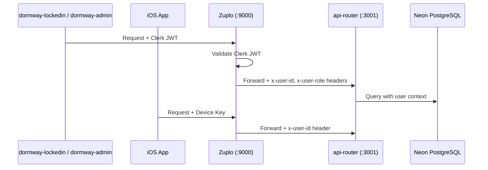

# Auth and Identity

DormWay uses Clerk for web authentication and a device-key pattern for mobile. All requests flow through Zuplo (API gateway) before reaching the api-router.

<Warning>
Some older docs reference Auth0. Auth0 is NOT used. The platform uses Clerk exclusively for web authentication.
</Warning>

## Request Flow



## Clerk (Web Authentication)

### How It Works

1. Users sign up or log in via Clerk's hosted UI or embedded components.
2. Clerk issues a short-lived JWT signed with Clerk's JWKS endpoint.
3. `dormway-lockedin` and `dormway-admin` attach the JWT as a Bearer token.
4. Zuplo validates the JWT and injects `x-user-id` and `x-user-role` headers.
5. `api-router` reads these headers — it never validates JWTs directly.

### Services Using Clerk

| Service | Port | Auth Method |
|---------|------|-------------|
| `dormway-lockedin` | 3008 | Clerk JWT |
| `dormway-admin` | 3004 | Clerk JWT + RBAC (admin role required) |
| iOS App | — | Device Key (not Clerk) |

### User Creation: Clerk Webhook

When a user signs up, Clerk fires a `user.created` webhook to `POST /api/webhooks/clerk`.

The webhook handler:
1. Creates the account row in the `accounts` table.
2. Runs `autoAssignCampusAndOverride(userId)` to detect the campus from email domain.
3. Triggers `processSingleCampus` Temporal workflow for the assigned campus (ensures term contexts exist).
4. Starts the `studentWatcherWorkflow` Temporal workflow for the new user.

The campus onboarding workflow ID is idempotent: `campus-onboard-signup-${campusId}-${userId}`.

### Local Development

For local testing, skip Zuplo by passing headers directly to api-router:

```bash
curl -s "http://localhost:3001/api/v2/students/me/context" \
  -H "X-User-Id: USER_UUID" \
  -H "X-User-Role: authenticated"
```

For admin endpoints:
```bash
curl -s "http://localhost:3001/api/admin/..." \
  -H "X-User-Id: ADMIN_UUID" \
  -H "X-User-Role: admin"
```

## Mobile Authentication (Device Keys)

iOS devices authenticate using device keys managed via Customer.io. There is no Clerk integration for the mobile app.

Mobile requests arrive at Zuplo with a device key, which Zuplo resolves to a `user_id` and injects the `x-user-id` header before forwarding to api-router.

## accounts Table

| Column | Type | Notes |
|--------|------|-------|
| `id` | uuid | Primary key |
| `email` | text | Unique |
| `given_name` | text | NOT `first_name` |
| `family_name` | text | NOT `last_name` |
| `user_type` | text | `'full'` or `'guest'` |
| `guest_token` | text | Set for guest users |
| `active_crew_id` | uuid | Active Crew for guest users |

<Warning>
The `accounts` table has NO `campus_id` column. Campus is determined by joining through the `contexts` table:

```sql
SELECT c.*
FROM accounts a
JOIN contexts student_ctx ON student_ctx.user_id = a.id AND student_ctx.type = 'student'
JOIN contexts c ON c.id = student_ctx.parent_id AND c.type = 'campus'
WHERE a.id = $1;
```
</Warning>

## Row Level Security (RLS)

DormWay uses PostgreSQL Row Level Security to enforce data isolation. Most tables have RLS policies that filter rows by `app.current_user_id()`.

Two connection strings are available:

| Variable | RLS | Use Case |
|----------|-----|----------|
| `DATABASE_URL` | Enforced | User-scoped reads (normal API requests) |
| `DATABASE_URL_ADMIN` | Bypassed | System writes, migrations, admin operations |

In `@dormway/core`:

```typescript
// Respects RLS — for user-scoped queries
const pool = await getAuroraPoolOrThrow();

// Bypasses RLS — for admin/system queries
const adminPool = await getAdminPoolOrThrow();
```

<Note>
When debugging with psql, always use `DATABASE_URL_ADMIN`. `DATABASE_URL` with RLS active will return empty results if the session user doesn't match the data's `user_id`.
</Note>

## Guest Mode

Crews supports a guest mode for viral sharing. Guests get:
- An HttpOnly cookie (`guest_token`) with a 90-day TTL.
- Full participation in **one** Crew.
- `accounts.user_type = 'guest'`

The guest-to-account conversion flow:

```
POST /api/v2/crew-guest/join
  → HttpOnly cookie set
  → guest account created

Second crew attempt → 403 GUEST_CREW_LIMIT

User signs up → POST /v2/auth/complete-signup-from-crew
  → mergeGuestToAccount() carries all data
  → campus auto-assigned from crew.school_id
```

## Environment and Secrets

All secrets are managed via Doppler. Never commit `.env` files.

Doppler configs:
- `dev` — Local development
- `dev_ethan` / `dev_riley` — Per-developer overrides
- `stg` — Staging
- `prd` — Production

Production runs on Railway. Railway auto-deploys when Doppler pushes a new environment variable.

## Key Files

| File | Purpose |
|------|---------|
| `services/api-router/src/routes/webhooks/clerk-routes.ts` | Clerk webhook handler (user.created) |
| `services/api-router/src/services/aurora-client.ts` | `adminAuroraClient` vs `auroraClient` |
| `services/shared/dormway-core/src/adapters/database/` | Database pool access |
| `.repos/dormway-api-2/config/routes.oas.json` | Zuplo route config (JWT validation) |
