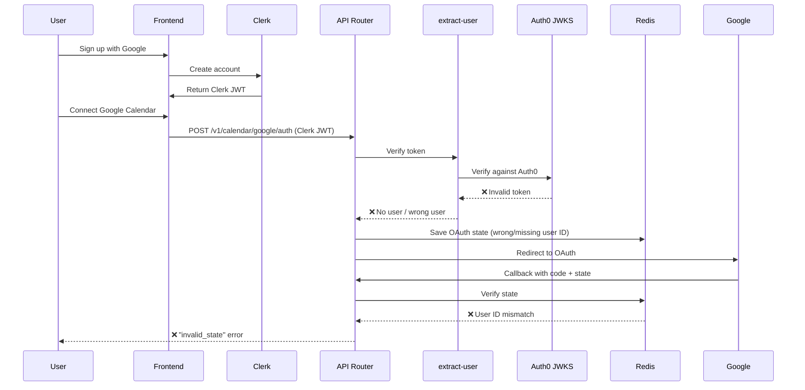
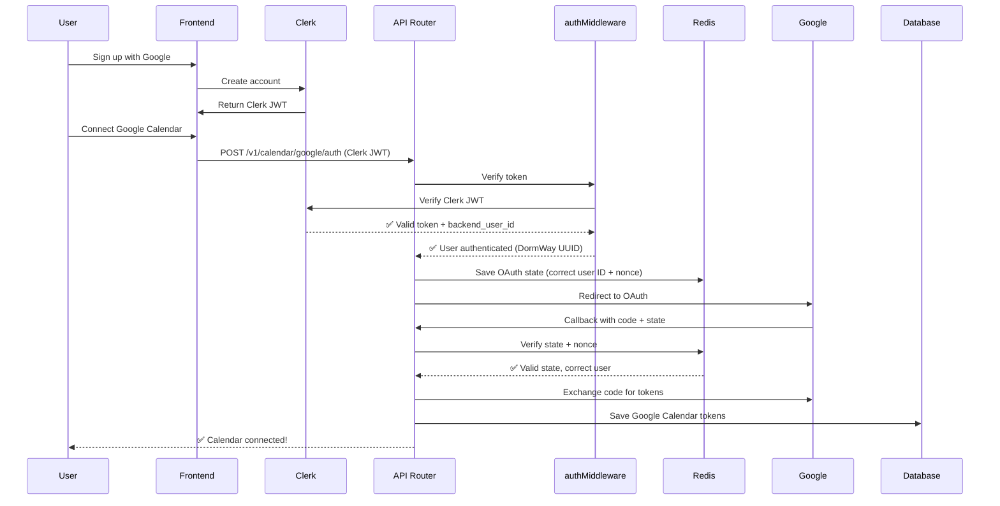

# Auth0 to Clerk Migration - OAuth Fix

**Date**: 2025-10-27
**Issue**: DORM-446
**Branch**: `fix/dorm-446-debug-view-redirect`
**Status**: ✅ Fixed

## Problem Statement

Users who registered via **Google OAuth through Clerk** were getting an **"invalid state" error** when trying to connect their Google Calendar during onboarding or from the integrations page.

This was a critical authentication bug that prevented new users from completing the onboarding flow.

## Root Cause

### The Authentication Mismatch

The codebase had a **dual authentication system**:
- **Frontend** (dormway-lockedin, dormway-admin): Uses **Clerk** for authentication
- **Backend** (api-router): Used **Auth0-only** middleware for route authentication

### What Happened

1. User signs up with Google → Clerk issues a JWT token
2. User tries to connect Google Calendar
3. Frontend calls `POST /v1/calendar/google/auth` with Clerk JWT
4. Backend uses `extract-user` middleware (Auth0-only)
5. ❌ Clerk JWT fails Auth0 JWKS verification
6. ❌ Wrong/missing user ID extracted from token
7. ❌ OAuth state saved to Redis with incorrect user ID
8. ❌ Google callback verification fails: **"invalid_state"**

### The Legacy Middleware Problem

File: `services/api-router/src/middleware/extract-user.ts`

```typescript
// Auth0 JWKS client for fetching public keys
const auth0Domain = process.env.AUTH0_DOMAIN || 'auth.dormway.app';
const jwksClient = jwksRsa({
  jwksUri: `https://${auth0Domain}/.well-known/jwks.json`,
  // ...
});

function verifyAuth0Token(token: string): Promise<any> {
  return new Promise((resolve, reject) => {
    jwt.verify(token, getKey, {
      algorithms: ['RS256'],
      issuer: `https://${auth0Domain}/`,
      // ...
    }, (err, decoded) => {
      // Only verifies Auth0 tokens!
    });
  });
}
```

This middleware:
- ❌ Only verified tokens from Auth0's JWKS endpoint
- ❌ Failed to verify Clerk JWTs
- ❌ Used by 27+ route files including calendar routes

## The Fix

### 1. Calendar Routes Migration

**File**: `services/api-router/src/routes/calendar-routes.ts`

```typescript
// ❌ BEFORE: Auth0-only middleware
import { requireUser } from '../middleware/extract-user';

router.post('/v1/calendar/google/auth',
  [requireUser, roleCheckMiddleware(['user', 'admin', 'authenticated'])],
  async (req, res) => { /* ... */ }
);
```

```typescript
// ✅ AFTER: Clerk-aware middleware
import { authMiddleware, roleCheckMiddleware } from '../middleware/auth';

router.post('/v1/calendar/google/auth',
  [authMiddleware, roleCheckMiddleware(['user', 'admin', 'authenticated'])],
  async (req, res) => { /* ... */ }
);
```

### 2. Clerk-Aware Middleware

**File**: `services/api-router/src/middleware/auth.ts`

The correct middleware verifies Clerk tokens:

```typescript
// Clerk JWT token auth (for LockedIn web app and admin dashboard)
if (authHeader && authHeader.startsWith('Bearer ')) {
  const token = authHeader.substring(7);
  try {
    const payload = await clerkClient.verifyToken(token) as any;
    const backendUserId = payload.backend_user_id || payload.sub;

    if (backendUserId && typeof backendUserId === 'string') {
      req.user = {
        id: backendUserId,           // ✅ Correct DormWay UUID
        clerk_id: payload.sub as string,
        role: (payload.role as string) || 'authenticated',
        source: 'jwt-clerk'
      };
      logger.info('User authenticated via Clerk JWT', {
        userId: backendUserId,
        clerkId: payload.sub
      });
      return next();
    }
  } catch (error) {
    logger.debug('Clerk JWT verification failed, trying next auth method', { error });
    // Fall through to next authentication method
  }
}
```

### 3. Bulk Route Migration

Migrated **27 route files** from `extract-user` to `auth` middleware:

- ✅ `calendar-routes.ts` (critical for OAuth fix)
- ✅ `dashboard-routes.ts`
- ✅ `mobile-routes.ts`
- ✅ `syllabus-routes.ts`
- ✅ `ace-llm-routes.ts`, `ace-llm-chat-routes.ts`
- ✅ `braingains-routes.ts`, `braingains-chat-routes.ts`
- ✅ `canvas-routes.ts`
- ✅ `context-intelligence-routes.ts`, `context-routes.ts`
- ✅ `dayplan-routes.ts`
- ✅ `feature-request-routes.ts`
- ✅ `mobile-campus-routes.ts`
- ✅ `notes-sync-routes.ts`
- ✅ `push-routes.ts`
- ✅ `realtime-routes.ts`
- ✅ `roadmap-events-routes.ts`, `roadmap-voting-routes.ts`
- ✅ `semester-routes.ts`
- ✅ `student-courses-routes.ts`
- ✅ `task-routes.ts`
- ✅ `temporal-routes.ts`
- ✅ `test-braingains-routes.ts`
- ✅ `assignment-completion-routes.ts`
- ✅ `calendar-current-routes.ts`
- ✅ `account-claim-routes.ts` (updated comments)

## OAuth Flow Now

### Before (Broken)



### After (Fixed)



## Authentication Layer Support

The new `authMiddleware` supports **multiple authentication methods** (checked in order):

1. **Internal service API key** (Engine → API Router)
2. **Temporal worker key** (x-temporal-worker-auth header)
3. **Device API key** (x-device-key header, mobile apps)
4. **Clerk JWT** (Bearer token, web apps) ← **NEW!**
5. **API Gateway headers** (x-user-id, production)
6. **Supabase JWT** (fallback, legacy)

This ensures backwards compatibility while supporting new Clerk-based authentication.

## Related Fixes in This PR

### Debug View Access

**Issue**: Admins couldn't access `/dashboard/debug` during onboarding testing.

**Fixes**:
1. Added debug route exception in middleware to bypass onboarding checks
2. Allowed simulation mode (`?simulate=true`) and test mode (`?test_email=...`) to bypass onboarding
3. Removed redundant admin role checks from debug pages (middleware already handles auth)

### Files Changed

- `services/dormway-lockedin/src/middleware.ts` - Bypass onboarding for debug routes
- `services/dormway-lockedin/src/app/dashboard/debug/page.tsx` - Removed admin check
- `services/dormway-lockedin/src/app/dashboard/debug/onboarding/page.tsx` - Removed admin check

## Testing

### Verification Steps

1. **New user signup with Google (Clerk)**:
   - ✅ User can complete onboarding
   - ✅ User can connect Google Calendar
   - ✅ No "invalid state" error
   - ✅ Calendar events sync successfully

2. **Existing users**:
   - ✅ Auth0 tokens still work (fallback)
   - ✅ Device keys still work (mobile)
   - ✅ API Gateway headers still work (production)
   - ✅ All dashboard features accessible

3. **Admin debugging**:
   - ✅ Can access `/dashboard/debug` at any time
   - ✅ Simulation mode works (`/onboarding?simulate=true`)
   - ✅ Test mode works (`/onboarding?test_email=user@example.com`)

## Deployment Notes

### Breaking Changes

None! The migration is **backwards compatible**:
- Auth0 tokens continue to work (fallback in middleware)
- Device keys continue to work (checked before Clerk)
- API Gateway headers continue to work (production flow)

### Environment Variables

No new environment variables required. Clerk configuration already exists:
- `CLERK_PUBLISHABLE_KEY` (frontend)
- `CLERK_SECRET_KEY` (backend)

### Monitoring

Monitor these metrics after deployment:
- **Sentry errors**: "invalid_state" should drop to zero
- **OAuth success rate**: Should increase significantly
- **Calendar connections**: New users should successfully connect
- **Failed auth attempts**: Should remain stable (no increase)

## Future Work

### Deprecation Candidates

Consider deprecating the legacy `extract-user` middleware:
- Still used in `server.ts` as global fallback
- Could be removed once all routes use `authMiddleware`
- Would simplify authentication layer

### Auth0 Legacy Code

These files still reference Auth0 but are not in critical path:
- `auth0-routes.ts` - Legacy admin routes, system auth only
- `auth0Service.ts` - Email verification (may still be needed)
- `config/auth0-local.ts` - Dev config
- Test scripts (`test-auth0-*.ts`) - Should be updated or removed

## Lessons Learned

1. **Single Source of Truth**: Having two authentication middlewares created confusion and bugs
2. **Migration Risk**: Authentication changes are high-risk and require thorough testing
3. **Documentation Matters**: This issue existed because frontend migrated to Clerk but backend didn't
4. **OAuth State Integrity**: OAuth state must contain correct user ID or entire flow fails
5. **Backwards Compatibility**: Supporting multiple auth methods during migration is critical

## References

- **Linear Issue**: [DORM-446](https://linear.app/dormwayllc/issue/DORM-446)
- **PR**: TBD
- **Commits**:
  - `d8c15148` - Admin role case sensitivity fix
  - `471f85f6` - Bypass onboarding for debug routes
  - `f59a4b8d` - Match sidebar role logic
  - `991a99cd` - Remove admin checks from debug pages
  - `39fe6460` - Allow simulation/test modes
  - `6054b9cf` - **Migrate all routes to Clerk middleware** ⭐

## Tags

#authentication #oauth #clerk #auth0 #migration #bug-fix #critical #calendar #integration
