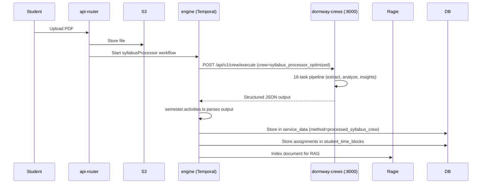

# BrainGains RAG and AI Crews

DormWay's AI intelligence layer is built on CrewAI, a multi-agent Python framework. The primary crew processes uploaded syllabi and produces rich structured output (assignments, policies, insights, grading). A secondary RAG layer (powered by Ragie) indexes syllabus documents for Ace (the AI assistant).

## Service Overview

| Service | Port | Stack |
|---------|------|-------|
| `dormway-crews` | 8000 | Python, FastAPI, CrewAI, OpenAI |
| Called via | Engine activities | HTTP POST from `braingains.activities.ts` |

## Syllabus Processing Pipeline

When a student uploads a syllabus, the full pipeline is:



## Crew Architecture

The syllabus crew (`syllabus_processor_optimized.py`) uses a 16-task pipeline with specialized agents:

### Agents

| Agent | Created by | Responsibility |
|-------|-----------|----------------|
| `syllabus_parser` | `create_syllabus_parser()` | Core extraction of course info, schedule, assignments |
| `class_session_extractor` | `create_class_session_extractor()` | Dedicated class session extraction (separate to prevent context accumulation) |
| `intelligence_analyzer` | `create_intelligence_analyzer()` | Hidden insights, workload analysis, professor style |
| `json_formatter` | `create_json_formatter()` | Normalizes output into canonical JSON structure |

Each agent has `verbose=True` and `memory=True` to maintain context within its task sequence.

### Template Variables

Crew prompts use Jinja-style template variables (not Python f-strings):

```python
# Correct — CrewAI handles interpolation
"{semester_dates.start_date}"
"{semester_dates.end_date}"

# semester_dates is passed as a template variable to the crew
crew_input = {
    "syllabus_content": text,
    "semester_dates": {
        "start_date": "2026-01-06",
        "end_date": "2026-04-30",
        "semester_name": "Winter 2026"
    },
    "ai_communication": user_preferences.aiCommunication
}
```

## Crew Output: Key Fields

The crew produces approximately 60 fields. The engine actively consumes about 35% of them.

### Fields the Engine Uses

| Field | Type | How Used |
|-------|------|----------|
| `class_sessions` | array | Parsed into `time_blocks` (type=class) |
| `schedule_events` | array | Parsed into `time_blocks` |
| `assignments` | array | Parsed into `student_time_blocks` (type=assignment/assessment) |
| `critical_dates` | array | Merged with assignments for scheduling |
| `grading` | object | Stored in course context metadata |
| `policies` | array (25 rich items) | Stored in course context metadata |
| `instructor` | object | Stored in course context metadata |
| `semester_dates` | object | Term boundary extraction |
| `weekly_analysis` | array | Stored in service_data, passed through BFF |

### Rich Assignment Shape

Each item in `assignments` preserves all LLM-produced keys:

```typescript
interface Assignment {
  name: string;
  type: string;          // 'homework', 'quiz', 'exam', 'project'
  due_date: string;      // ISO date string
  weight: number;        // 0-1 grade weight
  estimated_hours: number;
  priority: string;      // 'high', 'medium', 'low'
  submission_method: string;
  rubric_summary: string;
  tips: string;
  collaboration_allowed: boolean;
  // Plus any extra LLM-produced keys (isFinal, rubric, canvas_id, etc.)
}
```

### Rich Policy Shape

Each item in `policies` is a full object (not a flat key-value):

```typescript
interface PolicyItem {
  category: string;        // 'attendance', 'late_work', 'academic_integrity'
  policy_text: string;     // Full policy text from syllabus
  summary: string;
  criticality: string;     // 'high', 'medium', 'low'
  consequences: string;
  strictness: string;      // 'strict', 'moderate', 'lenient'
  action_required: string;
  relevant_dates: string | null;
  section_found: string;
}
```

### Intelligence Fields

| Field | Description |
|-------|-------------|
| `hidden_insights` | Object containing `professor_style`, `hidden_workload`, `success_indicators`, `strategic_advantages`, `wellness_factors` |
| `professor_style` | Teaching style, communication preferences, office hours usage |
| `red_flags` | Patterns that indicate course difficulty or grading risks |
| `opportunities` | Ways to maximize grade with least effort |
| `weekly_analysis` | Week-by-week workload forecast across the semester |
| `decision_matrix` | `take_if`, `avoid_if`, `pair_well_with`, `workload_compatibility` |
| `grade_strategy` | Strategic grading advice including gotchas and priorities |

### Output Validation

As of 2026-02-14, the Pydantic `SyllabusAnalysis` model is no longer used for validation. It was removed because `extra='allow'` only applied at the top level, causing nested objects (`PolicyInfo`, `Assignment`, etc.) to lose all extra keys via `model_dump()`.

Replaced with `_validate_json_structure()`: a lightweight check that verifies `course_code` and `course_title` exist and key fields have expected types. No data transformation.

## Ragie RAG Indexing

After syllabus processing, the document is indexed in Ragie for Ace (AI assistant) retrieval:

```typescript
import { getRagieAdapter } from '@dormway/core/adapters/ragie';

const ragie = getRagieAdapter();
await ragie.indexDocument({
  contextId: courseContextId,
  content: syllabusText,
  metadata: { courseCode, studentId }
});
```

The Ace assistant queries Ragie to answer student questions like "What's the attendance policy in EECS 281?" or "When is the final exam?".

## Storage

Crew output is stored in `service_data`:

```sql
SELECT data
FROM service_data
WHERE context_id = $1          -- course context ID
  AND method = 'processed_syllabus_crew'
  AND fetched_at >= NOW() - INTERVAL '30 days'
ORDER BY fetched_at DESC
LIMIT 1;
```

The legacy path uses `method = 'braingains_syllabus_structure'`.

## Ace Context Aggregation

The `ace-context-aggregator.ts` in api-router fetches data from multiple sources in parallel and assembles context for the Ace LLM:

```typescript
// Key entity methods for Ace context
studentEntity.getContextPrediction()  // Travel status, location, weather
studentEntity.getDayPlan()            // Today's schedule
studentEntity.getCourses()            // Enrolled courses with syllabus status
campusEntity.getLogisticsWidget()     // Dining, parking, facilities
cityEntity.getWeather()               // Current conditions
cityEntity.getTransit()               // Road closures, events
```

Student context prediction data is stored at `input.environment` (not at the top level):

```typescript
const env = contextPrediction?.input?.environment;
const travelStatus = env?.travelStatus;
const travelWeather = env?.travelWeather;
const homeWeather = env?.homeWeather;
```

## Key Files

| File | Purpose |
|------|---------|
| `services/dormway-crews/crews/syllabus_processor_optimized.py` | Crew definition, normalization, validation |
| `services/dormway-crews/shared/agents/syllabus_experts.py` | Agent factory functions |
| `services/engine/src/activities/braingains.activities.ts` | Crew invocation from engine |
| `services/engine/src/activities/semester.activities.ts` | Crew output → time_blocks + context metadata |
| `services/api-router/src/services/ace-context-aggregator.ts` | Ace context assembly |
| `services/shared/dormway-core/src/adapters/ragie/` | Ragie RAG adapter |
