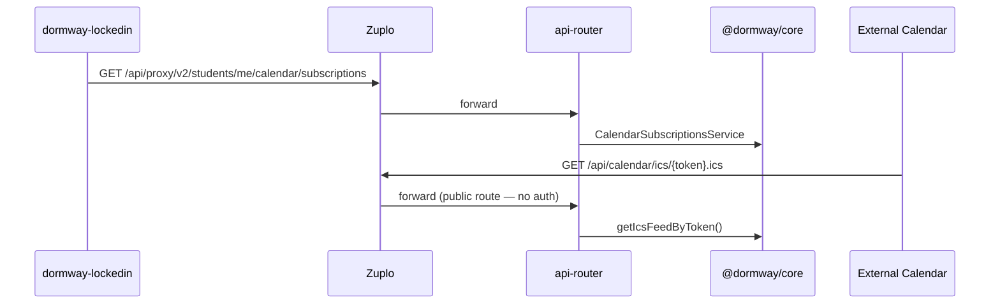

# Calendar and Time Blocks

DormWay has two complementary calendar systems:

1. **Inbound ICS parsing** — fetching and parsing LMS feeds (Canvas, Moodle, etc.) into `student_time_blocks`.
2. **Outbound ICS subscriptions** — generating tokenized ICS feeds that students subscribe to in Apple/Google/Outlook Calendar.

The campus academic calendar (term dates, breaks, exams) is maintained separately via Perplexity AI enrichment.

---

## Inbound: LMS ICS Parsing

### Code Entry Points

| File | Purpose |
|------|---------|
| `services/engine/src/activities/canvasICS.activities.ts` | Per-LMS parsers + ICS fetch, store, validate |
| `services/engine/src/workflows/canvasICSSync.workflow.ts` | Sync workflow: fetch → parse → match courses → store assignments |
| `services/engine/src/services/calendarNormalization.service.ts` | Generic normalization (manual schedule input) |
| `services/api-router/src/routes/canvas-routes.ts` | ICS connect endpoint (`POST /api/canvas/ics/connect`) |

### Supported Platforms

| Platform | `lms_type` | Parser Function | Status |
|----------|-----------|----------------|--------|
| Canvas (Instructure) | `canvas` | `parseCanvasICSFormat()` | Implemented |
| Moodle | `moodle` | `parseMoodleICSFormat()` | Implemented |
| Blackboard (Anthology) | `blackboard` | `parseBlackboardICSFormat()` | Stub (falls back to Canvas parser) |
| Google Classroom | `google_classroom` | `parseGoogleClassroomICSFormat()` | Stub |
| Brightspace / Schoology | — | `parseGenericICSFormat()` | Generic fallback |

Routing is by `lms_type` stored in `service_credentials` at connect time — not by PRODID sniffing.

### Canvas ICS

- **Feed URL**: `https://{institution}.instructure.com/feeds/calendars/user_{hash}.ics`
- **PRODID**: Contains `Instructure`
- **Course extraction**: Parses course code from SUMMARY brackets — `[ASTRO 104 001 FA 2025]`
- **Events without brackets** are skipped.
- Supports `RRULE` for recurring events (unlike Moodle/Blackbaud which expand all occurrences).

```typescript
// Course code extraction from Canvas SUMMARY
const courseMatch = summary.match(/\[([^\]]+)\]/);
const courseCodeParts = courseFullName.split(/\s+/);
const courseCode = courseCodeParts.slice(0, 2).join(' ');
```

### Moodle ICS

- **Feed URL**: `https://{institution}/calendar/export_execute.php?userid={id}&authtoken={token}&preset_what=all&preset_time=recentupcoming`
- **PRODID**: Contains `Bennu`
- **Course extraction**: Two-pass — SUMMARY prefix first, then CATEGORIES fallback.
- **No RRULE**: All occurrences are expanded individually.
- **Attendance filtering**: Events with SUMMARY = `Attendance` and session duration (20–240 min) are skipped. `Attendance closes` (zero-duration) events are kept.

```typescript
// Moodle CATEGORIES normalization
// "BIOL201L All Sections 2026S" → "BIOL 201L"
const cleaned = catStr.replace(/\s+All Sections.*$/i, '').replace(/-?\d{4}[A-Z]?$/i, '').trim();
```

### Lab/Section Collapsing

When multiple parsed course codes map to the same course context (e.g., `BIOL 201` + `BIOL 201L`), `pickPreferredCourseCode()` in the sync workflow picks the shorter base code to avoid duplicate course buckets.

### All-Day Event Handling

`VALUE=DATE` events get `T23:59:59Z` appended to display on the correct date in negative-UTC timezones.

### Term-Start Filtering

Assignments dated before the current term's start date are dropped and cleaned from `student_time_blocks`.

---

## Outbound: Calendar Subscription Feeds

Students can subscribe to a personal ICS feed that exports their schedule to Apple/Google/Outlook Calendar.

### Architecture



### Business Logic Ownership

All subscription logic lives in `@dormway/core`:
- `services/shared/dormway-core/src/domains/calendar-subscriptions/calendar-subscriptions.service.ts`

`api-router` is transport-only: auth, validation, DTO mapping, HTTP response shaping. No subscription SQL in route handlers.

### Token and URL Rules

- Tokens are HMAC-based and deterministic from `(subscription_id, token_nonce)`.
- The database stores `token_hash`, `token_nonce`, and metadata. The raw token is returned to clients when needed.
- The subscription URL uses the configured public base URL (not inbound host headers).
  - Resolution order: `CALENDAR_SUBSCRIPTIONS_PUBLIC_BASE_URL` → `PUBLIC_API_BASE_URL` → `NEXT_PUBLIC_API_BASE_URL` → `https://api.dormway.app`

### Zuplo Route Requirement

The feed route must be explicitly declared as public in `dormway-api-2`:

```json
// .repos/dormway-api-2/config/routes.oas.json
"/api/calendar/ics/{token}.ics"
```

Do not rely on the `"/api/**"` catch-all for this endpoint — catch-all policy changes cause 401 errors for valid feed requests.

### Loop Prevention

ICS output includes a DormWay-origin marker to prevent recursive subscription ingestion:

```ics
UID: dormway-{userId}-{time_block_id}
X-DORMWAY-SOURCE: dormway
```

The inbound ICS normalizer skips events with `X-DORMWAY-SOURCE: dormway`. The web ICS-import UI also blocks DormWay feed URLs from being re-imported.

### Feed Query Rules

- Source table: `student_time_blocks`
- Include active lifecycle rows only
- Always cast the `type` enum to text before string transforms:
  ```sql
  COALESCE(type::text, '')   -- not COALESCE(type, '') which can throw enum errors
  ```

---

## Campus Academic Calendar

Term dates, breaks, and exam periods are fetched via Perplexity AI and stored in two places:

| Storage | Purpose |
|---------|---------|
| `service_data` (method `processed_perplexity_campus_data`) | **Canonical source** |
| `campus_configs.academic_calendar` | **Performance cache** (backfilled from Perplexity) |

<Warning>
`campus_configs.current_term_data` is managed by course enrollment systems. The Perplexity backfill only updates `academic_calendar`, never `current_term_data`.
</Warning>

### Data Structure

```json
{
  "data": {
    "termDates": {
      "academicCalendar": {
        "terms": [
          {
            "id": "fall-2025",
            "name": "Fall 2025",
            "year": 2025,
            "startDate": "2025-08-25",
            "endDate": "2025-12-17",
            "breaks": [],
            "examPeriod": {}
          }
        ]
      }
    }
  }
}
```

### APIs

| Endpoint | Description |
|----------|-------------|
| `GET /api/v2/students/me/term-calendar` | Student term dropdown (queries `campus_configs` cache) |
| `GET /api/admin/campus-configs/:campusId` | Admin view (queries canonical `service_data`) |
| `POST /api/admin/campus-configs/trigger-enrichment` | Force re-enrichment via Perplexity |

---

## time_block_type Enum

The `type` column in `time_blocks` and `student_time_blocks` uses this enum:

| Value | Source |
|-------|--------|
| `class` | LMS schedule |
| `assignment` | LMS / syllabus |
| `assessment` | Syllabus |
| `club` | Manual |
| `meeting` | Manual |
| `meal` | Manual |
| `sleep` | Manual |
| `travel` | Inferred |
| `other` | Manual |
| `holiday` | Campus calendar |
| `trip` | Manual |
| `appointment` | Manual |
| `sports` | Manual |
| `concert` | Manual |
| `extracurricular` | Manual |

<Note>
`quiz`, `exam`, and `project` are NOT enum values. Assignment subtypes live in `student_time_blocks.metadata.assignment_type`.
</Note>

## Source Types

The `source` column on `student_time_blocks` indicates origin:

| Value | Description |
|-------|-------------|
| `canvas` | Synced from Canvas ICS feed |
| `lms` | Generic LMS source |
| `syllabus` | Extracted from uploaded syllabus |
| `manual` | Student-entered manually |
