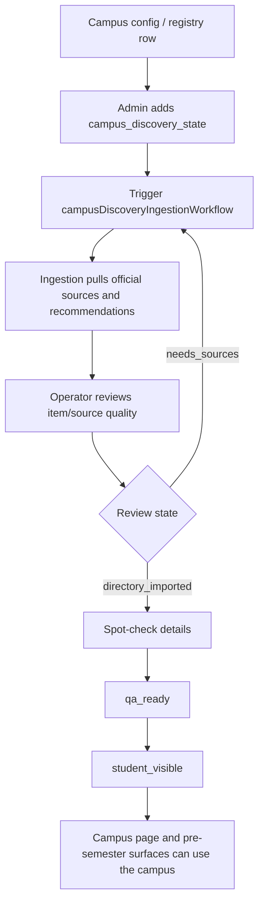
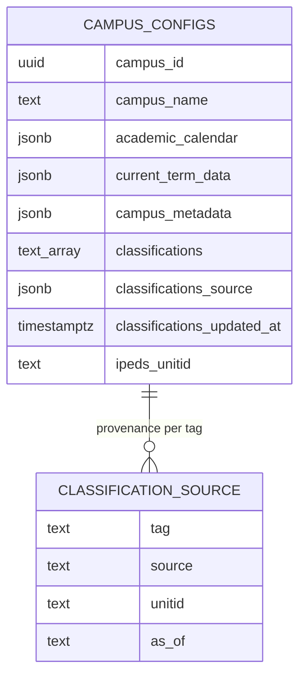

# Campus Intelligence

DormWay's campus layer is not a list of schools. It is a **per-campus and per-college-town world model**: weather, dining, events, safety/news, transport and parking, the school's real academic calendar, and housing — merged with the student's personal sources (Canvas, syllabi, schedule). This is the core differentiator. A study-materials tool or a generic planner has no campus or world context; DormWay does.

This page separates what is live today from what is planned, because several of the latest Obsidian docs are implementation plans rather than shipped code.

## The World Model (Differentiator)

DormWay maintains two layers of place-aware context, both grounded in the `contexts` hierarchy (see [Context System](/docs/engineering/context-system)) and stored as time-stamped rows in the partitioned `service_data` table:

| Layer | Stored on | What it carries |
|-------|-----------|-----------------|
| College-town (city) | the campus's parent city context | weather, multi-day forecast, transit issues, local news, processed city context |
| Campus | the campus context | events, dining, news and safety alerts, logistics (parking, facilities, closures), the school's academic calendar, housing |

The student layer then merges this place context with the student's own deadlines and schedule. Neither half alone is the product — the merge is.

<Note>
**Capability vs. rollout.** The *structure* spans every campus and college town in the system. Deep LLM enrichment (events, news, safety, logistics) is rolling out **target-campus-first** and is live on only a handful of pilot campuses today. Do not represent deep enrichment as complete for the full footprint. See [Enrichment Coverage](#enrichment-coverage-capability-vs-rollout).
</Note>

### Substrate at a Glance

Grounded counts (verified 2026-05-30):

| Substrate | Count | Role |
|-----------|-------|------|
| `campus_configs` | 6,456 | Per-campus config: academic calendar, current term, feature flags, data sources, metadata |
| `city_configs` (college towns) | 2,884 | Per-college-town config and sync schedule |
| `contexts` type = `city` | 2,891 | City nodes in the hierarchy |
| `contexts` type = `building` | 28,983 | Buildings (incl. residence halls) under campuses |

### Campus Enrichment Pipeline

Enrichment runs as Temporal activities on the `campus-worker` queue (`services/engine/src/activities/campus.activities.ts`). The default data-collection method for most campuses is `perplexity`; a small number of campuses use custom workflows.

1. **Source via Perplexity** — `fetchCampusEventsWithPerplexity` and the broader campus enrichment pull events, dining, news, safety, transportation/parking, facilities, and term dates, scoped to the campus's local timezone, city, and state.
2. **Persist as `processed_perplexity_campus_data`** — `savePerplexityCampusData` stores the raw enrichment (hash-deduplicated) and **backfills `campus_configs.academic_calendar` and `current_term_data`** when the calendar is valid. Writes are skipped if `campus_metadata.calendar_locked` is set, and terms that ended more than 18 months ago are rejected as stale (DORM-949).
3. **Transform into widgets** — single-shot LLM calls turn the enrichment into student-facing widgets, replacing the older multi-agent crews:
   - `campus-logistics-widgets` → `processed_campus_logistics_crew` (parking, facilities, dining, weather)
   - `campus-events-widgets` → `processed_campus_events_crew`
   - `campus-news-widgets` → `processed_campus_news_crew` (the **news & safety** surface)
4. **City context** — weather, forecast, transit, and news are fetched and processed at the city level (`fetch_weather`, `fetch_forecast`, `fetch_transit`, `fetch_news`, `processed_city_context`) and read up the hierarchy by campus activities.

### Enrichment Coverage (Capability vs. Rollout)

Enrichment is **priority-scored and rolling**, not a one-time full-footprint backfill. `getCampusesForEnrichment` ranks campuses by active accounts, student count, course count, housing signal, enrollment, and staleness, then enriches the top of the list. `checkCampusNeedsEnrichment` treats a campus as needing enrichment if it was never enriched or last enriched more than 30 days ago; the batch selector uses a 7-day floor.

The honest framing for partners and employees:

- The **per-campus / per-college-town model is structural** and exists across the footprint.
- **Deep LLM enrichment** (events, news, safety, logistics widgets) is **live on a handful of pilot/target campuses**, expanding outward by priority.
- Academic-calendar coverage is broader than widget coverage because calendar backfill rides on the same enrichment pass and is the highest-value field.

### Implementation Map: World Model

| Concern | Primary paths |
|---------|---------------|
| Campus enrichment + widget transforms | `services/engine/src/activities/campus.activities.ts` |
| Campus config + calendar backfill | `services/api-router/src/services/campus-config-service.ts`, `campus.activities.ts` (`savePerplexityCampusData`) |
| City (college-town) context | `services/shared/dormway-core/src/domains/city/city.service.ts`, `city/types.ts` |
| Context hierarchy | `services/shared/dormway-core/src/database/context-graph/context-graph.service.ts` (see [Context System](/docs/engineering/context-system)) |

---

## Campus Classification &amp; Discovery

Beyond the world model, the campus layer is the data substrate for pre-arrival activation, student-visible campus pages, K-12 handling, cohort analysis, and future campus classification queries.

## Current Live Model

| Concept | Current role |
|---------|--------------|
| `campus_configs` | Main campus configuration store for campus pages, academic calendars, current term data, feature flags, and metadata. |
| `contexts` | Graph-backed context model for campuses, students, courses, buildings, cities, and dependencies. |
| `campus_registry` | Existing registry source for known campuses and IPEDS-backed metadata. |
| `campus_discovery_state` | Operator-controlled allowlist and promotion state for campus discovery and pre-semester extraction. |
| Campus Discovery API | Student/public-facing discovery payload for campus pages and activation surfaces. |
| Admin Campus Discovery | Review-state page for adding campuses, triggering ingestion, and promoting student-visible status. |

## Campus Discovery Flow

The important contract is that public visibility is an explicit operator decision. Discovery is allowed to gather evidence, but it does not silently promote a campus to student-visible.

## Classification Work: Current vs Planned

The new Obsidian docs describe two related but different classification tracks:

| Track | Status | Shape |
|-------|--------|-------|
| School type | Planned architecture | A first-class signal for `college`, `community_college`, `k12_high_school`, `k12_middle_school`, `k12_elementary`, `k12_other`, `medical_school`, `graduate`, and `other`. |
| Campus classifications | Draft implementation plan | Queryable `campus_configs.classifications text[]` tags such as `msi:hbcu`, `control:public`, `level:4year`, `carnegie_basic:r1`, and `athletic:big_ten`. |

The live code still contains transitional logic such as K-12 defaults and school-request type validation. The durable direction is to replace name regexes and one-off lists with sourced, queryable campus metadata.

## Proposed Data Sources

| Source | Intended use |
|--------|--------------|
| IPEDS | US colleges, control, level, region, UNITID, and baseline classifications. |
| NCES public-school dataset | Public K-12 schools, grade range, school type, and open/closed status. |
| International HE registries | Higher-ed institutions in priority non-US markets, especially where email-domain matching is available. |
| Carnegie 2025 | Research, degree, and institutional classification tags. |
| ED MSI eligibility lists | HBCU, HSI, TCU, AANAPISI, ANNH, PBI, and NASNTI designations. |
| NCAA / curated systems lists | Athletic conference, division, UC/SUNY/CUNY/UNCF/TMCF, and similar tags. |

## Target Campus Classification Shape

The planned `classifications` model is intentionally additive:

The field is designed for queries such as:

- "all HBCUs"
- "public four-year schools in the South"
- "Big Ten schools"
- "campuses with no source-backed classification"

Every tag should have provenance in `classifications_source`; otherwise the tag is not auditable.

## School Type Direction

The planned school-type signal is narrower than the classifications array. It answers "what kind of institution is this campus row?" so downstream logic can stop guessing from names.

Expected consumers include:

- K-12 default term dates
- future K-12 calendar enrichment
- onboarding year/grade picker behavior
- Mix and campus social surfaces that should not assume a residential college model
- LLM enrichment prompts that should differ between a high school, a medical school, and a four-year college

## What Is Not Shipped Yet

These items are plans, not live guarantees:

- `campus_configs.classifications`
- `classifications_source`
- `classifications_updated_at`
- `ipeds_unitid`
- quarterly classification refresh workflow
- public `/v2/campuses?classification=...` filter
- admin override UI for school type
- full IPEDS/NCES/Carnegie/MSI/NCAA backfill pipeline

Until those land, readers should treat classification docs as execution direction and not as current API shape.

## Implementation Map

| Concern | Primary paths |
|---------|---------------|
| Admin discovery state | `services/api-router/src/routes/admin/campus-discovery-state-routes.ts`, `services/dormway-admin/src/pages/campus-discovery-state/index.tsx` |
| Student/public campus discovery | `services/api-router/src/routes/v2/campus-discovery.routes.ts`, `services/dormway-lockedin/src/app/colleges/[slug]/` |
| Discovery workflow | `services/engine/src/workflows/campusDiscoveryIngestion.workflow.ts`, `services/engine/src/activities/campusDiscovery.activities.ts` |
| K-12 defaults | `services/shared/dormway-core/src/domains/campus/k12-defaults.ts` |
| School request typing | `services/api-router/src/routes/school-request-routes.ts` |
| Pre-semester dependency | `services/api-router/src/routes/admin/cohort-deadline-extraction-routes.ts` |

## Engineering Rules

- Do not add more name-list matching when a sourced campus field would solve the problem.
- Keep public visibility operator-controlled until source quality is proven.
- Store stable external IDs such as IPEDS UNITID and NCES ID when importing public datasets.
- Separate system-managed classifications from editorial or growth tags.
- Preserve provenance for every classification value so production counts can be explained later.
