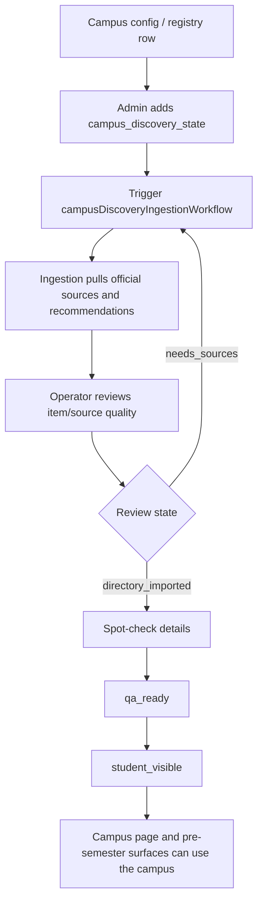
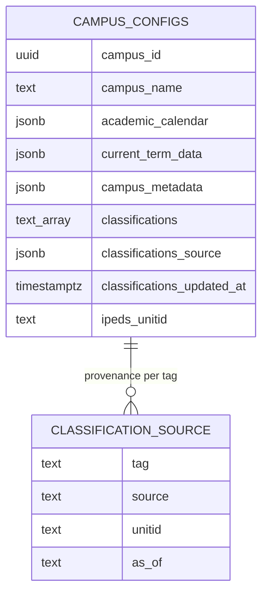

# Campus Intelligence

DormWay's campus layer is no longer only a list of schools. It is becoming the data substrate for pre-arrival activation, student-visible campus pages, term calendars, K-12 handling, cohort analysis, and future campus classification queries.

This page separates what is live today from what is planned, because several of the latest Obsidian docs are implementation plans rather than shipped code.

## Current Live Model

| Concept | Current role |
|---------|--------------|
| `campus_configs` | Main campus configuration store for campus pages, academic calendars, current term data, feature flags, and metadata. |
| `contexts` | Graph-backed context model for campuses, students, courses, buildings, cities, and dependencies. |
| `campus_registry` | Existing registry source for known campuses and IPEDS-backed metadata. |
| `campus_discovery_state` | Operator-controlled allowlist and promotion state for campus discovery and pre-semester extraction. |
| Campus Discovery API | Student/public-facing discovery payload for campus pages and activation surfaces. |
| Admin Campus Discovery | Review-state page for adding campuses, triggering ingestion, and promoting student-visible status. |

## Campus Discovery Flow

The important contract is that public visibility is an explicit operator decision. Discovery is allowed to gather evidence, but it does not silently promote a campus to student-visible.

## Classification Work: Current vs Planned

The new Obsidian docs describe two related but different classification tracks:

| Track | Status | Shape |
|-------|--------|-------|
| School type | Planned architecture | A first-class signal for `college`, `community_college`, `k12_high_school`, `k12_middle_school`, `k12_elementary`, `k12_other`, `medical_school`, `graduate`, and `other`. |
| Campus classifications | Draft implementation plan | Queryable `campus_configs.classifications text[]` tags such as `msi:hbcu`, `control:public`, `level:4year`, `carnegie_basic:r1`, and `athletic:big_ten`. |

The live code still contains transitional logic such as K-12 defaults and school-request type validation. The durable direction is to replace name regexes and one-off lists with sourced, queryable campus metadata.

## Proposed Data Sources

| Source | Intended use |
|--------|--------------|
| IPEDS | US colleges, control, level, region, UNITID, and baseline classifications. |
| NCES public-school dataset | Public K-12 schools, grade range, school type, and open/closed status. |
| International HE registries | Higher-ed institutions in priority non-US markets, especially where email-domain matching is available. |
| Carnegie 2025 | Research, degree, and institutional classification tags. |
| ED MSI eligibility lists | HBCU, HSI, TCU, AANAPISI, ANNH, PBI, and NASNTI designations. |
| NCAA / curated systems lists | Athletic conference, division, UC/SUNY/CUNY/UNCF/TMCF, and similar tags. |

## Target Campus Classification Shape

The planned `classifications` model is intentionally additive:

The field is designed for queries such as:

- "all HBCUs"
- "public four-year schools in the South"
- "Big Ten schools"
- "campuses with no source-backed classification"

Every tag should have provenance in `classifications_source`; otherwise the tag is not auditable.

## School Type Direction

The planned school-type signal is narrower than the classifications array. It answers "what kind of institution is this campus row?" so downstream logic can stop guessing from names.

Expected consumers include:

- K-12 default term dates
- future K-12 calendar enrichment
- onboarding year/grade picker behavior
- Mix and campus social surfaces that should not assume a residential college model
- LLM enrichment prompts that should differ between a high school, a medical school, and a four-year college

## What Is Not Shipped Yet

These items are plans, not live guarantees:

- `campus_configs.classifications`
- `classifications_source`
- `classifications_updated_at`
- `ipeds_unitid`
- quarterly classification refresh workflow
- public `/v2/campuses?classification=...` filter
- admin override UI for school type
- full IPEDS/NCES/Carnegie/MSI/NCAA backfill pipeline

Until those land, readers should treat classification docs as execution direction and not as current API shape.

## Implementation Map

| Concern | Primary paths |
|---------|---------------|
| Admin discovery state | `services/api-router/src/routes/admin/campus-discovery-state-routes.ts`, `services/dormway-admin/src/pages/campus-discovery-state/index.tsx` |
| Student/public campus discovery | `services/api-router/src/routes/v2/campus-discovery.routes.ts`, `services/dormway-lockedin/src/app/colleges/[slug]/` |
| Discovery workflow | `services/engine/src/workflows/campusDiscoveryIngestion.workflow.ts`, `services/engine/src/activities/campusDiscovery.activities.ts` |
| K-12 defaults | `services/shared/dormway-core/src/domains/campus/k12-defaults.ts` |
| School request typing | `services/api-router/src/routes/school-request-routes.ts` |
| Pre-semester dependency | `services/api-router/src/routes/admin/cohort-deadline-extraction-routes.ts` |

## Engineering Rules

- Do not add more name-list matching when a sourced campus field would solve the problem.
- Keep public visibility operator-controlled until source quality is proven.
- Store stable external IDs such as IPEDS UNITID and NCES ID when importing public datasets.
- Separate system-managed classifications from editorial or growth tags.
- Preserve provenance for every classification value so production counts can be explained later.
