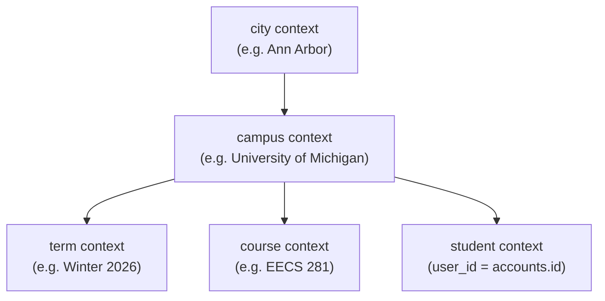

# Context System

DormWay's context system is the hierarchical backbone of the platform. Every entity — cities, campuses, courses, students — is stored as a row in the `contexts` table with a `parent_id` that forms a tree. Additional many-to-many relationships are tracked in `context_dependencies`.

## Core Table: `contexts`

```sql
CREATE TABLE contexts (
  id            UUID PRIMARY KEY,
  parent_id     UUID REFERENCES contexts(id),
  type          TEXT NOT NULL,  -- 'city', 'campus', 'course', 'student', 'term'
  name          TEXT,
  metadata      JSONB,
  user_id       UUID REFERENCES accounts(id),  -- set for student contexts only
  external_id   TEXT,
  is_active     BOOLEAN DEFAULT true,
  next_sync_at  TIMESTAMPTZ,
  sync_frequency_minutes INTEGER,
  sync_priority_score    NUMERIC
);
```

| `type` | Represents | `parent_id` points to |
|--------|------------|----------------------|
| `city` | A city in the system | NULL (root) |
| `campus` | A university campus | city context |
| `term` | An academic term | campus context |
| `course` | A course section | campus context (or term context) |
| `student` | A student enrollment | campus context |

## Context Hierarchy



The student context's `parent_id` points to the campus context. Students connect to courses through `context_dependencies` (not `parent_id`).

## Getting a Student's Campus

The `accounts` table has **no `campus_id` column**. Always use a join through `contexts`:

```sql
SELECT c.id, c.name
FROM accounts a
JOIN contexts student_ctx
  ON student_ctx.user_id = a.id AND student_ctx.type = 'student'
JOIN contexts c
  ON c.id = student_ctx.parent_id AND c.type = 'campus'
WHERE a.id = $1;
```

## Context Dependencies: Many-to-Many Relationships

The `context_dependencies` table stores relationships that don't fit the strict parent-child tree:

```sql
CREATE TABLE context_dependencies (
  parent_context_id  UUID NOT NULL REFERENCES contexts(id),
  child_context_id   UUID NOT NULL REFERENCES contexts(id),
  dependency_type    TEXT NOT NULL,  -- 'enrolled_in', 'attends', 'lives_in', etc.
  metadata           JSONB
);
```

<Warning>
The column is `child_context_id`, NOT `target_context_id`. Using the wrong name returns empty results silently.
</Warning>

### Get a Student's Enrolled Courses

```sql
SELECT course_ctx.*
FROM context_dependencies cd
JOIN contexts course_ctx ON course_ctx.id = cd.child_context_id
WHERE cd.parent_context_id = $1   -- student context ID
  AND cd.dependency_type = 'enrolled_in'
  AND course_ctx.type = 'course';
```

## Course Code Canonicalization

All course-related objects must converge on one canonical context per `(campus_id, term_id, root canonical code)`. This is enforced via two functions in `@dormway/core`:

- **`buildCourseCodeMetadata()`** — Produces canonical, root, compact, and alias variants of a course code.
- **`findOrCreateCourseContext()`** — Uses canonical metadata and aliases to prevent duplicate course contexts. Always call this instead of inserting directly.

Key storage fields:
- `contexts.metadata.courseCodeRootCanonical` — the canonical root code (e.g., `EECS 281`)
- `contexts.metadata.courseCodeAliases` — array of variant codes (e.g., `EECS281`, `eecs 281`)
- `time_blocks.course_code_normalized` — the normalized code on schedule rows
- `student_time_blocks.course_code_normalized` — same on student-scoped rows

### Duplicate Detection Guardrails

| Threshold | Value |
|-----------|-------|
| Duplicate rate (overall) | < 0.5% |
| Duplicate rate (large campus > 500 contexts) | < 0.2% |
| Hard cap (active terms) | < 50 duplicates |

Admin endpoints:
- `POST /api/admin/courses/reconcile-duplicates` — merge with dry-run option
- `GET /api/admin/courses/duplicates-hybrid` — list with strict/loose toggle
- `GET /api/admin/courses/health` — orphan blocks, mismatch events, new context spikes

## Term Context Rules

- Term ID is normalized from `campus_configs.current_term_data` where available.
- If term data is missing, fall back to an estimated term by date and flag for QA.
- External IDs are term-specific: always include a term suffix (e.g., `EECS281_winter_2026`).

## Campus Onboarding on First Signup

When the first student signs up at a new campus, the Clerk `user.created` webhook triggers the `processSingleCampus` Temporal workflow:

```typescript
await temporalClient.startWorkflow({
  workflowId: `campus-onboard-signup-${campusId}-${userId}`,
  workflowName: 'processSingleCampus',
  taskQueue: 'campus-worker',
  args: [campusId],
});
```

This workflow (in `services/engine/src/workflows/campusProcessor.workflow.ts`) fetches the academic calendar from Perplexity AI, creates term contexts, and populates `campus_configs.current_term_data`. Without this, courses have a NULL `term_id` and the schedule page cannot function.

The workflow ID is idempotent: if multiple users sign up simultaneously, only one onboarding runs per campus.

## Related APIs

| Endpoint | Description |
|----------|-------------|
| `GET /api/v2/students/me/context` | Student's resolved context |
| `GET /api/v2/students/me/campus` | Campus information |
| `GET /api/v2/students/me/terms` | Academic terms for student's campus |
| `GET /api/v2/students/me/current-term` | Active term |
| `GET /api/v2/students/me/courses` | Enrolled course list |
