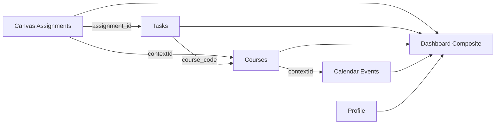

# Demo Fixtures System

**Status**: ✅ Production Ready
**Version**: 1.0
**Last Updated**: 2025-12-26
**Related**: [Demo Static Mode](/docs/engineering/development/demo-static-mode), Canvas LMS Integration, [Dashboard Architecture](/docs/engineering/ios-dashboard-architecture)

---

## Overview

The Demo Fixtures System provides realistic mock data for the homepage demo iframe. With 4200+ lines of interconnected data, it creates a fully functional demo experience without requiring authentication or database access.

---

## Fixture Inventory

### Complete Data Set

| Category | Count | Purpose |
|----------|-------|---------|
| **Canvas Assignments** | 21 | Show coursework and deadlines |
| **Courses** | 4 | Semester schedule representation |
| **Tasks** | 10 | Task bank and priority management |
| **Calendar Events** | 8 | Schedule visualization |
| **Dashboard Widgets** | 12 | Home screen composite data |
| **Profile Data** | 1 | User info and preferences |
| **Time Blocks** | 6 | Planner schedule blocks |

**Total Lines**: 4200+
**Total Size**: ~200KB

---

## Data Structure

### 1. Canvas LMS Data

#### Assignments (`demoCanvasAssignments`)

21 assignments across 4 courses with realistic distribution:

```typescript
// COMM 404 - Advanced Communication (6 assignments)
{
  id: 1001,
  name: 'Research Paper Draft',
  course_id: 404,
  course_name: 'COMM 404 - Advanced Communication',
  contextId: 'bb2887ee-55ae-414a-87bd-e049522a786c',
  due_at: '2025-09-22T23:59:00Z',
  points_possible: 100,
  submission_types: ['online_upload'],
  workflow_state: 'published',
  weight: 15,
}
```

**Courses Included**:
1. **COMM 404** - Advanced Communication (6 assignments)
2. **COMM 230** - Digital Media & Culture (5 assignments)
3. **ASTRO 104** - Exploring the Universe (5 assignments)
4. **DIGITAL 202** - Digital Strategy (5 assignments)

**Assignment Types**:
- Papers/Essays
- Quizzes/Exams
- Discussions
- Projects/Demos
- Problem Sets

#### Canvas Status (`demoCanvasStatus`)

```typescript
{
  connected: true,
  lastSync: '2025-11-10T08:00:00Z',
  syncStatus: 'success',
  coursesCount: 4,
  assignmentsCount: 21,
}
```

#### Upcoming Assignments (`demoCanvasUpcoming`)

2 urgent assignments due within 3 days:
- Prototype Demo (DIGITAL 202) - 2 days
- Midterm Exam (ASTRO 104) - 3 days

---

### 2. Task Bank (`demoTasks`)

10 tasks with varied priorities and sources:

```typescript
{
  id: 'task-1',
  user_id: '06ea6226-c327-483b-9bc6-e554af6a22a1',
  title: 'Start Research Paper Draft',
  estimated_duration_minutes: 120,
  priority: 'high',
  course_code: 'COMM 404',
  due_date: '2025-09-22T23:59:00Z',
  status: 'pending',
  source: 'assignment', // or 'manual', 'dayplan', 'ai_suggestion'
  metadata: {
    assignment_id: 1001,
    contextId: 'bb2887ee-55ae-414a-87bd-e049522a786c',
  },
}
```

**Priority Distribution**:
- Urgent: 2 tasks
- High: 3 tasks
- Medium: 3 tasks
- Low: 2 tasks

**Source Types**:
- `assignment` - Linked to Canvas (70%)
- `manual` - User-created (10%)
- `dayplan` - From AI day planner (10%)
- `ai_suggestion` - AI-recommended (10%)

---

### 3. Dashboard Composite (`demoDashboardComposite`)

Aggregated data for the home screen with 12 widgets:

#### Core Sections

1. **Urgent Assignments Widget**
```typescript
{
  displayType: 'workload_summary',
  data: {
    urgentAssignments: [
      {
        id: 'assign-4003',
        title: 'Prototype Demo',
        course: 'DIGITAL 202',
        dueDate: '2025-11-12T14:00:00Z',
        daysUntil: 2,
        priority: 'urgent',
      },
      // ... 2 more
    ],
  },
}
```

2. **Due Soon Section**
```typescript
dueSoon: [
  {
    id: 4003,
    title: 'Prototype Demo',
    course_name: 'DIGITAL 202 - Digital Strategy',
    due_at: '2025-11-12T14:00:00Z',
    daysUntil: 2,
  },
  // ... 2 more
]
```

3. **Canvas Courses**
```typescript
canvasCourses: [
  {
    id: 404,
    name: 'COMM 404 - Advanced Communication',
    assignments_count: 6,
    upcoming_count: 1,
  },
  // ... 3 more courses
]
```

4. **Pending Tasks**
```typescript
pendingTasks: {
  items: [
    {
      id: 'task-3',
      title: 'Work on Digital Strategy Prototype',
      estimatedDuration: 180,
      priority: 'urgent',
      courseCode: 'DIGITAL 202',
      dueDate: '2025-11-12T14:00:00Z',
    },
    // ... 4 more tasks
  ],
}
```

---

### 4. Calendar & Schedule

#### Calendar Events (`demoCalendarEvents`)

8 events covering the current week:

```typescript
{
  events: [
    {
      id: 'event-1',
      title: 'COMM 404 - Lecture',
      start: '2025-09-15T10:00:00Z',
      end: '2025-09-15T11:30:00Z',
      type: 'class',
      location: 'Ryder Hall 458',
      course_code: 'COMM 404',
    },
    // ... 7 more events
  ],
}
```

**Event Types**:
- Class lectures
- Office hours
- Study sessions
- Project work time

#### Planner Blocks (`demoPlannerBlocks`)

6 time blocks for the day:

```typescript
{
  blocks: [
    {
      id: 'block-1',
      title: 'Morning Routine',
      start_time: '08:00',
      end_time: '09:00',
      type: 'personal',
      color: '#E3F2FD',
    },
    // ... 5 more blocks
  ],
}
```

---

### 5. User Data

#### Profile (`demoProfile`)

```typescript
{
  id: '06ea6226-c327-483b-9bc6-e554af6a22a1',
  email: 'demo@dormway.app',
  name: 'Demo Student',
  firstName: 'Demo',
  lastName: 'Student',
  university: 'Northeastern University',
  onboarding_status: 'completed',
}
```

#### Preferences (`demoPreferences`)

```typescript
{
  theme: 'dark',
  fontSize: 'medium',
  sidebarCollapsed: false,
  notifications: {
    email: true,
    push: true,
    dueSoon: 24, // hours
  },
}
```

---

## Data Relationships

### Interconnected Data Flow



### Key Relationships

1. **Assignments → Tasks**: Tasks reference assignment IDs
2. **Assignments → Courses**: Linked via `contextId`
3. **Tasks → Courses**: Linked via `course_code`
4. **All → Dashboard**: Composite aggregates everything

---

## Date Management

### Current Date Strategy

All dates are relative to a base date of **September 15, 2025**:

```typescript
// Assignment due dates
'2025-09-22T23:59:00Z'  // 1 week out (Research Paper)
'2025-09-25T23:59:00Z'  // 1.5 weeks out (Media Analysis)
'2025-11-12T14:00:00Z'  // 8 weeks out (Prototype Demo)

// Calendar events
'2025-09-15T10:00:00Z'  // Today (Morning class)
'2025-09-15T14:00:00Z'  // Today (Afternoon class)
'2025-09-16T10:00:00Z'  // Tomorrow

// Activity timestamps
'2025-11-08T10:00:00Z'  // Recent activity
'2025-11-10T08:00:00Z'  // Last sync
```

### Update Script

**Purpose**: Regenerate dates relative to current date

```bash
# Preview changes
npm run demo:update-fixtures:dry-run

# Apply updates
npm run demo:update-fixtures
```

**What It Updates**:
- Assignment due dates → Next 3 weeks from today
- Calendar events → This week
- Task due dates → Match assignments
- Activity timestamps → Recent dates
- Day plan date → Today

**Algorithm**:
```javascript
const today = new Date();
const assignmentDueSoon = addDays(today, 2);      // 2 days from now
const assignmentThisWeek = addDays(today, 5);     // 5 days from now
const assignmentNextWeek = addDays(today, 12);    // 12 days from now
const assignmentLater = addDays(today, 20);       // 20 days from now
```

---

## Adding New Fixtures

### Step-by-Step Guide

#### 1. Add Fixture Data

**File**: `src/demo-data/fixtures.ts`

```typescript
// Add at end of file
export const demoNewFeature = {
  id: 'feature-1',
  name: 'New Feature',
  data: {
    // ... your mock data
  },
};
```

#### 2. Register Route

**File**: `src/demo-data/router.ts`

```typescript
// Add to demoRoutes array
{
  test: (url) => url.pathname.startsWith('/api/proxy/new-feature'),
  handler: () => jsonResponse(demoNewFeature),
},
```

#### 3. Update Inventory

**File**: `src/demo-data/FIXTURES_INVENTORY.md`

```markdown
## New Feature

**Endpoint**: `/api/proxy/new-feature`
**Response**: `demoNewFeature`
**Purpose**: Demonstrates new feature X

### Data Structure
- id: Feature identifier
- name: Feature name
- data: Feature-specific data
```

#### 4. Test

```bash
# Start dev server
npm run dev

# Open demo iframe
open http://localhost:3008/dashboard?demoStatic=true&embed=true

# Check console for fixture load
# Expected: [demo-data] Serving fixture for /api/proxy/new-feature
```

#### 5. Document

Update this file with:
- New fixture count
- Data structure
- Relationships to existing data

---

## Best Practices

### Realistic Data

✅ **Do**:
- Use real-looking course codes (COMM 404, ASTRO 104)
- Realistic assignment names and point values
- Varied due dates (not all same day)
- Mix of assignment types (papers, quizzes, projects)
- Realistic time estimates (30-120 minutes)

❌ **Don't**:
- Test data like "Test Assignment 1"
- All 100-point assignments
- All due dates on same day
- Only one type of assignment
- Unrealistic durations (5 minutes for paper)

### Data Consistency

✅ **Ensure**:
- Assignment IDs match between Canvas and Tasks
- Context IDs are valid UUIDs
- Course codes match across fixtures
- Dates are in ISO 8601 format
- All required fields present

❌ **Avoid**:
- Orphaned references (task with no assignment)
- Mismatched IDs
- Invalid date formats
- Missing required fields

### Performance

✅ **Optimize**:
- Keep fixture file under 500KB
- Minimize redundant data
- Use references (IDs) not duplicates
- Consider code-splitting if >1MB

❌ **Avoid**:
- Embedding large images in fixtures
- Duplicate full objects
- Excessive nesting (>5 levels)

---

## Troubleshooting

### Common Issues

#### Missing Data in Dashboard

**Symptom**: Widget shows "No assignments" despite fixtures existing

**Cause**: Fixture route not registered or wrong endpoint path

**Fix**:
```bash
# Check console for 501 errors
# Expected: [demo-data] No fixture for /api/proxy/...

# Add route in router.ts
{
  test: (url) => url.pathname.startsWith('/api/proxy/your-endpoint'),
  handler: () => jsonResponse(yourFixture),
}
```

#### Date Parsing Errors

**Symptom**: Console error "Invalid Date" or NaN for days until

**Cause**: Wrong date format or timezone issues

**Fix**:
```typescript
// ✅ Use ISO 8601 with timezone
due_at: '2025-09-22T23:59:00Z'

// ❌ Avoid ambiguous formats
due_at: '9/22/2025'
due_at: '2025-09-22' // Missing time/timezone
```

#### Stale Data

**Symptom**: All assignments show as overdue

**Cause**: Fixture dates are in the past

**Fix**:
```bash
npm run demo:update-fixtures
```

---

## Future Enhancements

### Planned

- [ ] **Dynamic Dates**: Auto-update on page load (no manual script)
- [ ] **Variants**: Multiple demo profiles (freshman, senior, etc.)
- [ ] **Localization**: Multi-language fixture support
- [ ] **A/B Testing**: Different fixture sets for experiments

### Considered

- [ ] **Real-time Updates**: Simulate live data changes
- [ ] **User Interactions**: Save demo state in localStorage
- [ ] **Fixture Generator**: CLI to create fixtures from templates
- [ ] **Visual Editor**: GUI for editing fixtures

---

## Related Files

### Source Files

```
src/demo-data/
├── fixtures.ts                 # Main fixture data (4200+ lines)
├── router.ts                   # Route definitions (~20 routes)
├── mode.ts                     # Demo mode detection logic
├── FIXTURES_INVENTORY.md       # Human-readable inventory
└── DATABASE_QUERIES.md         # SQL reference for fixture creation
```

### Scripts

```
scripts/
└── update-demo-fixtures.js     # Date regeneration script
```

### Documentation

```
obsidian-vault/DormWay/Engineering/Development/
├── Demo Static Mode.md         # This file
├── Demo Fixtures System.md     # Fixture details
└── Homepage Demo Iframe.md     # Integration guide
```

---

## Maintenance Schedule

### Weekly
- [ ] Verify demo iframe loads on homepage
- [ ] Check console for errors

### Monthly
- [ ] Run `npm run demo:update-fixtures`
- [ ] Review fixture data relevance
- [ ] Update course codes if needed

### Quarterly
- [ ] Add new features to fixtures
- [ ] Performance audit (bundle size)
- [ ] Review and archive old fixtures

### Annually
- [ ] Major fixture refresh (new courses, assignments)
- [ ] Update university names/codes
- [ ] Review all documentation

---

## Tags

#fixtures #mock-data #demo #canvas #assignments #tasks #dashboard

---

## Questions?

Contact: Engineering Team
Documentation: [Demo Static Mode](/docs/engineering/development/demo-static-mode)
PR: https://github.com/DormWay/dormway-platform/pull/477
