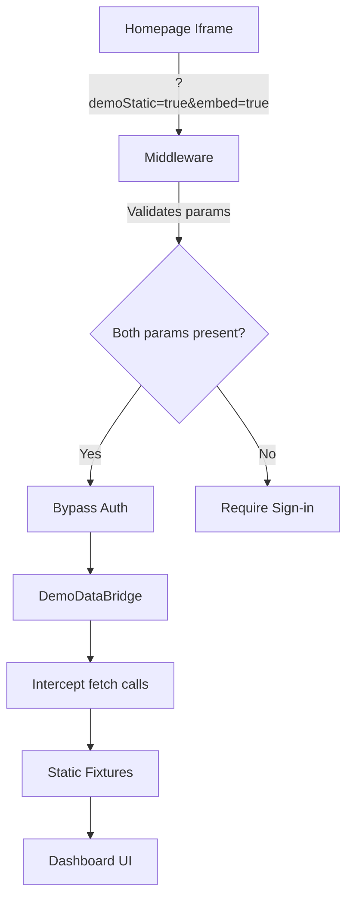

# Demo Static Mode

**Status**: ✅ Production Ready
**Version**: 1.0
**Last Updated**: 2025-11-10
**Owner**: Engineering
**Related**: [Homepage Demo Iframe](/docs/engineering/development/homepage-demo-iframe), [Security Architecture](/docs/engineering/architecture/security-architecture), DormWay LockedIn

---

## Overview

Demo Static Mode is a secure system that allows the DormWay dashboard to be embedded in an iframe on the marketing homepage without requiring user authentication. It uses local fixtures (mock data) instead of real API calls, enabling potential users to explore the platform instantly.

### Key Features

- 🔒 **Secure** - Requires both `demoStatic=true` AND `embed=true` params
- 📦 **Static Fixtures** - 4200+ lines of realistic mock data
- 🎯 **No Auth Required** - Bypasses Clerk authentication in iframe only
- 🔄 **Auto-updating** - Script to regenerate dates periodically
- 🎨 **Clean UI** - Hidden NavBar and adjusted layout for embedding

---

## Architecture

### Component Overview



### File Structure

```
services/dormway-lockedin/
├── src/
│   ├── demo-data/
│   │   ├── mode.ts                    # Demo mode detection
│   │   ├── router.ts                  # Request routing to fixtures
│   │   ├── fixtures.ts                # 4200+ lines of mock data
│   │   ├── FIXTURES_INVENTORY.md      # Fixture documentation
│   │   └── DATABASE_QUERIES.md        # Query reference
│   ├── components/
│   │   └── demo/
│   │       └── DemoDataBridge.tsx     # Fetch interception
│   └── middleware.ts                  # Auth bypass logic
└── scripts/
    └── update-demo-fixtures.js        # Date regeneration
```

---

## How It Works

### 1. Mode Detection (`mode.ts`)

Demo mode activates when **ALL** conditions are met:

1. ✅ Running inside an iframe (`window.self !== window.top`)
2. ✅ Query param `demoStatic=true` present
3. ✅ Or cookie `dw.demoStatic=1` exists

```typescript
export function isDemoStaticMode(): boolean {
  if (typeof window === 'undefined') return false;

  // MUST be in an iframe
  if (!isInIframe()) return false;

  // Check URL param or cookie
  const params = new URLSearchParams(window.location.search);
  if (params.get('demoStatic') === 'true') return true;

  const cookies = document.cookie.split(';');
  for (const cookie of cookies) {
    const [name, value] = cookie.trim().split('=');
    if (name === 'dw.demoStatic' && value === '1') return true;
  }

  return false;
}
```

**Security**: Server-side (middleware) requires BOTH `demoStatic=true` AND `embed=true` to bypass auth. This prevents abuse where someone adds `?demoStatic=true` to access protected routes.

### 2. Middleware Auth Bypass (`middleware.ts`)

```typescript
const hasDemoStaticParam = searchParams.get('demoStatic') === 'true';
const hasEmbedParam = searchParams.get('embed') === 'true';

if ((hasDemoStaticParam && hasEmbedParam) ||
    (hasDemoStaticCookie && hasEmbedParam)) {
  // Bypass authentication
  const response = NextResponse.next();
  response.headers.set("x-demo-static-mode", "true");
  return response;
}
```

**Critical**: Both params required server-side prevents unauthorized access.

### 3. Fetch Interception (`DemoDataBridge.tsx`)

Client-side component intercepts all `fetch()` calls and routes them to local fixtures:

```typescript
// Module-level reference counting for safety
let originalFetch: typeof fetch | null = null;
let refCount = 0;

export function DemoDataBridge() {
  useEffect(() => {
    if (!isDemoStaticMode()) return;

    // First mount: replace fetch
    if (refCount === 0) {
      originalFetch = window.fetch.bind(window);
      window.fetch = async (input, init) => {
        const response = await handleDemoFetch(input, init);
        return response || originalFetch!(input, init);
      };
    }
    refCount++;

    return () => {
      refCount--;
      // Last unmount: restore original
      if (refCount === 0 && originalFetch) {
        window.fetch = originalFetch;
      }
    };
  }, []);
}
```

**Reference Counting**: Prevents race conditions in React StrictMode (double mount).

### 4. Fixture Router (`router.ts`)

Routes API requests to static fixtures:

```typescript
const demoRoutes: DemoRoute[] = [
  {
    test: (url) => url.pathname === '/api/session',
    handler: () => jsonResponse(demoUserSession),
  },
  {
    test: (url) => url.pathname.startsWith('/api/proxy/dashboard/v1/composite'),
    handler: () => jsonResponse(demoDashboardComposite),
  },
  {
    test: (url) => url.pathname.startsWith('/api/proxy/canvas/assignments'),
    handler: () => jsonResponse(demoCanvasAssignments),
  },
  // ... 20+ more routes
];
```

### 5. Static Fixtures (`fixtures.ts`)

4200+ lines of realistic mock data:

- **Canvas LMS**: 21 assignments across 4 courses
- **Tasks**: 10 tasks with priorities and due dates
- **Dashboard**: Composite data with all widgets populated
- **Calendar**: Events and schedule blocks
- **Profile**: User and preferences data

---

## Usage

### Embedding the Demo

```html
<!-- Homepage iframe embed -->
<iframe
  src="https://dormway.app/dashboard/home?demoStatic=true&embed=true&desktop=true"
  width="100%"
  height="800px"
  frameborder="0"
/>
```

**Query Parameters**:
- `demoStatic=true` - Enables demo mode
- `embed=true` - Required for auth bypass
- `desktop=true` - Forces desktop layout

### Local Development

```bash
# Start dev server
npm run dev

# Access demo mode
open http://localhost:3008/dashboard/home?demoStatic=true&embed=true&desktop=true
```

### Updating Fixtures

```bash
# Regenerate dates (dry-run first)
npm run demo:update-fixtures:dry-run

# Apply changes
npm run demo:update-fixtures

# Review changes
git diff src/demo-data/fixtures.ts

# Commit if good
git add src/demo-data/fixtures.ts
git commit -m "chore: update demo fixture dates"
```

**When to Update**:
- Monthly (keep dates current)
- Before major marketing campaigns
- When adding new features to demo

---

## Security Considerations

### ✅ What's Secure

1. **Dual Parameter Requirement**: Both `demoStatic` AND `embed` required server-side
2. **Iframe-Only Activation**: Client checks `window.self !== window.top`
3. **No Real Data**: All data is static fixtures, no database access
4. **Read-Only**: Demo users cannot modify any data
5. **No Secrets**: Fixtures contain no API keys or sensitive info

### ❌ Attack Vectors Prevented

| Attack | Prevention |
|--------|-----------|
| Normal user bypasses auth with `?demoStatic=true` | ❌ Requires `embed=true` also |
| Direct access to demo endpoints | ❌ Iframe check on client |
| Modifying demo data | ❌ All writes return mock success |
| Stealing session tokens | ❌ No real auth tokens generated |
| Accessing real user data | ❌ Fetch intercepted to fixtures |

### ⚠️ Known Limitations

1. **Browser Extensions**: Extensions that modify page behavior may conflict
2. **Cross-Origin**: Iframe must be same-origin or CORS-enabled
3. **SSR Hydration**: Initial render shows loading state (expected)

---

## UI Adjustments for Embed Mode

### Hidden Elements

When `embed=true`:

```typescript
// NavBar hidden completely
if (isEmbedded) {
  return null;
}

// No top padding (NavBar space removed)
<main className={isDemoStaticMode ? '' : 'pt-24 md:pt-28'}>

// Sidebar/bottom nav still visible (demo UX)
```

### Theme Handling

```typescript
// ThemeContext returns safe defaults if provider missing
export function useTheme() {
  const context = useContext(ThemeContext);
  if (context === undefined) {
    return {
      theme: 'dark',
      resolvedTheme: 'dark',
      fontSize: 'medium',
      // ... safe defaults
    };
  }
  return context;
}
```

**Hydration**: Added `suppressHydrationWarning` to NavBar for SSR/iframe mismatch.

---

## Troubleshooting

### Demo Mode Not Activating

**Symptoms**: Redirected to sign-in, or shows empty dashboard

**Checklist**:
1. ✅ Both `demoStatic=true` AND `embed=true` in URL?
2. ✅ Actually in an iframe? (Check `window.self !== window.top`)
3. ✅ Middleware not blocking? (Check console logs)
4. ✅ DemoDataBridge mounted? (Check for `[demo-data] Static fixtures enabled`)

**Debug**:
```javascript
// In browser console
console.log('In iframe?', window.self !== window.top);
console.log('Demo mode?', isDemoStaticMode());
console.log('Has cookie?', document.cookie.includes('dw.demoStatic'));
```

### Fixtures Not Loading

**Symptoms**: API errors, empty widgets, console warnings

**Checklist**:
1. ✅ DemoDataBridge console message shown?
2. ✅ Routes defined in `router.ts` for failing endpoints?
3. ✅ Fixture data structure matches expected shape?

**Debug**:
```javascript
// Check if fetch is intercepted
const original = window.fetch.toString();
console.log('Fetch patched?', !original.includes('[native code]'));

// Test specific endpoint
fetch('/api/proxy/dashboard/v1/composite')
  .then(r => r.json())
  .then(d => console.log('Dashboard data:', d));
```

### Stale Dates

**Symptoms**: All assignments show as past due, calendar in wrong month

**Solution**:
```bash
npm run demo:update-fixtures
```

### TypeScript Errors

**Symptoms**: Build fails with fixture type errors

**Common Issues**:
- Missing properties in fixtures
- Type mismatches (use `as any` sparingly)
- Wrong import paths

**Fix**:
```typescript
// Use type assertion for dynamic properties
const syllabusData = course?.syllabus?.data as any;
if (syllabusData?.web_experience) {
  // ...
}
```

---

## Maintenance

### Monthly Tasks

- [ ] Run `npm run demo:update-fixtures` to refresh dates
- [ ] Review fixture data for outdated courses/assignments
- [ ] Check demo iframe loads on homepage
- [ ] Verify no console errors in production

### Quarterly Tasks

- [ ] Add new features to demo fixtures
- [ ] Update course names/codes to match current semester
- [ ] Review security parameters (still dual-required?)
- [ ] Performance audit (bundle size, load time)

### When Adding Features

1. **Update Fixtures**: Add mock data for new endpoints
2. **Add Route**: Register route in `router.ts`
3. **Test**: Load demo iframe and verify feature works
4. **Document**: Update `FIXTURES_INVENTORY.md`

---

## Performance

### Bundle Size Impact

- **fixtures.ts**: ~200KB (4200+ lines)
- **router.ts**: ~15KB
- **DemoDataBridge**: ~2KB
- **Total**: ~217KB added to bundle

**Optimization**: Consider code-splitting fixtures if bundle grows >500KB.

### Load Time

- **Initial Load**: ~1.5s (includes fixture parsing)
- **Subsequent Navigations**: <100ms (fixtures cached)
- **Fetch Interception Overhead**: <5ms per request

---

## Related Documentation

- [Homepage Demo Iframe](/docs/engineering/development/homepage-demo-iframe) - Marketing site integration
- Canvas LMS Integration - Real Canvas data structure
- [Dashboard Architecture](/docs/engineering/ios-dashboard-architecture) - Dashboard composite endpoint
- [Security Architecture](/docs/engineering/architecture/security-architecture) - Auth flow and middleware
- Clerk Authentication - Primary auth system

---

## Change Log

### 2025-11-10 - Initial Implementation

**Added**:
- ✅ Demo static mode with dual-parameter security
- ✅ 4200+ lines of static fixtures
- ✅ DemoDataBridge fetch interceptor with reference counting
- ✅ Fixture update script with date regeneration
- ✅ Comprehensive fixture inventory documentation

**Fixed**:
- ✅ Rules of Hooks violations in UserContext and ThemeContext
- ✅ Type mismatch in ThemeContext fallback
- ✅ Query parameter loss in middleware redirects
- ✅ Race conditions in DemoDataBridge multiple mounts
- ✅ TypeScript error in router syllabus handler

**Security**:
- ✅ Require both `demoStatic=true` AND `embed=true` for auth bypass
- ✅ Iframe-only activation on client side
- ✅ No real data or secrets exposed

---

## Tags

#demo #fixtures #security #iframe #embedding #marketing #authentication-bypass

---

## Questions?

Contact: Engineering Team
PR: https://github.com/DormWay/dormway-platform/pull/477
Related Issues: DORM-XXX
