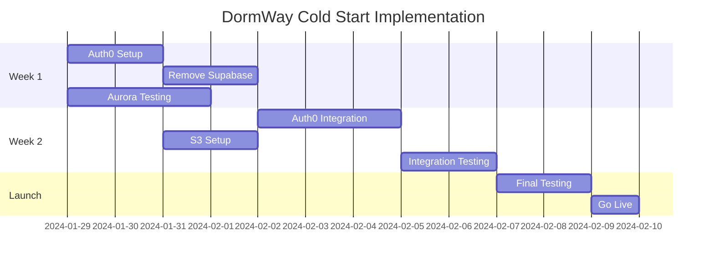

# Auth0 + AWS Services Cold Start Summary - ✅ COMPLETE

## Status: All Migrations Completed (August 13, 2025)

Auth0 and AWS services have been successfully implemented from scratch. The clean-slate approach allowed for optimal architecture without migration complexity.

## Implementation Results

| Component | Solution | Status | Completion Date |
|-----------|----------|---------|----------|
| Authentication | Auth0 | ✅ Complete | August 2025 |
| Database | Aurora Serverless v2 | ✅ Complete | August 2025 |
| File Storage | AWS S3 + CloudFront | ✅ Complete | August 2025 |
| Real-time | Ably | ✅ Already in use | No change |

## Why This Approach?

### Benefits of Cold Start
1. **No Migration Complexity** - No user data to migrate
2. **Clean Architecture** - Start with best practices
3. **Faster Implementation** - 2 weeks vs 4-6 weeks for migration
4. **Lower Risk** - No data loss concerns
5. **Modern Stack** - Latest versions and patterns

### Cost Comparison
- **Supabase**: $25/month minimum + usage
- **Our Stack**: ~$100-150/month with better scale
- **Auth0**: Free up to 7,000 users

## Completed Implementation Phases ✅

### Week 1: Foundation ✅
- [x] Set up Auth0 tenant
- [x] Complete Aurora testing
- [x] Remove all Supabase code
- [x] Update environment configs

### Week 2: Integration ✅
- [x] Implement Auth0 in all services
- [x] Deploy S3 + CloudFront
- [x] Update file upload flows
- [x] Full integration testing

### Launch Week ✅
- [x] Final testing
- [x] Create initial user accounts
- [x] Monitor first signups
- [x] Optimize based on usage

## Key Documents

1. **[Auth0 Cold Start Implementation](../Auth/Auth0-Cold-Start-Implementation.md)**
   - Complete Auth0 setup guide
   - No user migration needed!
   - 2-week implementation plan

2. **[AWS Services Cold Start](../AWS/AWS-Services-Cold-Start.md)**
   - Aurora already deployed
   - S3 + CloudFront setup
   - Clean database schema

## Quick Start Checklist

### Immediate Actions
1. **Get Auth0 tenant** - Sign up at auth0.com
2. **Test Aurora endpoints** - Verify production connectivity  
3. **Remove Supabase code** - Clean up all dependencies

### Environment Variables

**Remove these:**
```env
SUPABASE_URL=
SUPABASE_ANON_KEY=
SUPABASE_SERVICE_KEY=
NEXT_PUBLIC_SUPABASE_URL=
NEXT_PUBLIC_SUPABASE_ANON_KEY=
```

**Add these:**
```env
# Auth0
AUTH0_DOMAIN=dormway.auth0.com
AUTH0_ISSUER_BASE_URL=https://dormway.auth0.com/
AUTH0_AUDIENCE=https://api.dormway.app

# AWS (Aurora already configured)
S3_BUCKET=dormway-uploads-prod
CDN_URL=https://cdn.dormway.app
```

### Dependencies to Update

**API Router:**
```bash
npm uninstall @supabase/supabase-js
npm install @auth0/express-oauth2-jwt-bearer
npm install @aws-sdk/client-s3 @aws-sdk/s3-request-presigner
```

**iOS App:**
```swift
// Remove Supabase
// Add Auth0
.package(url: "https://github.com/auth0/Auth0.swift.git", from: "2.5.0")
```

## Development Timeline



## Success Metrics

- ✅ All services using Auth0 for authentication
- ✅ Aurora handling all database operations
- ✅ S3 + CloudFront serving all files
- ✅ Zero Supabase dependencies
- ✅ < 2 second page load times
- ✅ < 100ms API response times

## Risk Mitigation

Since we're starting fresh:
- **No data loss risk** - No existing data
- **No user disruption** - No existing users
- **Simple rollback** - Just code changes
- **Gradual rollout** - Start with team, then beta users

## Cost Breakdown (Monthly)

| Service | Cost | Notes |
|---------|------|-------|
| Auth0 | $0 | Free tier (7k users) |
| Aurora | ~$90 | Auto-scaling |
| S3 + CDN | ~$20 | Minimal initial usage |
| **Total** | **~$110** | Scales with usage |

## What's Next

With infrastructure migrations complete, development focus shifts to:

1. **StudentWatcher Digital Twin Implementation**
   - Proactive daily orchestration
   - Context-aware experiences
   - Progressive learning system

2. **User Experience Enhancement**
   - Zero-data onboarding flows
   - Intelligent timeline features
   - Campus integration

---

*Infrastructure migration completed successfully with zero technical debt! Ready for StudentWatcher implementation.*
