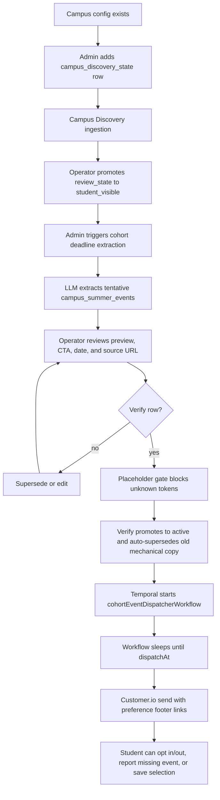

# Pre-Semester Orientation Layer

The pre-semester layer is DormWay's current incoming-freshman activation path. It lets a student sign up before the term exists in their personal schedule, then receive school-specific reminders for official deadlines such as housing, immunization, move-in, registration, and orientation.

This is a live system, not only a campaign concept. The current implementation spans public campus pages, a standalone `/pre-semester/[slug]` signup page, admin verification queues, Temporal dispatch workflows, Customer.io rendering, and preference links in every email.

<Note>
  This page is the Mintlify distillation of the internal operator runbook. The full runbook stays in Obsidian because it contains step-by-step operator guidance and incident details.
</Note>

## Current State

| Layer | Current implementation |
|-------|------------------------|
| Public entry | `/2030`, `/pre-semester/[slug]`, and campus pages can surface active Class of 2030 events. |
| Signup API | `POST /api/v2/pre-semester/signup` starts `preSemesterSignupWorkflow` and creates the enrollment. |
| Campus eligibility | A campus must have a row in `campus_discovery_state`; row existence is the allowlist. |
| Deadline extraction | Admin starts `cohortDeadlineExtractionWorkflow` for a campus and cohort year. |
| Human review | Extracted rows start as `tentative`; operators edit and verify before anything sends. |
| Dispatch | Verified rows start deterministic `cohort-event-dispatch-<eventId>` workflows. |
| Preferences | Email footers include tokenized links for tier enable/disable, event opt-out, undo, and unsubscribe-all. |
| Student feedback | Authenticated students can report missing events through the pre-semester feedback route. |
| Event selections | Students can save event-specific selections and upload screenshots through `/welcome/select/[eventId]`. |

## End-to-End Flow

## Trust Gates

The system intentionally keeps AI away from direct student delivery until a human verifies the output.

| Gate | Why it exists | Live behavior |
|------|---------------|---------------|
| Discovery allowlist | Prevents arbitrary campus extraction runs. | Extraction requires `campus_discovery_state`; the workflow checks the same eligibility. |
| Tentative status | Makes LLM output non-sending by default. | Extraction writes tentative rows; only verified active rows dispatch. |
| Placeholder validation | Stops literal `{{bad_token}}` drift from reaching students. | Verify returns `unknown_placeholders` unless all tokens are canonical. |
| Edit before verify | Lets operators repair copy without SQL. | Admin inline edit returns remaining unknown placeholders. |
| Mechanical-copy cleanup | Prevents duplicate sends after re-extraction. | Verify auto-supersedes old v1.x mechanical siblings on the same event type. |
| Deterministic workflow IDs | Makes re-verify idempotent. | Dispatcher uses `cohort-event-dispatch-<eventId>`. |
| Live dispatch status | Confirms active rows have corresponding Temporal dispatchers. | Admin shows scheduled/fired/missing chips for active rows. |

## Public Student Surface

The student-facing promise is intentionally narrow:

- See the official deadlines DormWay knows for the student's school.
- Sign up with email before the student has a full DormWay account.
- Receive dated reminders with enough context and a direct action URL.
- Control optional tiers and event categories from email footer links.
- Report a missing event when the school's published timeline has something DormWay missed.
- Save event-specific selections after signing in, including screenshot uploads for confirmation-heavy workflows.

This keeps the pre-semester layer useful even when the student's fall schedule, Canvas account, or syllabus data does not exist yet.

## Operator Contract

Operators work entirely through `dormway-admin`:

1. Add the campus to Campus Discovery State.
2. Run ingestion and promote the campus to `student_visible` only after source data looks credible.
3. Trigger cohort deadline extraction for a graduation cohort such as Class of 2030.
4. Review every tentative event row, including subject, body, CTA label, action URL, and event date.
5. Fix placeholders or stale copy in admin.
6. Verify trusted rows.
7. Confirm every active row has a green dispatch status.
8. Send at least one test email through the real render path before treating the campus as live.

## Implementation Map

| Concern | Primary paths |
|---------|---------------|
| Admin campus discovery | `services/dormway-admin/src/pages/campus-discovery-state/index.tsx`, `services/api-router/src/routes/admin/campus-discovery-state-routes.ts` |
| Admin cohort deadline queue | `services/dormway-admin/src/pages/cohort-deadlines/`, `services/api-router/src/routes/admin/cohort-deadline-extraction-routes.ts` |
| Extraction workflow | `services/engine/src/workflows/cohortDeadlineExtraction.workflow.ts`, `services/engine/src/activities/cohortDeadlineExtraction.activities.ts` |
| Scheduled dispatcher | `services/engine/src/workflows/cohortEventDispatcher.workflow.ts`, `services/engine/src/activities/cohortEventDispatch.activities.ts` |
| Signup workflow | `services/api-router/src/routes/v2/pre-semester.routes.ts`, `services/engine/src/workflows/preSemesterSignup.workflow.ts` |
| Preferences | `services/api-router/src/routes/v2/pre-semester-preferences.routes.ts`, `services/dormway-lockedin/src/app/preferences/` |
| Event selections | `services/api-router/src/routes/v2/pre-semester-selections.routes.ts`, `services/dormway-lockedin/src/app/welcome/select/[eventId]/` |
| Public pages | `services/dormway-lockedin/src/app/2030/page.tsx`, `services/dormway-lockedin/src/app/pre-semester/[slug]/page.tsx`, `services/dormway-lockedin/src/app/colleges/[slug]/page.tsx` |

## Operational Notes

- Cohort year means graduation year. Class of 2030 corresponds to Fall 2026 freshmen.
- Active rows are not enough; the dispatcher workflow must also exist.
- Rich-copy duplicates are not automatically removed because some campuses legitimately have multiple deadlines of the same type.
- The command-line simulator exists for engineering inspection, but the admin "Send test to me" path is the standard validation path.
- The pre-semester layer should not overclaim full DormWay setup. It is a bridge into the product, not a substitute for schedule, Canvas, or syllabus activation.
