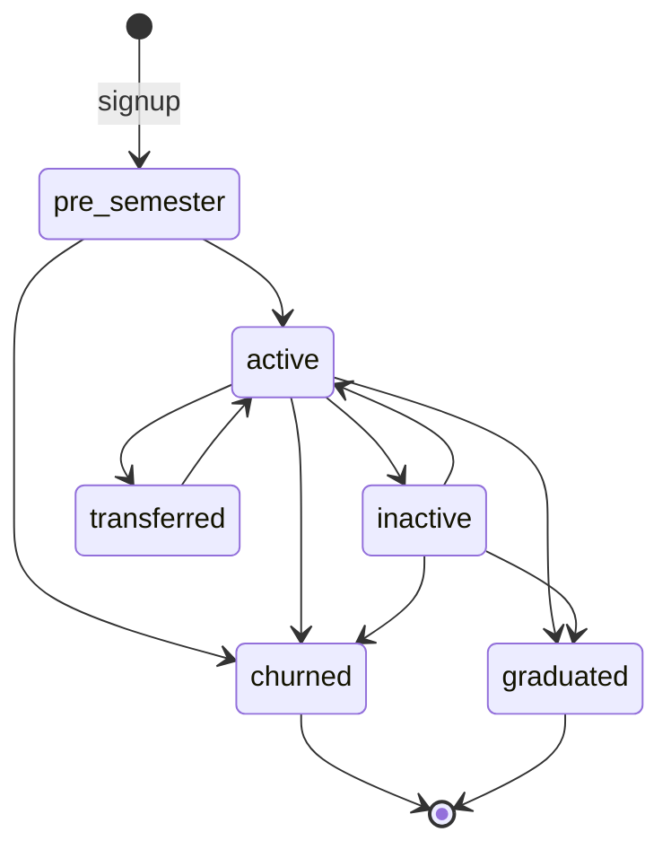
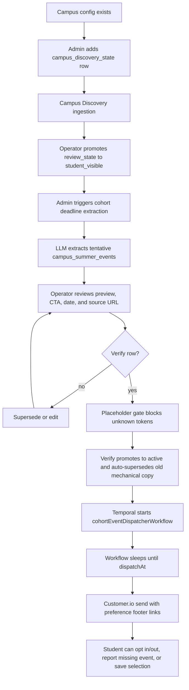

# Pre-Semester Orientation Layer

The pre-semester layer is DormWay's current incoming-freshman activation path. It lets a student sign up before the term exists in their personal schedule, then receive school-specific reminders for official deadlines such as housing, immunization, move-in, registration, and orientation.

This is a live system, not only a campaign concept. The current implementation spans public campus pages, a standalone `/pre-semester/[slug]` signup page, admin verification queues, Temporal dispatch workflows, Customer.io rendering, and preference links in every email.

<Note>
  This page is the Mintlify distillation of the internal operator runbook. The full runbook stays in Obsidian because it contains step-by-step operator guidance and incident details.
</Note>

<Note>
  **Maturity: built but nascent.** The lifecycle and dispatch machinery shipped ~2026-05-19 and is on-thesis for the Class of 2030 wedge, but adoption is early — the `enrollments` table is near-empty in dev (only cohort `2030` / `pre_semester` rows). The honest framing is "DormWay begins in high school to get students set up before day one," **not** "thousands of high schoolers use us."
</Note>

## Current State

| Layer | Current implementation |
|-------|------------------------|
| Public entry | `/2030`, `/pre-semester/[slug]`, and campus pages can surface active Class of 2030 events. |
| Signup API | `POST /api/v2/pre-semester/signup` starts `preSemesterSignupWorkflow` and creates the enrollment. |
| Campus eligibility | A campus must have a row in `campus_discovery_state`; row existence is the allowlist. |
| Deadline extraction | Admin starts `cohortDeadlineExtractionWorkflow` for a campus and cohort year. |
| Human review | Extracted rows start as `tentative`; operators edit and verify before anything sends. |
| Dispatch | Verified rows start deterministic `cohort-event-dispatch-<eventId>` workflows. |
| Preferences | Email footers include tokenized links for tier enable/disable, event opt-out, undo, and unsubscribe-all. |
| Student feedback | Authenticated students can report missing events through the pre-semester feedback route. |
| Event selections | Students can save event-specific selections and upload screenshots through `/welcome/select/[eventId]`. |

## Enrollments Lifecycle

The `enrollments` table is the engine of the "begins in high school / before college" wedge. A signup creates one enrollment row that carries a student from incoming-freshman interest through activation — independent of whether the student yet has a full DormWay account, schedule, Canvas connection, or syllabus data.

| Column | Role |
|--------|------|
| `id` | Enrollment primary key (referenced by selections, dispatch outcomes, and event feedback). |
| `account_id` | The owning account (FK to `accounts`). |
| `campus_id` | The campus the student enrolled against — the "pick your school" choice. |
| `cohort_year` | **Graduation year.** Class of 2030 (cohort `2030`) corresponds to Fall 2026 freshmen. |
| `state` | Lifecycle state — see below. Defaults to `pre_semester`. |
| `email`, `given_name` | Captured at signup, used for email-first reminders before account setup. |
| `notification_preferences` | JSONB tier toggles; defaults `{ tier_1: true, tier_2: false, tier_3: false }`. |
| `unsubscribed_event_types` | Per-category opt-outs driven by email footer links. |
| `ios_app_installed_at` | Set when the student installs the iOS app. |
| `enrolled_at`, `activated_at`, `churned_at`, `graduated_at` | Lifecycle timestamps. |

### State machine

The signup default is `pre_semester`. The legal transition graph is enforced in code by `ENROLLMENT_STATE_TRANSITIONS` in `dormway-core` (`services/shared/dormway-core/src/entities/enrollment/enrollment.types.ts`); the enrollment factory rejects any transition not in this map. Bypassing it is a bug.

| State | Meaning (per code comments) |
|-------|------------------------------|
| `pre_semester` | Signed up before classes; receives Tier-1+ event notifications. |
| `active` | Uploaded a syllabus or connected Canvas; on the canonical product surface. |
| `inactive` | Completed a term without activation; cold but not churned. |
| `transferred` | Switched campuses (a new `active` row likely exists at the new `campus_id`). |
| `churned` | Unsubscribed or hard-deleted account; terminal. |
| `graduated` | Completed degree; terminal (alumni). |

<Note>
  Verified against `ENROLLMENT_STATE_TRANSITIONS` and the DB `enrollments_state_valid` CHECK constraint (2026-05-30). The map is the source of truth for *which* transitions are legal; the CHECK constraint only enforces the *set* of allowed state values. Note that `transferred` re-enters at a new campus via a new row, and that `pre_semester` can only go to `active` or `churned` (not directly to `inactive`/`transferred`).
</Note>

A partial unique index (`enrollments_account_campus_cohort_live_uniq`) keeps at most one live enrollment per `(account_id, campus_id, cohort_year)` while `state` is `pre_semester` or `active`. A second partial index (`enrollments_dispatch_eligibility_idx`) backs dispatcher eligibility lookups on the same predicate.

### Companion tables

| Table | Role |
|-------|------|
| `pre_semester_selections` | Event-specific selections a student saves (e.g. via `/welcome/select/[eventId]`), including screenshot uploads. FK to `enrollments`. |
| `pre_semester_deadline_dispatch_outcomes` | Per-enrollment, per-event record of what was dispatched. FK to `enrollments`. |
| `campus_event_feedback` | Student "missing event" reports tied to an enrollment. FK to `enrollments`. |

## Funnel Measurement

Per the GTM Playbook (§7), the pre-semester funnel is **measured separately and does NOT roll up into WFAU**. It is the top-of-funnel for the incoming-freshman wedge, not an in-semester engagement metric.

| Step | Definition |
|------|------------|
| `pre_semester_signup` | An `enrollments` row created via `POST /api/v2/pre-semester/signup` (state = `pre_semester`). Tracked as its own funnel stage. |
| August activation | Per the funnel definition (GTM §7), the enrollment transitions `pre_semester → active` when the `syllabi_available` event fires. The `pre_semester → active` edge is a legal transition in the code state machine; the specific `syllabi_available`-driven trigger is documented as the funnel definition and was not independently confirmed in a code path during this distillation (see unverified). |

<Note>
  Do not conflate the pre-semester funnel with WFAU. WFAU (Weekly First-Action Users) counts in-semester users who complete a first action — syllabus upload, schedule import, or Canvas connect — within 7 days. `pre_semester_signup → August activation` is a distinct funnel with its own denominator.
</Note>

## End-to-End Flow

## Trust Gates

The system intentionally keeps AI away from direct student delivery until a human verifies the output.

| Gate | Why it exists | Live behavior |
|------|---------------|---------------|
| Discovery allowlist | Prevents arbitrary campus extraction runs. | Extraction requires `campus_discovery_state`; the workflow checks the same eligibility. |
| Tentative status | Makes LLM output non-sending by default. | Extraction writes tentative rows; only verified active rows dispatch. |
| Placeholder validation | Stops literal `{{bad_token}}` drift from reaching students. | Verify returns `unknown_placeholders` unless all tokens are canonical. |
| Edit before verify | Lets operators repair copy without SQL. | Admin inline edit returns remaining unknown placeholders. |
| Mechanical-copy cleanup | Prevents duplicate sends after re-extraction. | Verify auto-supersedes old v1.x mechanical siblings on the same event type. |
| Deterministic workflow IDs | Makes re-verify idempotent. | Dispatcher uses `cohort-event-dispatch-<eventId>`. |
| Live dispatch status | Confirms active rows have corresponding Temporal dispatchers. | Admin shows scheduled/fired/missing chips for active rows. |

## Public Student Surface

The student-facing promise is intentionally narrow:

- See the official deadlines DormWay knows for the student's school.
- Sign up with email before the student has a full DormWay account.
- Receive dated reminders with enough context and a direct action URL.
- Control optional tiers and event categories from email footer links.
- Report a missing event when the school's published timeline has something DormWay missed.
- Save event-specific selections after signing in, including screenshot uploads for confirmation-heavy workflows.

This keeps the pre-semester layer useful even when the student's fall schedule, Canvas account, or syllabus data does not exist yet.

## Planned: Season-Aware Homepage (Pre-Semester Mode)

<Note>
  **Not yet shipped.** The following is a decision made 2026-05-30 (Linear **DORM-1518**), pending build and Riley sign-off. Current production posture: the marketing homepage tells one story to everyone and surfaces no pre-semester-specific mode.
</Note>

**Current production posture:** the homepage is already technically dynamic (Hypertune-ordered sections) but serves a single narrative regardless of visitor.

**Planned (decided 2026-05-30, DORM-1518):** one homepage with two **modes** — pre-semester (Class of 2030 primary) and in-semester (current students) — sharing a common product-proof and trust tail. Mode is computed per campus from that campus's **actual term boundaries** (falling back to a calendar window, ~mid-May → late-Aug = pre-semester, only when a campus's terms are unknown), with an always-visible hero toggle ("Incoming freshman / Current student") and override precedence: explicit toggle → `?campus_*` params / detected school → date default. It reuses the existing Hypertune section registry; no new rendering framework.

The pre-semester mode is the top of the separate pre-semester funnel: its hero ("Walk into day one already set up") and a roommate/dorm email quick-start feed `pre_semester_signup → August activation`, not WFAU.

## Operator Contract

Operators work entirely through `dormway-admin`:

1. Add the campus to Campus Discovery State.
2. Run ingestion and promote the campus to `student_visible` only after source data looks credible.
3. Trigger cohort deadline extraction for a graduation cohort such as Class of 2030.
4. Review every tentative event row, including subject, body, CTA label, action URL, and event date.
5. Fix placeholders or stale copy in admin.
6. Verify trusted rows.
7. Confirm every active row has a green dispatch status.
8. Send at least one test email through the real render path before treating the campus as live.

## Implementation Map

| Concern | Primary paths |
|---------|---------------|
| Admin campus discovery | `services/dormway-admin/src/pages/campus-discovery-state/index.tsx`, `services/api-router/src/routes/admin/campus-discovery-state-routes.ts` |
| Admin cohort deadline queue | `services/dormway-admin/src/pages/cohort-deadlines/`, `services/api-router/src/routes/admin/cohort-deadline-extraction-routes.ts` |
| Extraction workflow | `services/engine/src/workflows/cohortDeadlineExtraction.workflow.ts`, `services/engine/src/activities/cohortDeadlineExtraction.activities.ts` |
| Scheduled dispatcher | `services/engine/src/workflows/cohortEventDispatcher.workflow.ts`, `services/engine/src/activities/cohortEventDispatch.activities.ts` |
| Signup workflow | `services/api-router/src/routes/v2/pre-semester.routes.ts`, `services/engine/src/workflows/preSemesterSignup.workflow.ts` |
| Preferences | `services/api-router/src/routes/v2/pre-semester-preferences.routes.ts`, `services/dormway-lockedin/src/app/preferences/` |
| Event selections | `services/api-router/src/routes/v2/pre-semester-selections.routes.ts`, `services/dormway-lockedin/src/app/welcome/select/[eventId]/` |
| Public pages | `services/dormway-lockedin/src/app/2030/page.tsx`, `services/dormway-lockedin/src/app/pre-semester/[slug]/page.tsx`, `services/dormway-lockedin/src/app/colleges/[slug]/page.tsx` |

## Operational Notes

- Cohort year means graduation year. Class of 2030 corresponds to Fall 2026 freshmen.
- Active rows are not enough; the dispatcher workflow must also exist.
- Rich-copy duplicates are not automatically removed because some campuses legitimately have multiple deadlines of the same type.
- The command-line simulator exists for engineering inspection, but the admin "Send test to me" path is the standard validation path.
- The pre-semester layer should not overclaim full DormWay setup. It is a bridge into the product, not a substitute for schedule, Canvas, or syllabus activation.
