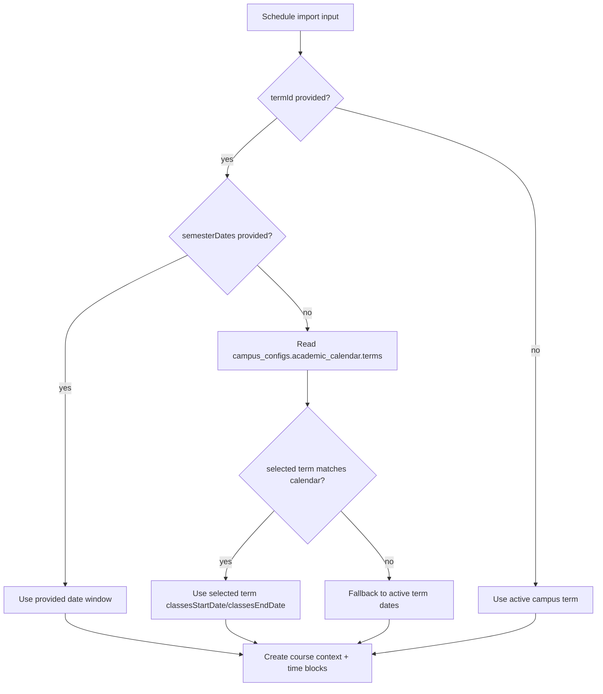
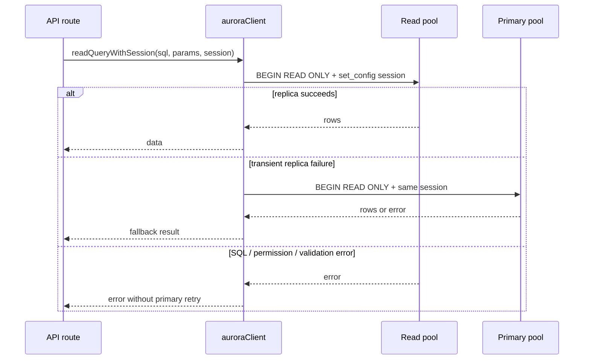
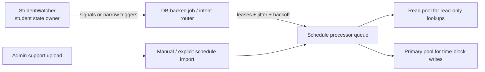

# Schedule Runtime Reliability

DormWay's schedule layer has to do two different jobs at once:

- import explicit student schedules from PDFs, screenshots, ICS, manual input, or admin support uploads
- keep schedule-derived state fresh without letting background reconciliation starve onboarding or student-facing reads

The current implementation is moving toward explicit runtime boundaries: schedule import remains a durable Temporal workflow, read-heavy API paths route through read helpers, and recurring maintenance fanout is being separated from the per-student watcher loop.

## Current Reliability Model

| Area | Current contract |
|------|------------------|
| Schedule import | `scheduleImportWorkflow` normalizes imported courses into course contexts and time blocks. |
| Explicit term setup | If a student selects a future term, the workflow resolves that term from `campus_configs.academic_calendar.terms` before falling back to active-term dates. |
| Admin support upload | Admin file imports map directly into schedule-import inputs instead of going through generic file reclassification. |
| Generic upload classifier | Syllabi with grading, policy, instructor, or course-description evidence override weak schedule guesses. |
| Read-heavy API paths | `readQuery`, `readQueryWithSession`, and `readQuerySingleWithSession` route eligible reads through the read pool with primary fallback. |
| Background schedule processing | The long-term direction is dedicated schedule queues and bounded job/router patterns, not unlimited StudentWatcher fanout. |

## Import Date Selection

The important recent fix is explicit-term date resolution. Before the fix, a user could select a future term such as `fall_2026`, but if the client omitted `semesterDates`, the workflow could still use the currently active term's dates for class blocks.

Now the workflow resolves the selected term in this order:

This matters for pre-arrival and fall-setup flows: future-term users should not get summer class blocks simply because summer is the currently active campus term.

## Read Replica Routing

The api-router now has session-aware read helpers for RLS-safe reads:

- `auroraClient.readQueryWithSession(text, params, session)`
- `auroraClient.readQuerySingleWithSession(text, params, session)`
- non-session `readQuery` for public and unauthenticated listing/detail reads

The helper behavior is intentionally conservative:

1. Use the read pool when `DATABASE_READ_REPLICA_ENABLED` and readonly URLs are configured.
2. Open a `BEGIN READ ONLY` transaction and set the same RLS session variables as primary-pool session queries.
3. Retry once on the primary only for transient replica availability failures.
4. Return non-availability errors without hiding them as primary fallback.

## Where Read Helpers Are Used

Recent live-code migrations moved large read surfaces to read helpers:

| Surface | Current read-helper usage |
|---------|---------------------------|
| Public colleges | `colleges-routes.ts` uses `readQuery` for public campus lookup, page queries, and counts. |
| Mobile campus discovery | `mobile-campus-routes.ts` uses `readQuery` for spotlight, roll-call, nearby, domain, config, registry fallback, and canvas info reads. |
| Mobile authenticated reads | `mobile-routes.ts` uses `readQueryWithSession` / `readQuerySingleWithSession` across campus, events, preferences, imported calendars, tasks, day plan, and capture reads. |
| Student v2 reads | `v2/students.routes.ts` uses session-aware read helpers for multiple student-facing GET paths. |
| Dashboard Aurora | `dashboard-aurora-service.ts` uses session-aware read helpers for composite dashboard reads. |

Writes, locks, claims, imports, workflow state, dedupe rows, service-data inserts, and read-after-write checks remain primary-pool concerns.

## Queue and Fanout Boundary

The May 2026 schedule incident clarified a durable rule:

> StudentWatcher should not be the unbounded scheduler for high-cardinality recurring maintenance fanout.

Background schedule reconciliation can be useful, but it must not compete with onboarding, import completion, or student-facing setup on the same activity capacity. The target architecture is:

Containment fixes can reduce burst size, but the long-term end state is bounded processors with explicit concurrency budgets.

## Implementation Map

| Concern | Primary paths |
|---------|---------------|
| Schedule import workflow | `services/engine/src/workflows/scheduleImport.workflow.ts` |
| Schedule upload API | `services/api-router/src/routes/mobile-routes.ts` |
| Admin schedule upload | `services/dormway-admin/src/pages/schedule-debug/`, `services/api-router/src/routes/admin/` |
| RLS read helpers | `services/api-router/src/services/aurora-client.ts` |
| Non-session read helper | `services/api-router/src/services/auroraDb.ts` |
| Term resolver / calendar terms | `services/shared/dormway-core/src/entities/term/`, `services/engine/src/activities/termManagement.activities.ts` |
| Runtime architecture plan | `obsidian-vault/DormWay/Plans/Engineering/Realtime-Runtime-Without-StudentWatcher-Implementation-Runbook.md` |

## Engineering Rules

- Use explicit read helpers for read-only route migrations; do not infer read-only intent by parsing SQL.
- Keep `BEGIN READ ONLY` in session read helpers even on primary fallback.
- Never put schedule writes, locks, or claims on the read pool.
- For future-term imports, prefer selected calendar-term dates over active-term fallback.
- Treat generic-file classifier changes as trust-sensitive: weak schedule hints should not reroute a syllabus into schedule parsing.
- Queue isolation is a capacity boundary, not just a code organization preference.
