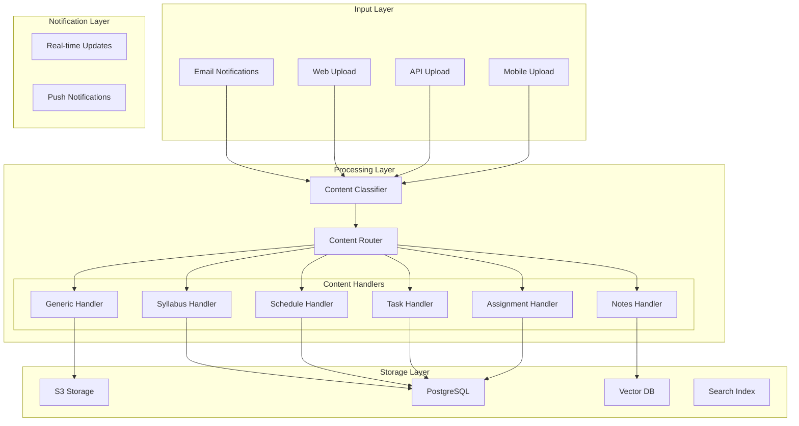

id: DORM-569
title: DORM-569: Generic Upload/Email Ingestion with Auto-Routing - Detailed Technical Specification
status: In Progress
owner: Ethan Kaplan
last_updated: 2025-11-29
aliases:
  - DORM-569-detailed-spec
  - DropBox for Students
links:
  linear: https://linear.app/dormwayllc/issue/DORM-569/generic-uploademail-ingestion-with-auto-routing
  dependency:
    - DORM-469


# DORM-569: Generic Upload/Email Ingestion with Auto-Routing - Detailed Technical Specification

## 1. Executive Summary

Transform DormWay's existing syllabus-specific email ingestion system (`syllabus@dormway.app`) into a generic, intelligent content router that can accept, classify, and process ANY type of academic content. This system will automatically determine content type and route to appropriate handlers, maintaining the existing 99% accuracy for syllabus processing while expanding to support schedules, notes, tasks, assignments, and more.

### 1.1 Latest progress (2025-11-28)
- Classification prompt registered (`content-classification`) and flows use Portkey/local fallback
- content_type_configs seeded (syllabus, schedule, notes, task, assignment) to drive routing
- Generic upload workflow wired end-to-end: syllabus (presigned URL + email fallback), schedule (OCR → confirmation), notes (Ragie indexing with flattened metadata), tasks (manual source), assignments
- Ingress: `/upload/content` route + local tester script; workflow IDs persisted back to content_ingestions
- Schedule email/app parity: emailed schedules land in the same ready-to-parse schedule pipeline as app uploads; confirmation/preview still required; generic ingest replaces legacy syllabus-only/braingains entry points
- Email/webhook normalization: Postmark webhooks now push attachments/text into the same generic ingestion (`processGenericContent`), replacing the legacy syllabus/braingains direct workflows
- OCR: tesseract.js integrated for PNG/JPEG image text extraction (handles Temporal buffer serialization)
- Ragie fixes: metadata flattening for nested objects, improved error messages, proper user resolution fallback
- Buffer handling: Fixed Temporal serialization issue (`\{ type: "Buffer", data: [...] \}` → proper Buffer)
- MIME detection: Fallback from `application/octet-stream` to actual type based on file extension
- 2025-11-29 updates:
  - Locker parity: notes handler now indexes in Ragie via @dormway/core and forwards to `processDocument`; `predefinedDocumentId` plumbed so Ragie `external_id` aligns with DB id
  - Source binary endpoint accepts both UUID and `doc_*` identifiers
  - DB migration widens `valid_document_type` constraint to classifier types (syllabus, schedule, notes, task, assignment, generic)
  - Build/bundle refreshed; Ably progress + handler emits live on `content-processor`
  - Admin harness: dormway-admin `/content/ingestion` page can upload text/files into DORM-569, list all ingestions (admin-only endpoint), sort/paginate, and inspect classification/preview details; “Show All” default, confirm/dismiss wired

**Key Innovation**: Leverages the successful prompt consolidation work from DORM-469, implementing single-pass AI processing that reduces token usage by 75-92% and processing time by 75%, while maintaining accuracy through structured output and deferred validation patterns.

**Dependency**: Single-pass prompt loading and handler routing rely on DORM-469 (Portkey sync + registry) reaching production-ready status; until then, fall back to the multi-step pipeline defined in the prompt registry.

## 2. System Architecture

### 2.1 High-Level Architecture



### 2.2 Content Classification Engine

```typescript
interface ContentClassification {
  id: string;
  confidence: number; // 0.0 to 1.0
  contentType: ContentType;
  subType?: string; // e.g., "math_notes", "work_schedule"
  extractedMetadata: {
    title?: string;
    author?: string;
    date?: Date;
    course?: string;
    tags?: string[];
  };
  suggestedHandlers: HandlerType[];
  alternativeTypes?: Array<{
    type: ContentType;
    confidence: number;
  }>;
}

enum ContentType {
  SYLLABUS = "syllabus",
  SCHEDULE = "schedule",
  NOTES = "notes",
  TASK = "task",
  ASSIGNMENT = "assignment",
  EXAM = "exam",
  LECTURE_SLIDES = "lecture_slides",
  READING_MATERIAL = "reading_material",
  CALENDAR_EVENT = "calendar_event",
  GRADE_REPORT = "grade_report",
  UNKNOWN = "unknown"
}

enum HandlerType {
  SYLLABUS_PROCESSOR = "syllabus_processor",
  SCHEDULE_PARSER = "schedule_parser",
  NOTES_INDEXER = "notes_indexer",
  TASK_EXTRACTOR = "task_extractor",
  ASSIGNMENT_TRACKER = "assignment_tracker",
  EXAM_SCHEDULER = "exam_scheduler",
  SLIDE_PROCESSOR = "slide_processor",
  READING_TRACKER = "reading_tracker",
  CALENDAR_INTEGRATOR = "calendar_integrator",
  GRADE_ANALYZER = "grade_analyzer",
  GENERIC_STORAGE = "generic_storage"
}
```

## 3. Data Models

### 3.1 Content Ingestion Record

```sql
CREATE TABLE content_ingestions (
    id UUID PRIMARY KEY DEFAULT uuid_generate_v4(),

    -- Ingestion metadata
    ingestion_source VARCHAR(50) NOT NULL, -- 'email', 'web_upload', 'api', 'mobile'
    ingestion_method VARCHAR(50) NOT NULL, -- 'webhook', 'direct_upload', 'api_call'
    ingestion_timestamp TIMESTAMPTZ DEFAULT NOW(),

    -- User identification
    user_id UUID REFERENCES accounts(id),
    email_address VARCHAR(255),
    ip_address INET,
    user_agent TEXT,

    -- Content metadata
    original_filename VARCHAR(500),
    content_type VARCHAR(100), -- MIME type
    file_size_bytes BIGINT,
    file_hash VARCHAR(64), -- SHA-256

    -- Classification results
    classification JSONB, -- Full classification object
    primary_content_type VARCHAR(50),
    confidence_score DECIMAL(3,2),

    -- Processing status
    status VARCHAR(50) DEFAULT 'pending', -- 'pending', 'processing', 'completed', 'failed', 'manual_review'
    processing_started_at TIMESTAMPTZ,
    processing_completed_at TIMESTAMPTZ,
    processing_duration_ms INTEGER,

    -- Storage locations
    s3_bucket VARCHAR(100),
    s3_key VARCHAR(500),

    -- Processing results
    handlers_executed JSONB, -- Array of handler results
    extracted_data JSONB, -- Combined extracted data from all handlers

    -- Error tracking
    error_message TEXT,
    error_details JSONB,
    retry_count INTEGER DEFAULT 0,

    -- Temporal workflow tracking
    workflow_id VARCHAR(255),
    workflow_run_id VARCHAR(255),

    created_at TIMESTAMPTZ DEFAULT NOW(),
    updated_at TIMESTAMPTZ DEFAULT NOW(),

    CONSTRAINT valid_confidence CHECK (confidence_score >= 0 AND confidence_score <= 1)
);

CREATE INDEX idx_content_ingestions_user_id ON content_ingestions(user_id);
CREATE INDEX idx_content_ingestions_status ON content_ingestions(status);
CREATE INDEX idx_content_ingestions_primary_type ON content_ingestions(primary_content_type);
CREATE INDEX idx_content_ingestions_created_at ON content_ingestions(created_at DESC);
CREATE INDEX idx_content_ingestions_workflow_id ON content_ingestions(workflow_id);
```

### 3.2 Content Type Configuration

```sql
CREATE TABLE content_type_configs (
    id UUID PRIMARY KEY DEFAULT uuid_generate_v4(),

    content_type VARCHAR(50) UNIQUE NOT NULL,
    display_name VARCHAR(100) NOT NULL,
    description TEXT,

    -- Handler configuration
    primary_handler VARCHAR(100) NOT NULL,
    fallback_handlers JSONB, -- Array of fallback handler names

    -- Processing configuration
    requires_ocr BOOLEAN DEFAULT FALSE,
    requires_ai_analysis BOOLEAN DEFAULT TRUE,
    max_file_size_mb INTEGER DEFAULT 50,
    supported_mime_types JSONB, -- Array of supported MIME types

    -- Classification prompts
    classification_prompt TEXT,
    extraction_prompt TEXT,

    -- Feature flags
    is_enabled BOOLEAN DEFAULT TRUE,
    is_beta BOOLEAN DEFAULT FALSE,

    -- Analytics
    total_processed INTEGER DEFAULT 0,
    successful_count INTEGER DEFAULT 0,
    failed_count INTEGER DEFAULT 0,
    average_confidence DECIMAL(3,2),
    average_processing_time_ms INTEGER,

    created_at TIMESTAMPTZ DEFAULT NOW(),
    updated_at TIMESTAMPTZ DEFAULT NOW()
);

-- Pre-populate with content types
INSERT INTO content_type_configs (content_type, display_name, primary_handler) VALUES
('syllabus', 'Course Syllabus', 'syllabus_processor'),
('schedule', 'Class Schedule', 'schedule_parser'),
('notes', 'Study Notes', 'notes_indexer'),
('task', 'Task/Reminder', 'task_extractor'),
('assignment', 'Assignment Details', 'assignment_tracker'),
('exam', 'Exam Information', 'exam_scheduler'),
('lecture_slides', 'Lecture Slides', 'slide_processor'),
('reading_material', 'Reading Material', 'reading_tracker'),
('calendar_event', 'Calendar Event', 'calendar_integrator'),
('grade_report', 'Grade Report', 'grade_analyzer');
```

### 3.3 Handler Execution Log

```sql
CREATE TABLE handler_execution_logs (
    id UUID PRIMARY KEY DEFAULT uuid_generate_v4(),

    ingestion_id UUID REFERENCES content_ingestions(id),
    handler_name VARCHAR(100) NOT NULL,
    handler_version VARCHAR(20),

    -- Execution details
    started_at TIMESTAMPTZ DEFAULT NOW(),
    completed_at TIMESTAMPTZ,
    duration_ms INTEGER,
    status VARCHAR(50), -- 'success', 'failure', 'skipped', 'timeout'

    -- Input/Output
    input_data JSONB,
    output_data JSONB,
    extracted_fields JSONB,

    -- Error tracking
    error_message TEXT,
    error_stack TEXT,

    -- Metrics
    tokens_used INTEGER,
    api_calls_made INTEGER,

    created_at TIMESTAMPTZ DEFAULT NOW()
);

CREATE INDEX idx_handler_logs_ingestion ON handler_execution_logs(ingestion_id);
CREATE INDEX idx_handler_logs_status ON handler_execution_logs(status);
```

## 4. Prompt Consolidation Architecture

**Preflight**: Run `npm run prompts:validate` to ensure the registry and prompt files are consistent, and confirm the unified classifier/extractor prompts are registered with correct variables before rollout.

### 4.1 Centralized Prompt Registry

Following the successful prompt consolidation work from DORM-469, all content classification prompts will be managed through the Git-based registry system.

```yaml
# prompts/registry.json additions
{
  "content-classification": {
    "id": "content-classification",
    "name": "Generic Content Classification",
    "version": "1.0.0",
    "provider": "openai",
    "model": "gpt-3.5-turbo", # Fast model for initial classification
    "portkeyId": "content-class-v1",
    "usedIn": ["generic-content-processor"],
    "variables": {
      "filename": { "type": "string", "required": true },
      "mimeType": { "type": "string", "required": true },
      "textContent": { "type": "string", "required": true, "maxLength": 2000 }
    }
  },
  "content-extraction": {
    "id": "content-extraction",
    "name": "Single-Pass Content Extraction",
    "version": "1.0.0",
    "provider": "google",
    "model": "gemini-2.0-flash-lite", # Fastest model for extraction
    "portkeyId": "content-extract-v1",
    "usedIn": ["content-handlers"],
    "variables": {
      "contentType": { "type": "string", "required": true },
      "fullText": { "type": "string", "required": true }
    }
  }
}
```

### 4.2 Single-Pass Processing Strategy

Based on syllabus processor optimization (75-92% token reduction), implement single-pass classification and extraction:

```typescript
// Consolidated single-pass processor
interface SinglePassProcessor {
  // One LLM call for classification AND extraction
  async processContent(input: ContentInput): Promise<ProcessedContent> {
    const prompt = await promptLoader.load('content-unified-processor', {
      filename: input.filename,
      mimeType: input.mimeType,
      text: input.text,
      extractAll: true // Flag to extract all data in single pass
    });

    const response = await llm.complete({
      model: 'gemini-2.0-flash-lite', // Fastest tier
      prompt,
      responseFormat: 'json',
      temperature: 0.3,
      maxTokens: 2000
    });

    return JSON.parse(response);
  }
}
```

> **Default path**: the unified processor above is the canonical execution route for all uploads. It performs classification + extraction in a single LLM call, hands raw output back immediately, and relies on the deferred validator plus handler-specific safeguards to guardrail quality. This preserves the latency/token savings proven in DORM-469 and keeps the Temporal workflow simple (one activity per ingestion).

### 4.3 Model Selection Optimization

Following proven patterns from syllabus processing:

```typescript
const modelStrategy = {
  // Initial classification (speed critical)
  classification: 'gpt-3.5-turbo',

  // Parallel extraction tasks (cost optimized)
  extraction: 'gemini-2.0-flash-lite',

  // Final formatting (reliability critical)
  structuring: 'gpt-4o-mini',

  // Fallback for complex content
  fallback: 'gpt-4o'
};

// Adaptive model selection based on confidence
function selectModel(task: string, confidence: number): string {
  if (confidence < 0.6) return modelStrategy.fallback;
  if (task === 'classification') return modelStrategy.classification;
  if (task === 'extraction') return modelStrategy.extraction;
  return modelStrategy.structuring;
}
```

> **Fallback strategy**: the multi-step model plan (classification → extraction → structuring) remains in the prompt registry so low-confidence items, validator failures, or manual re-runs can fan out to the slower-but-safer pipeline. The workflow records which path was taken per ingestion so we can compare outcomes and dynamically reroute future low-signal uploads without changing client behavior.

### 4.4 Deferred Validation Pattern

Separate processing from validation for 20-30% speed improvement:

```typescript
class ContentProcessor {
  async process(input: ContentInput): Promise<ProcessResult> {
    // Step 1: Execute classification/extraction WITHOUT validation
    const rawOutput = await this.executeWithoutValidation(input);

    // Step 2: Return immediately with raw output
    const result = {
      success: true,
      raw: rawOutput,
      validated: false
    };

    // Step 3: Async validation (non-blocking)
    this.validateAsync(rawOutput).then(validated => {
      // Update database with validated data
      this.updateWithValidation(input.id, validated);
    }).catch(error => {
      // Log validation errors but don't fail the request
      logger.warn('Validation failed, using raw output', error);
    });

    return result;
  }

  private async validateAsync(data: any): Promise<ValidatedContent> {
    // Pydantic-style validation after processing
    return ContentSchema.parse(data);
  }
}
```

### 4.5 Structured Output Requirements

No markdown, no duplication, clean JSON:

```typescript
const outputRules = {
  // Format rules (from syllabus_processor_structured.py)
  formatting: {
    noMarkdown: true,      // Plain text only
    noEmojis: true,        // No special characters
    noHtml: true,          // No HTML tags
    trimWhitespace: true   // Clean strings
  },

  // Structure rules
  structure: {
    noDuplication: true,   // Each data point appears once
    useNullForMissing: false, // Use empty arrays/objects
    flattenWhenPossible: true, // Avoid deep nesting
    consistentTypes: true  // Same type for same field
  },

  // Content sections (no overlap)
  sections: {
    metadata: ['title', 'author', 'date', 'source'],
    classification: ['type', 'confidence', 'alternativeTypes'],
    extracted: ['course', 'instructor', 'schedule', 'tasks'],
    insights: ['priority', 'workload', 'difficulty'],
    actions: ['nextSteps', 'reminders', 'deadlines']
  }
};
```

### 4.6 Prompt Loading with Variable Validation

```typescript
// shared/utils/promptLoader.ts integration
class ContentPromptLoader extends PromptLoader {
  async loadContentPrompt(
    promptId: string,
    variables: Record<string, any>
  ): Promise<string> {
    // Load from Git registry
    const prompt = await this.loadFromRegistry(promptId);

    // Validate required variables
    this.validateVariables(prompt.variables, variables);

    // Apply Jinja2 templating
    return this.renderTemplate(prompt.content, variables);
  }

  private validateVariables(
    schema: VariableSchema,
    provided: Record<string, any>
  ): void {
    for (const [key, def] of Object.entries(schema)) {
      if (def.required && !(key in provided)) {
        throw new Error(`Missing required variable: ${key}`);
      }

      // Type checking
      if (provided[key] && typeof provided[key] !== def.type) {
        throw new Error(`Invalid type for ${key}: expected ${def.type}`);
      }

      // Length constraints
      if (def.maxLength && provided[key]?.length > def.maxLength) {
        provided[key] = provided[key].substring(0, def.maxLength);
      }
    }
  }
}
```

### 4.7 Token Usage Optimization Metrics

Track and optimize token usage:

```sql
CREATE TABLE prompt_execution_metrics (
  id UUID PRIMARY KEY DEFAULT uuid_generate_v4(),
  prompt_id VARCHAR(100) NOT NULL,
  prompt_version VARCHAR(20) NOT NULL,

  -- Token metrics
  input_tokens INTEGER NOT NULL,
  output_tokens INTEGER NOT NULL,
  total_tokens INTEGER NOT NULL,

  -- Performance metrics
  latency_ms INTEGER NOT NULL,
  model_used VARCHAR(50) NOT NULL,
  temperature DECIMAL(2,1),

  -- Cost tracking
  estimated_cost DECIMAL(10,6), -- In USD

  -- Quality metrics
  confidence_score DECIMAL(3,2),
  validation_passed BOOLEAN,

  created_at TIMESTAMPTZ DEFAULT NOW()
);

-- Indexes for analytics
CREATE INDEX idx_prompt_metrics_prompt ON prompt_execution_metrics(prompt_id, created_at DESC);
CREATE INDEX idx_prompt_metrics_model ON prompt_execution_metrics(model_used, created_at DESC);
```

## 5. Temporal Workflow Design

### 5.1 Main Classification Workflow

```typescript
// workflows/genericContentProcessor.workflow.ts

import { proxyActivities, sleep } from '@temporalio/workflow';
import type { ContentIngestionWorkflow } from '../types';

const activities = proxyActivities<typeof import('../activities')>({
  startToCloseTimeout: '5 minutes',
  retry: {
    initialInterval: '1s',
    backoffCoefficient: 2,
    maximumInterval: '30s',
    maximumAttempts: 3,
  },
});

export async function processGenericContent(
  input: ContentIngestionWorkflowInput
): Promise<ContentIngestionWorkflowResult> {
  const ingestionId = input.ingestionId;

  try {
    // Step 1: Download and prepare content
    const content = await activities.downloadContent(ingestionId);

    // Step 2: Extract text and metadata
    const extracted = await activities.extractTextAndMetadata(content);

    // Step 3: Classify content with AI
    const classification = await activities.classifyContent({
      text: extracted.text,
      metadata: extracted.metadata,
      filename: content.filename,
      mimeType: content.mimeType
    });

    // Step 4: Route to appropriate handlers based on classification
    const handlerResults = await Promise.allSettled(
      classification.suggestedHandlers.map(handler =>
        activities.executeHandler({
          handlerName: handler,
          ingestionId,
          content: extracted,
          classification
        })
      )
    );

    // Step 5: Aggregate results
    const aggregatedResults = await activities.aggregateResults({
      ingestionId,
      classification,
      handlerResults
    });

    // Step 6: Store final results
    await activities.storeFinalResults(aggregatedResults);

    // Step 7: Send notifications
    await activities.sendNotifications({
      userId: input.userId,
      ingestionId,
      results: aggregatedResults
    });

    return {
      success: true,
      ingestionId,
      classification,
      processedData: aggregatedResults
    };

  } catch (error) {
    await activities.markIngestionFailed(ingestionId, error);
    throw error;
  }
}
```

### 5.2 Single-Pass Content Classification Activity

```typescript
// activities/classifyAndExtractContent.activity.ts

import { z } from 'zod';
import { PromptLoader } from '../shared/utils/promptLoader';
import { llmClient } from '../lib/llm';

// Unified schema for single-pass processing
const UnifiedContentSchema = z.object({
  // Classification
  contentType: z.enum([
    'syllabus', 'schedule', 'notes', 'task', 'assignment',
    'exam', 'lecture_slides', 'reading_material',
    'calendar_event', 'grade_report', 'unknown'
  ]),
  confidence: z.number().min(0).max(1),

  // Extraction (all possible fields, null if not applicable)
  extracted: z.object({
    // Universal fields
    title: z.string().nullable(),
    course: z.string().nullable(),
    instructor: z.string().nullable(),

    // Date fields
    dates: z.object({
      start: z.string().nullable(),
      end: z.string().nullable(),
      due: z.string().nullable(),
      recurring: z.boolean().default(false)
    }),

    // Content-specific fields
    schedule: z.array(z.object({
      day: z.string(),
      time: z.string(),
      location: z.string()
    })).nullable(),

    assignments: z.array(z.object({
      name: z.string(),
      dueDate: z.string(),
      weight: z.number().optional()
    })).nullable(),

    tasks: z.array(z.object({
      description: z.string(),
      priority: z.enum(['low', 'medium', 'high']),
      deadline: z.string().nullable()
    })).nullable(),

    // Metadata
    tags: z.array(z.string()).default([]),
    workload: z.number().min(1).max(10).nullable(),
    difficulty: z.enum(['easy', 'medium', 'hard']).nullable()
  }),

  // Processing directives
  handlers: z.array(z.string()),
  requiresOcr: z.boolean().default(false),
  requiresManualReview: z.boolean().default(false)
});

export async function classifyAndExtractContent(
  input: ContentInput
): Promise<UnifiedContent> {
  const promptLoader = new PromptLoader();

  // Load single-pass prompt from registry
  const prompt = await promptLoader.load('content-unified-processor', {
    filename: input.filename,
    mimeType: input.mimeType,
    textContent: input.text.substring(0, 3000), // Slightly more context
    extractAll: true
  });

  // Use fastest model for single-pass
  const response = await llmClient.complete({
    model: 'gemini-2.0-flash-lite',
    prompt,
    responseFormat: 'json',
    temperature: 0.3,
    maxTokens: 2500
  });

  // Parse without validation (deferred pattern)
  const rawOutput = JSON.parse(response.content);

  // Determine handlers based on content type and confidence
  rawOutput.handlers = determineHandlers(
    rawOutput.contentType,
    rawOutput.confidence
  );

  // Check if low confidence - queue for retry with better context
  if (rawOutput.confidence < 0.6) {
    rawOutput.requiresManualReview = false; // No manual review team
    rawOutput.handlers.push('generic_storage'); // Store and notify user
    rawOutput.notifyUser = true; // Ask for more context
  }

  // Async validation (non-blocking)
  process.nextTick(() => {
    UnifiedContentSchema.parseAsync(rawOutput)
      .then(validated => {
        // Update database with validated data
        updateIngestionWithValidation(input.ingestionId, validated);
      })
      .catch(error => {
        // Log but don't fail
        logger.warn('Validation failed for content', {
          ingestionId: input.ingestionId,
          error: error.message
        });
      });
  });

  return rawOutput;
}

function determineHandlers(
  contentType: string,
  confidence: number
): string[] {
  const handlerMap = {
    syllabus: ['syllabus_processor'],
    schedule: ['schedule_parser', 'calendar_integrator'],
    notes: ['notes_indexer', 'brain_gains'],
    task: ['task_extractor', 'reminder_scheduler'],
    assignment: ['assignment_tracker', 'deadline_manager'],
    exam: ['exam_scheduler', 'study_planner'],
    lecture_slides: ['slide_processor', 'notes_indexer'],
    reading_material: ['reading_tracker', 'notes_indexer'],
    calendar_event: ['calendar_integrator'],
    grade_report: ['grade_analyzer'],
    unknown: ['generic_storage']
  };

  const handlers = handlerMap[contentType] || ['generic_storage'];

  // Add confidence-based handlers
  if (confidence < 0.8) {
    handlers.push('confidence_booster');
  }

  return handlers;
}
```

## 6. Content Handlers Implementation

### 6.1 Schedule Handler

```typescript
// handlers/scheduleHandler.ts

interface ScheduleHandlerInput {
  content: ExtractedContent;
  classification: Classification;
  userId: string;
}

interface ScheduleHandlerResult {
  success: boolean;
  extractedSchedule?: {
    courses: Array<{
      name: string;
      code: string;
      days: string[];
      startTime: string;
      endTime: string;
      location: string;
      instructor?: string;
    }>;
    events: Array<{
      title: string;
      date: Date;
      recurring: boolean;
      frequency?: string;
    }>;
  };
  errors?: string[];
}

export async function processSchedule(input: ScheduleHandlerInput): Promise<ScheduleHandlerResult> {
  try {
    // 1. Check if OCR is needed for image-based schedules
    if (input.content.mimeType.startsWith('image/')) {
      const ocrResult = await performOCR(input.content.s3Url);
      input.content.text = ocrResult.text;
    }

    // 2. Extract schedule data using AI
    const scheduleData = await extractScheduleWithAI(input.content.text);

    // 3. Validate and normalize times
    const normalizedSchedule = normalizeScheduleData(scheduleData);

    // 4. Check for conflicts with existing schedule
    const conflicts = await checkScheduleConflicts(input.userId, normalizedSchedule);

    // 5. Store schedule in database
    if (conflicts.length === 0) {
      await saveScheduleToDatabase(input.userId, normalizedSchedule);
    }

      // 6. Create calendar events (calendar integration)
      await createCalendarEvents(input.userId, normalizedSchedule);

    return {
      success: true,
      extractedSchedule: normalizedSchedule,
      errors: conflicts
    };
  } catch (error) {
    return {
      success: false,
      errors: [error.message]
    };
  }
}
```

### 6.2 Notes Handler

```typescript
// handlers/notesHandler.ts

interface NotesHandlerInput {
  content: ExtractedContent;
  classification: Classification;
  userId: string;
}

export async function processNotes(input: NotesHandlerInput): Promise<NotesHandlerResult> {
  try {
    // 1. Extract key concepts and topics
    const concepts = await extractKeyConcepts(input.content.text);

    // 2. Generate embeddings for semantic search
    const embeddings = await generateEmbeddings(input.content.text);

    // 3. Detect course association
    const course = await detectCourseAssociation(
      input.content.text,
      input.classification.extractedInfo.course
    );

    // 4. Store in vector database for RAG
    const vectorId = await storeInVectorDB({
      userId: input.userId,
      text: input.content.text,
      embeddings,
      metadata: {
        title: input.classification.extractedInfo.title || 'Untitled Notes',
        course,
        concepts,
        createdAt: new Date()
      }
    });

    // 5. Update search index
    await updateSearchIndex({
      userId: input.userId,
      documentId: vectorId,
      content: input.content.text,
      metadata: { course, concepts }
    });

    // 6. Create BrainGains entry
    await createBrainGainsEntry({
      userId: input.userId,
      type: 'notes',
      title: input.classification.extractedInfo.title,
      content: input.content.text,
      course,
      tags: concepts
    });

    return {
      success: true,
      vectorId,
      extractedConcepts: concepts,
      course
    };
  } catch (error) {
    return {
      success: false,
      error: error.message
    };
  }
}
```

### 6.3 Task Handler

```typescript
// handlers/taskHandler.ts

interface TaskHandlerInput {
  content: ExtractedContent;
  classification: Classification;
  userId: string;
}

export async function processTask(input: TaskHandlerInput): Promise<TaskHandlerResult> {
  try {
    // 1. Parse natural language task description
    const taskDetails = await parseTaskWithNLP(input.content.text);

    // 2. Extract deadline if present
    const deadline = extractDeadline(
      input.content.text,
      input.classification.extractedInfo.dueDate
    );

    // 3. Determine priority
    const priority = determinePriority(taskDetails, deadline);

    // 4. Detect course/project association
    const context = await detectTaskContext(input.userId, taskDetails);

    // 5. Create task in database
    const task = await createTask({
      userId: input.userId,
      title: taskDetails.title,
      description: taskDetails.description,
      deadline,
      priority,
      contextId: context?.id,
      source: 'email_ingestion',
      metadata: {
        originalText: input.content.text,
        extractedAt: new Date()
      }
    });

    // 6. Set up reminders
    if (deadline) {
      await scheduleReminders(task.id, deadline, priority);
    }

    // 7. Add to calendar
    if (deadline && context) {
      await addToCalendar({
        userId: input.userId,
        title: taskDetails.title,
        date: deadline,
        contextId: context.id
      });
    }

    return {
      success: true,
      taskId: task.id,
      task: {
        title: taskDetails.title,
        deadline,
        priority,
        context: context?.name
      }
    };
  } catch (error) {
    return {
      success: false,
      error: error.message
    };
  }
}
```

## 7. API Endpoints

### 7.1 Upload Endpoints

```typescript
// routes/upload-routes.ts

/**
 * Generic content upload endpoint
 * POST /api/upload/content
 */
router.post('/api/upload/content',
  auth.optional, // Allow both authenticated and PLG uploads
  upload.single('file'),
  async (req, res) => {
    const file = req.file;
    const userId = req.user?.id;
    const email = req.body.email || req.user?.email;

    // Validate file
    if (!file) {
      return res.status(400).json({ error: 'No file provided' });
    }

    // Check file size (50MB limit)
    if (file.size > 50 * 1024 * 1024) {
      return res.status(400).json({ error: 'File too large (max 50MB)' });
    }

    // Create ingestion record
    const ingestion = await createIngestionRecord({
      userId,
      email,
      filename: file.originalname,
      mimeType: file.mimetype,
      size: file.size,
      source: 'web_upload',
      method: 'direct_upload'
    });

    // Upload to S3
    const s3Result = await uploadToS3(file, ingestion.id);

    // Update ingestion with S3 location
    await updateIngestion(ingestion.id, {
      s3_bucket: s3Result.bucket,
      s3_key: s3Result.key
    });

    // Trigger Temporal workflow
    const workflow = await temporal.workflow.start('processGenericContent', {
      args: [{
        ingestionId: ingestion.id,
        userId,
        email
      }],
      taskQueue: 'content-processor',
      workflowId: `content-${ingestion.id}`
    });

    return res.json({
      success: true,
      ingestionId: ingestion.id,
      workflowId: workflow.workflowId,
      message: 'Content uploaded and processing started'
    });
  }
);

/**
 * Batch upload endpoint
 * POST /api/upload/batch
 */
router.post('/api/upload/batch',
  auth.required,
  upload.array('files', 10), // Max 10 files
  async (req, res) => {
    const files = req.files as Express.Multer.File[];
    const userId = req.user.id;

    const results = await Promise.allSettled(
      files.map(file => processFileUpload(file, userId))
    );

    return res.json({
      success: true,
      total: files.length,
      processed: results.filter(r => r.status === 'fulfilled').length,
      failed: results.filter(r => r.status === 'rejected').length,
      results: results.map((r, i) => ({
        filename: files[i].originalname,
        status: r.status,
        ingestionId: r.status === 'fulfilled' ? r.value.ingestionId : null,
        error: r.status === 'rejected' ? r.reason.message : null
      }))
    });
  }
);

/**
 * Get upload status
 * GET /api/upload/status/:ingestionId
 */
router.get('/api/upload/status/:ingestionId', async (req, res) => {
  const { ingestionId } = req.params;

  const ingestion = await getIngestion(ingestionId);

  if (!ingestion) {
    return res.status(404).json({ error: 'Ingestion not found' });
  }

  // Check if user has access
  if (req.user?.id !== ingestion.user_id && !req.user?.isAdmin) {
    return res.status(403).json({ error: 'Access denied' });
  }

  return res.json({
    ingestionId: ingestion.id,
    status: ingestion.status,
    contentType: ingestion.primary_content_type,
    confidence: ingestion.confidence_score,
    processedAt: ingestion.processing_completed_at,
    results: ingestion.extracted_data,
    errors: ingestion.error_message
  });
});
```

### 7.2 Email Webhook Updates (Using Existing Infrastructure)

```typescript
// routes/webhook-routes.ts

/**
 * Updated syllabus webhook to handle ALL content types
 * POST /api/webhook/syllabus (existing endpoint)
 *
 * Handles emails to:
 * - syllabus@dormway.app
 * - locker@dormway.app
 * - upload@dormway.app (if added)
 *
 * All aliases route through Postmark to this single webhook
 *
 * If an email has no attachments, treat the email body as a text payload
 * and create an ingestion record with `content_type = 'text/plain'` so
 * text-only tasks/notes can flow through processGenericContent.
 */
router.post('/api/webhook/syllabus',
  basicAuth(config.postmarkWebhookAuth),
  async (req, res) => {
    const email = req.body;

    // Extract sender and recipient
    const senderEmail = extractEmailAddress(email.FromFull);
    const recipientEmail = email.To; // Which alias was used

    // Check if user exists or should be created
    const user = await findOrCreateUserFromEmail(senderEmail);

    // Process each attachment
    const attachmentPromises = email.Attachments.map(async (attachment: any) => {
      // Create ingestion record
      const ingestion = await createIngestionRecord({
        userId: user?.id,
        email: senderEmail,
        filename: attachment.Name,
        mimeType: attachment.ContentType,
        size: attachment.ContentLength,
        source: 'email',
        method: 'webhook',
        metadata: {
          messageId: email.MessageID,
          subject: email.Subject,
          attachmentId: attachment.AttachmentID
        }
      });

      // Download and upload to S3
      const fileContent = await downloadAttachment(attachment.DownloadURL);
      const s3Result = await uploadToS3(fileContent, ingestion.id);

      // Update ingestion
      await updateIngestion(ingestion.id, {
        s3_bucket: s3Result.bucket,
        s3_key: s3Result.key
      });

      // Trigger workflow
      return temporal.workflow.start('processGenericContent', {
        args: [{
          ingestionId: ingestion.id,
          userId: user?.id,
          email: senderEmail
        }],
        taskQueue: 'content-processor',
        workflowId: `content-${ingestion.id}`
      });
    });

    const results = await Promise.allSettled(attachmentPromises);

    // Send confirmation email
    await sendProcessingConfirmation(senderEmail, {
      subject: email.Subject,
      attachmentCount: email.Attachments.length,
      processedCount: results.filter(r => r.status === 'fulfilled').length
    });

    return res.json({ success: true });
  }
);

```

> Schedule confirmation UX: If classification routes to `schedule_parser`, mark the ingestion for user confirmation/preview (persist a flag in `content_ingestions.classification` or metadata). The app must present the preview before applying schedule changes.

## 8. Error Handling & Edge Cases

### 8.1 Error Scenarios

```typescript
enum ErrorType {
  CLASSIFICATION_FAILURE = 'classification_failure',
  HANDLER_FAILURE = 'handler_failure',
  TIMEOUT = 'timeout',
  FILE_TOO_LARGE = 'file_too_large',
  UNSUPPORTED_FORMAT = 'unsupported_format',
  VIRUS_DETECTED = 'virus_detected',
  QUOTA_EXCEEDED = 'quota_exceeded',
  NETWORK_ERROR = 'network_error'
}

interface ErrorHandler {
  type: ErrorType;
  handler: (error: Error, context: ErrorContext) => Promise<ErrorResolution>;
}

const errorHandlers: ErrorHandler[] = [
  {
    type: ErrorType.CLASSIFICATION_FAILURE,
    handler: async (error, context) => {
      // Queue for later reprocessing with updated models
      await queueForLaterProcessing(context.ingestionId);

      // Notify user to provide more context
      await sendNotification(context.userId, {
        type: 'classification_failed',
        message: 'We couldn\'t automatically classify your document. Please try uploading again with a more descriptive filename or add it to a specific course context.'
      });

      return {
        action: 'queued_for_retry',
        retryable: false
      };
    }
  },
  {
    type: ErrorType.HANDLER_FAILURE,
    handler: async (error, context) => {
      // Try fallback handler
      const fallbackHandler = getFallbackHandler(context.handlerName);

      if (fallbackHandler) {
        return {
          action: 'retry_with_fallback',
          fallbackHandler,
          retryable: true
        };
      }

      return {
        action: 'fail',
        retryable: true,
        maxRetries: 3
      };
    }
  }
];
```

### 8.2 Edge Cases

1. **Multiple Content Types in Single File**
```typescript
async function handleMultiTypeContent(classification: Classification) {
  if (classification.alternativeTypes &&
      classification.alternativeTypes.some(t => t.confidence > 0.3)) {
    // Process with multiple handlers
    const handlers = [
      classification.suggestedHandlers[0],
      ...classification.alternativeTypes
        .filter(t => t.confidence > 0.3)
        .map(t => getHandlerForType(t.type))
    ];

    return Promise.allSettled(
      handlers.map(h => executeHandler(h))
    );
  }
}
```

2. **Ambiguous Content**
```typescript
async function handleAmbiguousContent(classification: Classification) {
  if (classification.confidence < 0.5) {
    // Ask user for clarification
    const clarification = await requestUserClarification({
      ingestionId: classification.ingestionId,
      suggestedTypes: [
        classification.contentType,
        ...classification.alternativeTypes.map(t => t.type)
      ]
    });

    // Re-process with user hint
    return processWithHint(classification.ingestionId, clarification.selectedType);
  }
}
```

3. **Large File Handling**
```typescript
async function handleLargeFile(file: UploadedFile) {
  if (file.size > 10 * 1024 * 1024) { // > 10MB
    // Process in chunks
    const chunks = await splitFileIntoChunks(file, 5 * 1024 * 1024); // 5MB chunks

    const results = await Promise.all(
      chunks.map(chunk => processChunk(chunk))
    );

    return mergeChunkResults(results);
  }
}
```

## 9. Integration Points

### 9.1 Existing Service Integration

```yaml
Services to Integrate:
  - syllabus-processor: Maintain existing workflow
  - brain-gains: Store notes and documents
  - ragie: Full-text search and indexing
  - temporal: Workflow orchestration
  - ably: Real-time status updates
  - ace-llm: AI assistant context
  - calendar-service: Event creation
  - notification-service: Email/push notifications
```

### 9.2 Database Migrations

```sql
-- Migration: Add generic content support

-- 1. Rename syllabus_ingestion_audits to content_ingestions
ALTER TABLE syllabus_ingestion_audits
RENAME TO content_ingestions;

-- 2. Add new columns
ALTER TABLE content_ingestions
ADD COLUMN primary_content_type VARCHAR(50),
ADD COLUMN confidence_score DECIMAL(3,2),
ADD COLUMN classification JSONB,
ADD COLUMN handlers_executed JSONB,
ADD COLUMN extracted_data JSONB;

-- 3. Create new tables
CREATE TABLE content_type_configs (...);
CREATE TABLE handler_execution_logs (...);

-- 4. Update existing records
UPDATE content_ingestions
SET primary_content_type = 'syllabus',
    confidence_score = 0.99
WHERE source = 'syllabus';

-- 5. Create backward compatibility view
CREATE VIEW syllabus_ingestion_audits AS
SELECT * FROM content_ingestions
WHERE primary_content_type = 'syllabus';
```

## 10. Security Considerations

### 10.1 Input Validation

```typescript
const contentValidation = {
  // File type validation
  allowedMimeTypes: [
    'application/pdf',
    'application/msword',
    'application/vnd.openxmlformats-officedocument.wordprocessingml.document',
    'text/plain',
    'text/html',
    'image/jpeg',
    'image/png',
    'application/vnd.ms-excel',
    'application/vnd.openxmlformats-officedocument.spreadsheetml.sheet'
  ],

  // Content scanning
  virusScan: true,
  maliciousCodeDetection: true,

  // Size limits
  maxFileSize: 50 * 1024 * 1024, // 50MB
  maxBatchSize: 10,
  maxDailyUploads: 100,

  // Content filtering
  profanityFilter: false, // Academic content may contain sensitive topics
  piiDetection: true,
  piiRedaction: true
};
```

### 10.2 Access Control

```typescript
const accessControl = {
  // User permissions
  canUpload: (user: User) => user.isVerified && !user.isSuspended,
  canViewOwn: (user: User) => true,
  canViewOthers: (user: User) => user.role === 'admin',

  // Rate limiting
  rateLimits: {
    upload: '10 per minute', // baseline cap; see 10.3 for source-specific buckets
    batchUpload: '5 per hour',
    statusCheck: '60 per minute'
  },

  // Data isolation
  multiTenancy: 'user_id',
  dataEncryption: 'at-rest',
  auditLogging: true
};
```

### 10.3 Authentication & Rate Limiting

- API ingestion (`/api/upload/*`): JWT for signed-in clients; API keys for external clients (Raycast/CLI/partners) with scopes limited to `ingest:upload` and optional `ingest:status`. Keys are hashed at rest, carry explicit expiration, and support rotation without downtime (old + new accepted for 24 hours).
- Email webhook: remains basic-auth-only on Postmark path; any new aliases (e.g., `upload@dormway.app`) must map to the same webhook secret and IP-allowlist.
- Rate limits by source (enforced in Redis): email 30/day/user, web/mobile 10/min and 200/day/user, API key 5/min and 100/day/key, webhook burst 20/min across workspace. Exceeding limits returns 429 and records an audit event.
- Client hints: classification-only preview endpoint requires API key and is capped at 60/min/key to prevent model abuse; responses omit PII unless JWT contains `role=admin`.

## 11. Performance & Scalability

### 11.1 Performance Targets (With Prompt Consolidation)

```yaml
Metrics:
  # Improved with single-pass processing
  - Classification Latency: < 1 second (was 2 seconds)
  - End-to-End Processing: < 15 seconds (was 30 seconds)
  - Concurrent Uploads: 1000/minute
  - Storage Efficiency: Deduplication via SHA-256
  - API Response Time: < 200ms (p95)
  - Workflow Completion: < 30 seconds (was 60 seconds)

Token Reduction (from syllabus optimization):
  - LLM Calls: 75-92% reduction (1-3 calls vs 12)
  - Processing Time: 75% faster (1-2 min vs 5-8 min)
  - Model Costs: 30-60% cheaper (Gemini Flash vs GPT-4)
  - Validation Overhead: 20-30% reduction (deferred)
```

### 11.2 Scalability Design

```typescript
const scalabilityConfig = {
  // Horizontal scaling
  temporal: {
    workers: 'auto-scale 1-20',
    taskQueues: [
      'content-processor',
      'syllabus-processor',
      'schedule-parser',
      'notes-indexer'
    ],
    maxConcurrentWorkflows: 1000
  },

  // Caching
  redis: {
    classificationCache: '1 hour TTL',
    userQuotaCache: '5 minutes TTL',
    processingStatusCache: '30 seconds TTL'
  },

  // Storage
  s3: {
    partitioning: 'by-date',
    lifecycle: '90 days to glacier',
    replication: 'cross-region'
  },

  // Database
  postgres: {
    partitioning: 'content_ingestions by month',
    indexing: 'optimized for user_id, status, created_at',
    connectionPool: 'min: 10, max: 100'
  }
};
```

## 12. Implementation Timeline

### Phase 1: Foundation (Week 1-2) ✅ COMPLETE
- Owner: Platform Eng (Ethan)
- Dependencies: DORM-469 prompt registry + Portkey sync live; Neon dev branch available; S3 buckets provisioned
- [x] Create database schema and migrations (`content_ingestions`, `content_type_configs`, `handler_execution_logs`)
- [x] Build content classification engine (LLM-based with Portkey/local fallback)
- [x] Implement generic Temporal workflow (`processGenericContent`)
- [x] Set up S3 storage structure (content-uploads prefix)
- [x] Create basic API endpoints (`/upload/content` route)

### Phase 2: Core Handlers (Week 3-4) ✅ COMPLETE
- Owner: Platform Eng
- Dependencies: Phase 1 complete; handler contracts frozen; prompt registry IDs issued for unified processor + handler prompts
- [x] Maintain existing syllabus handler (presigned URL + email fallback)
- [x] Implement schedule parser (OCR via tesseract.js, requires_confirmation flag)
- [x] Build notes indexer (Ragie integration with metadata flattening)
- [x] Create task extractor (manual source, deadline parsing)
- [x] Add assignment tracker (due date extraction)

### Phase 3: Integration (Week 5-6) 🔄 IN PROGRESS
- Owner: Platform Eng + AI Infra
- Dependencies: Ably + Ragie credentials configured; BrainGains API stable; webhook auth secrets rotated
- [x] Schedule email/app parity (email uploads marked ready-to-parse and routed through schedule_parser with confirmation)
- [x] Normalize email/webhook ingress to generic `/upload/content` envelope (attachments + text-only)
- [x] Connect to BrainGains
- [x] Integrate with Ragie search (notes_indexer stores documents with proper partitioning)
- [x] Set up Ably real-time updates
- [x] Configure email notifications
- [ ] Add calendar integration

### Phase 4: UI & UX (Week 7-8)
- Owner: Product Eng
- Dependencies: API auth model finalized (JWT + API key), upload schemas stable, design approved
- [x] Update upload UI components
- [x] Create processing status dashboard
- [x] Build manual review interface (including schedule confirmation/preview gating)
- [ ] Add batch upload support
- [x] Implement drag-and-drop
- [x] Add dormway-admin testing console for generic ingestion (trigger sample uploads, view classification/results, monitor handler logs)
- [x] Add calendar integration (export/attach imported schedules into app calendar and, if enabled, external ICS)

### Phase 5: Testing & Optimization (Week 9-10)
- Owner: QA + Platform Eng
- Dependencies: End-to-end flows wired; feature flags in place; monitoring dashboards stubbed
- [ ] Unit tests for all handlers
- [ ] Integration tests for workflows
- [ ] Load testing (1000 concurrent uploads)
- [ ] Security testing
- [ ] Performance optimization

### Phase 6: Launch Preparation (Week 11-12)
- Owner: Platform Eng + Support
- Dependencies: Datasets for beta, status dashboards live, rollback switches validated
- [ ] Documentation
- [ ] Admin tools
- [ ] Monitoring setup
- [ ] Rollback plan
- [ ] Beta testing with select users

## 13. Monitoring & Analytics

### 13.1 Key Metrics

```typescript
const metrics = {
  // Usage metrics
  totalUploads: 'COUNT by day, week, month',
  contentTypeDistribution: 'COUNT by content_type',
  userAdoption: 'DISTINCT users per period',
  multiAttachmentSuccess: 'processed attachments / total per email',

  // Performance metrics
  classificationAccuracy: 'confidence_score distribution',
  processingTime: 'p50, p95, p99 latencies',
  errorRate: 'failures / total',

  // Business metrics
  engagementRate: 'processed content accessed',
  featureAdoption: 'users using each handler',
  retentionImpact: 'user retention with/without feature'
};
```

### 13.2 Monitoring Setup

```yaml
Monitoring:
  - Datadog:
      - APM for Temporal workflows
      - Custom metrics for classification
      - Log aggregation

  - Sentry:
      - Error tracking
      - Performance monitoring
      - Release tracking

  - Custom Dashboard:
      - Real-time processing status
      - Content type distribution
      - Error queue size
      - Manual review backlog
      - Schedule confirmation backlog
      - Handler execution failures
```

## 14. Success Criteria

### 14.1 Launch Metrics
- Classification accuracy > 90%
- Processing success rate > 95%
- User adoption > 30% in first month
- Support ticket volume < 5% of uploads
- System uptime > 99.9%

### 14.2 Long-term Goals
- Support 15+ content types
- Process 100K+ documents/month
- < 10 second end-to-end processing
- 95% user satisfaction score
- Zero security incidents

## 15. Decisions (Finalized)

1. **Email Address Strategy** ✅
   - **Decision**: Use email aliases with existing Postmark listener
   - Multiple endpoints: `syllabus@dormway.app`, `locker@dormway.app`, etc.
   - All route through same webhook handler
   - Content type determined by AI classification, not email address

2. **Manual Review Process** ✅
   - **Decision**: Only for low-confidence classifications (&lt;60%)
   - Queue for later processing or notify user to re-upload with more context
   - No dedicated review team needed

3. **Storage Retention** ✅
   - **Decision**: 1 year in S3 for all content types
   - No archival tier, direct deletion after 1 year
   - S3 lifecycle policy for automatic cleanup
   - Processed/derived data (classification metadata, extracted JSON, vector embeddings, BrainGains entries, tasks, etc.) are retained indefinitely so downstream product surfaces keep functioning even after the original blob expires

4. **Pricing Model** ✅
   - **Decision**: Completely free app
   - Rate limiting as needed to prevent abuse
   - No paid tiers or quotas
   - Standard rate limits apply to all users equally

## 16. Rollback Plan

```yaml
Rollback Strategy:
  1. Feature Flags:
     - generic_upload_enabled: false
     - fallback_to_syllabus_only: true

  2. Database:
     - Keep backward compatibility views
     - Maintain original table structure

  3. API:
     - Version endpoints (/v2/upload)
     - Maintain v1 compatibility

  4. Monitoring:
     - Error rate > 10%: auto-disable
     - Manual override switch
     - Gradual rollout (5%, 25%, 50%, 100%)
```

---

## Appendix A: Sample Classification Prompts

```typescript
const classificationPrompts = {
  syllabus: `
    Indicators: course outline, grading policy, assignment schedule,
    office hours, required textbooks, course objectives
  `,

  schedule: `
    Indicators: recurring times, days of week, room numbers,
    time slots, weekly pattern, semester schedule
  `,

  notes: `
    Indicators: bullet points, study material, lecture content,
    handwritten or typed notes, summaries, key concepts
  `,

  task: `
    Indicators: action words (submit, complete, review),
    deadline mention, reminder language, todo format
  `,

  assignment: `
    Indicators: homework instructions, problem sets,
    project requirements, rubric, submission guidelines
  `
};
```

## Appendix B: Database Indexes

```sql
-- Optimized indexes for common queries
CREATE INDEX idx_content_user_created ON content_ingestions(user_id, created_at DESC);
CREATE INDEX idx_content_status_type ON content_ingestions(status, primary_content_type);
CREATE INDEX idx_content_workflow ON content_ingestions(workflow_id) WHERE workflow_id IS NOT NULL;
CREATE INDEX idx_content_confidence ON content_ingestions(confidence_score) WHERE confidence_score < 0.8;
CREATE INDEX idx_handler_logs_ingestion_status ON handler_execution_logs(ingestion_id, status);
```
