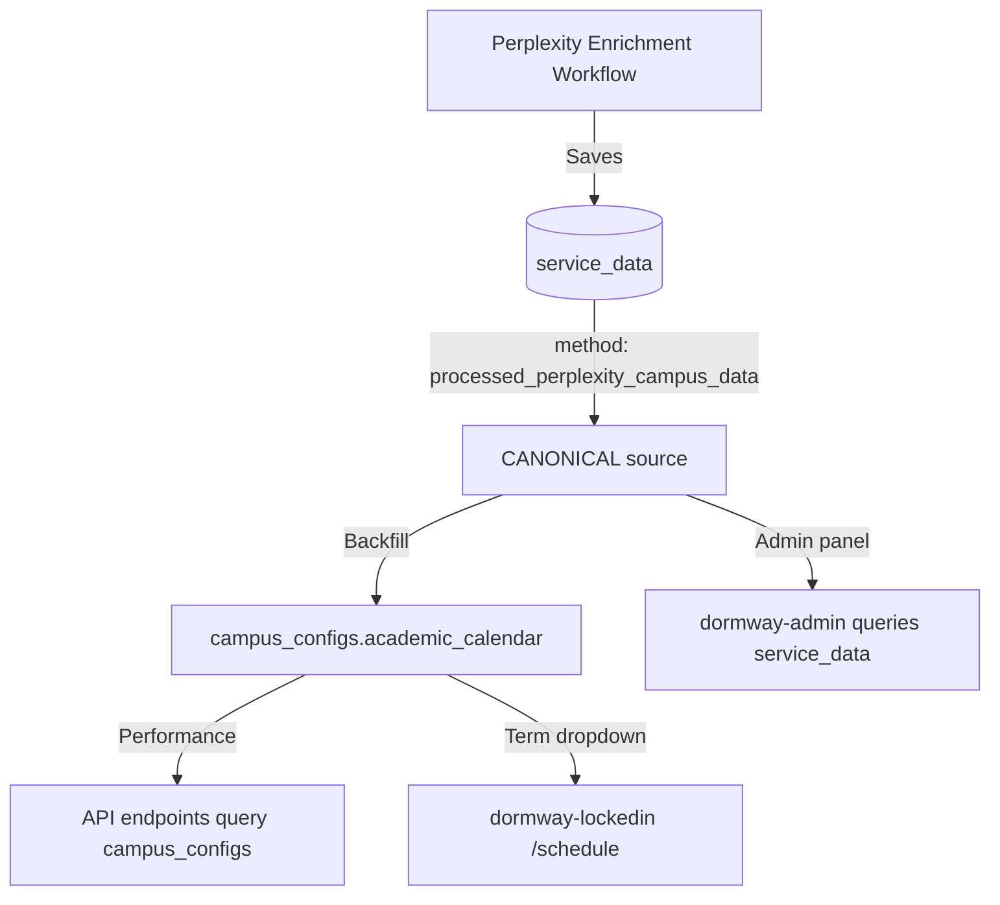

# Sync Orchestration

DormWay uses Temporal workflows to orchestrate all external data fetching. Sync is scheduled, prioritized, and deduped at the context level. Results are stored in the `service_data` table, which acts as the canonical time-series store for all external data.

## service_data Table

All external data — weather, campus information, canvas assignments, syllabus crew output, context predictions — is stored in `service_data`:

```sql
CREATE TABLE service_data (
  id           UUID PRIMARY KEY,
  context_id   UUID,            -- Campus, city, student, or course context
  user_id      UUID,            -- Owner (for student-scoped data)
  method       TEXT,            -- Data source identifier
  data         JSONB,           -- Full response payload
  fetched_at   TIMESTAMPTZ,     -- Partition key
  expires_at   TIMESTAMPTZ      -- NULL = never expires
) PARTITION BY RANGE (fetched_at);
```

<Warning>
`service_data` is partitioned by month on `fetched_at`. Always include `fetched_at` in WHERE clauses for performance. Queries without a date predicate cause full table scans across all partitions.
</Warning>

### Key Method Values

| `method` | Context type | Description |
|----------|-------------|-------------|
| `processed_perplexity_campus_data` | campus | Perplexity AI campus enrichment (term dates, facilities) |
| `processed_syllabus_crew` | course | Syllabus crew analysis output |
| `braingains_syllabus_structure` | course | Legacy syllabus path |
| `fetch_weather` | city | Current weather conditions |
| `fetch_forecast` | city | 7-day weather forecast |
| `fetch_transit` | city | Road closures and transit status |
| `context_prediction_response` | student | Student context prediction (travel, location) |
| `dayplan_context_update` | student | Day plan context update |

## Sync Scheduling (contexts table)

Sync scheduling metadata lives on the `contexts` table:

```sql
next_sync_at             TIMESTAMPTZ  -- When to run next sync
sync_frequency_minutes   INTEGER       -- Interval between syncs
sync_priority_score      NUMERIC       -- Higher = sooner
```

The campus sync worker queries for contexts with `next_sync_at <= NOW()`, sorted by `sync_priority_score DESC`. After syncing, it sets `next_sync_at = NOW() + sync_frequency_minutes`.

## Campus Sync Workflows

### processSingleCampus

Full campus onboarding — fetches all data via Perplexity, creates term contexts, enriches campus metadata.

```typescript
await temporalClient.startWorkflow({
  workflowName: 'processSingleCampus',
  taskQueue: 'campus-worker',
  args: [campusId],
});
```

Called automatically when the first student signs up at a new campus (via Clerk webhook).

### enrichCampusesPrioritized

Enrichment-only mode — skips the full Perplexity data fetch and updates only metadata fields. Used for periodic background refreshes.

### campusOnboardingWorkflow

Batch onboarding from the campus registry — processes multiple campuses in sequence. Used for initial bulk ingestion.

### gatherCampusDataWithPerplexity

Child workflow invoked by `processSingleCampus`. Fetches comprehensive campus data including:
- Academic calendar (term dates, breaks, exam periods)
- Campus events, dining, facilities, transportation
- Safety alerts and housing info

### Campus Enrichment Frequency

The admin panel has a 7-day enrichment window. Triggering enrichment before 7 days requires the force flag:

```json
POST /api/admin/campus-configs/trigger-enrichment
{
  "campusId": "uuid",
  "forceEnrichment": true
}
```

## Student-Level Sync

Student sync is driven by the StudentWatcher workflow. Key intervals:

| Sync Type | Trigger | Interval |
|-----------|---------|----------|
| Canvas ICS | `triggerCanvasSyncSignal` or timer | 6 hours |
| Calendar (ICS subscriptions) | `triggerCalendarSyncSignal` or timer | 6 hours |
| DayPlan regeneration | Timer | 30 minutes |
| Context prediction | Timer | Variable |

## Perplexity Campus Data Flow



The canonical data is always `service_data`. `campus_configs.academic_calendar` is a denormalized cache for read performance. Admin operations must always read from `service_data`.

## System Configuration

Runtime sync parameters are stored in the `system_config` table (managed by `SystemConfigService` in `@dormway/core`) and editable in dormway-admin at `/system-settings`:

| Config Key | Default | Description |
|------------|---------|-------------|
| `sync.max_concurrent_cities` | varies | City sync concurrency limit |
| `canvas.sync_interval_hours` | 6 | Canvas ICS sync frequency |
| `processing.batch_size` | varies | Campus processing batch size |

Values are cached in-process (60s TTL) and in Redis (60s TTL), with database as L3 fallback.

## Freshness Service

`FreshnessService` in dormway-core tracks when data was last successfully fetched for any context:

```typescript
import { getFreshnessService } from '@dormway/core';

const freshness = getFreshnessService();
const isStale = await freshness.isStale(contextId, method, thresholdMinutes);
```

Used by sync workers to decide whether to re-fetch data or use cached results.

## Task Queues

| Queue | Workflows |
|-------|-----------|
| `student-worker` | StudentWatcher, syllabusProcessor, canvasICSSync |
| `campus-worker` | processSingleCampus, enrichCampusesPrioritized, campusOnboardingWorkflow |
| `city-worker` | City enrichment, weather fetch |

## Key Files

| File | Purpose |
|------|---------|
| `services/engine/src/workflows/campusProcessor.workflow.ts` | Campus sync orchestration |
| `services/engine/src/activities/campus.activities.ts` | Campus data activities (including Perplexity save) |
| `services/engine/src/workflows/canvasICSSync.workflow.ts` | Student Canvas sync |
| `services/shared/dormway-core/src/domains/service-data/` | service_data queries |
| `services/shared/dormway-core/src/domains/system-config/` | Runtime config service |
