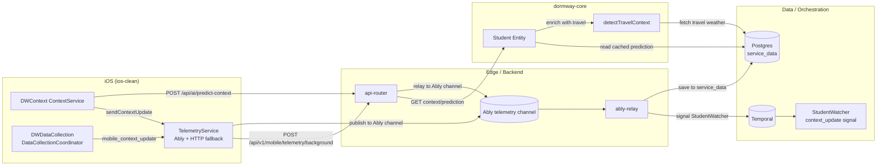
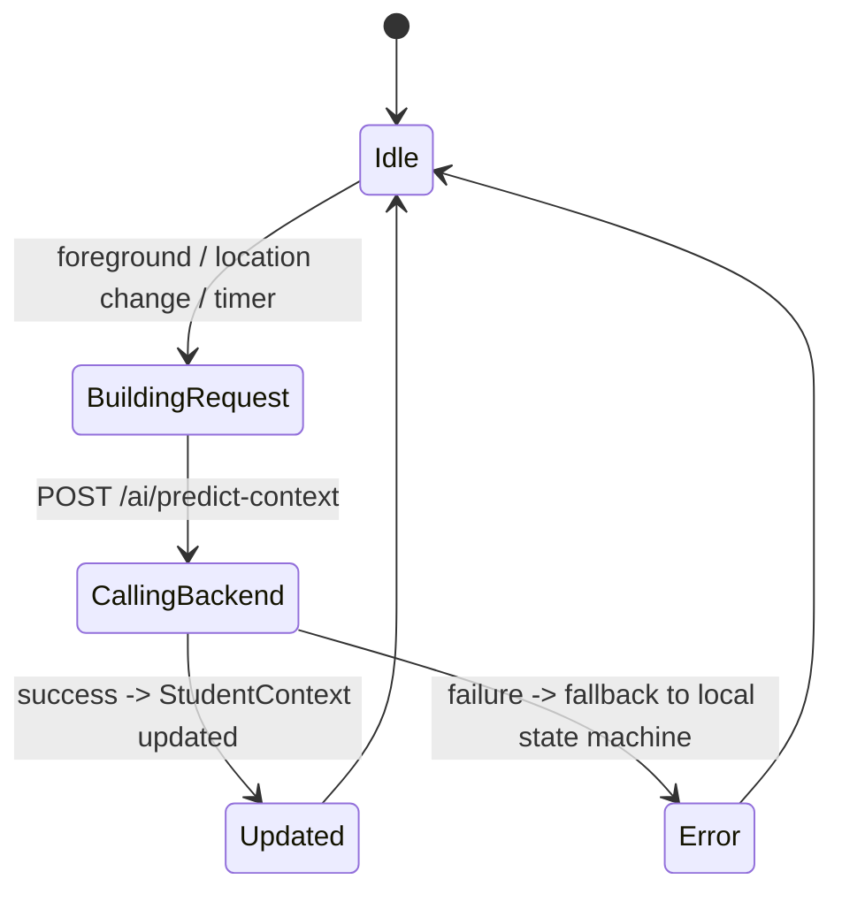
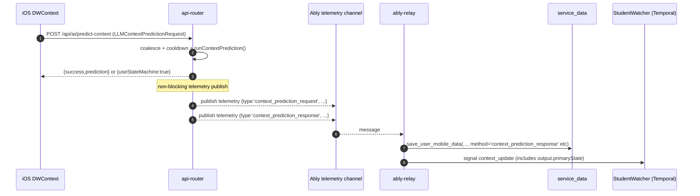
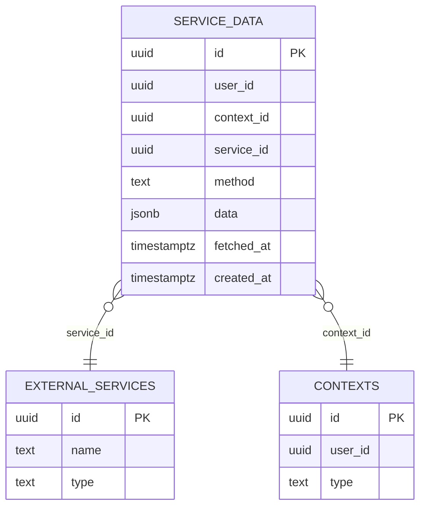

# Context Prediction Pipeline Deep Dive (Current)

This doc “double clicks” on the **current end-to-end pipeline**:

`iOS DWContext → api-router /ai/predict-context → Ably telemetry → Ably Relay → service_data + StudentWatcher reactions → downstream client updates/invalidations`

Related:

- [How DormWay Works](/docs/engineering/architecture/how-dormway-works)
- [StudentWatcher Workflow Deep Dive (Current)](/docs/engineering/technical/studentwatcher/studentwatcher-workflow-deep-dive-current)
- [Realtime Invalidation & Update Propagation Deep Dive (Current)](/docs/engineering/technical/realtime/realtime-invalidation-update-propagation-deep-dive-current)
- [DayPlan & Semester Summary Generation Deep Dive (Current)](/docs/engineering/technical/engine/dayplan-semester-summary-generation-deep-dive-current)

Primary code references (current):

- iOS context engine + backend call: `.repos/ios-clean/Packages/DWContext/Sources/DWContext/ContextService.swift`
- iOS telemetry publisher (Ably + HTTP fallback): `.repos/ios-clean/Packages/DWDataCollection/Sources/DWDataCollection/TelemetryService.swift`
- iOS “full dump” signal source: `.repos/ios-clean/Packages/DWDataCollection/Sources/DWDataCollection/DataCollectionCoordinator.swift`
- Context prediction endpoints: `.repos/dormway-platform/services/api-router/src/routes/context-intelligence-routes.ts`
- HTTP telemetry relay + direct mobile data storage: `.repos/dormway-platform/services/api-router/src/routes/mobile-routes.ts`
- Ably Relay: `.repos/dormway-platform/services/ably-relay/src/services/relay-orchestrator.ts`
- Ably → Temporal signal mapping: `.repos/dormway-platform/services/ably-relay/src/services/temporal-dispatcher.ts`
- Ably Relay → DB writes (Aurora): `.repos/dormway-platform/services/ably-relay/src/services/aurora-handler.ts`
- StudentWatcher context update behavior: `.repos/dormway-platform/services/engine/src/workflows/studentWatcher.simplified.workflow.ts`
- DayPlan context storage/reads: `.repos/dormway-platform/services/engine/src/activities/dayplan.activities.ts`
- DB stored procedure (local schema mirror): `.repos/dormway-platform/infrastructure/docker/init-scripts/01-schema.sql` (`save_user_mobile_data`)

---

## 0) Mental model: 3 different “context” concepts

DormWay uses “context” in three different ways that are easy to conflate:

1) **Durable context graph** (campus/course/student nodes): `contexts` + `context_dependencies`.
2) **Behavioral “student context”** (what the user is doing right now): predicted via LLM and/or heuristics.
3) **Realtime “context updates”** (signals that something changed): telemetry → StudentWatcher signals → optional DayPlan regeneration.

This doc is about (2) + (3).

---

## 1) Pipeline overview (end-to-end)



Key ideas:
- **Ably telemetry is the "bus"** that reliably gets mobile signals into Temporal, even if the mobile app falls back to HTTP (API Router re-publishes to Ably).
- **dormway-core enrichment**: When context prediction is read via `/v2/students/me/context/prediction`, the Student entity enriches it with travel detection data (location name, travel weather) via `detectTravelContext()`.

---

## 2) iOS producers (what iOS sends)

### 2.1 DWContext prediction requests (LLMContextPredictionRequest)

`DWContext` builds a structured request including:

- environment (location, time-of-day, day-of-week)
- recent activity transitions (state machine history)
- calendar (upcoming events; local classification)
- health + screen-time (when available via `DWDataCollection`)

Implementation:

- `.repos/ios-clean/Packages/DWContext/Sources/DWContext/ContextService.swift`
  - `buildContextRequest()`
  - `fetchContextFromBackend(endpoint="/ai/predict-context")`

DWContext refresh cadence (current):

- periodic timer: every **5 minutes** (`updateInterval = 300`)
- minimum interval guard: **30 seconds** (`minimumUpdateInterval = 30`)
- also triggers on:
  - significant location changes
  - app foreground
  - auth becoming valid



### 2.2 iOS telemetry: “context_updated” vs “mobile_context_update”

iOS emits *two different* kinds of telemetry:

1) **Lightweight “context updated” telemetry** (common)
   - emitted after DWContext gets a prediction
   - implemented via `TelemetryServiceProtocol.sendContextUpdate(...)`
   - becomes a `TelemetryEvent(type: .userAction, data: { action: "context_updated", ... })`
   - routes through Ably (foreground) or HTTP (`/v1/mobile/telemetry/background`) (background)

2) **Full data dump signal** (used for “LLM processing” / debugging / richer downstream)
   - `DataCollectionCoordinator` emits a `custom_signal` named `mobile_context_update`
   - payload can include device info, location context, calendar events, health, screen time
   - sent via `TelemetryService.sendCustomSignal(name:"mobile_context_update", data: ...)`

Implementation:

- `.repos/ios-clean/Packages/DWDataCollection/Sources/DWDataCollection/DataCollectionCoordinator.swift` (sends `mobile_context_update`)
- `.repos/ios-clean/Packages/DWDataCollection/Sources/DWDataCollection/TelemetryService.swift` (Ably publish + HTTP fallback)

---

## 3) API Router: context prediction + telemetry relay

### 3.1 Context prediction endpoints

Two variants exist:

- `POST /api/ai/predict-context` (mobile/web; auth required)
- `POST /api/ai/predict-context/server` (internal; used by engine “server-mode” predictions)

Implementation:

- `.repos/dormway-platform/services/api-router/src/routes/context-intelligence-routes.ts`

Important behavior (current):

- **coalescing**: concurrent requests per `(userId, telemetrySource, deviceId)` are coalesced
- **cooldown**: rate-limited; cached result may be returned when throttled
- **telemetry**: on non-cached predictions, publishes request/response telemetry to Ably telemetry channel as `type: context_prediction_request|context_prediction_response`



### 3.2 HTTP telemetry relay (background mode)

When iOS can’t publish to Ably (background / disconnected), it POSTs:

- `POST /api/v1/mobile/telemetry/background`

API Router:

- validates + enriches event (ensures `userId`)
- re-publishes the event to the Ably telemetry channel so Ably Relay can process it

Implementation:

- `.repos/dormway-platform/services/api-router/src/routes/mobile-routes.ts` (`/telemetry/background`)

---

## 4) Ably Relay: turning telemetry into DB rows + StudentWatcher signals

### 4.1 Ably telemetry parsing contract

Ably Relay expects Ably message `data` to be JSON (string or object) containing:

- `type` (string)
- `userId` and/or `deviceId`
- `timestamp`
- `data` (object)

Implementation:

- `.repos/dormway-platform/services/ably-relay/src/services/ably-listener.ts` (`parseTelemetryMessage`)

### 4.2 Storage: which telemetry becomes `service_data`

Ably Relay stores **some** events in Postgres.

1) Full mobile data signals (`mobile_context_update`, `mobile_health_data`, `mobile_calendar_data`, `mobile_mood_update`)
   - stored via stored procedure `save_user_mobile_data(...)`
   - methods:
     - `context_update`
     - `mobile_user_health_data`
     - `mobile_calendar_save`
     - `mobile_mood_update`

2) Context prediction request/response (published by API Router)
   - stored as:
     - `context_prediction_request`
     - `context_prediction_response`

Implementation:

- `.repos/dormway-platform/services/ably-relay/src/services/aurora-handler.ts`

DB stored proc (local schema mirror):

- `.repos/dormway-platform/infrastructure/docker/init-scripts/01-schema.sql` (`save_user_mobile_data`)

### 4.3 Orchestration: every telemetry message signals StudentWatcher

Ably Relay sends **all telemetry messages** into StudentWatcher using `signalWithStart(...)`.

Mapping:

- many message types map to StudentWatcher `context_update` signal
- payload is normalized into:
  - `type`: one of `location|calendar|preference|activity|...`
  - `data`: message fields + `originalEventType`
  - `timestamp`: ISO string

Implementation:

- `.repos/dormway-platform/services/ably-relay/src/services/temporal-dispatcher.ts`

```mermaid
flowchart TD
  A[TelemetryMessage.type] --> B{mapEventTypeToSignal}
  B -->|default| C[signalName = context_update]
  C --> D{transformSignalPayload}
  D --> E[ContextUpdateSignal{type,data,timestamp}]
  E --> F[Temporal signalWithStart to student-watcher-{userId}]
```

---

## 5) StudentWatcher: what it does when it receives `context_update`

### 5.1 High-level decision tree (current)

```mermaid
flowchart TD
  A[context_update signal] --> B{is calendar update?}
  B -->|yes| C[Force regenerate DayPlan]
  B -->|no| D{syllabus update/add?}
  D -->|yes| E[Force regenerate DayPlan]
  D -->|no| F{course enrollment changed?}
  F -->|yes| G[Force regenerate DayPlan]
  F -->|no| H{DayPlan exists?}
  H -->|no| I[storeContextUpdate() -> service_data.dayplan_context_update]
  H -->|yes| J[detect deviations + update plan state]
  J --> K{shouldTriggerServerPrediction?}
  I --> K
  K -->|yes| L[captureServerContextPrediction() (throttled)]
  K -->|no| M[No server-mode prediction]
```

Implementation:

- `.repos/dormway-platform/services/engine/src/workflows/studentWatcher.simplified.workflow.ts` (`setHandler(contextUpdateSignal, ...)`)

### 5.2 Calendar updates are special: they trigger regeneration

StudentWatcher treats these as “calendar changed, refresh plan”:

- `update.type === 'calendar'`
- or `update.data.originalEventType in ('calendar_data_updated','calendar.sync')`

Result: immediate `generateMorningPlan(..., forceRegenerate=true, sendNotifications=false)`

### 5.3 Context storage for later DayPlan generation

If no current DayPlan exists, StudentWatcher persists the context update to:

- `service_data.method = 'dayplan_context_update'`

Implementation:

- Workflow helper: `storeContextForFutureGeneration(...)` in `studentWatcher.simplified.workflow.ts`
- Activity: `.repos/dormway-platform/services/engine/src/activities/dayplan.activities.ts` (`storeContextUpdate`)

### 5.4 Server-mode context prediction (Engine-triggered)

On “high signal” context updates, StudentWatcher can request a **server-mode** context prediction:

- calls `.repos/dormway-platform/services/engine/src/activities/dayplan.activities.ts` (`captureServerContextPrediction`)
- which calls API Router internally:
  - `.repos/dormway-platform/services/engine/src/services/contextPrediction.service.ts` → `POST /api/ai/predict-context/server`
- throttled to ~30s in the workflow handler

The **prediction response** is stored into:

- `service_data.method = 'dayplan_context_update'`
- `data.updateType = 'context_prediction_response'`

This is what DayPlan generation currently reads as “recent context”.

---

## 6) Data model: key `service_data` methods involved



Current high-signal `method` values used by this pipeline:

- `context_update` (raw mobile context dump via Ably Relay)
- `context_prediction_request` / `context_prediction_response` (API Router-published telemetry, stored by Ably Relay)
- `dayplan_context_update` (StudentWatcher/DayPlan-owned context updates + server-mode predictions)
- `mobile_calendar_save` (large calendar payloads; also can trigger `calendar_data_updated` signal)

---

## 7) Downstream updates vs invalidations (what clients actually “react” to)

### 7.1 Informational Ably events (toasts / UX feedback)

Engine publishes events like:

- `dayplan.update` (includes `dayPlan` payload)
- `dashboard.update` (e.g., schedule reconciliation complete)

These are primarily used for **UX messaging** (toasts) and **debug visibility**.

Example consumer:

- LockedIn: `.repos/dormway-platform/services/dormway-lockedin/src/components/RealtimeProvider.tsx` (renders friendly toast messages)
- iOS: `.repos/ios-clean/Packages/DWServices/Sources/DWServices/RealtimeUpdatesService.swift` (handles `context_update`, `dashboard.update`, `feed.invalidate`, etc; does not currently handle `dayplan.update`)

### 7.2 Signal-based invalidations (React Query refetch)

LockedIn’s “canonical refresh” mechanism is **invalidate signals**:

- Ably `event='invalidate'` on `user:<id>:updates`
- emitted by API Router (`publishInvalidation(...)`)
- consumed by LockedIn (`useRealtimeInvalidation`)

Deep dive: [Realtime Invalidation & Update Propagation Deep Dive (Current)](/docs/engineering/technical/realtime/realtime-invalidation-update-propagation-deep-dive-current)

**Important current nuance**: StudentWatcher-driven DayPlan regeneration emits `dayplan.update`, but does not necessarily emit invalidation signals for `dashboard|schedule|academic|feed`. If a UI surface depends on refetching to show the new data, it may remain stale unless it polls or separately invalidates.

---

## 8) Architecture notes (debugging context)

Key points to keep in mind when debugging:

- There are **two stores** for context-like information:
  - `service_data.method='context_prediction_*'` (Ably Relay storage)
  - `service_data.method='dayplan_context_update'` (DayPlan-owned)
  - DayPlan generation reads `dayplan_context_update` today.
- DayPlan regeneration emits both an Engine-driven event (`dayplan.update`) and proper invalidation signals (`invalidate`) so clients properly refetch. **Note:** Prior to 2025-12-26, invalidation signals were sometimes missing; this has been resolved (SE-018/DORM-792).

---

## 9) Travel detection enrichment (dormway-core)

**Added 2025-12-26**: Context prediction is now enriched with travel detection data from dormway-core.

### How it works

When `Student.getContextPrediction()` is called (in dormway-core), it:

1. Loads cached context prediction from `service_data.method='context_prediction_response'`
2. Extracts user's GPS location from the prediction input
3. Gets the student's campus coordinates
4. Calls `detectTravelContext()` to determine if user is >50 miles from campus
5. If traveling, fetches weather for the user's current location via City entity
6. Enriches the response with `travel` field

### Travel context structure

```typescript
interface TravelContext {
  isTraveling: boolean;
  distanceFromCampusMiles: number;
  currentLocationName?: string;
  travelWeather?: {
    temperature: number;
    feels_like: number;
    humidity: number;
    wind_speed: number;
  };
}
```

### API response

The `/v2/students/me/context/prediction` endpoint returns enriched data:

```json
{
  "success": true,
  "data": {
    "input": { ... },
    "output": { ... },
    "travel": {
      "isTraveling": true,
      "distanceFromCampusMiles": 1959,
      "currentLocationName": "West Hills",
      "travelWeather": {
        "temperature": 56.62,
        "feels_like": 56.08,
        "humidity": 87,
        "wind_speed": 9.22
      }
    }
  }
}
```

### Downstream consumers

- **DayPlan generation**: Uses `travel.travelWeather` instead of campus weather when user is traveling
- **DayPlan prompt**: Labels campus/city context as "HOME" and adds travel-specific recommendations

### Architecture principle

**ALL business logic lives in dormway-core**:
- `api-router` = thin HTTP passthrough, NO business logic
- `dormway-core` = ALL business logic including travel detection
- `engine` = workflow orchestration, calls dormway-core methods

See: [TravelDetectionService](/docs/engineering/technical/dormway-core/domain-services/traveldetectionservice) for implementation details
