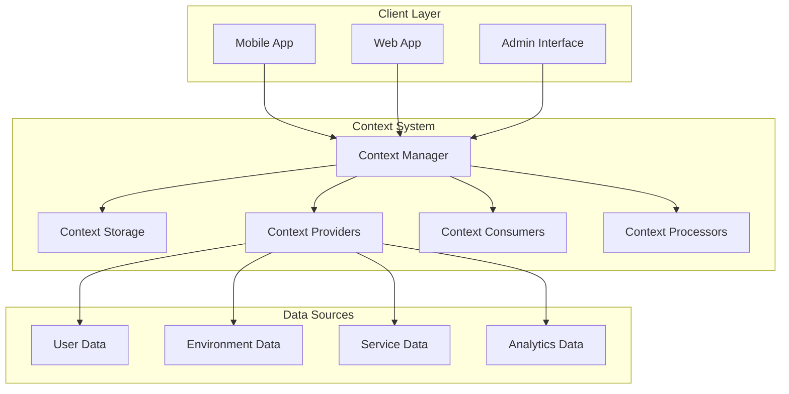
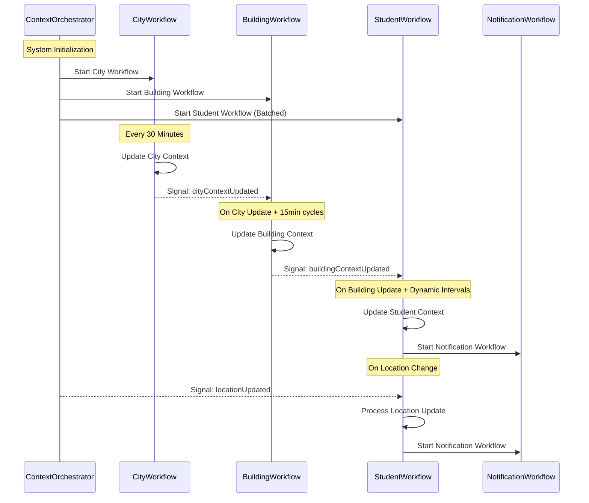
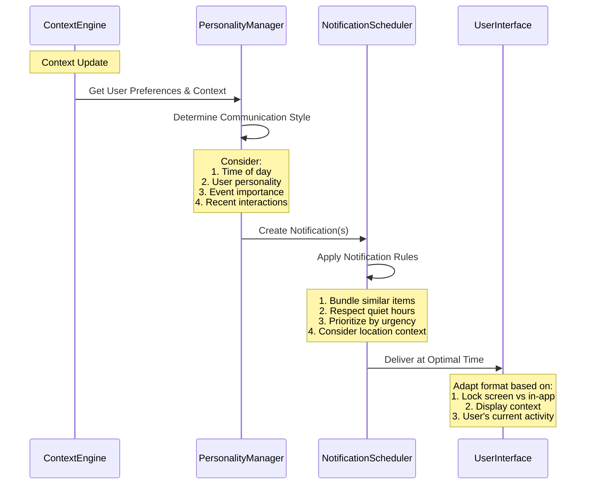

# DormWay Context System: Architecture & Implementation

## Executive Summary

The DormWay Context System is a hierarchical, event-driven architecture that delivers personalized, contextually-aware content to students based on their location, schedule, preferences, and environmental factors. This document outlines the technical architecture, data flow, processing patterns, and implementation approach using Temporal as the orchestration engine.

## 1. System Architecture

The system follows a hierarchical structure with cascading contexts:

1. **City Context Layer** - Processes city-wide information (weather, transit, events)
2. **Building Context Layer** - Manages building-specific contexts (occupancy, dining, facilities)
3. **Personal Context Layer** - Handles individual student contexts (schedule, preferences, location)

### 1.1 Architecture Diagram



### 1.2 Context Hierarchy & Dependencies

```
City Context
└── Building Context
    └── Student Context
        └── Notifications
```

Each context level depends on the levels above it, creating a cascading effect where:
- Weather changes affect building recommendations
- Building occupancy affects student study location suggestions
- Student context changes affect notification content and timing

## 2. Temporal Workflow Implementation

The system is implemented using Temporal, a workflow orchestration platform that enables:
- Long-running processes with durability
- Event-driven updates via signals
- Automatic retry and recovery
- State management for context data

### 2.1 Workflow Types

#### 2.1.1 City Context Workflow
- **Purpose**: Process city-level data and propagate changes
- **Update Frequency**: Every 30 minutes (configurable)
- **Inputs**: Weather API, Transit API, Campus Events API
- **Outputs**: Enriched city context with LLM-processed insights

#### 2.1.2 Building Context Workflow
- **Purpose**: Process building-specific data and respond to city changes
- **Update Frequency**: Every 15 minutes (configurable)
- **Inputs**: Building sensors, dining systems, facility status, city context
- **Outputs**: Enriched building context with LLM-processed insights

#### 2.1.3 Student Context Workflow
- **Purpose**: Create personalized context for individual students
- **Update Frequency**: Dynamic based on activity (15-60 minutes)
- **Inputs**: Student schedule, preferences, location updates, building context
- **Outputs**: Personalized recommendations and notification triggers

#### 2.1.4 Notification Workflow
- **Purpose**: Manage notification timing, bundling, and delivery
- **Update Frequency**: Event-driven (triggered by context changes)
- **Inputs**: Student context, notification content, delivery preferences
- **Outputs**: Optimally timed and personalized push notifications

### 2.2 Workflow Coordination



## 3. LLM Processing & Context Enrichment

The DormWay context system leverages AI to transform raw data into actionable insights. This processing is implemented using Helicone with the OpenAI API for all context levels.

### 3.1 LLM Processing Functions

At each level of the system, LLM processing transforms raw data into actionable insights:

1. **City-Level Processing**:
   - Weather impact analysis for campus activities
   - Transit optimization recommendations
   - Event prioritization and relevance

2. **Building-Level Processing**:
   - Space utilization recommendations
   - Service status interpretations
   - Cross-building comparisons (dining, study spaces)

3. **Student-Level Processing**:
   - Schedule optimization
   - Task prioritization
   - Location-specific recommendations
   - Wellness and productivity insights

### 3.2 Example LLM Prompt Template (Weather Analysis)

```
Analyze this weather data for {cityName}:
{weatherData}

Focus on:
1. How will this affect campus transport and walking times?
2. What activities are impacted (indoor/outdoor)?
3. What suggestions should be made for students?
4. How does this affect building operations?

Provide a structured analysis that can be used for downstream context processing.
```

### 3.3 Data Enrichment Pipeline

Raw data → LLM Analysis → Structured Context → Dependency Updates → UI/Notification Adaptation

### 3.4 Helicone Integration

All AI processing is centralized through Helicone for:

1. **Observability**: All prompts and responses are tracked
2. **Cost Control**: Token usage monitoring and optimization
3. **Caching**: Similar requests use cached responses
4. **Analytics**: Usage patterns and performance metrics

As implemented in student context processing:

```javascript
const response = await generate({
  promptId: "student-context",
  inputs: {
    calendarData: JSON.stringify(calendarData),
    lmsData: JSON.stringify(lmsData),
    campusContext: JSON.stringify(campusContext),
    timezone: new Date().toLocaleTimeString('en-us', { timeZoneName: 'short' }).split(' ')[2]
  }
}) as any;
```

## 4. Notification Orchestration

### 4.1 Notification Generation Process

The system generates contextually-relevant notifications through:

1. **Context Monitoring**:
   - Schedule-based triggers (class reminders, preparation time)
   - Location-based triggers (entering/leaving buildings)
   - External event triggers (weather changes, campus alerts)

2. **Content Personalization**:
   - Communication style adaptation to student preferences
   - Time-of-day appropriate tone and content
   - Context-aware information prioritization

3. **Delivery Optimization**:
   - Quiet hours respect
   - Activity-appropriate timing
   - Notification bundling to reduce overload
   - Priority-based delivery scheduling

### 4.2 Notification Flow Diagram



### 4.3 Implementation in Temporal

Notifications are generated using the `generateNotificationWorkflow` defined in the StudentProcessor:

```javascript
export async function generateNotificationWorkflow(studentId: string, newContext: any): Promise<void> {
  try {
    // Fetch prior context and travel context in parallel
    const [priorContext, travelContext] = await Promise.all([
      studentActivities.fetchPriorStudentContext(studentId),
      studentActivities.fetchTravelContext(studentId)
    ]);

    // Get student info for timezone and name
    const studentInfo = await studentActivities.getStudentContext(studentId);
    const timezone = (studentInfo as any).metadata?.timezone || 'UTC';
    const name = (studentInfo as any).metadata?.name || 'Student';
    
    // Generate notification from contexts
    const notification = await studentActivities.generateNotificationFromContexts({
      newContext,
      priorContext,
      travelContext,
      timezone,
      name
    });

    // If we have a valid notification, send it
    if (notification && notification.title && notification.content) {
      await studentActivities.sendPushNotification(studentId, {
        title: notification.title,
        content: notification.content,
        data: notification.data,
        badge: notification.badge,
        sound: notification.sound,
        silent: notification.silent
      });
    }
  } catch (error) {
    logger.error(`Failed to generate notification for student ${studentId}`, { error });
    throw error;
  }
}
```

## 5. Implementation Guide

### 5.1 System Configuration

The system uses a tiered workflow configuration:

**City Workflows**:
- One workflow per city/campus
- Update interval: 30 minutes (weather), 5 minutes (transit)
- High priority processing

**Building Workflows**:
- One workflow per 5-10 buildings
- Update interval: 15 minutes
- Medium priority processing

**Student Workflows**:
- Batched processing (50-100 students per batch)
- Dynamic update intervals (15-60 minutes)
- Prioritization based on activity levels

### 5.2 Scaling Considerations

1. **Workflow Batching**:
   - Process students in batches rather than individual workflows
   - Group by building, activity level, or class schedule

2. **Resource Optimization**:
   - Higher-frequency updates for active users
   - Reduced processing for inactive users
   - Shared context processing for building/city levels

3. **Monitoring and Recovery**:
   - Regular workflow health checks
   - Automatic restart of failed workflows
   - System health dashboard for operations

### 5.3 Development & Deployment Roadmap

1. **Phase 1: Core Context Engine**
   - City and building workflow implementation
   - Basic LLM processing integration
   - Context database schema

2. **Phase 2: Student Context Layer**
   - Student workflow implementation
   - Schedule and preference integration
   - Location-based context processing

3. **Phase 3: Notification System**
   - Notification workflow implementation
   - Bundling and timing optimization
   - Push notification delivery

4. **Phase 4: UI Integration**
   - Mobile app context integration
   - Smart display integration
   - Real-time UI updates

## 6. Technical Requirements

### 6.1 Infrastructure

- **Temporal Cluster**: For workflow orchestration
- **Supabase**: For context data storage
- **OpenAI API**: For LLM processing (via Helicone)
- **Redis**: For context caching and real-time updates

### 6.2 API Integrations

- Weather APIs (OpenWeatherMap, etc.)
- Campus APIs (courses, dining, events)
- Building systems (occupancy, services)
- Push notification services (FCM, APNS)

### 6.3 Performance Goals

- City context updates: < 10 seconds
- Building context updates: < 5 seconds
- Student context updates: < 3 seconds
- Notification delivery: < 1 second from trigger
- Location-based updates: < 2 seconds from detection

## 7. Context Storage

The context system stores data in Supabase with several key tables:

1. **contexts**: Core table for storing hierarchical context data with parent-child relationships
2. **service_data**: Time-series data from various services, partitioned by timestamp
3. **student_calendar**: Stores normalized calendar events
4. **student_time_blocks**: Stores processed and merged time blocks with intelligent incremental updates (optimized June 1, 2025)

For detailed schema information, see Context System Schema.

### 8.1 Time Block Storage Optimization (June 1, 2025)

The `student_time_blocks` table has been optimized with intelligent incremental updates:

**Performance Improvements**:
- **Incremental Updates**: Replace delete-all + insert-all with intelligent diff-based operations
- **Set-based Lookups**: O(n) complexity using constraint-aware key matching
- **Database Operations**: 80%+ reduction for typical calendar sync scenarios
- **Upsert Operations**: Graceful handling of constraint violations

**Technical Implementation**:
```typescript
// Constraint-aware key generation
const generateTimeBlockKey = (block: TimeBlock): string => {
  return `${block.user_id}|${block.start_time}|${block.label}`;
};

// Efficient diff calculation
const { toDelete, toInsert, toUpdate } = calculateTimeBlockDiff(existingBlocks, newBlocks);
```

**Impact**: Foundation for Redis caching and massive performance improvements for users with stable schedules.

The storage system supports:

- Historical context retrieval
- Diff-based updates
- Versioned context data
- Context metadata for efficient lookup
- Hierarchical context relationships
- Time-series analysis

## 8. Integration with Mobile Clients

Mobile clients interact with the context system through:

1. **Context API**: REST endpoints for querying context
2. **Signal API**: For sending location and user events
3. **Push Notifications**: For receiving context-driven alerts
4. **Client Context Cache**: For efficient rendering and offline support

The mobile integration happens primarily through the API Router's `mobile-routes.ts` endpoints and push notification services.

## 9. Conclusion

The DormWay Context System provides a robust framework for delivering deeply contextual experiences to college students. By leveraging a hierarchical context model with Temporal workflows and LLM processing, the system creates a personalized, adaptive experience that responds to changing conditions and student needs in real-time.

The architecture emphasizes:
- Scalability through appropriate batching and resource allocation
- Resilience through automatic workflow recovery
- Contextual relevance through cascading updates
- Personalization through LLM-powered insights

This system forms the foundation of DormWay's unique value proposition: an intelligent campus companion that truly understands and anticipates student needs as they move through their day.

## 🔗 Related

*Backlinks and related notes will appear here*
