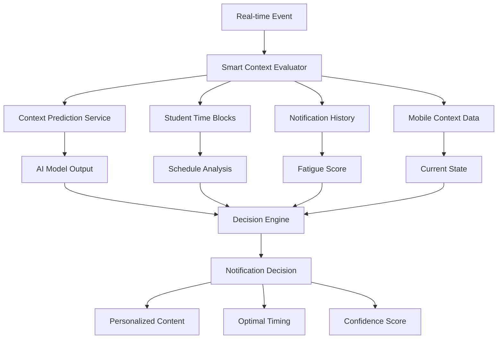

# Smart Context Evaluation System

Created: 2025-07-18
Status: 🟢 Ready for Testing
Tags: #notification #context #ai #ml

## Overview

The Smart Context Evaluation System is an advanced notification decision engine that uses predictive AI context, student schedules, and behavioral patterns to make intelligent notification decisions. It replaces simple rule-based logic with sophisticated multi-factor analysis.

## Architecture

### System Components



## Key Features

### 1. Predictive Context Integration
- Uses `context_prediction_response` from AI models
- Incorporates confidence scores and alternative states
- Leverages temporal insights for state transitions
- Considers wellness and energy assessments

### 2. Schedule-Aware Decisions
- Integrates with `student_time_blocks` table
- Respects class schedules and important events
- Identifies optimal notification windows
- Avoids interrupting focused work time

### 3. Notification Fatigue Prevention
- Tracks recent notification history
- Uses exponential decay for weighted fatigue scoring
- Dynamically adjusts thresholds based on time of day
- Prevents notification overload

### 4. Personalized Content Generation
- Context-aware message templates
- Tone adaptation (encouraging, urgent, gentle, celebratory)
- Energy-level appropriate messaging
- State-specific content variations

## Implementation Details

### Core Algorithm

```typescript
interface SmartNotificationDecision {
  shouldNotify: boolean;
  reason: string;
  confidence: number;
  suggestedTiming?: {
    immediate: boolean;
    deferUntil?: Date;
    optimalWindow?: { start: Date; end: Date };
  };
  personalizedContent?: {
    title: string;
    body: string;
    tone: 'encouraging' | 'urgent' | 'gentle' | 'celebratory';
  };
  contextualFactors: {
    currentState: string;
    nextTransition?: string;
    currentActivity?: string;
    energyLevel?: string;
    upcomingEvents?: TimeBlock[];
  };
}
```

### Decision Factors

1. **State Rules** (30% weight)
   - Current context state (studying, traveling, at home, etc.)
   - Time block type (class, meeting, meal, sleep)
   - Hard blocks for certain states

2. **Notification Value** (40% weight)
   - Type-specific base values
   - Context adjustments
   - Urgency multipliers
   - Deadline proximity

3. **Fatigue Score** (20% weight)
   - Recent notification count
   - Time-weighted decay
   - User engagement history

4. **Confidence** (10% weight)
   - AI model confidence
   - Data quality indicators
   - State prediction accuracy

### Dynamic Thresholds

The system uses time-aware thresholds:
- **Night (10pm-8am)**: 0.8 threshold
- **Morning Focus (8am-10am)**: 0.6 threshold
- **Regular Hours**: 0.5 threshold
- **Evening Wind Down (6pm-8pm)**: 0.55 threshold

## Data Sources

### 1. Context Prediction (`service_data`)
```sql
SELECT data->>'output' as context_prediction
FROM service_data
WHERE user_id = ? 
  AND method = 'context_prediction_response'
ORDER BY fetched_at DESC
LIMIT 1
```

### 2. Student Time Blocks
```sql
SELECT * FROM student_time_blocks
WHERE user_id = ?
  AND start_time >= NOW()
  AND start_time <= NOW() + INTERVAL '6 hours'
ORDER BY start_time
```

### 3. Notification History
```sql
SELECT * FROM engine_notification_history
WHERE user_id = ?
  AND sent_at >= NOW() - INTERVAL '3 hours'
ORDER BY sent_at DESC
```

## Usage

### Enabling Smart Evaluation

Add `useSmartEvaluation: true` to event data:

```typescript
const event: ContextualEvent = {
  type: 'location_change',
  data: {
    newLocation: 'library',
    confidence: 0.95,
    useSmartEvaluation: true  // Enable smart evaluation
  },
  timestamp: new Date(),
  userId: userId
};
```

### Integration with Workflows

The contextual notification workflow automatically uses smart evaluation when enabled:

```typescript
if (useSmartEval && !isTestRun) {
  smartDecision = await smartContextActivities.evaluateWithPredictiveContext(
    event.userId,
    event,
    event.type
  );
}
```

## Benefits

1. **Reduced Notification Fatigue**
   - Intelligent rate limiting
   - Context-aware delivery
   - Optimal timing selection

2. **Higher Engagement**
   - Personalized messaging
   - Relevant timing
   - Appropriate tone

3. **Better User Experience**
   - Respects user schedules
   - Considers energy levels
   - Avoids interruptions

## Testing

Use the test script to compare smart vs rule-based evaluation:

```bash
npm run test:smart-evaluation
```

This will run various scenarios and show the decision differences between the two systems.

## Performance Considerations

- Evaluation time: <1 second target (currently ~500ms)
- Caches context predictions for 5 minutes
- Parallel data fetching for efficiency
- Fallback to rule-based on errors

## Future Enhancements

1. **Machine Learning Integration**
   - Train on user engagement data
   - Personalized threshold learning
   - A/B testing framework

2. **Advanced Timing**
   - Multi-day lookahead
   - Batch notification optimization
   - Cross-notification coordination

3. **Richer Context**
   - Weather integration
   - Social context awareness
   - Academic performance trends
