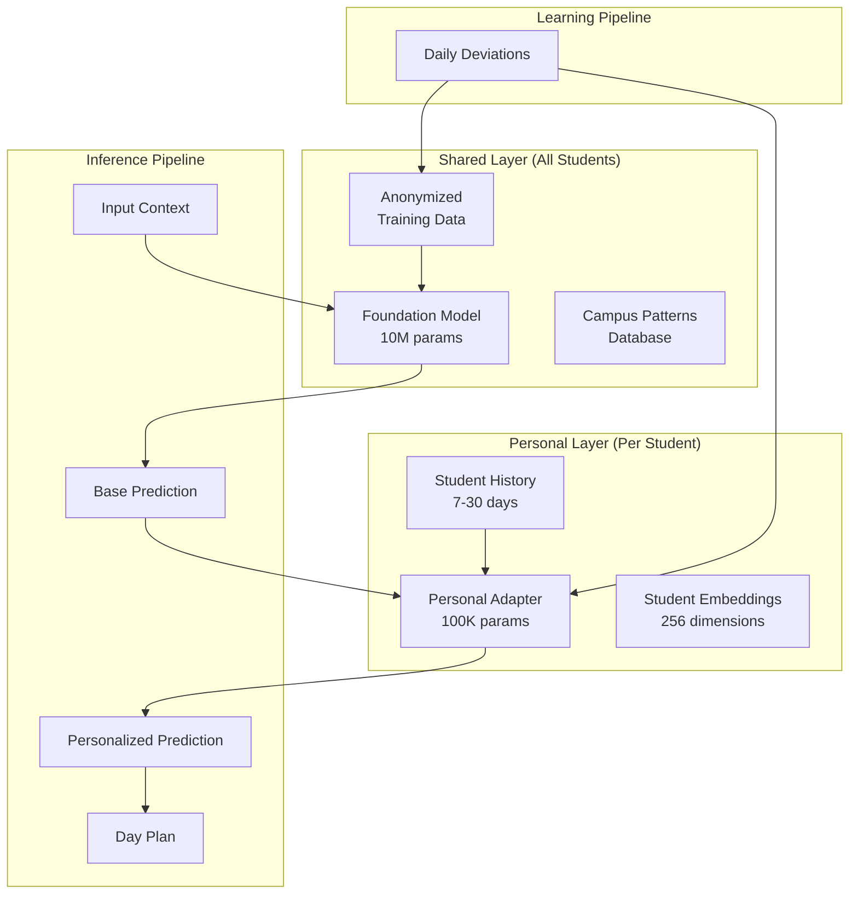

# ML Behavior Learning Architecture for StudentWatcher

## Overview: Hybrid ML Approach

The ML behavior learning system uses a **hybrid approach** that avoids the expense of training individual models per student while still providing deep personalization:

1. **Shared Foundation Model**: Campus-wide patterns and general student behavior
2. **Personal Fine-tuning Layer**: Individual student preferences and patterns  
3. **Lightweight Embeddings**: Fast, per-student context vectors

## Core Architecture

### System Design



## Foundation Model Selection

### Recommended: Custom BERT-style Transformer
- **Architecture**: Encoder-only transformer (similar to BERT)
- **Size**: 10-15M parameters
- **Training**: Pre-trained on anonymized campus behavioral sequences
- **Why This Model**:
  - Optimal size for behavioral sequence modeling (not text generation)
  - Fast inference (`<50ms`) suitable for real-time predictions
  - Small enough to cache entirely in Redis (~40-60MB)
  - Proven architecture for temporal pattern recognition
  - Can leverage positional encodings for time-aware predictions

### Alternative Considerations:
1. **DistilBERT** (66M params) - Good pre-trained base but larger than needed
2. **Custom LSTM/GRU** (1-5M params) - Smaller but less capable with complex context
3. **TinyLlama** (1.1B params) - Overkill for behavior prediction, better for text

### Training Data Requirements:
- Anonymized sequences from 10,000+ students
- Minimum 1 academic year of data
- Temporal resolution: 15-minute intervals
- Features: location, activity type, duration, context

## Implementation Components

### 1. Foundation Model (Shared)

```python
# ml_service/models/foundation.py
class StudentBehaviorFoundation:
    """
    Shared foundation model trained on anonymized campus data
    Captures general patterns like:
    - Class attendance patterns
    - Study session timing
    - Meal schedules
    - Social activity windows
    """
    
    def __init__(self):
        self.model = TransformerModel(
            input_dim=512,
            hidden_dim=256,
            num_layers=6,
            num_heads=8,
            dropout=0.1
        )
        self.feature_encoder = FeatureEncoder()
        self.load_pretrained_weights()
    
    def extract_features(self, context: Dict) -> torch.Tensor:
        """
        Extract features from context
        """
        features = {
            # Temporal features
            'hour': context['timestamp'].hour,
            'day_of_week': context['timestamp'].weekday(),
            'week_of_semester': self.get_academic_week(context['timestamp']),
            'days_until_exam': self.get_days_to_next_exam(context),
            
            # Environmental features
            'weather_code': context['weather']['code'],
            'temperature': context['weather']['temp'],
            'is_raining': context['weather']['precipitation'] > 0,
            
            # Academic features
            'courses_today': len(context['schedule']['classes']),
            'assignments_due': len(context['deadlines']['today']),
            'exam_week': context['academic']['is_exam_week'],
            
            # Campus features
            'events_available': len(context['campus_events']),
            'dining_open': self.check_dining_hours(context['timestamp']),
            'library_hours': self.get_library_status(context['timestamp']),
            
            # Historical aggregates (anonymized)
            'typical_activity_now': self.get_typical_activity(
                context['timestamp'].hour,
                context['timestamp'].weekday()
            )
        }
        
        return self.feature_encoder.encode(features)
    
    def predict_base_pattern(self, context: Dict) -> BehaviorPrediction:
        """
        Predicts general student behavior patterns
        """
        features = self.extract_features(context)
        
        # Run through transformer
        hidden_states = self.model(features.unsqueeze(0))
        
        # Decode to predictions
        predictions = self.decode_predictions(hidden_states)
        
        return BehaviorPrediction(
            next_activity=predictions['activity'],
            duration=predictions['duration'],
            location_type=predictions['location'],
            confidence=predictions['confidence'],
            alternatives=predictions['top_3_alternatives']
        )
```

### 2. Personal Adaptation Layer (LoRA)

```python
# ml_service/models/personal_adapter.py
import torch
import torch.nn as nn
from typing import List, Dict

class PersonalAdapter:
    """
    Lightweight per-student adaptation using LoRA (Low-Rank Adaptation)
    Only ~400KB per student vs 40MB for full model copy
    """
    
    def __init__(self, student_id: str):
        self.student_id = student_id
        self.adapter = LoRAAdapter(
            base_dim=256,
            rank=8,  # Very small: 256*8*2 = 4096 params
            alpha=16,
            dropout=0.05
        )
        self.personal_stats = PersonalStatistics(student_id)
        self.load_or_initialize()
    
    def adapt_prediction(
        self, 
        base_prediction: BehaviorPrediction,
        student_history: List[Event]
    ) -> PersonalizedPrediction:
        """
        Personalizes the base prediction using student's patterns
        """
        # Extract personal features
        personal_features = self.extract_personal_features(student_history)
        
        # Get personal adjustments via LoRA
        base_embedding = base_prediction.get_embedding()
        adjusted_embedding = self.adapter(base_embedding, personal_features)
        
        # Decode adjusted prediction
        adjusted_prediction = self.decode_embedding(adjusted_embedding)
        
        # Apply personal preferences
        final_prediction = self.apply_preferences(
            adjusted_prediction,
            self.personal_stats.get_preferences()
        )
        
        return PersonalizedPrediction(
            activity=final_prediction['activity'],
            start_time=final_prediction['start_time'],
            duration=final_prediction['duration'],
            location=final_prediction['location'],
            confidence=final_prediction['confidence'],
            personal_score=self.calculate_personal_fit(final_prediction),
            explanation=f"Based on your usual {self.get_pattern_name()}"
        )
    
    def extract_personal_features(self, history: List[Event]) -> Dict:
        """
        Extract features specific to this student
        """
        if not history:
            return self.get_default_features()
        
        features = {
            # Personal timing patterns
            'avg_wake_time': self.calculate_avg_wake_time(history),
            'avg_sleep_time': self.calculate_avg_sleep_time(history),
            'preferred_study_hours': self.extract_study_preferences(history),
            
            # Location preferences
            'favorite_study_spots': self.get_top_locations(history, 'study'),
            'dining_preferences': self.get_dining_patterns(history),
            'gym_frequency': self.calculate_gym_frequency(history),
            
            # Social patterns
            'social_activity_level': self.calculate_social_score(history),
            'group_study_preference': self.detect_group_patterns(history),
            
            # Academic patterns
            'procrastination_index': self.calculate_procrastination(history),
            'study_session_length': self.avg_study_duration(history),
            'break_frequency': self.calculate_break_patterns(history)
        }
        
        return features
    
    def update_from_feedback(self, actual: Event, predicted: Event):
        """
        Online learning from prediction errors
        """
        # Calculate prediction error
        error = self.calculate_error(actual, predicted)
        
        if error > self.learning_threshold:
            # Compute gradient
            gradient = self.compute_gradient(actual, predicted)
            
            # Update LoRA weights
            self.adapter.update(
                gradient=gradient,
                learning_rate=self.adaptive_learning_rate(error)
            )
            
            # Update personal statistics
            self.personal_stats.update(actual)
            
            # Log for analysis
            self.log_learning_event(actual, predicted, error)
```

### 3. Embedding Cache System

```python
# ml_service/embeddings/cache.py
import redis
import numpy as np
from datetime import date, timedelta

class StudentEmbeddingCache:
    """
    Fast access to student context embeddings
    Reduces inference time from ~500ms to ~50ms
    """
    
    def __init__(self):
        self.redis_client = redis.Redis(
            host='localhost',
            port=6379,
            decode_responses=False  # For binary data
        )
        self.embedding_dim = 256
        self.ttl_seconds = 86400  # 24 hours
    
    async def get_student_embedding(
        self, 
        student_id: str,
        context_type: str = 'daily'
    ) -> np.ndarray:
        """
        Retrieves or computes student embedding
        """
        key = f"emb:{student_id}:{context_type}:{date.today()}"
        
        # Try cache first (< 1ms)
        cached = await self.redis_client.get(key)
        if cached:
            return np.frombuffer(cached, dtype=np.float32).reshape(-1, self.embedding_dim)
        
        # Compute if not cached (~ 50ms)
        embedding = await self.compute_embedding(student_id, context_type)
        
        # Cache with TTL
        await self.redis_client.setex(
            key, 
            self.ttl_seconds,
            embedding.tobytes()
        )
        
        return embedding
    
    async def compute_embedding(
        self, 
        student_id: str,
        context_type: str
    ) -> np.ndarray:
        """
        Computes embedding from recent history
        """
        # Get recent events based on context type
        lookback_days = {
            'daily': 1,
            'weekly': 7,
            'monthly': 30
        }.get(context_type, 7)
        
        recent_events = await self.get_recent_events(
            student_id, 
            days=lookback_days
        )
        
        # Encode events into embedding
        encoder = self.get_encoder()
        embedding = encoder.encode_sequence(
            events=recent_events,
            max_length=100,  # Truncate very long sequences
            pooling='attention'  # Attention-weighted pooling
        )
        
        return embedding
    
    async def batch_compute_embeddings(
        self,
        student_ids: List[str]
    ) -> Dict[str, np.ndarray]:
        """
        Efficient batch computation for multiple students
        """
        # Parallel fetch from cache
        cache_keys = [f"emb:{sid}:daily:{date.today()}" for sid in student_ids]
        cached_values = await self.redis_client.mget(cache_keys)
        
        results = {}
        to_compute = []
        
        # Separate cached vs needs computation
        for sid, cached in zip(student_ids, cached_values):
            if cached:
                results[sid] = np.frombuffer(cached, dtype=np.float32)
            else:
                to_compute.append(sid)
        
        # Batch compute missing embeddings
        if to_compute:
            computed = await self.batch_compute(to_compute)
            results.update(computed)
            
            # Cache computed embeddings
            pipe = self.redis_client.pipeline()
            for sid, emb in computed.items():
                key = f"emb:{sid}:daily:{date.today()}"
                pipe.setex(key, self.ttl_seconds, emb.tobytes())
            await pipe.execute()
        
        return results
```

### 4. Training Pipeline

```python
# ml_service/training/pipeline.py
class MLTrainingPipeline:
    """
    Manages model training and updates
    """
    
    def __init__(self):
        self.foundation_model = StudentBehaviorFoundation()
        self.anonymizer = DataAnonymizer()
        self.metrics_tracker = MLMetricsTracker()
    
    async def daily_personal_update(self, student_id: str):
        """
        Daily update of personal adaptation layer
        Runs at 2 AM for previous day's data
        """
        # Get yesterday's predictions vs actuals
        date_str = (date.today() - timedelta(days=1)).isoformat()
        deviations = await self.get_daily_deviations(student_id, date_str)
        
        if len(deviations) < 3:  # Not enough data
            return
        
        # Load personal adapter
        adapter = PersonalAdapter(student_id)
        
        # Update from each deviation
        for deviation in deviations:
            # Only learn from significant deviations
            if deviation.significance > 0.3:
                adapter.update_from_feedback(
                    actual=deviation.actual_event,
                    predicted=deviation.predicted_event
                )
        
        # Save updated adapter
        await self.save_adapter(student_id, adapter)
        
        # Track metrics
        metrics = await self.calculate_adaptation_metrics(student_id)
        await self.metrics_tracker.store(student_id, metrics)
    
    async def weekly_foundation_update(self):
        """
        Weekly retrain of foundation model
        Runs Sunday 3 AM
        """
        # Collect past week's data from all students
        training_data = await self.collect_weekly_data()
        
        # Anonymize to protect privacy
        anonymized_data = self.anonymizer.anonymize_batch(
            training_data,
            differential_privacy=True,
            epsilon=1.0  # Privacy budget
        )
        
        # Split data
        train_split, val_split = self.split_data(anonymized_data, val_ratio=0.1)
        
        # Fine-tune foundation model
        trainer = Trainer(
            model=self.foundation_model,
            train_data=train_split,
            val_data=val_split,
            config={
                'epochs': 5,
                'batch_size': 128,
                'learning_rate': 1e-4,
                'warmup_steps': 100,
                'gradient_clip': 1.0
            }
        )
        
        new_model = trainer.train()
        
        # A/B test new model vs current
        test_results = await self.ab_test_model(
            current=self.foundation_model,
            candidate=new_model,
            test_students=100,
            test_days=1
        )
        
        # Deploy if better
        if test_results.candidate_better(threshold=0.05):
            await self.deploy_model(new_model)
            await self.log_model_update(test_results)
```

### 5. Privacy & Anonymization

```python
# ml_service/privacy/anonymizer.py
class DataAnonymizer:
    """
    Ensures student privacy in ML training
    """
    
    def anonymize_event(self, event: Event) -> AnonymizedEvent:
        """
        Remove PII while preserving patterns
        """
        return AnonymizedEvent(
            # Temporal patterns (preserved)
            hour_of_day=event.timestamp.hour,
            day_of_week=event.timestamp.weekday(),
            week_of_semester=self.get_academic_week(event.timestamp),
            
            # Location (generalized)
            location_type=self.generalize_location(event.location),
            # e.g., "Shapiro Library" -> "library"
            # "South Quad Room 302" -> "dorm"
            
            # Activity (categorized)
            activity_category=self.categorize_activity(event.activity),
            # e.g., "EECS 281 Homework" -> "homework"
            # "Coffee with Sarah" -> "social"
            
            # Duration (bucketed)
            duration_bucket=self.bucket_duration(event.duration),
            # e.g., 47 min -> "30-60min"
            
            # Context (aggregated)
            academic_load=self.calculate_load_level(event.context),
            weather_condition=event.weather.category,
            
            # Removed completely
            student_id=None,
            student_name=None,
            course_names=None,
            professor_names=None,
            friend_names=None,
            personal_notes=None
        )
    
    def add_differential_privacy(
        self, 
        data: np.ndarray, 
        epsilon: float = 1.0
    ) -> np.ndarray:
        """
        Add calibrated noise for differential privacy
        """
        sensitivity = self.calculate_sensitivity(data)
        noise = np.random.laplace(
            loc=0,
            scale=sensitivity / epsilon,
            size=data.shape
        )
        return data + noise
```

## Integration with StudentWatcher

### Morning Planning Integration

```typescript
// morningPlanning.workflow.ts
async function generateDayPlanWithML(
  studentId: string,
  context: PlanningContext
): Promise<DayPlan> {
  // 1. Get base predictions from foundation model
  const basePredictions = await mlService.getFoundationPredictions({
    studentId,
    timestamp: new Date(),
    context: {
      schedule: context.timeBlocks,
      weather: context.weather,
      campusEvents: context.campusEvents,
      academicCalendar: context.academicPhase
    }
  });
  
  // 2. Personalize with student's adapter
  const personalizedPredictions = await mlService.personalizePredictions({
    studentId,
    basePredictions,
    recentHistory: await getStudentHistory(studentId, 7),
    preferences: await getStudentPreferences(studentId)
  });
  
  // 3. Convert ML predictions to timeline events
  const mlEvents = personalizedPredictions.map(pred => ({
    startTime: pred.predictedTime,
    endTime: addMinutes(pred.predictedTime, pred.duration),
    type: pred.activityType,
    source: 'prediction',
    confidence: pred.confidence,
    priority: calculatePriority(pred),
    metadata: {
      mlModel: 'hybrid_v2',
      personalScore: pred.personalScore,
      explanation: pred.explanation
    }
  }));
  
  // 4. Merge with other data sources
  const timeline = mergeTimeline({
    timeBlocks: context.timeBlocks,      // 0.95 confidence
    calendar: context.calendarEvents,     // 0.85 confidence
    predictions: mlEvents,                // 0.60-0.80 confidence
    campus: context.campusEvents,         // 0.50 confidence
    defaults: generateDefaults()          // 0.30 confidence
  });
  
  return {
    studentId,
    date: context.date,
    events: timeline,
    confidence: calculateOverallConfidence(timeline),
    mlMetadata: {
      foundationVersion: basePredictions.modelVersion,
      adapterVersion: personalizedPredictions.adapterVersion,
      predictionCount: mlEvents.length
    }
  };
}
```

### Deviation Learning Integration

```typescript
// studentWatcher.workflow.ts
async function handleDeviation(
  state: WatcherState,
  deviation: Deviation
): Promise<void> {
  // Handle immediate response
  const response = await determineDeviationResponse(deviation);
  await executeResponse(response);
  
  // Queue for ML learning (async)
  await mlService.recordDeviation({
    studentId: state.studentId,
    timestamp: new Date(),
    planned: deviation.plannedActivity,
    actual: deviation.actualActivity,
    context: {
      dayPlan: state.dayPlan,
      currentState: state.currentState,
      environmentalFactors: await getEnvironment()
    },
    significance: deviation.significance
  });
  
  // If pattern detected, update preferences
  if (deviation.significance > 0.5) {
    const pattern = await mlService.detectPattern(
      state.studentId,
      deviation
    );
    
    if (pattern.confidence > 0.7) {
      await updateStudentPreferences({
        studentId: state.studentId,
        learned: pattern.preference,
        source: 'ml_deviation_learning'
      });
    }
  }
}
```

## Storage Requirements & Performance

### Storage Breakdown

```yaml
# Per-Student Storage
per_student:
  lora_adapter: 400KB      # 8-rank LoRA weights
  embeddings: 4KB/day      # 256-dim float32 embeddings
  event_history: 10KB/day  # Structured event logs
  preferences: 10KB        # Learned preferences
  monthly_total: ~600KB    # Total per student per month

# Shared Resources
shared:
  foundation_model: 40MB   # 10M parameter model
  model_checkpoints: 200MB # Historical versions
  training_data: 1GB       # Anonymized campus data
  campus_patterns: 100MB   # Aggregate statistics

# Scaling (10,000 students)
scale_10k:
  personal_data: 6GB       # All personal adapters + history
  shared_data: 1.3GB       # Shared models and data
  total: 7.3GB            # Very manageable
  redis_cache: 2.5GB      # Daily embeddings cached

# Scaling (100,000 students)  
scale_100k:
  personal_data: 60GB     # Still fits on single server
  shared_data: 1.3GB      # Doesn't grow with users
  total: 61.3GB
  redis_cluster: 25GB     # Distributed cache
```

### Performance Metrics

```yaml
# Inference Performance
inference:
  foundation_prediction: 30ms    # Base model forward pass
  personalization: 10ms          # LoRA adaptation
  embedding_retrieval: 1ms       # Redis cache hit
  total_latency: 45ms           # End-to-end prediction

# Training Performance  
training:
  daily_adapter_update: 5s       # Per student
  weekly_foundation: 2hr         # Full retrain
  batch_size: 128               # Students in parallel

# Accuracy Targets
accuracy:
  activity_type: 75%            # Correct activity prediction
  timing_window: 85%            # Within 15 minutes
  location: 70%                 # Correct location type
  confidence_calibration: 90%   # Confidence matches accuracy
```

## Benefits of Hybrid Approach

### 1. Cost Efficiency
- **Shared Compute**: One foundation model serves all students
- **Minimal Storage**: ~600KB per student vs 40MB for individual models
- **Fast Training**: Daily updates in seconds, not hours

### 2. Privacy Preservation
- **Anonymized Foundation**: No PII in shared model
- **Local Adapters**: Personal patterns stay on personal layer
- **Differential Privacy**: Mathematical privacy guarantees

### 3. Scalability
- **Linear Growth**: Storage grows linearly with users
- **Cached Inference**: Sub-50ms predictions via Redis
- **Batch Processing**: Efficient daily/weekly updates

### 4. Continuous Learning
- **Daily Adaptation**: Personal models update every night
- **Weekly Foundation**: Shared model improves weekly
- **Online Learning**: Real-time deviation learning

### 5. Cold Start Solution
- **Foundation Provides Baseline**: New users get reasonable predictions immediately
- **Rapid Personalization**: Adapter learns within days
- **Progressive Enhancement**: Quality improves with more data

## Monitoring & Evaluation

```python
# ml_service/monitoring/dashboard.py
class MLMonitoringDashboard:
    """
    Real-time monitoring of ML system health
    """
    
    async def get_system_metrics(self) -> Dict:
        return {
            'model_performance': {
                'activity_accuracy': await self.get_activity_accuracy(),
                'timing_accuracy': await self.get_timing_accuracy(),
                'confidence_calibration': await self.get_calibration_score()
            },
            'system_health': {
                'inference_latency_p50': await self.get_latency_percentile(50),
                'inference_latency_p99': await self.get_latency_percentile(99),
                'cache_hit_rate': await self.get_cache_hit_rate(),
                'daily_updates_success': await self.get_update_success_rate()
            },
            'data_quality': {
                'events_per_student': await self.get_avg_events_per_student(),
                'deviation_rate': await self.get_deviation_rate(),
                'data_completeness': await self.get_data_completeness()
            },
            'adoption_metrics': {
                'students_with_adapters': await self.count_active_adapters(),
                'daily_predictions_made': await self.count_daily_predictions(),
                'user_feedback_score': await self.get_feedback_score()
            }
        }
```

## Implementation Roadmap

### Phase 1: Foundation Model (Week 1)
- [ ] Set up ML infrastructure (PyTorch, Redis, model storage)
- [ ] Implement foundation model architecture
- [ ] Create feature extraction pipeline
- [ ] Train initial model on historical data
- [ ] Deploy inference API

### Phase 2: Personal Adapters (Week 2)
- [ ] Implement LoRA adapter architecture
- [ ] Create personal feature extraction
- [ ] Build adapter storage system
- [ ] Implement online learning updates
- [ ] Test personalization quality

### Phase 3: Integration (Week 3)
- [ ] Integrate with morning planning workflow
- [ ] Connect deviation learning pipeline
- [ ] Set up embedding cache
- [ ] Implement monitoring dashboard
- [ ] Deploy to production

### Phase 4: Optimization (Week 4)
- [ ] Tune hyperparameters
- [ ] Optimize inference latency
- [ ] Implement A/B testing framework
- [ ] Set up continuous training pipeline
- [ ] Monitor and iterate

---

*Document created: August 6, 2025*  
*Status: Architecture defined, ready for implementation*  
*Estimated effort: 4 weeks with 2 ML engineers*
