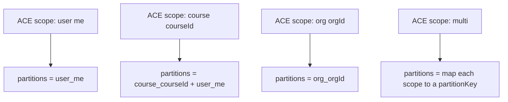
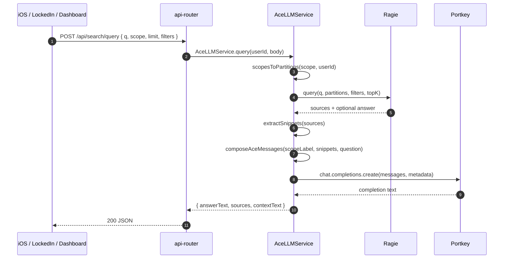
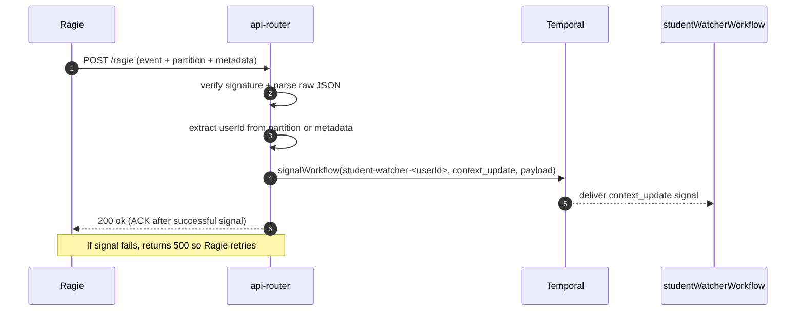

# Ragie Ingestion, Webhooks, and ACE Query Pipeline Deep Dive (Current)

This document traces DormWay’s **current Ragie-based RAG system** end-to-end, focusing on:

- How content is **indexed into Ragie**
- How ACE queries **retrieve** Ragie sources and produce answers
- How Ragie **webhooks** trigger **StudentWatcher** via `context_update`

Related docs:

- [How DormWay Works](/docs/engineering/architecture/how-dormway-works)
- [StudentWatcher Workflow Deep Dive (Current)](/docs/engineering/technical/studentwatcher/studentwatcher-workflow-deep-dive-current)
- [Syllabus Processing & Overlays Deep Dive (Current)](/docs/engineering/technical/syllabus/syllabus-processing-overlays-deep-dive-current)
- [Context Model: Hierarchy vs Graph (Current)](/docs/engineering/technical/ai/context/context-model-hierarchy-vs-graph)

Code entry points (current):

- Ragie webhook handler: `.repos/dormway-platform/services/api-router/src/routes/webhook-routes-s3.ts` (`POST /ragie`)
- ACE query service: `.repos/dormway-platform/services/api-router/src/services/ace-llm.ts` (`AceLLMService.query`)
- ACE routes: `.repos/dormway-platform/services/api-router/src/routes/ace-llm-routes.ts` (`/api/search/*`)
- Ragie adapter singleton: `.repos/dormway-platform/services/api-router/src/config/ragie-adapter.ts`
- Engine Ragie activities: `.repos/dormway-platform/services/engine/src/activities/ragie.activities.ts`
- Portkey managed prompts infrastructure: `.repos/dormway-platform/services/shared/dormway-core/src/llm/llm-caller.ts`, `.repos/dormway-platform/services/shared/dormway-core/src/llm/prompt-loader.ts`

---

## 1) Mental model (what’s actually happening)

DormWay currently uses Ragie as the **retrieval backend** for ACE. Conceptually:

1) Documents are indexed into **partitions** (mostly “per user”, sometimes “per course/org”)
2) ACE queries Ragie across one-or-more partitions, gets **sources/snippets**
3) ACE uses a Portkey-proxied LLM to turn those snippets into an **answer**
4) When Ragie finishes indexing (or updates/deletes), Ragie calls our webhook, which signals StudentWatcher with a `context_update` so it can regenerate plans / refresh context.

---

## 2) Partition keys (how we scope retrieval)

### 2.1 Partition naming rules

ACE partitions are strings like:

- `user_<userId>`
- `course_<courseContextId>`
- `org_<organizationId>`

The partition key logic lives in:

- `.repos/dormway-platform/services/api-router/src/services/ace-llm.ts` (`partitionKey`, `sanitizeId`)

Key behaviors:

- IDs are lowercased and non `[a-z0-9_-]` characters are replaced with `_`
- `scope.type='course'` queries **two** partitions: the course partition **plus** the user partition (to catch user-indexed notes that are still relevant)

---

## 3) Indexing paths (how things get into Ragie)

There are multiple indexing entry points; they share the idea “upload text + metadata into a partition”.

### 3.1 Engine: generic document indexing (notes, etc.)

Engine has activities to index “generic” text content:

- `.repos/dormway-platform/services/engine/src/activities/ragie.activities.ts`
  - `storeGenericDocumentInRagie({ userId, documentId, title, content, metadata })`
  - `deleteDocumentFromRagie({ userId, documentId })`

Implementation detail:

- The partition key is computed as `user_<userId>` (lowercased + sanitized).

### 3.2 Engine: pushing syllabi to enrolled students

When a syllabus is associated with a course, the engine can index it into **each enrolled student’s partition** so ACE queries work for every student enrolled:

- `.repos/dormway-platform/services/engine/src/activities/ragie.activities.ts` (`pushSyllabusToEnrolledStudents`)

This:

- queries `context_dependencies` to find student contexts enrolled in a course (`dependency_type='enrolled_in'`)
- uploads `documentId = syllabus_<syllabusId>` into each `user_<studentUserId>` partition

### 3.3 API Router: user-facing indexing endpoints (ACE)

API Router exposes indexing and document APIs under `/api/search/*`:

- `.repos/dormway-platform/services/api-router/src/routes/ace-llm-routes.ts`

Notable behaviors:

- Some endpoints allow indexing text directly (title + content)
- Some endpoints upload files and store them in S3 first (then index downstream)
- Document text retrieval endpoints:
  - verify `user_id` access before returning Ragie content when the identifier is a DormWay UUID
  - restrict outbound fetch to the configured Ragie base URL to reduce SSRF risk

### 3.4 Document identity mapping (DB)

ACE routes use `braingains_documents` to map a DormWay UUID to a Ragie document reference:

- `.repos/dormway-platform/services/api-router/src/routes/ace-llm-routes.ts` (`GET /documents/text`)
- It looks up:
  - `ragie_document_id`
  - `ragie_partition_key`

This is the join that lets the UI say “open this document” using a DormWay ID while the backend fetches Ragie’s canonical content.

---

## 4) ACE query path (Ragie retrieval + LLM answer)

### 4.1 High-level sequence

### 4.2 Observability knobs

- `ACE_LLM_DEBUG=true` logs resolved partitions and snippet previews
- Portkey metadata includes `_source='dormway-api-router'` and `_feature='ace_llm_query'`

---

## 5) Ragie webhooks → StudentWatcher (`context_update`)

### 5.1 What the webhook is for

Ragie emits lifecycle events like “file indexed” or “file deleted”. DormWay uses those events to nudge StudentWatcher so it can:

- refresh planning inputs
- regenerate a DayPlan when needed
- re-run context graph–driven flows that depend on newly indexed content

### 5.2 Signature verification (HMAC over raw body)

The handler is:

- `.repos/dormway-platform/services/api-router/src/routes/webhook-routes-s3.ts` (`POST /ragie`)

Key behaviors:

- Uses a raw-body JSON parser to preserve raw bytes for HMAC verification
- Accepts several header names (`x-ragie-signature`, `x-ragie-signature-sha256`, etc.)
- Supports both:
  - simple signatures: HMAC over raw body
  - timestamped signatures: HMAC over `t + '.' + rawBody` with `v1`

### 5.3 Routing to the right student

The webhook tries to extract `userId` from:

1) `partition` when it matches `user_<id>` or `user:<id>`
2) `metadata.userId` if present

### 5.4 Which events actually trigger StudentWatcher

The webhook only forwards “milestone” events:

- `file.indexed`
- `file.updated`
- `file.deleted`
- `sync.completed`
- `document_status_updated` (only when status is `indexed`, `updated`, or `deleted`)

### 5.5 Signal payload shape

StudentWatcher is signaled at:

- `workflowId = student-watcher-<userId>`
- `signalName = context_update`

Payload shape (current):

- `{ type: 'activity', data: { originalEventType, documentId, partition, metadata }, timestamp }`

---

## 6) Sharp edges / review checklist (documented behavior that surprises people)

- `scope.type='course'` always includes `user_<me>` as a fallback partition; this can surface user-indexed notes in "course" scope, which is usually good but can surprise product expectations.
- Webhook → StudentWatcher routing depends on the partition matching `user_<id>` or `user:<id>`; any other partition scheme will skip signaling unless `metadata.userId` is present.
- ~~The webhook acks `200` before doing extraction + signaling; failures to signal won't retry at the HTTP level (only logs).~~ **Fixed in SE-014/DORM-786 (2025-12-25)**: Webhook now ACKs `200` only after successful signal; returns `500` on signal failure so Ragie retries.
- `document_status_updated` forwarding is gated on a status allowlist; if Ragie changes status naming, signals may silently stop.
- `braingains_documents` is the bridge between DormWay document IDs and Ragie document IDs; missing `ragie_document_id` makes document-text retrieval return "not indexed yet".
