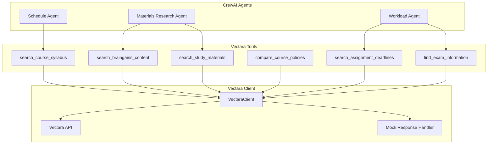

# Vectara Tools Implementation

## Overview

The Vectara tools provide semantic search capabilities for AI crews to query academic documents, syllabi, and student-generated content. These tools enable crews to access contextual information from the DormWay knowledge base without hallucinating or inventing data.

## Implementation Details

### Tool Architecture



### Available Tools

#### 1. Search Course Syllabus
```python
@tool("Search Vectara for course syllabus")
def search_course_syllabus(course_code: str) -> str
```
- **Purpose**: Find syllabus content for specific courses
- **Input**: Course code (e.g., "CS101", "MATH201")
- **Returns**: Syllabus information including grading policies, schedules, assignments

#### 2. Search BrainGains Content
```python
@tool("Search BrainGains for class notes")
def search_braingains_content(course_code: str) -> str
```
- **Purpose**: Access student-generated notes and summaries
- **Input**: Course code
- **Returns**: Class notes, key concepts, study guides

#### 3. Search Assignment Deadlines
```python
@tool("Search for assignment deadlines")
def search_assignment_deadlines(time_period: str = "next week") -> str
```
- **Purpose**: Find upcoming assignments across all courses
- **Input**: Time period (e.g., "next week", "this month", "finals week")
- **Returns**: Consolidated list of deadlines

#### 4. Compare Course Policies
```python
@tool("Compare course policies")
def compare_course_policies(policy_type: str = "attendance") -> str
```
- **Purpose**: Compare policies across enrolled courses
- **Input**: Policy type (e.g., "attendance", "late submission", "grading")
- **Returns**: Side-by-side policy comparison

#### 5. Search Study Materials
```python
@tool("Search study materials by topic")
def search_study_materials(topic: str, course_code: Optional[str] = None) -> str
```
- **Purpose**: Find topic-specific study resources
- **Input**: Topic and optional course filter
- **Returns**: Explanations, examples, practice problems

#### 6. Find Exam Information
```python
@tool("Find exam information")
def find_exam_information(exam_type: str = "all") -> str
```
- **Purpose**: Locate exam dates and study guides
- **Input**: Exam type ("midterm", "final", "quiz", "all")
- **Returns**: Exam schedules, formats, coverage

## Integration with Crews

### Student Academic Context Crew

The Materials Research Agent uses Vectara tools to enrich academic context:

```python
# Course Materials Research Agent
materials_research_agent = Agent(
    role="Course Materials Research Specialist",
    goal="Search Vectara and BrainGains for relevant syllabus content",
    tools=vectara_tools,
    # ... agent configuration
)
```

### Usage Pattern

1. **Schedule Analysis**: Agent identifies enrolled courses from student data
2. **Material Search**: Research agent queries Vectara for each course
3. **Context Enrichment**: Results enhance workload and deadline analysis
4. **Strategy Formation**: Coordinator synthesizes all data into recommendations

## Configuration

### Environment Variables

```bash
# Required for production
VECTARA_API_KEY=your_api_key
VECTARA_CUSTOMER_ID=your_customer_id

# Optional (defaults provided)
VECTARA_CORPUS_ID=1  # Default corpus for general documents
VECTARA_BRAINGAINS_CORPUS_ID=2  # Separate corpus for BrainGains
```

### Mock Data Mode

When `VECTARA_API_KEY` is not set:
- Tools return mock responses for development
- Warning message displayed on initialization
- Crews can still execute with placeholder data

## API Integration

### Request Format

```json
{
  "query": [{
    "query": "syllabus course CS101 assignments grading",
    "num_results": 5,
    "corpus_key": [{"corpus_id": 1}],
    "summary": [{
      "summarizerPromptName": "vectara-summary-ext-v1.2.0",
      "response_lang": "en",
      "max_summarized_results": 5
    }]
  }]
}
```

### Response Handling

```python
def query(self, corpus_id: int, query_text: str, num_results: int = 5):
    # API call with timeout and error handling
    try:
        response = client.post(endpoint, headers=headers, json=payload)
        return response.json()
    except Exception as e:
        # Fallback to mock data
        return self._mock_query_response(query_text)
```

## Query Enhancement Strategies

### 1. Syllabus Queries
- Enhanced with: "assignments grading policy schedule"
- Ensures comprehensive syllabus extraction

### 2. Deadline Queries
- Enhanced with: "assignment deadline due date submission"
- Captures various deadline formats

### 3. Study Material Queries
- Enhanced with: "explanation examples practice problems"
- Returns educational content

## Testing

### Unit Test Script

```bash
# Run the test script
python test_vectara_tools.py
```

Tests include:
1. Individual tool validation
2. Crew integration simulation
3. Full Student Academic Context Crew execution

### Test Coverage

- ✅ All 6 tools tested individually
- ✅ Mock mode validation
- ✅ Error handling verification
- ✅ Crew integration tested
- ✅ Multi-course workflow simulated

## Performance Considerations

### Caching Strategy
- Results cached by crew execution framework
- 24-hour default TTL for academic content
- Shorter TTL for time-sensitive queries

### Query Optimization
- Batch queries when possible
- Use specific corpus IDs for faster search
- Limit results to necessary count

## Security & Privacy

### Data Isolation
- User-specific corpus separation
- No cross-user data leakage
- Course enrollment validation

### API Security
- API keys stored in environment
- HTTPS for all requests
- Request timeout protection

## Future Enhancements

### Q3 2025
- Multimodal search (PDFs with images)
- Real-time document updates
- Personalized query enhancement

### Q4 2025
- Cross-semester comparisons
- Study group shared corpora
- Voice query support

## Troubleshooting

### Common Issues

1. **No API Key Set**
   - Solution: Add VECTARA_API_KEY to environment
   - Workaround: Use mock mode for development

2. **Empty Results**
   - Check corpus ID configuration
   - Verify documents are indexed
   - Review query terms

3. **Timeout Errors**
   - Increase timeout in VectaraClient
   - Reduce num_results parameter
   - Check network connectivity

## Related Documentation

- RAG System Architecture
- [Student Academic Context Crew](/docs/engineering/ai-crews/crew-input-specifications-for-temporal-integration)
- [Engine Vectara Service](/docs/engineering/technical/implementation-patterns/braingains-service-data-methods-reference)
